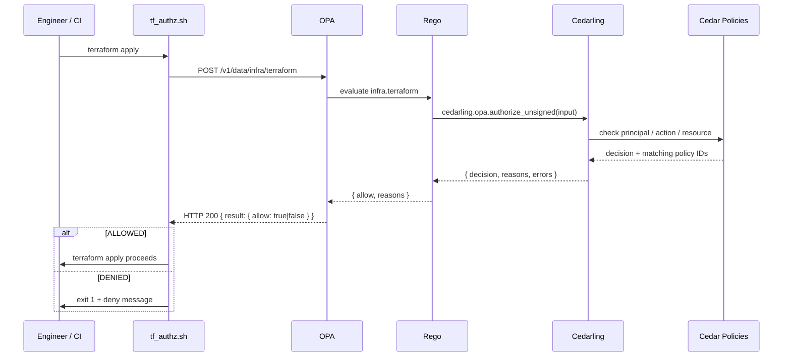

---
tags:
  - Cedar
  - Cedarling
  - OPA
  - Terraform
  - Infrastructure
---

# Gating Terraform with Cedarling-OPA

!!! tip "Not sure which flow to use?"
    See the [Terraform authorization overview](./terraform-authz-overview.md) for a side-by-side comparison of the unsigned and JWT flows before diving into implementation details.

This guide walks through a concrete use case for the [Cedarling-OPA plugin](./cedarling-opa.md): enforcing role-based access control on Terraform operations before any infrastructure change is made.

## The Problem

Infrastructure teams often need to answer questions like:

- Can this engineer run `terraform apply` against the production environment?
- Should a CI job be allowed to destroy a staging workspace?
- How do we audit *who* approved an infrastructure change and *why*?

Traditional solutions rely on cloud-provider IAM policies, custom CI guards, or honor-system conventions. The Cedarling-OPA integration lets you express these rules as **Cedar policies** — auditable, version-controlled, and evaluated in milliseconds before `terraform` ever runs.

## Choosing a Flow: Unsigned vs JWT

Two Terraform authorization demos are available. Use this table to decide which fits your situation before diving into the implementation details.

| | **Unsigned (this guide)** | **[JWT guide](./terraform-authz-jwt.md)** |
|---|---|---|
| **Identity source** | Environment variables asserted by the caller | Signed GitHub Actions OIDC token |
| **Signature validation** | None — `CEDARLING_JWT_SIG_VALIDATION: "disabled"` | Cryptographic — Cedarling fetches GitHub's JWKS and verifies every token |
| **Trusted issuer config** | Not required — no `trusted-issuers/` directory needed | Required — `policy-store/trusted-issuers/github-actions.json` must declare the issuer endpoint |
| **Principal model** | `Infra::User` with asserted `role` attribute | `CI::GitHubWorkflow` with verified JWT claims (`repository`, `ref`, `environment`) |
| **Cedarling built-in** | `authorize_unsigned` | `authorize_multi_issuer` |
| **Secret management** | Requires `TF_USER_ID` / `TF_USER_ROLES` set by the operator | No secrets — GitHub issues the OIDC token automatically |
| **Production approval gate** | Role-based policy only | `environment` JWT claim proves GitHub Environment approval by a human reviewer |
| **Best suited for** | Local development, human operators, simple setups | CI/CD pipelines (GitHub Actions), automated deployments requiring cryptographic identity |

**Choose the unsigned flow** if you are running Terraform locally or in a simple script where the caller's identity is trusted by convention and you do not need cryptographic proof of origin.

**Choose the JWT flow** if you are deploying from a CI/CD pipeline and want Cedarling to verify the pipeline's identity cryptographically — eliminating the need for shared secrets and enabling enforceable production approval gates.

## Authorization Model

The demo uses three roles and three workspaces:

| Role      | `terraform plan` | `terraform apply` | `terraform destroy` |
|-----------|:----------------:|:-----------------:|:-------------------:|
| Developer |        ✓         |         ✗         |          ✗          |
| Ops       |        ✓         | ✓ (non-prod only) |          ✗          |
| Admin     |        ✓         |         ✓         |          ✓          |

Workspaces: `dev`, `staging`, `production`.



## Cedar Schema

The schema defines three entity types and three actions:

```cedar
namespace Infra {
    // Role entity kept for schema validity; role membership is enforced via
    // principal.role.contains("RoleName") in Cedar policies.
    entity Role;

    entity User in [Role] {
        sub: String,
        role: Set<String>,
    };

    entity TerraformWorkspace;

    action Plan, Apply, Destroy
        appliesTo {
            principal: [User],
            resource:  [TerraformWorkspace],
            context: {
                current_time: Long,
            }
        };
}
```

The `role: Set<String>` attribute is the key: when the wrapper asserts `role: ["Ops"]`, Cedarling sets the `role` attribute on the `User` entity, and Cedar policies check `principal.role.contains("Ops")` to match.

## Cedar Policies

Three policy files cover all the rules.

**Admin — unrestricted access:**
```cedar
@id("admin-permit-all")
permit (
    principal,
    action in [
        Infra::Action::"Plan",
        Infra::Action::"Apply",
        Infra::Action::"Destroy"
    ],
    resource
) when {
    principal.role.contains("Admin")
};
```

**Ops — plan and apply, but not production:**
```cedar
@id("ops-permit-plan-apply-non-prod")
permit (
    principal,
    action in [
        Infra::Action::"Plan",
        Infra::Action::"Apply"
    ],
    resource
) when {
    principal.role.contains("Ops") &&
    resource != Infra::TerraformWorkspace::"production"
};
```

**Developer — plan only, any workspace:**
```cedar
@id("developer-permit-plan")
permit (
    principal,
    action == Infra::Action::"Plan",
    resource
) when {
    principal.role.contains("Developer")
};
```

Cedar's default-deny posture means any combination not covered by a `permit` is automatically rejected — no `forbid` rules needed for the common case.

## OPA Rego Policy

The Rego policy is a thin adapter. It passes the entire `input` to Cedarling and exposes two rules for consumers:

```rego
package infra.terraform

default allow := false

result := cedarling.opa.authorize_unsigned(input)

allow if {
    result.decision == true
}

# decision mirrors result.decision for per-rule access via
# /v1/data/infra/terraform/decision
decision := result.decision

# reasons contains the IDs of Cedar policies that granted the request.
reasons := result.reasons
```

The `cedarling.opa.authorize_unsigned` built-in is the right choice here because Terraform operations are service-initiated — the operator's identity is known by the calling system and asserted directly, rather than arriving via a JWT from an IDP.

## OPA Configuration

```json
{
  "plugins": {
    "cedarling_opa": {
      "stderr": false,
      "bootstrap_config": {
        "CEDARLING_APPLICATION_NAME": "TerraformAuthz",
        "CEDARLING_USER_AUTHZ": "enabled",
        "CEDARLING_WORKLOAD_AUTHZ": "disabled",
        "CEDARLING_JWT_SIG_VALIDATION": "disabled",
        "CEDARLING_JWT_STATUS_VALIDATION": "disabled",
        "CEDARLING_ID_TOKEN_TRUST_MODE": "never",
        "CEDARLING_LOG_TYPE": "std_out",
        "CEDARLING_LOG_TTL": 60,
        "CEDARLING_LOG_LEVEL": "INFO",
        "CEDARLING_JWT_SIGNATURE_ALGORITHMS_SUPPORTED": ["HS256", "RS256"],
        "CEDARLING_POLICY_STORE_LOCAL_FN": "./policy-store"
      }
    }
  }
}
```

`CEDARLING_POLICY_STORE_LOCAL_FN` points to a directory containing `metadata.json`, `schema.cedarschema`, and a `policies/` subdirectory — the [directory-based policy store format](../reference/cedarling-policy-store.md#2-new-directory-based-format).

### No trusted issuer file needed

The JWT-based demo ([`terraform-authz-jwt.md`](./terraform-authz-jwt.md)) requires a `policy-store/trusted-issuers/` directory so Cedarling can fetch and validate the signing keys for the incoming OIDC token. This unsigned demo does not need that directory because:

- `CEDARLING_JWT_SIG_VALIDATION: "disabled"` — no signature is checked.
- `CEDARLING_ID_TOKEN_TRUST_MODE: "never"` — Cedarling never tries to resolve an issuer from an ID token.
- Identity is asserted directly in the `authorize_unsigned` payload (via the `principal` object in the OPA `input`) rather than carried inside a signed JWT.

The policy-store directory for this demo therefore contains only `metadata.json`, `schema.cedarschema`, and `policies/`. If you later switch to signed tokens, add a `trusted-issuers/` subdirectory with one JSON file per issuer — see the [trusted issuer file format](./terraform-authz-jwt.md#trusted-issuer-file-format) in the JWT guide for the exact schema and field reference.

## The Authorization Wrapper

`tf_authz.sh` is a drop-in shim around the `terraform` binary. It:

1. Maps the Terraform sub-command (`plan` / `apply` / `destroy`) to the corresponding Cedar action.
2. Builds the `authorize_unsigned` payload from environment variables.
3. POSTs to OPA and inspects the `allow` field.
4. Either calls `terraform` or exits with a denial message.

### Environment variables

| Variable        | Required | Default             | Description                                        |
|-----------------|:--------:|---------------------|----------------------------------------------------|
| `TF_WORKSPACE`  | yes      | `dev`               | Target workspace (`dev`, `staging`, `production`)  |
| `TF_USER_ID`    | yes      | `$USER`             | Operator identity (username or service account)    |
| `TF_USER_ROLES` | yes      | `Developer`         | Comma-separated Cedar role names                   |
| `OPA_URL`       | no       | `http://localhost:8181` | OPA server base URL                            |
| `TERRAFORM_BIN` | no       | `terraform`         | Path to the terraform binary                       |

### Usage

```bash
export TF_WORKSPACE=staging
export TF_USER_ID=alice
export TF_USER_ROLES=Developer

# Plan is allowed for Developers on any workspace.
# Terraform global flags (e.g. -chdir=) may appear before the sub-command:
./demo/terraform/tf_authz.sh -chdir=./environments/staging plan
# Or after it:
./demo/terraform/tf_authz.sh plan -chdir=./environments/staging

# Apply is denied for Developers:
./demo/terraform/tf_authz.sh apply -auto-approve
```

The wrapper scans all arguments for the **first non-flag token** to determine the sub-command, so `terraform` global flags (like `-chdir=`, `-version`, `-help`) placed before the sub-command are handled correctly and do not bypass the authorization check.

Commands other than `plan`, `apply`, and `destroy` (e.g. `init`, `fmt`, `validate`) bypass the authorization check and are passed directly to `terraform`.

## Example OPA Query and Response

The wrapper queries `/v1/data/infra/terraform` — the full package endpoint — rather than the narrower `/v1/data/infra/terraform/allow`. This returns the complete Rego package result in a single round-trip, making `allow`, `decision`, `reasons`, and the full Cedarling result object all available for inspection or logging. If you only need the boolean decision, you can query `/v1/data/infra/terraform/allow` instead.

The wrapper sends:

```bash
curl -X POST http://localhost:8181/v1/data/infra/terraform \
    -H "Content-Type: application/json" \
    -d '{
      "input": {
        "principal": {
          "cedar_entity_mapping": {
            "entity_type": "Infra::User",
            "id": "alice"
          },
          "sub": "alice",
          "role": ["Developer"]
        },
        "action": "Infra::Action::\"Apply\"",
        "resource": {
          "cedar_entity_mapping": {
            "entity_type": "Infra::TerraformWorkspace",
            "id": "production"
          }
        },
        "context": {
          "current_time": 1776826458
        }
      }
    }'
```

Response (denied — no matching Cedar policy):

```json
{
  "result": {
    "allow": false,
    "reasons": [],
    "result": {
      "decision": false,
      "errors": [],
      "reasons": [],
      "request_id": "019dadff-3a21-7e0d-a4fc-cce7e05ef2c1"
    }
  }
}
```

Now with an Ops user applying to staging:

```bash
-d '{
  "input": {
    "principal": {
      "cedar_entity_mapping": { "entity_type": "Infra::User", "id": "bob" },
      "sub": "bob",
      "role": ["Ops"]
    },
    "action": "Infra::Action::\"Apply\"",
    "resource": {
      "cedar_entity_mapping": { "entity_type": "Infra::TerraformWorkspace", "id": "staging" }
    },
    "context": { "current_time": 1776826458 }
  }
}'
```

Response (allowed — matched `ops-permit-plan-apply-non-prod`):

```json
{
  "result": {
    "allow": true,
    "reasons": ["ops-permit-plan-apply-non-prod"],
    "result": {
      "decision": true,
      "errors": [],
      "reasons": ["ops-permit-plan-apply-non-prod"],
      "request_id": "019dae00-1c32-7a1d-b5fc-dde8f06ef3d2"
    }
  }
}
```

The `reasons` array tells you exactly which Cedar policy granted access — useful for audit logs.

## Running the Demo

See the [demo README](https://github.com/JanssenProject/jans/tree/main/jans-cedarling/cedarling_opa/demo/terraform/README.md) for complete step-by-step instructions including:

- Starting the Cedarling-OPA server
- Running all authorization scenarios
- Querying OPA directly with `curl`
- Adding custom policies

## Adapting to Your Environment

### Integration with CI/CD

In a CI pipeline (GitHub Actions, GitLab CI, Jenkins), set the environment variables from your pipeline secrets and replace the `terraform` call with `./tf_authz.sh`:

```yaml
- name: Terraform apply
  env:
    TF_WORKSPACE: ${{ vars.TF_WORKSPACE }}
    TF_USER_ID:   ${{ github.actor }}
    TF_USER_ROLES: ${{ vars.CI_TERRAFORM_ROLES }}
    OPA_URL: http://opa-service:8181
  run: ./tf_authz.sh apply -auto-approve
```

For a more secure CI/CD integration that eliminates service-account secrets entirely, see the [JWT-based Terraform authorization demo](./terraform-authz-jwt.md). That variant authenticates the pipeline with a signed GitHub Actions OIDC token, and Cedar policies check JWT claims such as `repository`, `ref`, and `environment` to gate access — including a production approval gate backed by GitHub Environments.

### Using JWT tokens instead

If your operators authenticate via an OIDC provider, switch from `cedarling.opa.authorize_unsigned` to `cedarling.opa.authorize_multi_issuer` and pass the access token in the payload. Update the Rego to match:

```rego
result := cedarling.opa.authorize_multi_issuer(input)
```

See the [JWT-based Terraform authorization guide](./terraform-authz-jwt.md) for a complete working example with GitHub Actions OIDC, Cedar schemas, and a wrapper script. For the full list of bootstrap properties see the [Cedarling-OPA plugin reference](./cedarling-opa.md).

### Auditing decisions

Cedarling emits structured logs for every authorization decision. Set `CEDARLING_LOG_LEVEL` to `INFO` or `DEBUG` to capture the principal, action, resource, decision, and matching policy IDs in your log pipeline.
