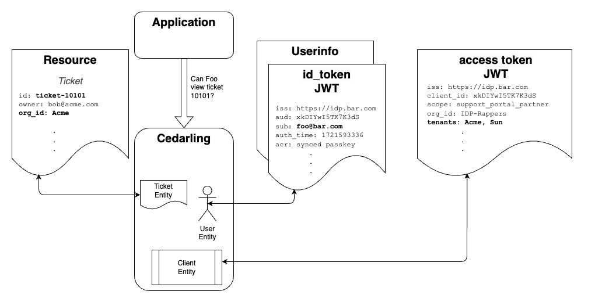

---
tags:
  - administration
  - lock
  - authorization / authz
  - Cedar
  - Cedarling
---

# Authorization Using Cedarling

The **Policy Store** contains the Cedar Policies, Cedar Schema, and optionally, a list of the
Trusted IDPs. The Cedarling loads its Policy Store during initialization as a static JSON file
or fetched via HTTPS. In enterprise deployments, the Cedarling can retrieve its Policy Store from
a Jans Lock Server OAuth protected endpoint.

Developers need to define Cedar Schema that makes sense for their application. For example, a
developer writing a customer support application might define an "Issue" Resource and Actions like
"Reply" or "Close". Once the schema is defined, developers can author policies to model the fine
grain access controls needed to implement the business rules of their application. The easiest way
to define schema and policies is to use the [AgamaLab](https://cloud.gluu.org/agama-lab) Policy
Designer. This is a free developer tool hosted by [Gluu](https://gluu.org).



The JWTs, Resource, Action, and Context are sent in the authz request. Cedar Principal entities
are derived from JWT tokens. The OpenID Connect ("OIDC") JWTs are used by the Cedarling to create
User, Workload, and Role entities based on token claims.

The Cedarling maps "Roles" out-of-the-box. In Cedar, Roles are a special kind of Principal. Instead
of saying "User can perform action", we can say "Role can perform action"--a convenient way to
implement RBAC. Developers can specify which JWT claim is used to map Cedar Roles. For example, one
domain may use the `role` user claim of the OpenID Userinfo token; another domain may use the
`memberOf` claim in the OIDC id_token.

Developers can also express a variety of policies beyond the limitations of RBAC by expressing ABAC
conditions, or combining ABAC and RBAC conditions. For example, a policy like Admins can access a
"private" Resource from the private network, during business hours. In this case "Admins" is the role,
but the other conditions are ABAC. Policy evaluation is fast because Cedar uses the RBAC role to
"slice" the data, minimizing the number of entries on which to evaluate the ABAC conditions.

The OIDC `id_token` JWT represents a Person authentication event. The access token JWT represents a
Workload authentication event. These tokens contain other interesting contextual data. The `id_token`
tells you who authenticated, when they authenticated, how they authenticated, and optionally other
claims like the User's roles. An OAuth access token can tell you information about the Workload that
obtained the JWT, its extent of access as defined by the OAuth Authorization Server (_i.e._ the
values of the `scope` claim), or other claims--domains frequently enhance the access token to
contain business specific data needed for policy evaluation.

## Which authorization method should I use?

Cedarling provides two authorization methods. Choose the one that fits your deployment:

| | `authorize_multi_issuer` | `authorize_unsigned` |
|---|---|---|
| **When to use** | You have JWT tokens from trusted IDPs and want Cedarling to validate them | Your application has already authenticated the principal and wants to pass raw entity data directly |
| **JWT validation** | Yes — full signature, expiration, and status validation | No — accepts raw entity data as-is |
| **Principal source** | Derived from JWT token claims | Supplied directly by the application |
| **Typical scenarios** | Production apps with OIDC/OAuth IDPs, federation, API gateways | Custom auth flows, testing, service-to-service with upstream verification |
| **Security model** | Higher — Cedarling independently verifies token authenticity | Lower — trusts the calling application |
| **Recommended for** | Most production deployments | Prototyping, or when authentication is handled externally |

## Multi-Issuer Authorization (authorize_multi_issuer) — Recommended

The `authorize_multi_issuer` method enables authorization decisions based on multiple JWT tokens from different issuers in a single request. This is the recommended method for most production deployments.

This method does **not** use a principal entity — authorization decisions are based solely on token claims placed in the context. Each validated token becomes a Cedar entity accessible via `context.tokens.{issuer_name}_{token_type}`.

### Key Features

| Feature                | Description                                             |
| ---------------------- | ------------------------------------------------------- |
| Token Sources          | Multiple issuers supported                              |
| Token Types            | Flexible with explicit mapping                          |
| Context Structure      | Individual token entities in `context.tokens`           |
| Use Case               | Federation, API gateways, multi-issuer apps             |
| Policy Context Access  | `context.tokens.{issuer}_{token_type}`                  |

### How It Works

1. **Token Input**: Developers provide an array of `TokenInput` objects, each containing:
   - `mapping`: The Cedar entity type (e.g., "Jans::Access_Token", "Acme::DolphinToken")
   - `payload`: The JWT token string

2. **Token Validation**: Each token is validated using the existing Cedarling JWT validation capabilities:
   - Signature verification
   - Expiration and time-based validation
   - Status list validation (if configured)
   - Only tokens from trusted issuers are processed

3. **Entity Creation**: Each valid token becomes a Cedar entity with:
   - Token metadata (type, jti, issuer, exp, validated_at)
   - JWT claims stored as entity tags
   - All claims stored as Sets of strings by default for consistency

4. **Context Building**: Valid tokens are organized into a `tokens` collection with predictable naming:
   - Field naming: `{issuer_name}_{token_type}`
   - Example: `context.tokens.acme_access_token`, `context.tokens.google_id_token`
   - Issuer name comes from trusted issuer metadata or JWT iss claim

5. **Policy Evaluation**: Policies evaluate based on token entities in context without requiring a principal

### Example Usage

```js
const bootstrap_config = {...};
const cedarling = await init(bootstrap_config);

// Create tokens array with explicit mappings
let tokens = [
  {
    mapping: "Jans::Access_Token",
    payload: "eyJhbGciOiJIUzI1NiIs..."
  },
  {
    mapping: "Jans::Id_Token",
    payload: "eyJhbGciOiJFZERTQSIs..."
  },
  {
    mapping: "Acme::DolphinToken",
    payload: "ey1b6cfMef21084633a7..."
  }
];

// Create multi-issuer request
let request = {
  tokens: tokens,
  action: "Jans::Action::\"Read\"",
  resource: {
    cedar_entity_mapping: {
      entity_type: "Jans::Document",
      id: "doc-123"
    },
    owner: "alice@example.com",
    classification: "confidential"
  },
  context: {
    ip_address: "54.9.21.201",
    time: Date.now()
  }
};

// Execute authorization
let result = await cedarling.authorize_multi_issuer(request);

// Check result — single decision (no per-principal breakdown)
if (result.decision) {
  console.log("Access allowed");
} else {
  console.log("Access denied");
}
```

### Policy Examples

Policies for multi-issuer authorization reference tokens directly in the context:

```cedar
// Policy checking token from specific issuer with claim
permit(
  principal,
  action == Jans::Action::"Read",
  resource in Jans::Document
) when {
  context has tokens.acme_access_token &&
  context.tokens.acme_access_token.hasTag("scope") &&
  context.tokens.acme_access_token.getTag("scope").contains("read:documents")
};

// Policy requiring tokens from multiple issuers
permit(
  principal,
  action == TradeAssociation::Action::"Vote",
  resource in TradeAssociation::Resource::"Elections"
) when {
  // Require token from trade association
  context has tokens.trade_association_access_token &&
  context.tokens.trade_association_access_token.hasTag("member_status") &&
  context.tokens.trade_association_access_token.getTag("member_status").contains("Corporate Member") &&
  // AND require token from company
  context has tokens.nexo_access_token &&
  context.tokens.nexo_access_token.hasTag("scope") &&
  context.tokens.nexo_access_token.getTag("scope").contains("trade_association_rep")
};

// Policy with custom token type
permit(
  principal,
  action == Acme::Action::"SwimWithDolphin",
  resource == Acme::Resource::"MiamiAcquarium"
) when {
  context has tokens.dolphin_dolphintoken &&
  context.tokens.dolphin_dolphintoken.hasTag("waiver") &&
  context.tokens.dolphin_dolphintoken.getTag("waiver").contains("signed")
};
```

### Token Collection Naming Convention

The Cedarling uses a deterministic algorithm to generate token collection field names. The final key is always **lowercase** and uses only **underscores** as separators, making it a valid Cedar identifier.

**Pattern**: `{issuer_name}_{token_type}`

Both components are individually normalized, then joined with a single underscore.

**Step 1 — Issuer Name Resolution**:

1. Look up the JWT's `iss` claim in the trusted issuer configuration from the policy store
2. If a matching trusted issuer is found, use its `name` field (e.g., `"Acme"`)
3. If no trusted issuer matches, extract the hostname from the `iss` URL:
    - Strip the protocol (`https://`, `http://`)
    - Take everything before the first `/`
    - Strip port numbers (everything after `:`)
    - Example: `https://unknown.issuer.com:8080/auth` → `unknown.issuer.com`
4. **Sanitize**: replace all `.` (dots), ` ` (spaces), and `-` (hyphens) with `_`, then convert to **lowercase**

**Step 2 — Token Type Simplification**:

1. Take the `mapping` field from the `TokenInput` (e.g., `"Jans::Access_Token"`)
2. Split by the Cedar namespace separator `::` and take only the **last segment**
3. Convert to **lowercase**
4. Underscores within the token type name are preserved

**Step 3 — Combine**:

Join the sanitized issuer name and simplified token type with `_`:

```text
{sanitized_issuer}_{simplified_token_type}
```

**Examples**:

| JWT `iss` claim | Trusted issuer `name` | Token `mapping` | Resulting key |
|---|---|---|---|
| `https://idp.acme.com/auth` | `"Acme"` | `Jans::Access_Token` | `acme_access_token` |
| `https://idp.acme.com/auth` | `"Acme"` | `Jans::Id_Token` | `acme_id_token` |
| `https://idp.dolphin.sea/auth` | `"Dolphin"` | `Jans::Access_Token` | `dolphin_access_token` |
| `https://idp.dolphin.sea/auth` | `"Dolphin"` | `Acme::DolphinToken` | `dolphin_dolphintoken` |
| `https://unknown.issuer.com/auth` | _(not configured)_ | `Custom::Employee_Token` | `unknown_issuer_com_employee_token` |
| `https://login.microsoftonline.com/tenant` | `"Microsoft"` | `Jans::Id_Token` | `microsoft_id_token` |

Tokens are then accessible in Cedar policies as `context.tokens.{key}`, e.g.:

```cedar
context.tokens.acme_access_token.hasTag("scope")
```

### Error Handling

**Graceful Token Validation Failures**:

- Invalid tokens are ignored and logged
- Authorization continues with remaining valid tokens
- At least one valid token is required for authorization to proceed

**Non-Deterministic Token Detection**:

- System rejects requests with multiple tokens of the same type from the same issuer
- Example: Two "Jans::Access_Token" from "Acme" issuer will fail
- This prevents ambiguous policy evaluation

### Use Cases

1. **Federation Scenarios**: Applications accepting tokens from multiple identity providers
2. **API Gateways**: Validating tokens from various upstream services in a single authorization check
3. **Multi-Organization Access**: Requiring tokens from different organizations for collaborative workflows
4. **Capability-Based Authorization**: Decisions based on capabilities asserted by different issuers rather than single user identity
5. **Zero Trust Architectures**: Each token represents a verification from a different trust boundary

## Automatically Adding Entity References to the Context

Cedarling simplifies context creation by automatically including certain entities. This means you don't need to manually pass their references when using them in your policies. The entities that are auto-added depend on which authorization method you use.

**For `authorize_unsigned`:**

Entities are added based on the Cedar schema's context requirements for the requested action. If the schema defines that an action's context includes a `user` field of type `User`, Cedarling will automatically populate it from the built entities. Typically:

- User Entity
- Workload Entity
- Resource Entity

**For `authorize_multi_issuer`:**

All validated token entities are placed under the `context.tokens` namespace. Each token is accessible via `context.tokens.{issuer_name}_{token_type}`. Additionally:

- `context.tokens.total_token_count` — the number of validated tokens

**Both methods** also include:

- Any [default entities](./cedarling-policy-store.md#default-entities) defined in the policy store
- Any data pushed via the [Context Data API](../tutorials/cedarling-getting-started.md#context-data-api) under `context.data`

**Entity merging automatically resolves conflicts**, ensuring that request entities take precedence over default entities when UIDs match.

### Example Policy

Below is an example policy schema that illustrates how entities are used:

```cedarschema
// Jans namespace: shared infrastructure types used across namespaces.
namespace Jans {
  type Url = {
    host: String,
    path: String,
    protocol: String
  };
}

// Acme namespace: trusted issuer and token entities for the Acme IDP.
// Token entities use `tags Set<String>` for claim-based access in policies.
namespace Acme {
  entity TrustedIssuer = {
    issuer_entity_id: Jans::Url
  };

  entity Access_token = {
    aud?: String,
    exp?: Long,
    iat?: Long,
    iss?: TrustedIssuer,
    jti?: String,
    scope?: Set<String>,
    token_type?: String,
    validated_at?: Long
  } tags Set<String>;

  entity id_token = {
    acr?: String,
    aud?: Set<String>,
    exp?: Long,
    iat?: Long,
    iss?: TrustedIssuer,
    jti?: String,
    sub?: String,
    role?: Set<String>,
    token_type?: String,
    validated_at?: Long
  } tags Set<String>;
}

// MyApp namespace: your business entities, principals, resources, and actions.
namespace MyApp {
  entity Role;

  entity User in [Role] = {
    country: String,
    email: String,
    sub: String,
    username: String
  };

  entity Workload = {
    client_id: String,
    iss: Acme::TrustedIssuer,
    name: String,
    org_id: String
  };

  entity Issue = {
    country: String,
    org_id: String
  };

  action "Update" appliesTo {
    principal: [Role, Workload, User],
    resource: [Issue],
    context: {
      access_token: Acme::Access_token,
      time: Long,
      user: User,
      workload: Workload
    }
  };

  action "View" appliesTo {
    principal: [Role, Workload, User],
    resource: [Issue],
    context: {
      access_token: Acme::Access_token,
      time: Long,
      user: User,
      workload: Workload
    }
  };
}
```

This example uses three namespaces to illustrate how they can be organized:

- **`Jans`** — shared infrastructure types (`Url`) managed by Cedarling
- **`Acme`** — trusted issuer and token entities for a specific IDP. Token entities use `tags Set<String>` to enable claim-based access in policies (e.g., `hasTag("scope")`, `getTag("scope")`)
- **`MyApp`** — your application's business entities (`User`, `Role`, `Issue`), principals, resources, and actions

Cross-namespace references use fully qualified names (e.g., `Jans::Url`, `Acme::TrustedIssuer`, `Acme::Access_token`). You can use as many namespaces as makes sense for your domain.

With this schema, you only need to provide the fields that are not automatically included. For instance, to define the `time` in the context:

```js
let context = {
  time: 1719266610,
};
```

## Unsigned Authorization (authorize_unsigned)

The `authorize_unsigned` method allows making authorization decisions without JWT token verification. Use this when:

- Your application has already verified the principals through other means
- You need to make authorization decisions for non-token-based scenarios
- You're implementing custom authentication flows
- You're testing or prototyping without an IDP

Example usage:

```js
let input = {
  principals: [
    {
      cedar_entity_mapping: {
        entity_type: "Jans::User",
        id: "user123"
      },
      email: "user@example.com",
      role: ["admin"]
    }
  ],
  action: "Jans::Action::\"View\"",
  resource: {
    cedar_entity_mapping: {
      entity_type: "Jans::Issue",
      id: "ticket-10101"
    },
    owner: "bob@acme.com",
    org_id: "Acme"
  },
  context: {
    ip_address: "54.9.21.201",
    network_type: "VPN",
    user_agent: "Chrome 125.0.6422.77 (Official Build) (arm64)",
    time: 1719266610
  }
};

let result = await cedarling.authorize_unsigned(input);
```

Each principal in `principals` uses `cedar_entity_mapping` to define its Cedar entity type and ID. All other fields become entity attributes. Roles are extracted from the attribute specified by `CEDARLING_UNSIGNED_ROLE_ID_SRC` (default: `"role"`).

The result contains per-principal Cedar responses combined using the [`CEDARLING_PRINCIPAL_BOOLEAN_OPERATION`](./cedarling-principal-boolean-operations.md) logic:

```js
{
  decision: true,           // Combined boolean decision
  request_id: "...",        // Tracing ID
  principals: {             // Per-principal Cedar responses
    "Jans::User": { ... }
  }
}
```

## Policy Introspection

Cedarling also provides methods to discover which policies are potentially applicable to a given authorization request **without executing authorization**. This is useful for:

- Showing operators which policies are relevant before authorization
- Supporting policy auditing and review workflows
- Debugging unexpected authorization outcomes by listing candidate policies

Two methods are available, corresponding to the two authorization methods:

- `get_matching_policies_unsigned(principals, actions, resources)` — for unsigned authorization
- `get_matching_policies_multi_issuer(tokens, actions, resources)` — for multi-issuer authorization

Both accept arrays of principals (or tokens), actions, and resources, and return a list of `PolicyMetadata` objects containing the policy `id`, `annotations`, and `source` code.

**Important:** These methods perform scope-level filtering only (principal type, action, resource type). Policies with `when`/`unless` body conditions cannot be pre-evaluated without full context, so the returned set is a superset of truly applicable policies.

See the [Interfaces](./cedarling-interfaces.md#policy-introspection) reference for full API details and examples.
