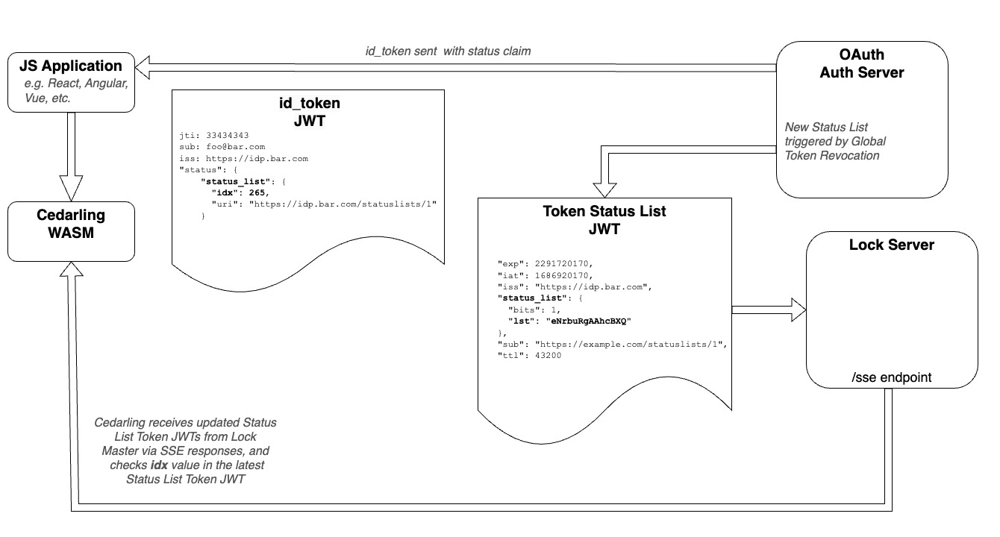

---
tags:
  - administration
  - authorization / authz
  - Cedar
  - Cedarling
  - jwt
  - validation
---

# Cedarling JWT Validation

Cedarling performs JWT (JSON Web Token) validation as part of its authorization workflow. This process ensures that only tokens from trusted issuers, with valid signatures and required claims, are used to make policy decisions. Optional revocation and trust-mode checks add further assurance and control.

## Overview

Learn more about each part of the validation process:

- [Signature Validation](#jwt-signature-validation): Verifies the token's origin using trusted issuer keys.
- [Content Validation](#jwt-content-validation): Ensures required claims like `exp` or `client_id` are present.
- [Schema and Claims Compatibility](#schema-and-claims-compatibility): How Cedar schema must match JWT payload structure.
- [JWT Status Validation](#jwt-status-validation): Checks if a token has been explicitly revoked.
- [Local JWKS](#local-jwks): Using local key stores for testing.

**Key Configuration Properties:**

- `CEDARLING_JWT_SIG_VALIDATION`: Controls JWT signature validation
- `CEDARLING_JWT_STATUS_VALIDATION`: Controls JWT revocation checks  
- `CEDARLING_LOCAL_JWKS`: Local key store for testing

See the complete [bootstrap properties reference](./cedarling-properties.md) for all available configuration options.

## JWT Signature Validation

At startup, Cedarling fetches public keys from trusted identity providers (IDPs) defined in the [policy store](./cedarling-policy-store.md). These keys are used to validate the signature of incoming JWTs.

!!! note "Running without trusted issuers"
When `CEDARLING_JWT_SIG_VALIDATION` is enabled, if no trusted issuers (or local JWKS) are configured, Cedarling still starts and logs a **WARN** indicating that signed authorization is unavailable. Unsigned requests (`authorize_unsigned`) continue to work, but any attempt to validate signed JWTs fails with `SignedAuthzUnavailable` until at least one trusted issuer or JWKS is configured. When `CEDARLING_JWT_SIG_VALIDATION` is disabled, this warning does not appear as signature validation is not required.

### Configuration

To enable this feature, set the `CEDARLING_JWT_SIG_VALIDATION` bootstrap property to `enabled`. For development and testing purposes, you can set this property to `disabled` and submit an unsigned JWT, such as one generated from [jwt.io](https://jwt.io).

On initialization, Cedarling will fetch the latest public keys from the issuers specified in the Policy Store and cache them. The system uses the JWT `iss` claim to select the appropriate keys for validation.

### Example Policy Store

Cedarling only validates tokens issued by [trusted issuers](./cedarling-policy-store.md#trusted-issuers-schema) listed in the policy store. Tokens from issuers not listed in the policy store will be **ignored** and will not be used for [entity creation](./cedarling-entities.md).

To allow an Access token like the one below to be used for authorization:

```json
{
  "iss": "https://test.issuer.com",
  "aud": "abc123",
  "exp": 1234567890
}
```

You **MUST** define a trusted issuer in your policy store with a matching `openid_configuration_endpoint` (same host as the token's `iss` claim):

```json
{
  // ... other fields have been omitted for brevity
  "trusted_issuers": {
    "my_trusted_issuer_id": {
      "name": "my trusted issuer",
      "description": "an IDP that i trust",
      "openid_configuration_endpoint": "https://test.issuer.com/.well-known/openid-configuration",
      "token_metadata": { 
        "access_token": { 
          "entity_type_name": "Jans::Access_token",
          "token_id": "jti",
          "required_claims": ["exp", "client_id"]
        }
      }
    }
  }
}
```

Additionally, only tokens **explicitly named** in the `token_metadata` section will be validated. All other tokens will be ignored.

### Validation Requirements

In summary, for a token to be validated by Cedarling, two conditions must be met:

1. The `iss` (Issuer) claim must match the **host** of an `openid_configuration_endpoint` in the policy store.
2. The token must be provided under a **token name** defined in the corresponding `token_metadata`

  ```js
  // Example authorize_multi_issuer call
  cedarling.authorize_multi_issuer({
    tokens: [
      { mapping: "Jans::Access_Token", payload: "<access_token>" }, // will be validated
      { mapping: "Jans::Id_Token", payload: "<id_token>" },         // will be ignored unless defined in token_metadata
    ],
    // ...
  })
  ```

## JWT Content Validation

Cedarling also supports validating the contents of a JWT by enforcing the presence of required claims. These requirements are defined in the `token_metadata` section of the policy store.

### Required Claims

You can specify required claims in your token metadata configuration. If `exp` or `nbf` are included in `required_claims`, Cedarling will validate them according to [RFC 7519](https://datatracker.ietf.org/doc/html/rfc7519#section-4.1) (checking expiration and not-before timestamps against the current time).

```json
{
  // ... other fields have been omitted for brevity
  "trusted_issuers": {
    "my_trusted_issuer_id": {
      "name": "my trusted issuer",
      "description": "an IDP that i trust",
      "openid_configuration_endpoint": "https://test.issuer.com/.well-known/openid-configuration",
      "token_metadata": { 
        "access_token": {
          "entity_type_name": "Jans::Access_token",
          "required_claims": ["exp", "client_id"]
        }
      }
    }
  }
}
```

The above configuration means that any `access_token` must contain both the `exp` and `client_id` claims, or it will be rejected. Registered claims like `exp` and `nbf` will also be validated according to [RFC 7519](https://datatracker.ietf.org/doc/html/rfc7519#section-4.1) standards (e.g., checking that the token is not expired).

## Schema and Claims Compatibility

When building token entities, Cedarling maps JWT claims to Cedar entity attributes based on the Cedar schema. The schema must be compatible with the JWT payload structure, otherwise entity creation will fail.

### Behavior Rules

| Scenario | Behavior |
| --- | --- |
| Required schema attribute missing from JWT | **Error**: entity creation fails with `MissingClaims` |
| Optional schema attribute missing from JWT | Silently skipped, attribute is not added |
| JWT claim present but not defined in schema | Ignored as attribute; added as entity tag in multi-issuer flow |
| Type mismatch on required attribute | **Error**: entity creation fails with `TypeMismatchError` |
| Type mismatch on optional attribute | Silently skipped |
| No schema defined for entity type | All JWT claims are added as attributes |

### Optionality

If a JWT claim may or may not be present in the token payload, the corresponding Cedar schema attribute **must** be marked as optional (with `?`). Otherwise, Cedarling will return an error when the claim is absent.

For example, if the `name` claim is not always present in access tokens:

```cedarschema
// Correct: name is optional
namespace Acme {
  entity Access_token = {
    jti?: String,
    iss?: TrustedIssuer,
    exp?: Long,
    name?: String,
  };
};
```

```cedarschema
// Wrong: name is required but may be missing from JWT
namespace Acme {
  entity Access_token = {
    jti?: String,
    iss?: TrustedIssuer,
    exp?: Long,
    name: String,
  };
};
```

### Type Matching

Cedar schema types must match the JWT claim value types:

| Cedar Type | Expected JWT Value |
| --- | --- |
| `String` | JSON string |
| `Long` | JSON number |
| `Bool` | JSON boolean |
| `Set<T>` | JSON array of `T` |
| Record (`{ field: Type }`) | JSON object |
| Entity reference | Resolved from built entities |

A type mismatch on a **required** attribute causes an error. A type mismatch on an **optional** attribute causes the attribute to be silently skipped.

## JWT Status Validation

Cedarling optionally supports JWT revocation checks by validating the status bit of a "Status Token" JWT, as proposed in the [OAuth Status Lists](https://datatracker.ietf.org/doc/draft-ietf-oauth-status-list/) draft.

This feature is toggled with the `CEDARLING_JWT_STATUS_VALIDATION` property.

> ℹ️ **Use Case**
>
> Enforcing token revocation can help mitigate account takeover risks by allowing for near-instant invalidation of compromised tokens.

## JWT Validation Flow Diagram

JWTs (JSON Web Tokens) contain authorization information that is used by the Cedarling to construct token entities in the `authorize_multi_issuer` flow. To verify the authenticity of this information, the Cedarling can verify the integrity of the JWT by validating its signature and status (active, expired, or revoked). It does so by fetching the public keyset and the list of active tokens from the issuer of the JWT.



## Local JWKS

A local JWKS can be used by setting the `CEDARLING_LOCAL_JWKS` bootstrap property to a path to a local JSON file. When providing a local Json Web Key Store (JWKS), the file must follow the following schema:

```json
{
    "trusted_issuer_id": [ ... ],
    "another_trusted_issuer_id": [ ... ]
}
```

* Where keys are `Trusted Issuer IDs` assigned to each key store
* and the values contains the JSON Web Keys as defined in [RFC 7517](https://datatracker.ietf.org/doc/html/rfc7517).
* The `trusted_issuer_id` is used to tag a JWKS with a unique identifier and enables using multiple key stores.

