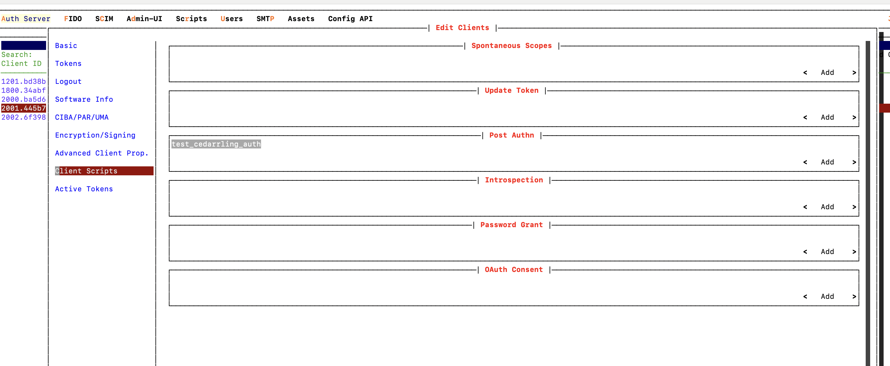

# Cedarling Java binding

[UniFFI](https://mozilla.github.io/uniffi-rs/latest/) (Universal Foreign Function Interface) is a tool developed by Mozilla to simplify cross-language bindings, primarily between Rust and other languages like Kotlin, Swift, and Python. It allows Rust libraries to be used in these languages without manually writing complex foreign function interface (FFI) bindings.

Please refer to [this document](./cedarling-uniffi.md) for details on the structs, enums, and functions exposed by UniFFI bindings. This section outlines the process of generating the Kotlin binding for Cedarling using Cedarling UniFFI. The Kotlin binding is then wrapped in a Java class to enable convenient use in Java applications.

## Building from Source

Apart from using the Cedarling binding [using the package manager](../../getting-started/java/#using-the-package-manager), you 
can also build it from source.

### Prerequisites

- Rust: Install it from [the official Rust website](https://www.rust-lang.org/tools/install).
- Java Development Kit (JDK): version 11 
- Apache Maven: Install it from [Apache Maven Website](https://maven.apache.org/download.cgi)

### Building

- Build Cedarling by executing below command from `./jans/jans-cedarling` of cloned jans project:
   ```bash
   cargo build -r -p cedarling_uniffi
   ```
   In `target/release`, you should find the `libcedarling_uniffi.dylib` (if Mac OS), `libcedarling_uniffi.so` (if Linux OS), or `libcedarling_uniffi.dll` (if Windows OS) file, depending on the operating system you are using.
!!! note
    You can use pre-built `libcedarling_uniffi.so` from the [Jans releases page](https://github.com/JanssenProject/jans/releases) if you are using Linux OS.

- Generate the bindings for Kotlin by running the command below. Replace `{build_file}` with `libcedarling_uniffi.dylib`, `libcedarling_uniffi.so`, or `libcedarling_uniffi.dll`, depending on which file is generated in `target/release`.
   ```bash
   cargo run --bin uniffi-bindgen generate --library ./target/release/{build_file} --language kotlin --out-dir ./bindings/cedarling-java/src/main/kotlin/io/jans/cedarling
   ```
!!! note
    You can use pre-built kotlin binding (`cedarling_uniffi-kotlin-{version}.zip`) from the [Jans releases page](https://github.com/JanssenProject/jans/releases).

- Copy the generated `libcedarling_uniffi.dylib`, `libcedarling_uniffi.so`, or `libcedarling_uniffi.dll` file to resource directory of the `cedarling-java` Maven project. Replace `{build_file}` in the below commad with `libcedarling_uniffi.dylib`, `libcedarling_uniffi.so`, or `libcedarling_uniffi.dll`, depending on which file is generated in `target/release`.
   ```bash
   mkdir ./bindings/cedarling-java/src/main/resources
   cp ./target/release/{build_file} ./bindings/cedarling-java/src/main/resources
   ```

4. Change directory to `./bindings/cedarling-java` and run below command to build `cedarling-java` jar file. This will generate `cedarling-java-{version}-distribution.jar` at `./bindings/cedarling-java/target/`.
   ```bash
    mvn clean install
   ```
   

## Recipes

### Use the Cedarling Java binding in custom scripts 

Here is a simple recipe to add scopes in access-token using update_token script only if the requesting client has `authorization_code` grant-type. We will use below policy for this:

```bash
@id("Allow if the grant type is authorization_code")
permit (
  principal is Jans::Workload,
  action == Jans::Action::"Execute",
  resource is Jans::Application
)
when {
  principal.grantTypes.contains("authorization_code")
};
```

**Steps:** 

- Upload [bootstrap.json](./cedarling-sample-inputs.md/#bootstrapjson) and [policy-store.json](./cedarling-sample-inputs.md/#policy-storejson) at `/opt/jans/jetty/jans-auth/custom/static` location of the auth server. The [Asset Screen](https://docs.jans.io/v1.6.0/janssen-server/config-guide/custom-assets-configuration/#asset-screen) can be used to upload assets.
- Upload the generate `cedarling-java-{version}.jar` at `/opt/jans/jetty/jans-auth/custom/libs` location of the auth server.

!!! note
    Rather than building the cedarling-java-{version}.jar from source code, you can directly download 
    the latest version of the jar from the [Maven repository](https://maven.jans.io/maven/io/jans/cedarling-java/).
   
- The following java [Update Token](./cedarling-sample-inputs.md/#sample_cedarling_update_tokenjava) script has been created for calling Cedarling authorization. Enable the script with following Custom Properties:
   
   |Key|Values|
   |---|------|
   |BOOTSTRAP_JSON_PATH|./custom/static/bootstrap.json|

- Map the script with the client used to perform authentication.
   

- The script runs before access_token generation and includes `openid` and `profile` scopes into the token if the oidc client has `authorization_code` in grant-types. 

### Build a sample Java Project using the Kotlin binding

1. Build Cedarling by executing below command from `./jans/jans-cedarling` of cloned jans project:
    ```bash
    cargo build -r -p cedarling_uniffi
    ```
   In `target/release`, you should find the `libcedarling_uniffi.dylib` (if Mac OS), `libcedarling_uniffi.so` (if Linux OS), or `libcedarling_uniffi.dll` (if Windows OS) file, depending on the operating system you are using.

2. Generate the bindings for Kotlin by running the command below. Replace `{build_file}` with `libcedarling_uniffi.dylib`, `libcedarling_uniffi.so`, or `libcedarling_uniffi.dll`, depending on which file is generated in `target/release`.
    ```bash
    cargo run --bin uniffi-bindgen generate --library ./target/release/{build_file} --language kotlin --out-dir ./bindings/cedarling_uniffi/javaApp/src/main/kotlin/org/example
    ```

3. Copy the generated `libcedarling_uniffi.dylib`, `libcedarling_uniffi.so`, or `libcedarling_uniffi.dll` file to resource directory of the sample Java Maven project. Replace `{build_file}` in the below commad with `libcedarling_uniffi.dylib`, `libcedarling_uniffi.so`, or `libcedarling_uniffi.dll`, depending on which file is generated in `target/release`.
    ```bash
    cp ./target/release/{build_file} ./bindings/cedarling_uniffi/javaApp/src/main/resources
    ```git add 

4. Change directory to sample Java project (`./bindings/cedarling_uniffi/javaApp`) and run below command to run the main method of a Maven project from the terminal.
    ```bash
     mvn clean install
     mvn exec:java -Dexec.mainClass="org.example.Main"
    ```
The method will execute the steps for Cedarling initialization with a sample bootstrap configuration, run authorization with sample tokens, resource and context inputs and call log interface to print authorization logs on console.

Note the following points in the sample Java Maven project to understand the changes required for using the Kotlin binding in other Java projects.

- The sample `tokens`, `resource` and `context` input files along with files containing `bootstrap configuration` and `policy- store` used by the sample application are present at `./bindings/cedarling_uniffi/javaApp/src/main/resources/config`.
- Refer to the Java code in org.example.Main to see how Cedarling's `init`, `authz`, and `log` interfaces are called using the Kotlin binding.

##### Required Dependencies

Add the following dependencies in the pom.xml.

- **Java Native Access (JNA):** A Java library that allows Java code to call native shared libraries (like .so on Linux, .dll on Windows, or .dylib on macOS) without writing JNI (Java Native Interface) code.

- **kotlinx.coroutines:** Adds support for asynchronous programming using coroutines.

- **kotlin-stdlib-jdk:** The kotlin-stdlib-jdk8 library is a variant of the Kotlin standard library that includes additional features specifically designed to work with JDK 8 (Java Development Kit 8) or higher.

- **nimbus-jose-jwt:** The nimbus-jose-jwt library is a Java library used for working with JWTs (JSON Web Tokens) and JOSE (JavaScript Object Signing and Encryption) standards

- **jackson-databind:** The jackson-databind library is a core module of the Jackson JSON processing framework in Java
