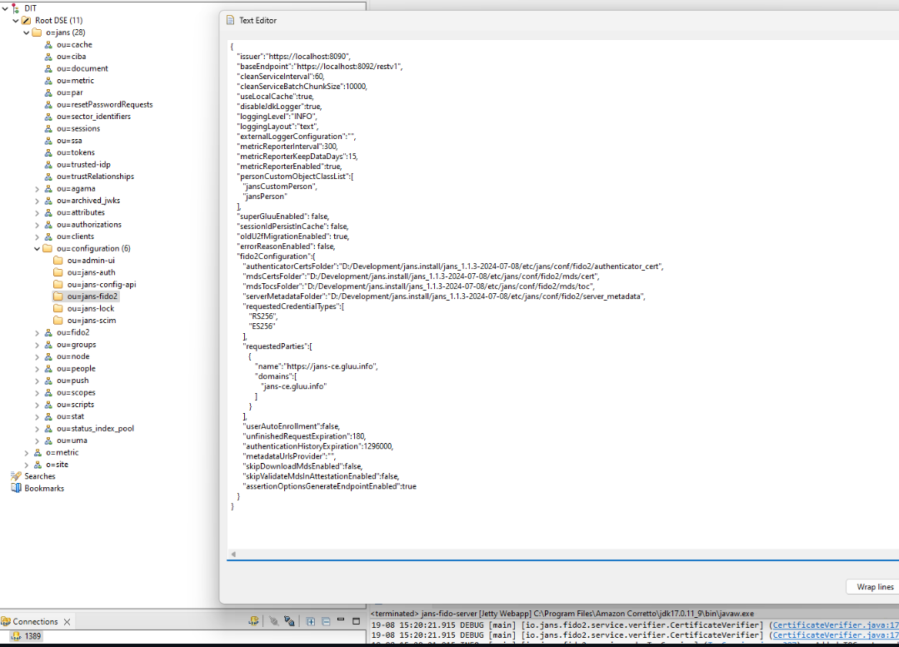
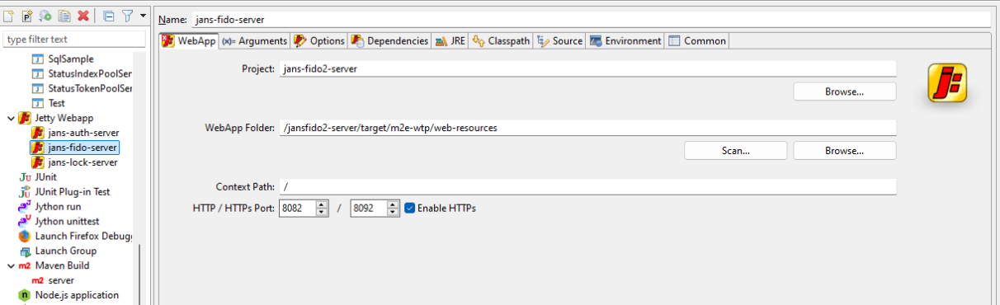
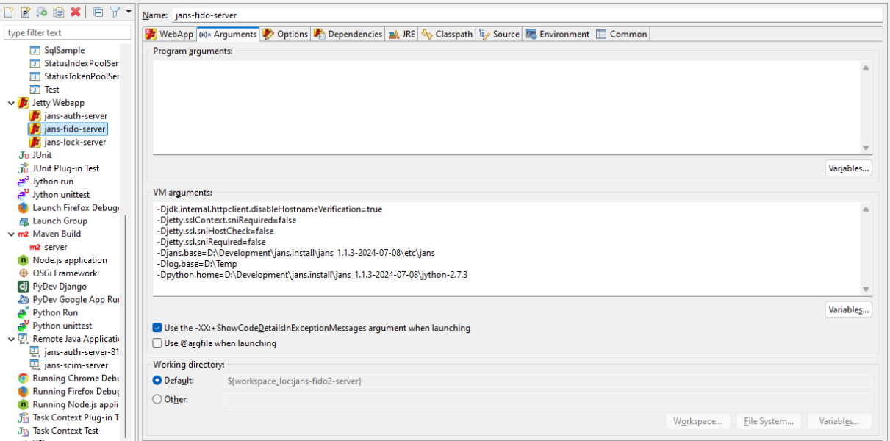
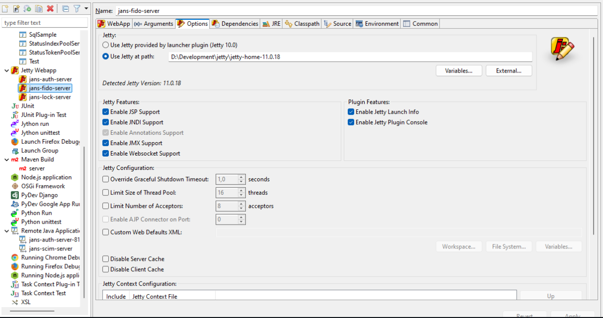
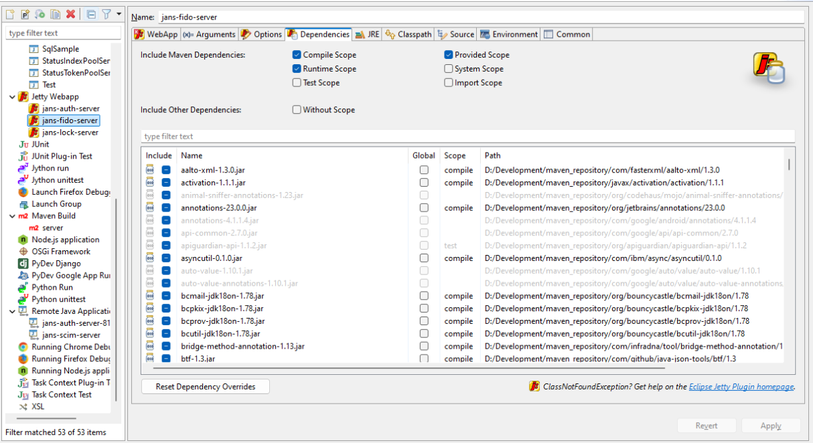
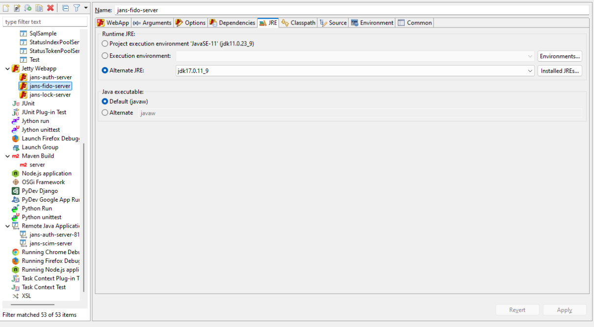
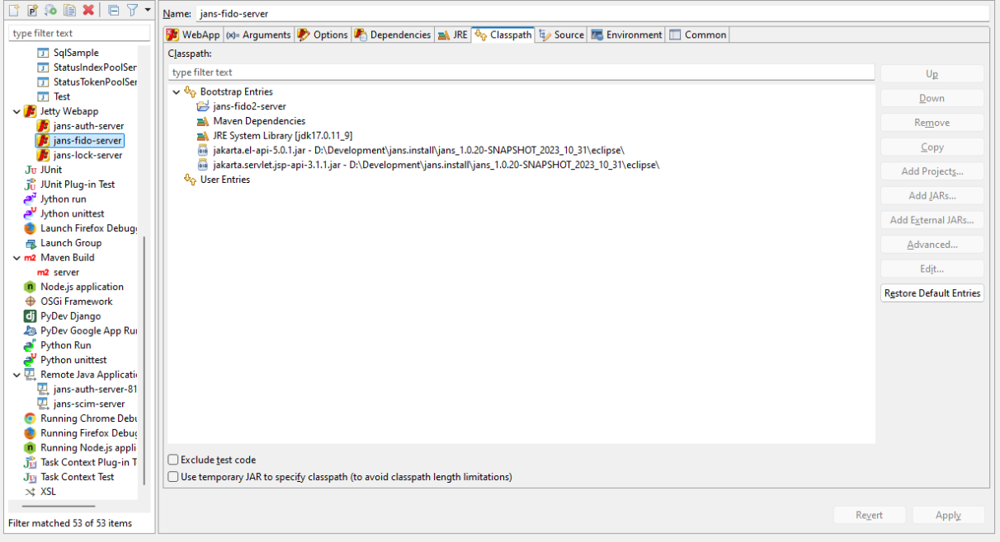
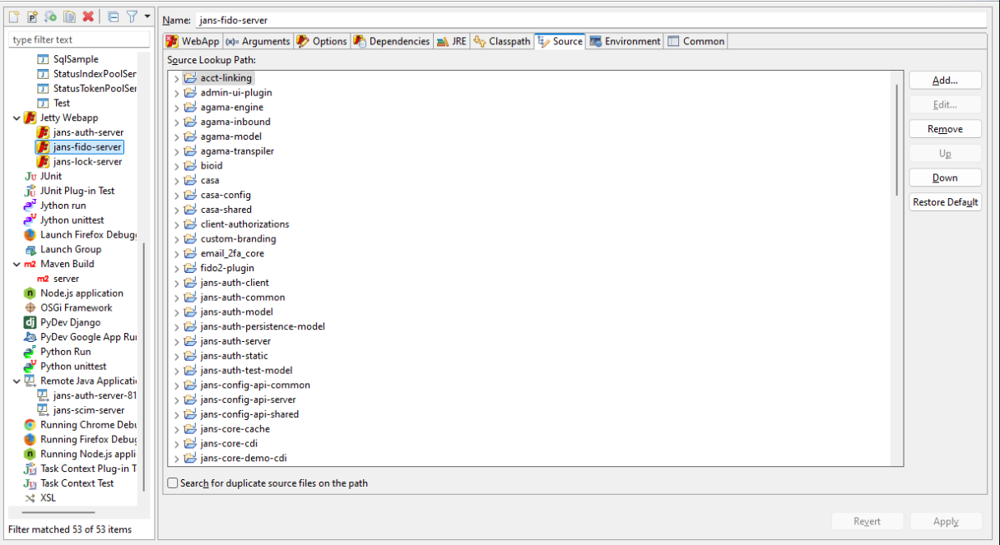
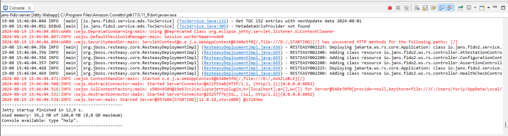
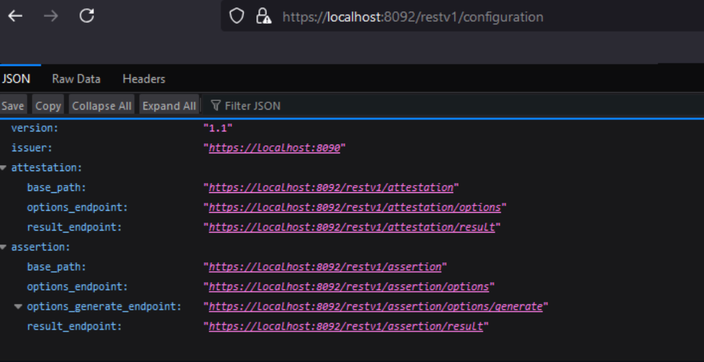

---
tags:
- development
- contribute
- workspace
- eclipse
---


# Local Run Under Eclipse

Follow this step-by-step guide to install, configure, and run `Jans CE` and its components (including OpenDJ and FIDO2) in a local development environment using Eclipse.

## Data preparation

1. Install Jans CE into VM with all required components. During install select LDAP server. It's most easier way to copy data developer workstation
2. Copy folders to local disk to tree like this:

```
  D:\Developement\jans\jans_1.1.3-2024-07-08
   |-etc
     |- certs\*
     |- jans\*
   |-jans-setup
   |-jython-2.7.4
   |-opendj
```

## Eclipse plugins


Install next Eclipse plugins:

* Apache Directory Studio (select browser part only)
* Eclipse jetty 7.0.0


## Run server locally

This section shows how to run Fido2 server, for example

* Start OpenDJ from local folder.

* Connect to OpenDJ with Apache DS plugin and update config

      

* Configure new Jetty Webapp run configuration. Here are screenshots:

      

      

      

      

      

      

      

## Expected result



