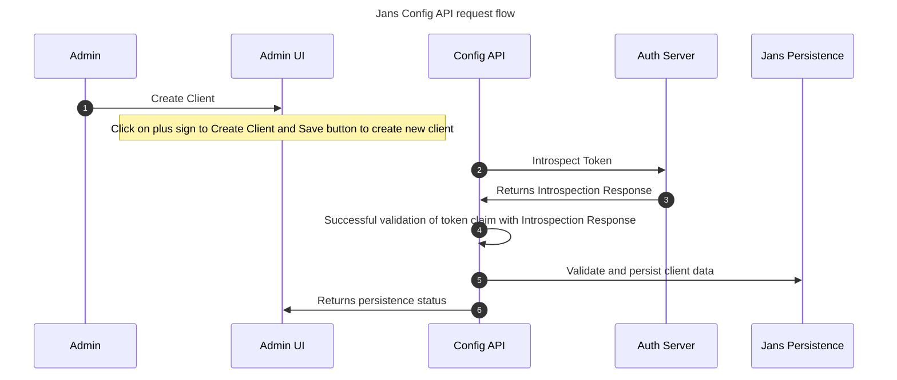

---
tags:
  - developer
  - config-api
---

# Janssen Config API

Janssen(Jans) Config API is an application programming interface (API) gateway managing configuring of various Janssen modules.

[Diagram reference](../../assets/config-api-components.png)

### Jans Config API features:

 1. Jans Config API uses REST endpoints to communicate. 
 2. Jans Config API endpoint are OAuth 2.0 protected. More details [here](../../janssen-server/config-guide/config-tools/config-api/authorization.md)
 3. Jans Config API plugin architecture can be used to add new features. More details [here](../../janssen-server/config-guide/config-tools/config-api/plugins.md).
 4. Config API endpoint can be used to create new user, clients, scopes, etc. This data is stores into the same persistence store as the Jans-Auth server.

### Jans Config API Flow

 1. **Admin**: Administrator of the application. Will use Admin UI to configure application. </li>
 2. **Admin UI**: Gluu graphical user interface for the administrators to manage configuration and other properties of Jans Auth Server via Jans Config API.</li>
 3. **Config API**: Jans API gateway for configuring Janssen modules like Jans Auth Server, fido2, SCIM, etc. </li>
 4. **Auth Server**: Janssen federated identity with comprehensive implementation of OpenID Connect. Used for introspection of access token in this flow.</li>
 5. **Jans Persistence**: Jans Persistence layer to persist data in backend.</li>

