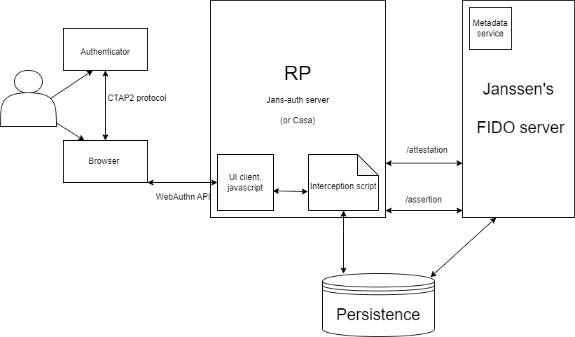

---
tags:
  - developer
  - fido
---

# Overview

## Janssen's FIDO2 server

FIDO2 as an open standard for authentication is based on public key cryptography.

Janssen's FIDO2 server - a component inside the Janssen project enables users of RPs to enroll and authenticate themselves using U2F keys, FIDO2 keys or inbuilt platform authenticator.
1. The FIDO2 server uses REST endpoints to communicate with an RP via an https connection.
2. The FIDO2 server implements the [FIDO Metadata Service (MDS3)](https://fidoalliance.org/metadata/metadata-service-overview/) defined by FIDO Alliance.
3. The FIDO2 server stores user data into the same persistence store as the Jans-Auth server. (LDAP, MYSQL, Couchbase etc.)

### Components of the FIDO2 ecosystem in Janssen




[Diagram reference](../../assets/fido2-components.xml)

 1. **User**: User of an application, the one who possesses the Authenticator and who's role is to pass the Test of User Presence (TUP) (touch device, look, speak etc.).

 2. **WebAuthn API**:
    * A global web standard for password-less FIDO2 authentication, implemented by most browsers (Google Chrome, Mozilla Firefox, Microsoft Edge, Apple Safari, Opera, Microsoft edge).
    * It provides clients access to the underlying capabilities of the Authenticator.
    * WebAuthn offers a very good user experience, there is no need for any additional browser plugin to be installed.
    * WebAuthn API: enables clients to make requests to authenticators with regards to :
       - creation of a new key-pair
       - provide an assertion about a key
       - report capabilities (capability exists but not offered in Janssen's FIDO2 offering)
       - manage a PIN. (capability exists but not offered in Janssen's FIDO2 offering)

3. **Authenticator**: A device which holds the private key. It prompts the user to perform a certain gesture. It can be a platform authenticator that is built into the client device or a roaming authenticator that is connected to the client device through USB, BLE, or NFC.

4. **Relying Party**: The RP (`jans-auth` or `casa`) implements a Javascript Client which makes a registration and authentication request to the WebAuthn API. The Relying Party ID is the DNS domain where the FIDO2 device will be registered and used.

5. **CTAP2**: Simple and lightweight hardware protocol that enables Authenticators to talk with Supported browsers.

6. **FIDO2 Server**
Janssen's FIDO server is a standalone server communicates with the RP using an API which can be obtained by querying the following URL :
`https://<myjans-server>/.well-known/fido2-configuration`
Response:

    ```
    {
      "version": "1.1",
      "issuer": "https://<myjans-server>",
      "attestation": {
        "base_path": "https://<myjans-server>/jans-fido2/restv1/attestation",
        "options_enpoint": "https://<myjans-server>/jans-fido2/restv1/attestation/options",
        "result_enpoint": "https://<myjans-server>/jans-fido2/restv1/attestation/result"
      },
      "assertion": {
        "base_path": "https://<myjans-server>/jans-fido2/restv1/assertion",
        "options_enpoint": "https://<myjans-server>/jans-fido2/restv1/assertion/options",
        "result_enpoint": "https://<myjans-server>/jans-fido2/restv1/assertion/result"
      }
    }
    ```

    The two main functionalities are:
    1. Attestation
    2. Assertion
    The authenticator credentials obtained after querying the WebAuthn API is forwarded to the FIDO2 server for attestation or assertion.

7. **Interception script** : In the Janssen ecosystem, the authentication flow that comprises of the calls to WebAuthn API and the FIDO server is achieved using an interception script, details of it can be found [here](../../script-catalog/person_authentication/fido2-external-authenticator/README).


### Attestation formats supported by Janssen's FIDO server
* [Packed (FIDO2)](https://github.com/JanssenProject/jans/blob/main/jans-fido2/server/src/main/java/io/jans/fido2/service/processor/attestation/PackedAttestationProcessor.java): The most used attestation format
* [TPM](https://github.com/JanssenProject/jans/blob/main/jans-fido2/server/src/main/java/io/jans/fido2/service/processor/attestation/TPMProcessor.java) : Attestation for Windows10 devices
* [Android key attestation](https://github.com/JanssenProject/jans/blob/main/jans-fido2/server/src/main/java/io/jans/fido2/service/processor/attestation/AndroidKeyAttestationProcessor.java) : Attestation for android devices.
* [Android SafetyNet ](https://github.com/JanssenProject/jans/blob/main/jans-fido2/server/src/main/java/io/jans/fido2/service/processor/attestation/AndroidSafetyNetAttestationProcessor.java): Any Android devices running 7+
* [FIDO U2F](https://github.com/JanssenProject/jans/blob/main/jans-fido2/server/src/main/java/io/jans/fido2/service/processor/attestation/U2FAttestationProcessor.java): Legacy U2F authenticators
* [Apple Anonymous](https://github.com/JanssenProject/jans/blob/main/jans-fido2/server/src/main/java/io/jans/fido2/service/processor/attestation/AppleAttestationProcessor.java): Apple devices do attestations differently.
* [None](https://github.com/JanssenProject/jans/blob/main/jans-fido2/server/src/main/java/io/jans/fido2/service/processor/attestation/NoneAttestationProcessor.java)

### Backward compatibility with U2F authenticators
The FIDO server offers registration and authentication using legacy U2F authenticators.

### References
1. https://www.w3.org/TR/webauthn-2/
2. http://fidoalliance.org/specs/mds/fido-metadata-statement-v3.0-ps-20210518.html

### Tools
1. https://jwt.io/ – For JWT decoding and debugging
2. https://www.base64decode.org/ – For Decoding Base64 to UTF8
3. https://fidoalliance.org/certification/fido-certified-products/ - To browse authenticators listed with FIDO Alliance
