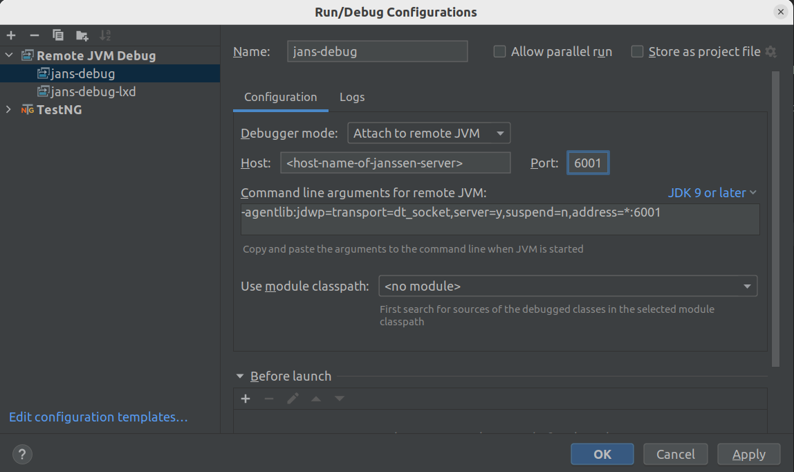
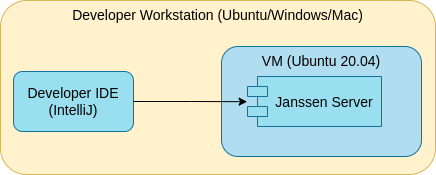
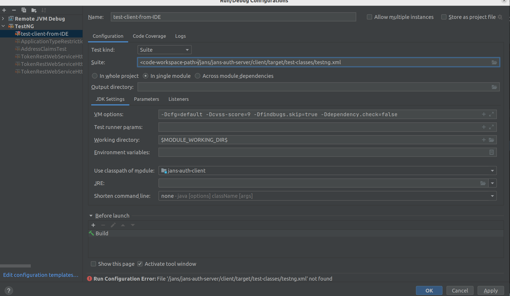

# Developing for Janssen Project

## Remote Debugging

Janssen Server modules run as a Java process. Hence, like any other Java process the module
JVMs can be configured to open a debug port where remote debugger can be attached. Steps below will show how to configure `auth-server` module for remote debugging.

1. Pass the commandline options to the JVM

    On the Janssen Server host, open the service config file `/etc/default/jans-auth` and add following JVM parameters to as `JAVA_OPTIONS`

    ```
    -Xrunjdwp:transport=dt_socket,server=y,suspend=n,address=6001
    ```
    This will open port 6001 for remote debugger. Any other port can also be used based on availability.

2. Restart `jans-auth` services

    ```
    systemctl restart jans-auth.service
    ```
   
3. Check if the port is open and accessible from within the Janssen Server host

    Use `jdb` tool from JDK to test if the JVM port has been opened

    ```
    ./<path-to-JDK>/bin/jdb -attach 6001
    ```

    if the port is open, it'll give you output like below:

    ```
    Set uncaught java.lang.Throwable
    Set deferred uncaught java.lang.Throwable
    Initializing jdb ...
    >
    ```
    press ctrl+c to come out of it.

4. Ensure that the port is accessible from outside the host VM as well and firewalls are configured accordingly

5. Connect to remote port on Janssen Server host from Janssen workspace. Use any IDE (Intellij, Eclipse etc.) to create and run a remote debugging profile providing IP and debug port of the Janssen Server host.

    For IntelliJIdea, create a debug configuration as below:

    

## Run Integration Tests with a Janssen Server VM

In this guide, we will look at steps to run the Janssen integration test suite against a locally installed Janssen server on developer machine.

### Component Setup



## Install Janssen:

  Install the Janssen server using one of the methods described in [this](../admin/install/README.md) guide. Make a note of the `host name` that you assign to the Janssen server during the installation. For the purpose of this guide, the Janssen host name would be `janssen2.op.io`

  Now access the `.well-known` end-points (sample below) of the Janssen server from browser to ascertain that the Janssen server running inside local VM is healthy and also accessible from developer's machine.

  ```
  https://janssen2.op.io/jans-auth/.well-known/openid-configuration
  ```

  Response received should be a JSON formatted Janssen configuration details, similar to below.

  ```
  {
  "request_parameter_supported" : true,
  "pushed_authorization_request_endpoint" : "https://janssen2.op.io/jans-auth/restv1/par",
  "introspection_endpoint" : "https://janssen2.op.io/jans-auth/restv1/introspection",
  "claims_parameter_supported" : false,
  "issuer" : "https://janssen2.op.io",
  "userinfo_encryption_enc_values_supported" : [ "RSA1_5", "RSA-OAEP", "A128KW", "A256KW" ],
  "id_token_encryption_enc_values_supported" : [ "A128CBC+HS256", "A256CBC+HS512", "A128GCM", "A256GCM" ],
  "authorization_endpoint" : "https://janssen2.op.io/jans-auth/restv1/authorize",
  "service_documentation" : "http://jans.org/docs",
  "authorization_encryption_alg_values_supported" : [ "RSA1_5", "RSA-OAEP", "A128KW", "A256KW" ],
  "id_generation_endpoint" : "https://janssen2.op.io/jans-auth/restv1/id",
  "claims_supported" : [ "street_address", "country", "zoneinfo", "birthdate", "role", "gender", "user_name", "formatted", "phone_mobile_number", "preferred_username", "inum", "locale", "updated_at", "post_office_box", "nickname", "preferred_language", "email", "website", "email_verified", "profile", "locality", "room_number", "phone_number_verified", "given_name", "middle_name", "picture", "name", "phone_number", "postal_code", "region", "family_name", "jansAdminUIRole" ],
  "scope_to_claims_mapping" : [ {
    "user_name" : [ "user_name" ]
  }, {
    "https://jans.io/scim/users.write" : [ ]
  }, {
    "https://jans.io/scim/groups.read" : [ ]
  }, {
    "https://jans.io/scim/all-resources.search" : [ ]
  }, {
    "https://jans.io/scim/fido.write" : [ ]
  }, {
    "https://jans.io/scim/groups.write" : [ ]
  }, {
    "https://jans.io/scim/fido2.read" : [ ]
  }, {
    "https://jans.io/scim/fido.read" : [ ]
  }, {
    "https://jans.io/scim/fido2.write" : [ ]
    
  ```

  

## Configure developer workspace

We are going to configure developer workspace in IntelliJIdea IDE. Using IDE, get Janssen server code from [Janssen GitHub repository](https://github.com/JanssenProject/jans).

Janssen Server is composed of multiple modules. Below are the instructions for configuring each module for tests.

### Auth-server client module

#### setup certificate

- Update Java cacerts

  extract certificate for Janssen server with name `janssen2.op.io`

  ```
  openssl s_client -connect test.local.jans.io:443 2>&1 |sed -ne '/-BEGIN CERTIFICATE-/,/-END CERTIFICATE-/p' > /tmp/httpd.crt
  ```
  this command takes few seconds to return.

 Update cacerts of your JRE which is being used by code workspace. For example if JRE being used my maven is `/usr/lib/jvm/java-11-amazon-corretto`. It will prompt for cert store password. Default is `changeit`.

  ```
  keytool -import -alias janssen2.op.io -keystore /usr/lib/jvm/java-11-amazon-corretto/lib/security/cacerts -file /tmp/httpd.crt
  ``` 

#### Profile setup

Follow the steps below to configure workspace and run tests for client module.

- Under `jans-auth-server/client/profile` module, make a copy of default profile directory and name the new profile as `janssen2.op.io`
- Under `jans-auth-server/client/profile/default` directory, Edit `config-oxauth-test-data.properties` file and update the host name in the value of following properties:
   - `test.server.name=<old-host>:8443` -> `test.server.name=janssen2.op.io` (Remember to remove the port)
   - `swd.resource=acct:test_user@<old-host>:8443` -> `swd.resource=acct:test_user@janssen2.op.io` (Remember to remove the port)
- now at, `jans-auth-server/client` directory level, run following maven command

  ```
  mvn -Dcfg=default -Dcvss-score=9 -Dfindbugs.skip=true -Dlog4j.default.log.level=TRACE -Ddependency.check=false -DskipTests clean install
  ```

  this will create new artifacts under `client/target` as per mentioned in profile `default`

- Now run client tests by creating intellij run config as below

