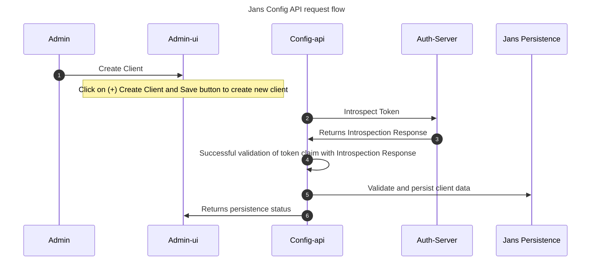

---
tags:
  - developer
  - config-api
---

# Overview

## Janssen Config API
Janssen(Jans) Config API is an application programming interface (API) gateway managing configuring of various Janssen modules.

[Diagram reference](../../assets/config-api-components.png)

### Jans Config API features:
<ol>
<li>l. Jans Config API uses REST endpoints to communicate.</li> 
<li>2. Jans Config API endpoint are OAuth 2.0 protected. More details [here](./authorization.md).</li> 
<li>3. Jans Config API plugin architecture can be used to add new features. More details [here](./plugins.md).</li> 
<li>4. Config API endpoint can be used to create new user, clients, scopes, etc. This data is stores into the same persistence store as the Jans-Auth server.</li> 
</ol>

### Jans Config API Flow
[Diagram reference](../../assets/sequence-config-api-flow.png)

<ol>
<li>1. **Admin**: Administrator of the application. Will use Admin-ui to configure application. </li>
<li>3. **Admin-ui**: Gluu graphical user interface for the administrators to manage configuration and other properties of Jans Auth Server via Jans Config API.</li>
<li>3. **Config-api**: Jans API gateway for configuring Janssen modules like Jans Auth Server, fido2, SCIM, etc. </li>
<li>4. **Auth-Server**: Janssen federated identity with comprehensive implementation of OpenID Connect. Used for introspection of access token in this flow.</li>
<li>5. **Jans Persistence**: Jans Persistence layer to persist data in backend.</li>
</ol>
