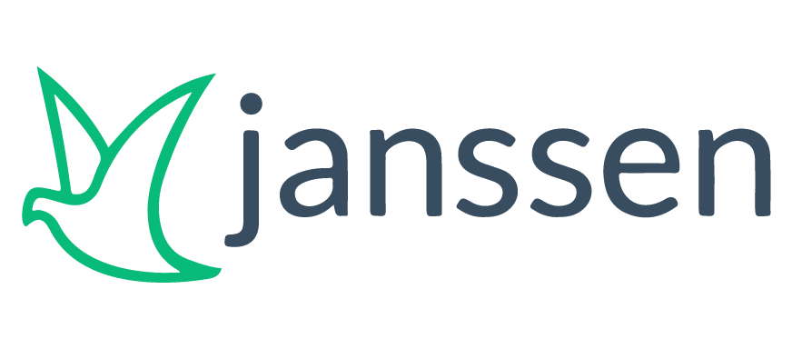
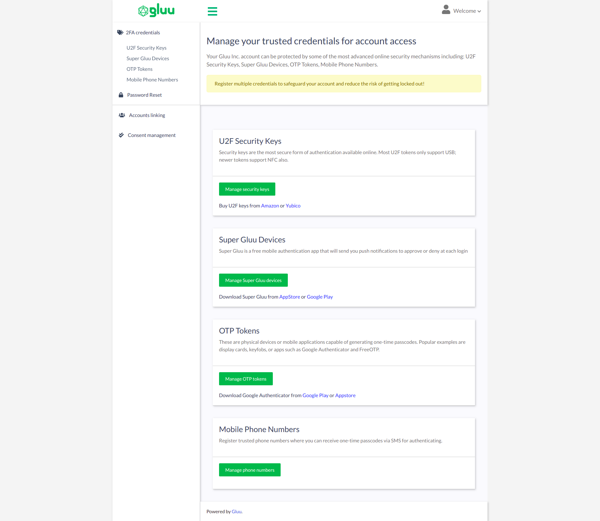
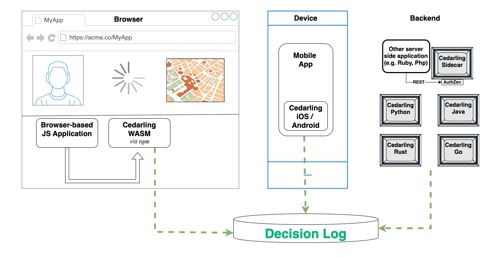

<div class="hero-section">
  <div class="hero-content">
    <div class="hero-logo">
      <div class="logo-container">
        <div class="main-logo-wrapper">
          
        </div>
      </div>
    </div>
    <h1>Build secure digital identity solutions with Janssen</h1>
    <p class="hero-description">
      <strong>Enterprise-grade authentication and authorization platform</strong> – Create robust identity management systems with OAuth 2.0, OpenID Connect, FIDO2, and modern security standards. Janssen provides everything you need to secure your applications and APIs.
    </p>
    <div class="hero-buttons">
      <a href="janssen-server" class="md-button md-button--primary">Get Started</a>
      <a href="https://github.com/JanssenProject/jans" class="md-button">View on GitHub</a>
    </div>
  </div>
</div>

---

## Why Choose Janssen?

<div class="why-janssen-grid simulate-loading" id="feature-cards" data-skeleton-type="featureCard" data-loading-duration="1200">

<div class="feature-highlight">
<h3>Enterprise Security</h3>
<p>Built with security at its core, featuring comprehensive audit logging, threat detection, and compliance controls. Advanced security features include brute force protection, account lockout policies, and detailed security event monitoring.</p>
</div>

<div class="feature-highlight">
<h3>Standards Compliant</h3>
<p>Complete implementation of OAuth 2.0, OpenID Connect, SAML 2.0, FIDO2, SCIM, and UMA 2.0. Certified compatibility ensures seamless integration with existing systems and future-proof deployments.</p>
</div>

<div class="feature-highlight">
<h3>Cloud Ready</h3>
<p>Native Kubernetes support with auto-scaling, service mesh compatibility, and cloud-agnostic deployment options. Designed for modern containerized environments with full observability.</p>
</div>

<div class="feature-highlight">
<h3>Highly Extensible</h3>
<p>Powerful interception scripts, custom plugins, and comprehensive REST APIs. Build tailored authentication flows, integrate third-party services, and customize every aspect of the platform.</p>
</div>

<div class="feature-highlight">
<h3>User Experience</h3>
<p>Casa self-service portal empowers users to manage their credentials, enroll devices, and handle account recovery. Intuitive interfaces reduce support burden while improving security.</p>
</div>

<div class="feature-highlight">
<h3>Visual Orchestration</h3>
<p>Agama's drag-and-drop designer enables complex authentication workflows without coding. Create sophisticated multi-factor flows, integrate external services, and test in real-time.</p>
</div>

</div>

---

## Core Components

=== "Janssen Server"

    **Enterprise Identity Platform**
    
    { .component-image }
    
    The core authentication and authorization server supporting multiple protocols and advanced security features.
    
    - OAuth 2.0 & OpenID Connect implementation
    - Multi-factor authentication support
    - Advanced session management
    - Enterprise directory integration
    - Comprehensive audit logging
    
    [Learn more](janssen-server/README.md){ .md-button }

=== "Casa"

    **Self-Service Portal**
    
    { .component-image }
    
    User-friendly portal for credential management and self-service operations.
    
    - 2FA device enrollment and management
    - Password reset and account recovery
    - Consent management
    - Custom branding and localization
    - Plugin ecosystem
    
    [Explore Casa](casa/index.md){ .md-button }

=== "Agama"

    **Authentication Orchestration**
    
    { .component-image }
    
    Visual platform for designing and implementing complex authentication flows.
    
    - Drag-and-drop flow designer
    - Custom authentication logic
    - Third-party integrations
    - Real-time testing and deployment
    - Version control support
    
    [Start with Agama](agama/introduction.md){ .md-button }

=== "Cedarling"

    **Policy Engine**
    
    { .component-image }
    
    Cedar-based authorization engine for fine-grained access control decisions.
    
    - Policy-as-code approach
    - Real-time authorization decisions
    - Audit trail and compliance
    - API-first architecture
    - Cloud-native deployment
    
    [Discover Cedarling](cedarling/README.md){ .md-button }

---

## Quick Start Guide

### 1. Choose Your Deployment

Select the deployment method that best fits your environment and requirements.

=== "Kubernetes"

    ```bash
    wget https://raw.githubusercontent.com/JanssenProject/jans/vreplace-janssen-version/automation/startjanssendemo.sh && chmod u+x startjanssendemo.sh && ./startjanssendemo.sh
    ```
    
    [Complete Kubernetes Setup Guide](janssen-server/install/helm-install/)

=== "Docker"

    **For Testing and Development Only**
    
    ```bash
    wget https://raw.githubusercontent.com/JanssenProject/jans/vreplace-janssen-version/automation/startjanssenmonolithdemo.sh && chmod u+x startjanssenmonolithdemo.sh && sudo bash startjanssenmonolithdemo.sh demoexample.jans.io MYSQL "" main
    ```
    
    [Complete Docker Setup Guide](janssen-server/install/docker-install/)

=== "VM Installation"

    **For Testing and Development Only**
    
    ```bash
    curl https://raw.githubusercontent.com/JanssenProject/jans/vreplace-janssen-version/jans-linux-setup/jans_setup/install.py > install.py
    sudo python3 install.py
    ```
    
    [Complete VM Setup Guide](janssen-server/install/vm-install/)

### 2. Initial Configuration

Set up your identity platform with the configuration tools.

=== "TUI (Terminal User Interface)"

    ```bash
    sudo /opt/jans/bin/jans-tui.py
    ```

=== "Command Line"

    ```bash
    sudo /opt/jans/bin/jans-cli.py
    ```

=== "Terraform"

    ```hcl
    resource "jans_client" "example" {
      client_name     = "My Application"
      grant_types     = ["authorization_code"]
      redirect_uris   = ["https://myapp.com/callback"]
      response_types  = ["code"]
      scope           = "openid profile email"
    }
    ```

### 3. Create Your First Client

Register an application using Terraform for infrastructure as code.

```hcl
terraform {
  required_providers {
    jans = {
      source = "JanssenProject/jans"
    }
  }
}

provider "jans" {
  url = "https://your-domain"
}

resource "jans_client" "webapp" {
  client_name    = "Web Application"
  grant_types    = ["authorization_code", "refresh_token"]
  redirect_uris  = ["https://myapp.com/callback"]
  response_types = ["code"]
  scope         = "openid profile email"
}
```

### 4. Test Authentication

Verify your setup with a simple authentication flow.

```bash
https://your-domain/jans-auth/restv1/authorize?
  response_type=code&
  client_id=YOUR_CLIENT_ID&
  redirect_uri=YOUR_REDIRECT_URI&
  scope=openid profile
```

---

*Janssen is a Linux Foundation project that provides next-generation identity and access management, building upon years of experience in enterprise security.*

<div class="linux-foundation-footer">
  <div class="foundation-badge-bottom">
    
    <div class="foundation-text-bottom">A Linux Foundation Project</div>
  </div>
</div>