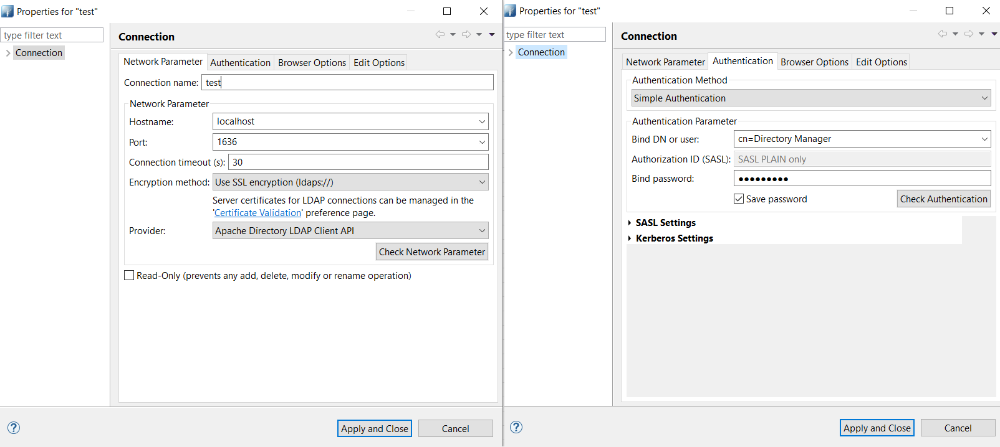
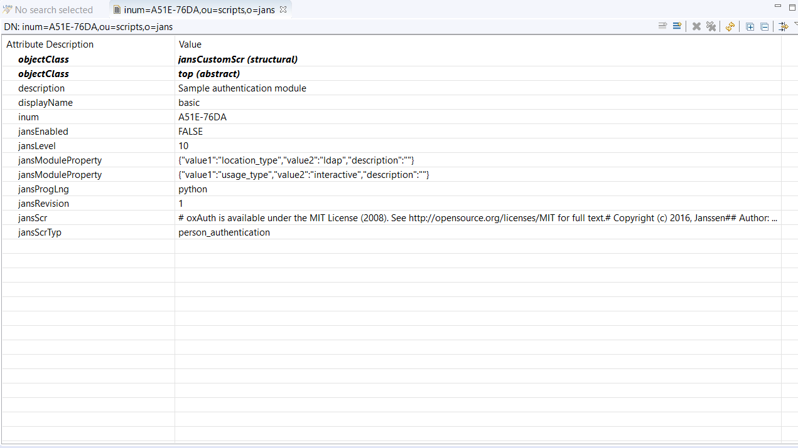
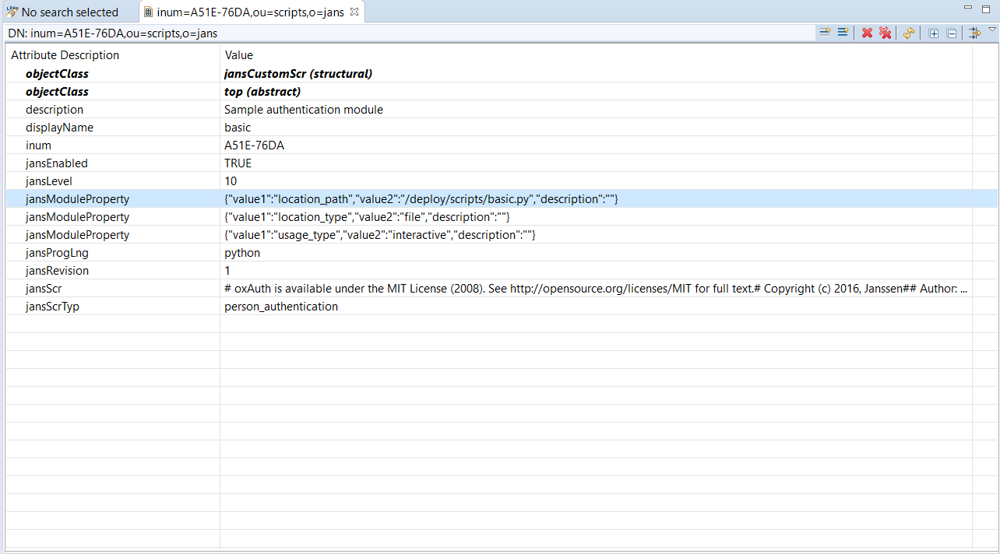

## Setup

For development the kubernetes setup must be local and accessible to the debug server address. The following steps will walk you trough a setup using Minikube with docker driver, and [ksync](https://ksync.github.io/ksync/) for syncing the files between local, and the container. The following instructions assume a fresh ubuntu 20.04, however the setup can be done on a different operating systems such as macOS or Windows.  

### System Requirements

The minimum system requirement for running all jans services are `8GB RAM`, `4 CPU`, and `50GB disk`. This can be dropped to `4GB RAM`, `4CPU` and `20GB` disk space if operating with required services auth-server, and LDAP.

### Setup Minikube

1. Install [Docker](https://docs.docker.com/engine/install/ubuntu/) 18.09 or higher. For other operating systems follow the appropriate [docs](https://hub.docker.com/search?q=&type=edition&offering=community&sort=updated_at&order=desc).

1. Install [minikube](https://minikube.sigs.k8s.io/docs/start/), but do not start it yet.

1. Install [kubectl](https://kubernetes.io/docs/tasks/tools/install-kubectl/).

1. Once Minikube is installed start it with the docker driver.

    ```bash
    minikube start --driver=docker
    ```
        
1. If not automatically set configure `kubectl` to use the cluster:

    ```bash
    kubectl config use-context minikube
    ```
        
1. Enable ingress on minikube

    ```bash
    minikube addons enable ingress
    ```
    
### Install Janssen

1. Install [Helm3](https://helm.sh/docs/using_helm/)

1. Install Janssen

    ```bash
    helm repo add jans https://janssenproject.github.io/jans-cloud-native/charts
    kubectl create ns jans
    helm install jans-auth jans/jans -n jans --set global.lbIp="$(minikube ip)" --set global.provisioner="k8s.io/minikube-hostpath" --devel
    ```

### Install Ksync

Once Janssen is fully running we want to create an active sync between a local folder, and the folder that will hold the interception scripts inside the auth server container.

1. Create a folder that will hold the interception script inside the auth server container. Place the namespace where jans is installed in the env `JANS_NAMESPACE` and execute:

    ```bash
    JANS_NAMESPACE=<jans-namespace>
    for pod in $(kubectl get pods -n $JANS_NAMESPACE --selector=APP_NAME=auth-server --output=jsonpath={.items..metadata.name}); do
        kubectl exec -ti $pod -n $JANS_NAMESPACE -- mkdir -p /deploy/interception-scripts-ksync
    done        
    ```
    
1. Install ksync

    ```bash
    curl https://ksync.github.io/gimme-that/gimme.sh | bash
    ```
    
1. Initialize ksync

    ```bash
    ksync init -n <jans-namespace>
    ```
    
1. Start ksync.

    ```bash
    ksync watch -n <jans-namespace> &
    ```

1. Open a new terminal and create a folder called `interception-scripts-ksync`

    ```bash
    mkdir -p $(pwd)/interception-scripts-ksync
    ```

1. Create a spec to start syncing folders between the local system and auth server container.

    ```bash
    ksync create --selector=APP_NAME=auth-server $(pwd)/interception-scripts-ksync /deploy/interception-scripts-ksync -n <jans-namespace>
    ```

1. Check the status. Also check the terminal where the `watch` command is running. 

    ```bash
    ksync get
    ```
1. Move the interception script to the local folder `$(pwd)/interception-scripts-ksync`. In the below example we copied the following script as `basic.py`:

    ```python
    # oxAuth is available under the MIT License (2008). See http://opensource.org/licenses/MIT for full text.
    # Copyright (c) 2016, Janssen
    #
    # Author: Yuriy Movchan
    #
    
    from io.jans.service.cdi.util import CdiUtil
    from io.jans.as.server.security import Identity
    from io.jans.model.custom.script.type.auth import PersonAuthenticationType
    from io.jans.as.server.service import AuthenticationService
    from io.jans.util import StringHelper
    
    import java
    
    class PersonAuthentication(PersonAuthenticationType):
        def __init__(self, currentTimeMillis):
            self.currentTimeMillis = currentTimeMillis
    
        def init(self, customScript,  configurationAttributes):
            print "Basic. Initialization"
            print "Basic. Initialized successfully"
            return True   
    
        def destroy(self, configurationAttributes):
            print "Basic. Destroy"
            print "Basic. Destroyed successfully"
            return True
            
        def getAuthenticationMethodClaims(self, requestParameters):
            return None
            
        def getApiVersion(self):
            return 11
    
        def isValidAuthenticationMethod(self, usageType, configurationAttributes):
            return True
    
        def getAlternativeAuthenticationMethod(self, usageType, configurationAttributes):
            return None
    
        def authenticate(self, configurationAttributes, requestParameters, step):
            authenticationService = CdiUtil.bean(AuthenticationService)
    
            if (step == 1):
                print "Basic. Authenticate for step 1"
    
                identity = CdiUtil.bean(Identity)
                credentials = identity.getCredentials()
    
                user_name = credentials.getUsername()
                user_password = credentials.getPassword()
    
                logged_in = False
                if (StringHelper.isNotEmptyString(user_name) and StringHelper.isNotEmptyString(user_password)):
                    logged_in = authenticationService.authenticate(user_name, user_password)
    
                if (not logged_in):
                    return False
    
                return True
            else:
                return False
    
        def prepareForStep(self, configurationAttributes, requestParameters, step):
            if (step == 1):
                print "Basic. Prepare for Step 1"
                return True
            else:
                return False
    
        def getExtraParametersForStep(self, configurationAttributes, step):
            return None
    
        def getCountAuthenticationSteps(self, configurationAttributes):
            return 1
    
        def getPageForStep(self, configurationAttributes, step):
            return ""
    
        def getNextStep(self, configurationAttributes, requestParameters, step):
            return -1
    
        def getLogoutExternalUrl(self, configurationAttributes, requestParameters):
            print "Get external logout URL call"
            return None
    
        def logout(self, configurationAttributes, requestParameters):
            return True
    
    ```

### Install an IDE

The IDE can be of choice but must contain PyDev. We chose [Liclipse](https://www.liclipse.com/download.html) for this demonstration. 

Once complete, start the PyDev debug server:

1. Open Liclipse

1. Install the jython jar for the interpreter. 

    ```
    wget https://repo1.maven.org/maven2/org/python/jython-standalone/2.7.2/jython-standalone-2.7.2.jar
    ```

1. From the menu: go to `File` -> `Open File` and choose the interception script that will be debugged in `$(pwd)/interception-scripts-ksync`.

 
1. When opening the Python file for the first time, we need to instruct Liclipse to use a specific interpreter. Follow these steps:
  
    - Press the "Manual Config" button in the dialog box after opening the Python file
    
    - Open "PyDev->Interpreters->Jython Interpreters"
    
    - Click the "New..." button in the right panel. Name it "Jython" and specify the interpreter executable that was downloaded previously "jython-standalone-2.7.2.jar"
    
    - Click "OK", then confirm the settings by clicking "OK" again, then "Apply and Close"
    
    - In the final dialog, confirm the settings by clicking "OK" 

1. From the menu: go to `Window` -> `Perspective` -> `Open Perspective` -> `Other..` -> `Debug`

1. From the menu: go to `Pydev` > `Start Debug Server`. Now the server should have started at port `5678`. Take a note of the ip of the computer running Liclipse and save it for later use. Remember that the auth server pod must be able to communicate with this ip. If you have followed the instructions above and installed minikube on your local computer which is the same computer Liclipse is operating on you should be able to reach it from within the pods.

### Development & Debugging

Now we are ready to perform script development and debugging. Here is a quick overview:

1. Instruct the auth server to load the script from the file system *instead* of LDAP. Follow the example scenario below to learn how to do this.

1. Add debug instructions to the script, as specified in the next section

1. Execute the script

### Enable Remote Debug in Custom Script

1. After the import section, add:   
  
    ```
    REMOTE_DEBUG = True
    
    if REMOTE_DEBUG:
        try:
            import sys
            import pydevd
        except ImportError as ex:
            print "Failed to import pydevd: %s" % ex
            raise
    ```     
      
1. Add the following lines wherever breakpoints are needed:   
  
    ```
    if REMOTE_DEBUG:
        pydevd.settrace('localhost', port=5678, stdoutToServer=True, stderrToServer=True)
    ```

### Sample Scenario

1. Copy the below script to `$(pwd)/interception-scripts-ksync/basic.py`  

    ```python
    # oxAuth is available under the MIT License (2008). See http://opensource.org/licenses/MIT for full text.
    # Copyright (c) 2016, Janssen
    #
    # Author: Yuriy Movchan
    #
    
    from io.jans.service.cdi.util import CdiUtil
    from io.jans.as.server.security import Identity
    from io.jans.model.custom.script.type.auth import PersonAuthenticationType
    from io.jans.as.server.service import AuthenticationService
    from io.jans.util import StringHelper
    
    import java
    
    class PersonAuthentication(PersonAuthenticationType):
        def __init__(self, currentTimeMillis):
            self.currentTimeMillis = currentTimeMillis
    
        def init(self, customScript,  configurationAttributes):
            print "Basic. Initialization"
            print "Basic. Initialized successfully"
            return True   
    
        def destroy(self, configurationAttributes):
            print "Basic. Destroy"
            print "Basic. Destroyed successfully"
            return True
            
        def getAuthenticationMethodClaims(self, requestParameters):
            return None
            
        def getApiVersion(self):
            return 11
    
        def isValidAuthenticationMethod(self, usageType, configurationAttributes):
            return True
    
        def getAlternativeAuthenticationMethod(self, usageType, configurationAttributes):
            return None
    
        def authenticate(self, configurationAttributes, requestParameters, step):
            authenticationService = CdiUtil.bean(AuthenticationService)
    
            if (step == 1):
                print "Basic. Authenticate for step 1"
    
                identity = CdiUtil.bean(Identity)
                credentials = identity.getCredentials()
    
                user_name = credentials.getUsername()
                user_password = credentials.getPassword()
    
                logged_in = False
                if (StringHelper.isNotEmptyString(user_name) and StringHelper.isNotEmptyString(user_password)):
                    logged_in = authenticationService.authenticate(user_name, user_password)
    
                if (not logged_in):
                    return False
    
                return True
            else:
                return False
    
        def prepareForStep(self, configurationAttributes, requestParameters, step):
            if (step == 1):
                print "Basic. Prepare for Step 1"
                return True
            else:
                return False
    
        def getExtraParametersForStep(self, configurationAttributes, step):
            return None
    
        def getCountAuthenticationSteps(self, configurationAttributes):
            return 1
    
        def getPageForStep(self, configurationAttributes, step):
            return ""
    
        def getNextStep(self, configurationAttributes, requestParameters, step):
            return -1
    
        def getLogoutExternalUrl(self, configurationAttributes, requestParameters):
            print "Get external logout URL call"
            return None
    
        def logout(self, configurationAttributes, requestParameters):
            return True
    
    ```

1. Make sure to have an LDAP browser available. We recommend [Apache Directory Studio](https://directory.apache.org/studio/).
    
1. Port forward the opendj pod. 

    ```bash
    kubectl port-forward jans-opendj-0 -n <jans-namespace> 1636:1636 --address 0.0.0.0
    ```
1. Create a connection to the ldap browser. The default password will be `Test1234#` if not changed in the helm install command.
 
   

1. Inside the browser navigate to `o=jans, ou=scripts`. Right click on `ou=scripts` and click on `Quick Search`. Inside the pop up box that appears fill `Returning Attributes` with `displayName`, and press `Apply and Close`

1. In the results that appear click on the `Dn` that has a `displayName` of `basic`.

   
   
1. Choose to load the script from file instead of ldap. Inside the browser change `jansModuleProperty` with value `{"value1":"location_type","value2":"ldap","description":""}` to `{"value1":"location_type","value2":"file","description":""}`

1. Specify the `Script Path` location to the location of the folder inside auth server pods: `/deploy/interception-scripts-ksync/basic.py`. Right click the upper `jansModuleProperty` and click `New Value`. A new entry for `jansModuleProperty` will be created. Insert the following for the value: `{"value1":"location_path","value2":"/deploy/interception-scripts-ksync/basic.py","description":""}`
  
1. Enable the script by settings `jansEnabled` to `true`. The following is an example of how the basic script entry should look.  

   

1. Check the following log inside the the auth-server container to verify that auth server loaded the script properly: `/opt/jans/jetty/jans-auth/logs/jans-auth_script.log`. It should look like this:    

    ```
    kubectl exec -ti <auth-server-pod-name> -n <jans-namespace> -- tail -f /opt/jans/jetty/jans-auth/logs/jans-auth_script.log
    
    ```
    
    You should find the following in the log:
    
    ```
    ... (PythonService.java:239) - Basic. Initialization

    ... (PythonService.java:239) - Basic. Initialized successfully
   
    ```


1. Download the jython jar for the interpreter. 

    ```
    wget https://repo1.maven.org/maven2/org/python/jython-standalone/2.7.2/jython-standalone-2.7.2.jar
    ```
    
1. From the IDE (Liclipse) menu: navigate  to `File` -> `Open File` and choose the interception script that will be debugged in `$(pwd)/interception-scripts-ksync/basic.py`
 
1. When opening the Python file for the first time, we need to instruct Liclipse to use a specific interpreter. Follow these steps:
  
    - Press the "Manual Config" button in the dialog box after opening the Python file
    
    - Open "PyDev->Interpreters->Jython Interpreters"
    
    - Click the "New..." button in the right panel. Name it "Jython" and specify the interpreter executable that was downloaded previously "jython-standalone-2.7.2.jar"
    
    - Click "OK", then confirm the settings by clicking "OK" again, then "Apply and Close"
    
    - In the final dialog, confirm the settings by clicking "OK" 

1. Open basic.py in a file editor. After the import section, add the following lines to load the PyDev libraries:

    ```bash
    REMOTE_DEBUG = True  
  
    if REMOTE_DEBUG:  
        try:  
            import sys  
            import pydevd  
        except ImportError as ex:  
            print "Failed to import pydevd: %s" % ex  
            raise  
    ```    

1. Add this break condition to the first line in the authenticate method. Place the ip of the maching running the ide , here liclipse i.e `192.168.140.2`.

    ```bash
    if REMOTE_DEBUG:   
        pydevd.settrace('<ip-of-machine-running-ide>', port=5678, stdoutToServer=True, stderrToServer=True)  

    ```

1. Save `basic.py`

1. Within one minute, the auth server should load the changed file. Check the following log file again to make sure there are no load errors: `/opt/jans/jetty/jans-auth/logs/jans-auth_script.log`
    
1. To check if the script works, update the default authentication method to Basic Authentication. Preform this in the LDAP browser. Navigate to `o=jans,ou=configuration`. Change the `jansAuthMode` to `basic` instead of `simple_password_auth`.
     
1. After executing `pydevd.settrace` the script will transfer execution control to the PyDev server in Liclipse. You can use any debug commands. For example: Step Over (F6), Resume (F8), etc
     
1. After debugging is finished, resume script execution to transfer execution control back to the auth server. 
