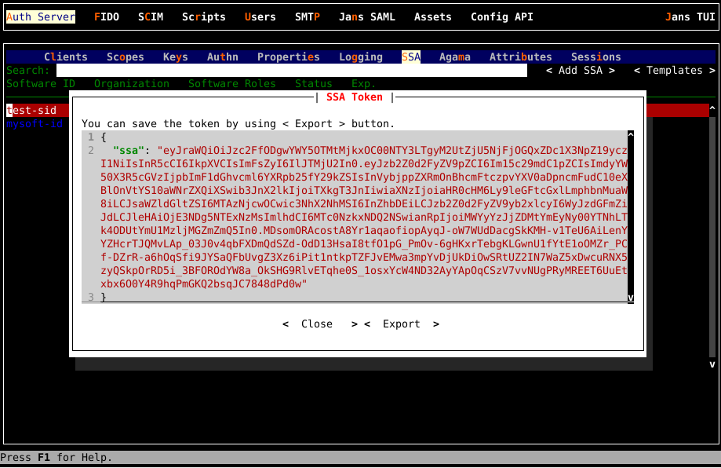

---
tags:
  - administration
  - client
  - software statements
---

# Software Statements

Software Statement is defined by OAuth dynamic client registration RFC
[7591](https://datatracker.ietf.org/doc/html/rfc7591#section-1.2) as

```
A digitally signed or MACed JSON Web Token (JWT) 
that asserts metadata values about the client software.
```

Janssen Server supports usage of software statements during dynamic client registration.

## Use During Dynamic Client Registration

Janssen Server supports dynamic client registration using software statements. It can be
[used as software statements](./../../auth-server/endpoints/client-registration.md#using-software-statement) or
[as software statement assertions (SSA)](../../auth-server/endpoints/client-registration.md#special-mention-about-fapi)
to register client dynamically.

Janssen Server also provides [SSA endpoint](../../auth-server/endpoints/ssa.md) to create and manage SSAs on the server.

## Creating SSA using TUI

To create SSA using TUI, launch TUI by command `/opt/jans/jans-cli/config-cli-tui.py`, Navigate to **Auth Server** -> **SSA**,
go to button **< Add SSA >** and prerss Enter. The following dialog will be opened


Please see explanation of each field at
[SSA field descriptions](./../../auth-server/endpoints/ssa.md#request-body-description)

If you are going to create similar SSA, you can save as template by enabling checkbox **Save as Template** and write a template name.

Once you hit **<   Save   >** button, you will have a dialog which displays created SSA as jwt. Please save it by
using button **<  Export  >**. _This is the only time you see the token._



If you saved as template, you can re-use it by hitting button **< Templates >** which opens a dialog that lists saved
SSA templates.

## Want to contribute?

If you have content you'd like to contribute to this page in the meantime, you can get started with our [Contribution guide](https://docs.jans.io/head/CONTRIBUTING/).
