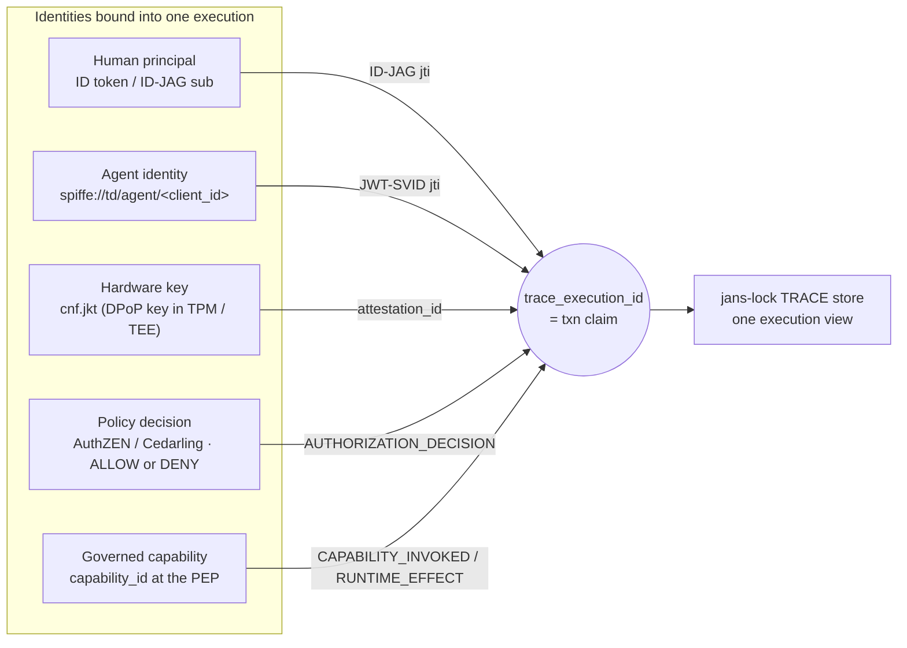
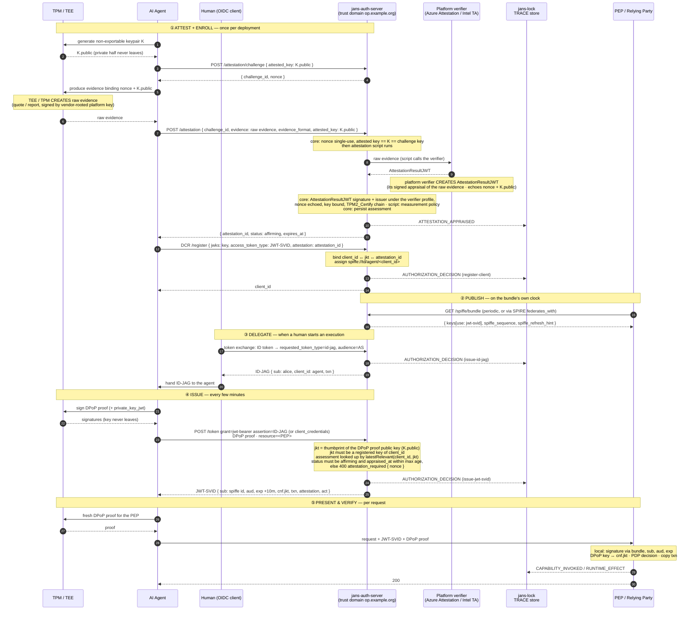
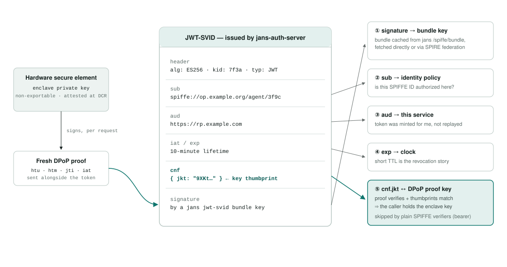
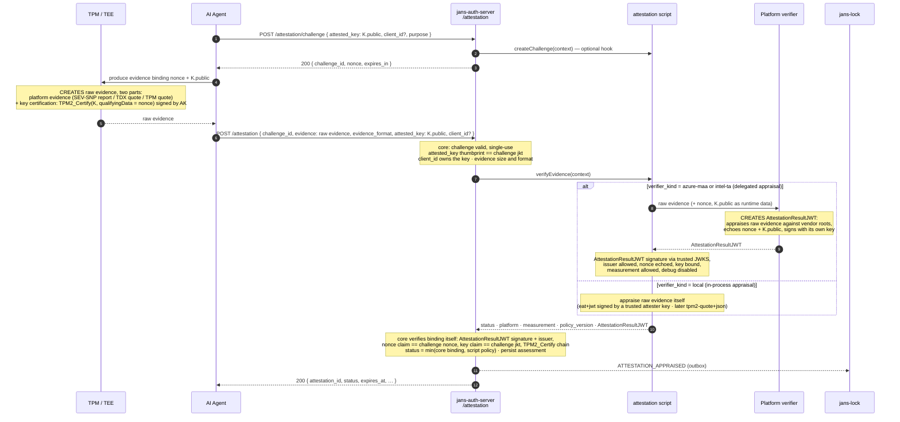
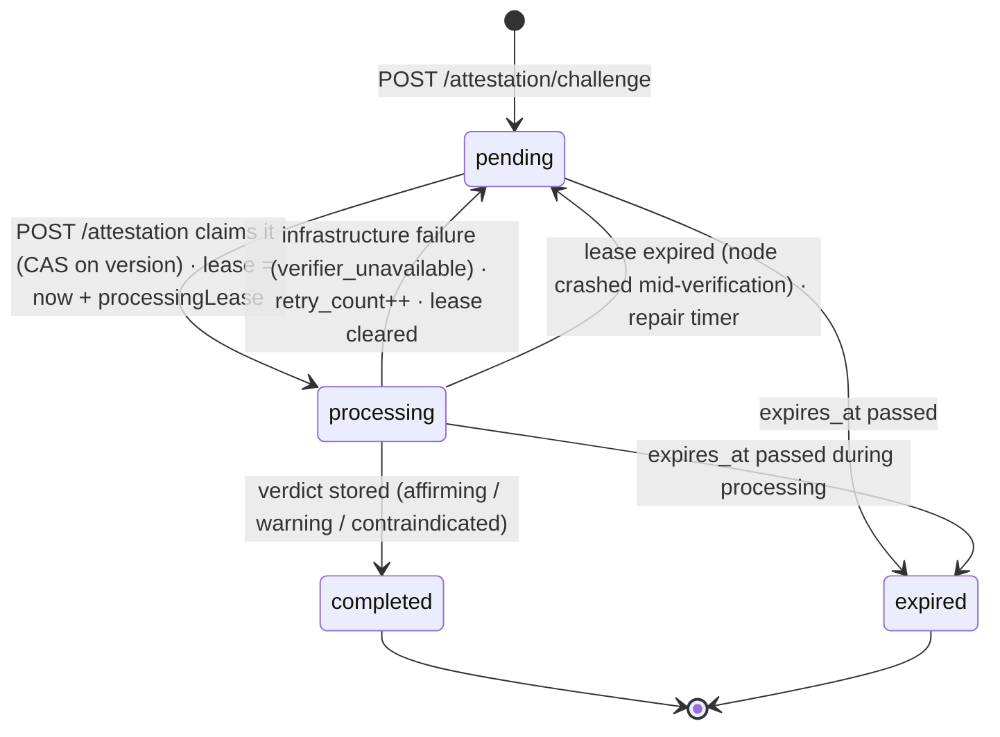
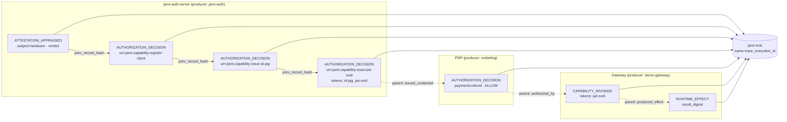
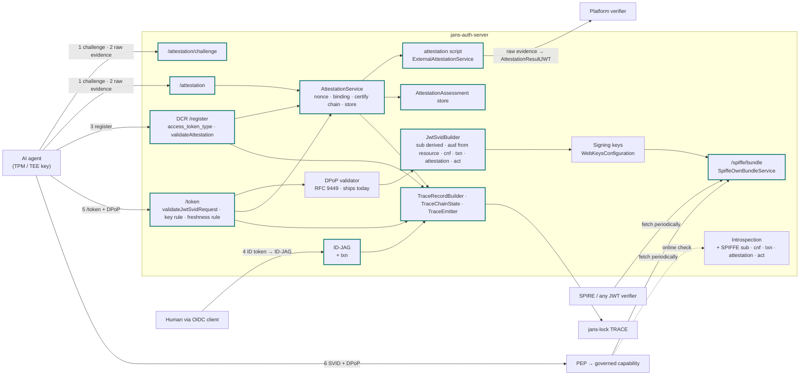

---
tags:
  - administration
  - auth-server
  - oauth
  - feature
  - spiffe
  - agent
  - attestation
  - trace
  - govops
  - design
---

# Hardware-Anchored Agent Identity with TRACE Evidence (Design Plan)

> **Status: design plan, not yet implemented.** This page is the single plan for giving AI agents
> a hardware-anchored identity in jans-auth-server and for producing TRACE evidence about how that
> identity is used. It supersedes and absorbs the earlier
> [Agent Identity via JWT-SVID](./agent-identity-jwt-svid.md) design: everything from that page
> that is still needed is restated here, nothing there is implemented, and this page is the one to
> build from. It follows the
> [Hardware-Anchored Agent Identity Demo Plan](https://github.com/JanssenProject/jans/wiki/Hardware%E2%80%90Anchored-Agent-Identity-Demo-Plan)
> and aligns with the OWASP GovOps architecture (capability as the unit of governance; access
> decisions visible, measurable, accountable). The scope is **jans-auth-server**; changes other
> components need are listed in one short section (section 12) as dependencies.

## 1. The goal in one paragraph

An operator enrolls an AI agent with jans-auth-server. The agent's keypair lives in a hardware
secure element (TPM, TEE, confidential VM) and never leaves it. jans-auth-server **attests** that
key through a dedicated attestation endpoint, binds it to the agent's registration, assigns the
agent a SPIFFE ID, and from then on mints short-lived **JWT-SVIDs** pinned to that key via `cnf`.
Before every issuance the server checks that the hardware passed policy *recently enough*, not only
at enrollment. jans-auth-server publishes its signing keys as a **SPIFFE trust bundle**, so any
relying party, SPIRE or plain JWT verifier, checks the token offline. When a human stands behind the
agent, the human's identity enters through an ID-JAG and is carried into the SVID. Every step the
server takes (appraisal, enrollment, delegation, issuance) is emitted as a signed, hash-chained
**TRACE record** under one execution identifier, so a third party can later correlate the human,
the agent, the hardware key, the authorization decision and the invocation of a governed capability
without calling the server back.

## 2. The trust chain at a glance

Each link answers one question a relying party or an auditor implicitly asks. Break any link and
trust stops there; the chain makes explicit what each party vouches for.

| # | Link | Who | What happens | Artifact |
|---|------|-----|--------------|----------|
| 1 | ROOT | TPM / TEE hardware | Non-exportable keypair; vendor-signed raw evidence over it | Raw evidence (quote / report) |
| 2 | ATTEST | `/attestation` + script | Single-use challenge; **jans** sends the raw evidence to the platform verifier and receives its `AttestationResultJWT`; measurement policy applied; **assessment stored with a validity window** | `attestation_id` (server-side assessment), `AttestationResultJWT` (verifier's) |
| 3 | ENROLL | DCR `/register` | Registration accepted only with a fresh `affirming` assessment for the registered key; `client_id` ↔ `jkt` ↔ `attestation_id` persisted; SPIFFE ID assigned | `spiffe://td/agent/<client_id>` |
| 4 | DELEGATE | Token exchange (ID-JAG) | Human's ID token exchanged for an ID-JAG naming the agent; execution id `txn` minted | ID-JAG with `txn` |
| 5 | ISSUE | `/token` + DPoP | `client_credentials` or JWT bearer with ID-JAG; DPoP key must equal the enrolled key **and** have an assessment younger than the maximum age; else `attestation_required` | JWT-SVID with `cnf.jkt`, `txn`, `attestation` |
| 6 | PUBLISH | `/spiffe/bundle` | Signing keys served in SPIFFE bundle format at a stable HTTPS URL | JWKS, `use: jwt-svid` |
| 7 | DECIDE | PDP (AuthZEN / Cedarling) | May agent A (for human H) invoke capability C? | `AUTHORIZATION_DECISION` record |
| 8 | PRESENT & INVOKE | Agent → PEP → capability | SVID + fresh DPoP proof; PEP verifies via the bundle, enforces the decision | `CAPABILITY_INVOKED`, `RUNTIME_EFFECT` records |
| 9 | RECORD & VERIFY | jans-auth-server, PDP, PEP → jans-lock | Each producer signs and chains its records; Lock verifies, receipts, correlates by execution id | One offline-verifiable execution view |

Links 1 to 3 happen once per agent deployment (and link 2 repeats on the attestation cadence).
Links 4 to 9 repeat continuously; tokens live 5 to 15 minutes, so possession of the hardware key,
not any long-lived secret, is the durable credential.

## 3. The correlation model

An **execution** is one unit of agent work: a task a human delegated, or an autonomous run. It is
identified by a `trace_execution_id`, carried in every token as the `txn` claim (RFC 8417 §2.2;
jans already uses `txn` in transaction tokens). Everyone downstream (PDP, PEP, capability) copies
`txn` into its own records. Correlation is structural: an auditor queries one execution and gets
the whole chain.

Execution scope is defined independently of credential lifetime:

| Scope | Identifier | Opened by | Closed by |
|-------|------------|-----------|-----------|
| **Execution** (`txn`) | `exe_…` | The ID-JAG exchange (human-delegated), or the first `/token` call of an autonomous agent that carries no `txn`; the server mints it and returns it in the token response (`txn` member) so the agent reuses it | `traceExecutionMaxAgeSeconds` (default 24 h), or an explicit `txn_close=true` on a token request |
| **Token lifetime** | SVID `jti` | Each issuance | `exp` (minutes) |
| **Key lifecycle** (attestation, enrollment) | `attestation_id`, `client_id` | Before any execution exists | Key rotation / client removal |

A renewal inside an execution presents the same `txn` (as the ID-JAG's claim, or the `txn`
request parameter); the server accepts it while the execution is open **and** belongs to the same
`client_id`, and refuses foreign or expired values with `invalid_request` (`txn_unknown`). So one
execution spans many token renewals, and tokens never fragment it. Attestation and enrollment
records are **not** execution records: they happen before any execution and serve many later
ones. They keep their own identifiers, and every execution record that relies on them points at
them through `parent_record_ids` (section 11.2).



| Identity | Carried in | Bound by | Recorded as |
|----------|-----------|----------|-------------|
| Human | ID-JAG (`sub`, `email`, `acr`, `auth_time`) | OIDC login at the IdP; token exchange at jans | `subject.principal`; `tokens[]` entry `token_type=id-jag` |
| Agent | JWT-SVID `sub` | Derived from `client_id` under the server's trust domain; never client-supplied | `subject.agent`; `tokens[]` entry `token_type=jwt-svid` |
| Hardware key | JWT-SVID `cnf.jkt`; DPoP proof on every request | Attestation assessment binds `jkt` to platform + measurement | `subject.hardware` (`jkt`, `attestation_id`, `platform`, `measurement`) |
| Policy decision | AuthZEN response | PDP evaluates agent + principal against capability | `AUTHORIZATION_DECISION` by the PDP |
| Capability invocation | PEP log | PEP validates SVID + DPoP, checks decision, invokes | `CAPABILITY_INVOKED` by the PEP; `RUNTIME_EFFECT` by the capability |

jans-auth-server produces the records for the first three rows. The last two are produced by the
PDP and the PEP; this plan only fixes what they must copy (`txn`, token `jti`s, `capability_id`).

## 4. What jans-auth-server already has

This plan is smaller than it looks, because most of the machinery shipped with earlier features.

| Capability | Where | Reused for |
|------------|-------|------------|
| Inbound SPIFFE client auth (draft-ietf-oauth-spiffe-client-auth) | `SpiffeIdUtil`, `SpiffeBundleService` (fetch, cache, stale-serving, negative cache), `SpiffeJwtSvidAssertion`, `spiffe_id` / `spiffe_bundle_endpoint` client metadata, `spiffeTrustDomains` config, `SPIFFE_CLIENT_AUTH` flag | Trust-domain grammar; the bundle consumer doubles as the integration test for the bundle we will serve |
| DPoP (RFC 9449) | `DpopService.getDPoPJwkThumbprint()`, `ExecutionContext.setDpop()`, `cnf.jkt` stamping in `fillPayloadOfAccessTokenJwt()`, `ClientAttributes.dpopBoundAccessToken`, introspection returns `cnf` | Key binding at issuance; assessments are keyed by the DPoP thumbprint |
| JWT access-token minting | `AuthorizationGrant.createAccessToken()` → `createAccessTokenAsJwt()` → `fillPayloadOfAccessTokenJwt()`; `JwtSigner` over `WebKeysConfiguration` | SVID minting branches here |
| DCR + interception scripts | `RegisterCreateAction` / `RegisterUpdateAction`, `RegisterService.updateClientFromRequestObject()`, `ExternalDynamicClientRegistrationService`, `ClientRegistrationType.createClient()` / `updateClient()` (runs after request mapping, before `clientService.persist()`; `false` → `invalid_client_metadata`) | Enrollment gate |
| DCR attestation evidence plumbing | `RegisterRequestParam.EVIDENCE`, `ClientAttributes.evidence`, `AppConfiguration.dcrAttestationEvidenceRequired`, `RegisterValidator.validateEvidence()`, `RegisterErrorResponseType.STALE_EVIDENCE` with `nonce`, `DynamicClientRegistrationContext.getEvidence()` / `createStaleEvidenceWebApplicationException(nonce)` | One-step enrollment; model for the token endpoint's `attestation_required` error |
| Custom script framework | `CustomScriptType`, `BaseExternalType`, `External*Service` pattern, `CdiUtil` | New `attestation` script type |
| ID-JAG (draft-ietf-oauth-identity-assertion-authz-grant) | `IdJagService`, `IdJagValidatorService`, `TokenExchangeService`, `JwtGrantService`, `ExternalIdentityAssertionService`, `identity_assertion_authz_grant` flag | Human identity into the agent flow; `txn` minted here |
| AuthZEN | `AccessEvaluationRestWebServiceImplV1` (`/access/v1/evaluation`), `ExternalAccessEvaluationService` | Decision source when jans is the PDP |
| Introspection (RFC 7662) | `IntrospectionWebService` | Online verification path |
| Feature flags, endpoint registration, config revision | `ErrorResponseFactory.validateFeatureEnabled()`, `ResteasyInitializer`, `Conf.revision` | New endpoints; `spiffe_sequence` |
| Transaction id | `TxTokenService` sets `txn` | Same claim name reused as execution id |
| Audit | `OAuth2AuditLog`, `ApplicationAuditLogger` | Operational log stays; TRACE is a separate signed channel |

## 5. Lifecycle



Steps 1 to 14 establish the hardware binding; if the appraisal is not `affirming` no identity is
ever assigned. Steps 15 to 16 run on the bundle's refresh cadence, never per token. Steps 17 to 20
put a human at the root of the execution. Steps 21 to 30 are the steady state: every token is
short-lived, pinned to the hardware key via `cnf`, stamped with the assessment it was issued
under, and recorded. Every call into the TPM / TEE returns only a public key, a signature or a
piece of evidence; the private half of `K` never crosses that boundary.

Reading the arrows: a **solid** arrow is a request the sender initiates and waits for; a
**dashed** arrow is either the reply to the solid arrow above it, or a one-way notification the
sender does not wait for (the records jans and the PEP send to jans-lock go through an outbox,
section 11.3). `K` is the agent's single hardware keypair: its private half signs the DPoP proofs
and the `private_key_jwt` client assertion, its public half (`K.public`) is the `attested_key` in
the challenge, the key in the registration `jwks`, and the thumbprint in the SVID's `cnf.jkt`.
There is exactly one key per agent; attestation, enrollment and issuance all talk about it.

## 6. Verification: how and where

Three offline-capable paths. In all three the answer to "does the verifier call the auth server?"
is: only periodically for the bundle, never per token.

| Path | Who it's for | How it works |
|------|--------------|--------------|
| **SPIRE federation** | Relying parties in a SPIFFE/SPIRE ecosystem | SPIRE server adds `federates_with` pointing at the jans bundle endpoint (`https_web` profile), fetches on the refresh-hint cadence, distributes to its agents; workloads validate via `ValidateJWTSVID` |
| **Direct bundle fetch** | Ordinary services, gateways | The bundle is a JWKS. Any JWT library verifies the signature and checks `sub`, `aud`, `exp` |
| **Introspection** | High-assurance checks and debugging | RFC 7662 at jans-auth-server for a live answer; the closest thing to revocation the short-TTL model offers |

SPIRE configuration on the relying party side (the entire integration):

```hcl
server {
    trust_domain = "rp-company.example"
    federation {
        federates_with "op.example.org" {
            bundle_endpoint_url = "https://op.example.org/jans-auth/restv1/spiffe/bundle"
            bundle_endpoint_profile "https_web" {}
        }
    }
}
```

**Bearer vs. bound.** Signature + claims checks alone treat the token as bearer. A verifier that
wants the hardware guarantee additionally demands a fresh DPoP proof signed by the key in `cnf`.
Plain SPIFFE verifiers ignore `cnf`, `txn`, `attestation` and `delegation` (unknown claims are additive),
so the token stays spec-valid for both audiences.



| Claim | Check | Roots in |
|-------|-------|----------|
| signature | verifies against a `jwt-svid` key | bundle cached from `/spiffe/bundle` |
| `sub` | `spiffe://op.example.org/agent/3f9c` authorised here? | relying party's identity policy |
| `aud` | equals this service | the service's own identifier |
| `iat`/`exp` | fresh (≤ 15 min) | clock |
| `cnf.jkt` | DPoP proof verifies **and** proof key thumbprint matches | the hardware key, attested |
| `attestation` | `status=affirming`, `appraised_at` recent, `measurement` acceptable to *this* verifier | the appraisal, re-checkable in Lock |
| `delegation` | which human delegated, through which credential | ID-JAG, recorded in Lock |

Checks 1 to 4 are standard SPIFFE JWT-SVID validation. Check 5 is the hardware binding. Checks 6
and 7 are optional and give a verifier the hardware state and the human behind the request without
any call to jans.

## 7. Access token type selection: `access_token_type` replaces `access_token_as_jwt`

No new `grant_type`. A grant type answers "on what basis is the client authorised to receive a
token"; for the agent flow that basis is unchanged (`client_credentials`, or JWT bearer with an
ID-JAG). Only the *format* of the issued token changes, and format is a registration-time client
property, the same model jans uses today to choose between bearer and JWT access tokens.

| `access_token_type` | Issued access token |
|---------------------|---------------------|
| `OPAQUE` | opaque reference token; **default** when absent |
| `JWT` | JWT access token; equivalent of today's `access_token_as_jwt=true` |
| `JWT-SVID` | SPIFFE JWT-SVID |

The value names the **serialization**, not the presentation: `OPAQUE` rather than `BEARER`,
because a JWT is also presented as a bearer token unless DPoP binds it, and `token_type` in the
token response (`Bearer` / `DPoP`) already says how a token is presented.

Rules:

- `access_token_type` present always wins over `access_token_as_jwt`; absent → fall back
  (`JWT` if `true`, else `OPAQUE`). Existing clients are unaffected.
- `access_token_as_jwt` is deprecated, removal in the next major release. Both are documented in
  swagger (all three client-metadata schema occurrences) during the window; config-api and TUI
  follow (outside this plan).
- `JWT-SVID` constraints at registration and update (`RegisterParamsValidator.validateAccessTokenType()`,
  `400 invalid_client_metadata`): `SPIFFE_SVID_ISSUANCE` flag enabled; `grant_types` ⊆
  {`client_credentials`, `urn:ietf:params:oauth:grant-type:jwt-bearer`}; asymmetric
  `token_endpoint_auth_method` (`private_key_jwt`, `tls_client_auth`, `self_signed_tls_client_auth`);
  `dpop_bound_access_token` not explicitly `false` (it is forced `true`); `jwks` or `jwks_uri`
  present; a valid `attestation` (section 9.5); a non-empty `allowed_resources` list (the
  audiences this agent may request SVIDs for, section 10.2); and a DPoP proof on the registration
  request signed by the attested key (section 9.5).

Implementation: `io.jans.as.model.common.AccessTokenType` enum (`fromString` accepts `JWT-SVID`
and `JWT_SVID`, case-insensitive); `RegisterRequestParam.ACCESS_TOKEN_TYPE`;
`ClientAttributes.accessTokenType` (stored in `jansAttrs`, no schema change);
`Client.getResolvedAccessTokenType()` / `isAccessTokenJwtFormat()` used everywhere the format is
decided (`AuthorizationGrant.createAccessToken()`, `AbstractAuthorizationGrant.getAccessTokenLifetimeInSeconds()`,
every other `isAccessTokenAsJwt()` reader); `RegisterRequest.accessTokenType` kept as a raw
`String` so an unknown value is rejected rather than ignored; `RegisterJsonService` echoes the
resolved value.

## 8. SPIFFE bundle endpoint (publish)

`GET /jans-auth/restv1/spiffe/bundle`, gated by `FeatureFlagType.SPIFFE_SVID_ISSUANCE`
(`spiffe_svid_issuance`, sibling of `SPIFFE_CLIENT_AUTH`).

```json
{
  "keys": [
    { "kty": "EC", "crv": "P-256", "x": "…", "y": "…", "kid": "7f3a", "alg": "ES256", "use": "jwt-svid" }
  ],
  "spiffe_sequence": 42,
  "spiffe_refresh_hint": 300
}
```

- `SpiffeOwnBundleService` (`@ApplicationScoped`) builds the bundle from
  `WebKeysConfiguration.getKeys()`: keep `use == SIGNATURE` keys with an asymmetric `alg` (never
  HMAC, never `enc`), apply the same `jwksAlgorithmsSupported` filter as `JwkRestWebServiceImpl`
  (extract to a shared helper), emit a minimal RFC 7517 JWK per key (`kty`, `kid`, `alg`,
  `use: "jwt-svid"`, `n`/`e` or `crv`/`x`/`y`; no jans-specific members). `spiffe_sequence` =
  `Conf.revision` (new `ConfigurationFactory.getLoadedRevision()`), `spiffe_refresh_hint` =
  `spiffeBundleRefreshHintSeconds`. An empty key list is a valid bundle.
- `SpiffeBundleRestWebService` / `Impl` in `io.jans.as.server.spiffe.ws.rs`, registered in
  `ResteasyInitializer`; headers `Cache-Control: public, max-age=<refresh hint>`.
- Discovery member `spiffe_bundle_endpoint` (OpenID configuration, client
  `OpenIdConfigurationResponse`, swagger), gated on the same flag.
- **Decision:** reuse the OIDC signing keys for v1 (relabelled `use: jwt-svid` only in the bundle
  output); SVID rotation stays coupled to OIDC rotation. A dedicated key set is a follow-up. During
  rotation the bundle serves old + new keys and bumps `spiffe_sequence`.
- **Trust domain:** `spiffeOwnTrustDomain` is permanent. `getSpiffeOwnTrustDomain()` returns the
  raw configured value; `getEffectiveSpiffeOwnTrustDomain()` applies the issuer-host fallback.
  `SpiffeTrustDomainService.pinTrustDomainIfNeeded()` (from `AppInitializer`) writes the derived
  value into `Conf` on first start with issuance enabled, logs a `WARN` that it is now permanent,
  logs an `ERROR` and continues if no valid trust domain can be derived, and adopts a value another
  node pinned first.
- Dogfood test: a second jans instance's existing `SpiffeBundleService` must accept this bundle.

Configuration: `spiffeOwnTrustDomain` (String), `spiffeBundleRefreshHintSeconds` (300),
`spiffeSvidLifetimeSeconds` (600), `spiffeSvidMaxLifetimeSeconds` (3600). All `@DocProperty`.

## 9. New: the attestation endpoint

### 9.1 Why an endpoint and not only a DCR script

A DCR script proves the key was in hardware *once*. The demo plan asks for "recent attestation for
issuance": the platform must have passed policy recently enough for *this* token. That needs a
challenge that can be issued and consumed outside DCR, an assessment with a validity window that
the token endpoint can look up, and a verdict that is itself evidence. A dedicated endpoint gives
all three; the DCR gate and the token-endpoint rule become callers of one service, so enrollment
and issuance apply exactly one policy.

### 9.2 Flow



The script never sees the nonce lifecycle, the key-binding check or persistence; those are core
and identical for every platform.

Reading the arrows: **solid** = a request the sender waits for; **dashed** = the reply to it, or a
one-way notification (the TRACE record to jans-lock is queued, not awaited). The `alt` box shows
the two appraisal backends a script can implement; which one runs is script configuration
(`verifier_kind`), not something the agent chooses.

**The agent never talks to the platform verifier.** Only jans-auth-server does, from inside the
attestation script, during `POST /attestation`. The agent's job ends at "ask the hardware for raw
evidence over the nonce and hand it to jans". Reasons:

- *Trust anchors stay server-side.* Which verifier is trusted, under which issuer and JWKS, with
  which API credentials, is jans configuration. An agent that could pick the verifier could pick a
  verifier it controls.
- *The verifier's answer is bound to the request jans made.* jans supplies the nonce and
  `K.public` as runtime data when it calls the verifier, so the `AttestationResultJWT` it gets back
  is about exactly the challenge it issued; there is no window in which an agent can swap results.
- *One credential set.* Intel Trust Authority needs an API key; Azure Attestation may need a
  tenant-specific endpoint. Those live in the script configuration, never on agent hosts.
- *Complete evidence trail.* jans sees, stores (digest and, by default, the full
  `AttestationResultJWT`) and records both the raw evidence and the verifier's appraisal, so an
  auditor can re-verify the verifier's signature later.
- *Simpler agents.* An agent needs one HTTP client and one hardware API, regardless of platform.

#### Who creates what: the RATS roles in this flow

RFC 9334 names three roles. Mapping them makes clear what the `evidence` parameter carries and who
signed it.

| RATS role | Played by | Creates | Signed with |
|-----------|-----------|---------|-------------|
| **Attester** | The hardware (TPM / TEE firmware / CPU) on the agent's host, driven by the agent process | **Raw evidence**, always two parts: (1) **platform evidence** (SEV-SNP report, TDX quote, or TPM `TPM2_Quote` over PCRs) and (2) **key certification**: a `TPM2_Certify` attestation over `K` with `qualifyingData = nonce`, signed by the attestation key (AK) that the platform evidence vouches for (section 9.3a). Bare SEV-SNP / TDX deployments without a vTPM put `SHA-256(nonce ‖ thumbprint(K.public))` in `REPORT_DATA` / `REPORTDATA` **and** must certify `K` by another platform mechanism; report data alone names bytes, it does not certify a key | A platform key rooted in the vendor: TPM / vTPM AK (certified by the EK CA or, on Azure CVMs, by the SEV-SNP report through HCL runtime data), AMD VCEK / VLEK, Intel PCK |
| **Verifier** (delegated, `verifier_kind=azure-maa` / `intel-ta`) | Azure Attestation or Intel Trust Authority, **called by jans-auth-server's attestation script** | **`AttestationResultJWT`**: a JWT stating "I verified this raw evidence against the vendor roots; the platform measured X; the report carried nonce N and key K.public" | The verifier's own published JWKS |
| **Verifier** (in-process, `verifier_kind=local`) | jans-auth-server's attestation script | The same appraisal, done locally over the raw evidence (`eat+jwt` signed by a trusted attester key; later `tpm2-quote+json`) | n/a; the verdict is signed by jans below |
| **Relying Party** | jans-auth-server core (`AttestationService`, then DCR and `/token`) | **Assessment** (server-side record, section 9.6): "I accept this verdict for key K until `expires_at`"; surfaced to others through the SVID `attestation` claim and the TRACE record | Not a separate token; the SVID and the TRACE record carry jans's signature |

So the request parameter named `evidence` always carries RATS *Evidence* (raw, hardware-signed);
the name matches the shipped DCR `evidence` parameter. *Attestation Results* exist in two layers
and are named to keep them apart: the platform verifier's **`AttestationResultJWT`** (obtained and
validated by jans, stored with the assessment, never seen by the agent unless jans chooses to echo
it) and jans's own **assessment**, a server-side record identified by `attestation_id` (section
9.6; no token is minted for it). The agent never creates evidence or results: it asks the
hardware for raw evidence and relays it. The agent's only cryptographic contribution to
attestation is owning `K`.

#### Why two requests: challenge first, evidence second

Remote attestation is a **challenge-response** protocol (RFC 9334 §8.1, "freshness"). The
verifier must prove that the evidence it receives was produced *after* it asked for it, by *this*
hardware, about *this* key; otherwise an attacker records one good attestation and replays it for
ever. The only way to get that property is for the verifier to pick an unpredictable value, hand
it to the attester, and require the hardware to sign over it. The hardware does exactly this:
a TPM `TPM2_Quote` / `TPM2_Certify` takes `qualifyingData`, a bare SEV-SNP report takes 64 bytes
of `REPORT_DATA`, a TDX quote takes `REPORTDATA`, and Azure Attestation / Intel Trust Authority
echo the nonce they find in the evidence into their `AttestationResultJWT`. In every case the
nonce has to exist before the evidence can be generated, so one HTTP request cannot carry both.

Freshness and key certification are two different properties, carried by two different signed
structures (section 9.3a): the nonce proves *when*, the key certification proves *where the
private key lives*. Report data alone does neither for an application key.

What each request does:

| | `POST /attestation/challenge` | `POST /attestation` |
|---|---|---|
| Who speaks | Agent asks, jans answers | Agent presents, jans judges |
| Input | The public key that will be attested, optionally `client_id` and `purpose` | The challenge id, the evidence, its format, the same public key |
| jans does | Generates ≥ 128 random bits, stores `{ nonce, jkt, client_id, purpose, expires_at }` under `challenge_id`, returns nonce + accepted formats | Consumes the challenge (single use), checks the key matches the challenge, runs the script, checks the script's answer, persists the assessment, signs the result token, emits the TRACE record |
| Agent does next | Asks its hardware to produce raw evidence with the nonce in the report data | Uses `attestation_id` at DCR; nothing at `/token` (looked up by `(client_id, jkt)`) |
| jans does behind the scenes | nothing external | For delegated backends the script calls the platform verifier with the raw evidence and validates the returned `AttestationResultJWT` |
| Binds | nonce ↔ key ↔ (client) ↔ purpose | evidence ↔ nonce ↔ key, plus the verdict |

Why the challenge is bound to the key and not only random: the evidence proves "this platform
holds key K and saw nonce N". If the challenge were not tied to K, an attacker with any attested
machine could request a challenge, attest *its own* key K′ and present the result for a
registration whose `jwks` contains K. The core check `key named in the verifier result ==
challenge.jkt == registered key` closes that gap and is deliberately outside the script
(section 9.3b).

Why `/attestation` is separate from `/register` and `/token` even though both call it:

- The same assessment is needed in two places (enrollment and every issuance) and by two kinds of
  caller (an unregistered agent and a registered one). One endpoint, one service, one policy.
- An agent can attest ahead of time, before the first `/token` of a burst, and re-attest on a
  timer, so attestation latency (which includes a round trip to a platform verifier) stays off
  the token path.
- The verdict is evidence in its own right. Negative verdicts must be recorded too; folding them
  into a `400` from `/register` would lose them.
- Operators can gate `/attestation` differently (rate limits, IP allowlists, a WAF rule for 64 KB
  bodies) from the OAuth endpoints.

The one-step DCR path (section 9.5) is the same protocol with the roles of the two messages played
by the `stale_evidence` error and the retried registration: the first `/register` without evidence
*is* the challenge request, the error body *is* the challenge, the second `/register` *is* the
evidence submission. It exists for compatibility with the shipped `evidence` parameter; new agents
should use the explicit endpoint.

### 9.3 Request and response definitions

Base path `/jans-auth/restv1/attestation`. Gated by new `FeatureFlagType.ATTESTATION`
(`attestation`). Both operations are `POST` with `application/json`, need no OAuth client
authentication (the caller may not be registered yet), and are rate-limited per source IP and per
`jkt` like `/register`.

#### `POST /attestation/challenge`

```json
{
  "attested_key": { "kty": "EC", "crv": "P-256", "x": "…", "y": "…" },
  "client_id": "3f9c…",
  "purpose": "enroll"
}
```

| Field | Required | Meaning |
|-------|----------|---------|
| `attested_key` | yes; JWK **or** `jkt` string | Public key the evidence will be about. Core computes the RFC 7638 thumbprint; everything downstream is keyed by it |
| `client_id` | no | Re-attesting an existing client. Core checks the key is one of the client's `jwks` / `jwks_uri` keys (same lookup as section 10.3) |
| `purpose` | no | `enroll` (default without `client_id`) or `issue`; lets the script pick a stricter policy for issuance |

Response `200`:

```json
{
  "challenge_id": "c0a8d4…",
  "nonce": "qH3kZ9…",
  "expires_in": 300,
  "evidence_formats_supported": ["azure-cvm-sev-snp+json", "tpm2-quote+json", "eat+jwt"]
}
```

Nonce ≥ 128 bits random, stored as a persistent `AttestationChallenge` entry (section 9.3c) with
`{ jkt, client_id, purpose, state: pending, expires_at }` under `challenge_id`
(TTL `attestationChallengeLifetimeSeconds`). A script may add response members via
`modifyChallengeResponse`.

Errors (`400`): `invalid_request` (malformed key), `invalid_client` (unknown `client_id`),
`key_not_registered`.

#### `POST /attestation`

```json
{
  "challenge_id": "c0a8d4…",
  "evidence": {
    "snp_report": "<base64url SEV-SNP attestation report>",
    "hcl_runtime_data": "<base64url HCL runtime data (contains the vTPM AK public key)>",
    "vcek_chain": "<base64url PEM chain>",
    "key_certification": {
      "certify_info": "<base64url TPMS_ATTEST from TPM2_Certify over K, extraData = nonce>",
      "signature": "<base64url TPMT_SIGNATURE by the AK>",
      "key_public": "<base64url TPMT_PUBLIC of K>",
      "ak_public": "<base64url TPMT_PUBLIC of the AK>"
    }
  },
  "evidence_format": "azure-cvm-sev-snp+json",
  "attested_key": { "kty": "EC", "crv": "P-256", "x": "…", "y": "…" },
  "client_id": "3f9c…"
}
```

| Field | Required | Meaning |
|-------|----------|---------|
| `challenge_id` | yes | From `/attestation/challenge`; consumed on use |
| `evidence` | yes | **Raw evidence from the hardware**, opaque to core: a JSON document with the platform evidence **and** the key certification (section 9.3a) for `azure-cvm-sev-snp+json` and `tpm2-quote+json`; a compact JWT for `eat+jwt`; base64url CBOR for `eat+cwt`. Never a verifier result: the agent does not talk to verifiers. Max `attestationMaxEvidenceBytes` |
| `evidence_format` | yes | Names the hardware evidence type and therefore which certification mechanism applies; must be in `attestationEvidenceFormatsSupported`. Which appraisal backend handles it (Azure Attestation, Intel Trust Authority, in-process) is script configuration, not a request choice |
| `attested_key` | yes | Must thumbprint to the challenge `jkt` |
| `client_id` | conditional | Must equal the challenge's `client_id` when one was given |

Core, before the script: flag; challenge exists, unexpired, and moves `pending → processing`
atomically (section 9.3c); thumbprint equals challenge `jkt`; `client_id` consistency; size and
format. Then `verifyEvidence(context)`, which returns the `AttestationResultJWT` (or, for
`verifier_kind=local`, the attester-signed EAT) plus the script's policy verdict. Core, after the
script, **verifies the binding itself** (section 9.3b): result signature against the server-
configured verifier profile, issuer and `exp`, nonce claim equals the challenge nonce, key claim
equals the challenge `jkt`, and the key certification chain. The final status is the minimum of
core's binding verdict and the script's policy verdict; a script cannot raise it. The challenge
then moves to `completed`.

Response `200` (also for negative verdicts; the verdict is the payload):

```json
{
  "attestation_id": "att_7b1e…",
  "status": "affirming",
  "attested_jkt": "9XKt…",
  "platform": "azure-cvm-sev-snp",
  "measurement": "sha384:c9e4…",
  "policy_version": "agent-tpm-policy-2026-09",
  "appraised_at": 1790000000,
  "expires_at": 1790000900,
  "verifier": "https://sharedeus.eus.attest.azure.net",
  "verifier_result_digest": "sha256:…",
  "reasons": [],
  "trace_record_id": "rec_01J…"
}
```

| Field | Meaning |
|-------|---------|
| `attestation_id` | Primary key of the stored assessment; used in DCR and `/token` (`attestation` parameter) and in TRACE |
| `status` | RATS EAR vocabulary (draft-ietf-rats-ar4si; same as TRACE `appraisal.status`): `affirming`, `warning`, `contraindicated`. Only `affirming` satisfies enrollment and issuance unless `attestationAcceptWarning=true` |
| `attested_jkt` | RFC 7638 thumbprint of the attested key as **core** extracted it from the verifier result and the key certification (never script-supplied) |
| `platform` | TRACE `runtime.platform` value (`tpm2`, `azure-cvm-sev-snp`, `intel-tdx`, `amd-sev-snp`, `aws-nitro`, `software-only`, …) |
| `measurement` | `sha256:…` / `sha384:…` (TPM PCR composite, TDX MRTD, SEV launch measurement) |
| `policy_version` | Identifier of the measurement / platform policy the script applied |
| `appraised_at`, `expires_at` | Validity window; length `attestationAssessmentLifetimeSeconds` unless the script shortens it |
| `verifier` | URI of the party that appraised the raw evidence: the platform verifier the script called, or this issuer for in-process appraisal |
| `verifier_result_digest` | SHA-256 of the `AttestationResultJWT` the script received (absent for in-process appraisal). The JWT itself is stored with the assessment (`attestationStoreVerifierResult`, default `true`) and is not returned to the agent unless `attestationEchoVerifierResult=true` |
| `reasons` | Stable codes for `warning` / `contraindicated` / `none`: `measurement_not_allowed`, `evidence_expired`, `nonce_mismatch`, `key_mismatch`, `untrusted_verifier`, `debug_enabled`, `verifier_unavailable`, … |
| `trace_record_id` | `record_id` of the `ATTESTATION_APPRAISED` TRACE record when emission is enabled |

Errors (`400`): `invalid_challenge` (unknown / expired / used; body carries a fresh `challenge_id`
+ `nonce` for a one-round-trip retry), `invalid_request`, `unsupported_evidence_format`,
`evidence_too_large`. `503 verifier_unavailable` when the script could not reach the platform
verifier (timeout, 5xx, TLS failure): no verdict about the hardware is implied, the challenge is
**not** consumed so the agent can retry with the same evidence, and an `ATTESTATION_APPRAISED`
record with `status=none`, reason `verifier_unavailable` is still emitted. `500` is never used for
a negative verdict.

### 9.3a Key certification: proving that `K` is a hardware-protected key

A key *named* in attestation evidence is not thereby a hardware key. Writing
`SHA-256(nonce ‖ thumbprint(K.public))` into a report's `REPORT_DATA` binds those 64 bytes to the
report; it says nothing about where the private half of `K` was generated or whether it can be
exported. The design therefore requires a **separate, platform-specific certification** of `K`
and treats the result as the hardware binding. The checks in the last column are performed by
**core** (section 9.3b), not by the script; the script's role is to obtain the verifier result
and apply measurement policy.

| Platform (`evidence_format`) | What certifies `K` | Chain to the silicon root | Core checks |
|------------------------------|--------------------|---------------------------|---------------|
| **Azure confidential VM, SEV-SNP with vTPM** (`azure-cvm-sev-snp+json`), the demo platform | `TPM2_Certify` of `K` by the vTPM's **attestation key (AK)**, with `qualifyingData = nonce`. Output: `TPMS_ATTEST` (type `TPM_ST_ATTEST_CERTIFY`, `extraData = nonce`, `attested.certify.name = Name(K)`) and a `TPMT_SIGNATURE` by the AK | Azure's HCL puts the vTPM AK public key into the SNP report's runtime data (`REPORT_DATA = SHA-256(hcl_runtime_data)`), AMD signs the report with the VCEK. Azure Attestation verifies that chain and returns the AK in `x-ms-runtime.keys` of the `AttestationResultJWT`. **Note:** on Azure CVMs the guest cannot choose `REPORT_DATA`, so freshness comes from the `TPM2_Certify` `extraData`, not from the SNP report | (1) `AttestationResultJWT` valid, `x-ms-isolation-tee.x-ms-attestation-type = sevsnpvm`, launch measurement in policy, `x-ms-sevsnpvm-is-debuggable=false`; (2) `ak_public` equals the AK in `x-ms-runtime.keys`; (3) AK signature over `certify_info` verifies; (4) `extraData == nonce`; (5) `attested.certify.name == Name(key_public)` (TPM name = hash of the marshalled `TPMT_PUBLIC`); (6) `key_public` attributes contain `fixedTPM`, `fixedParent`, `sensitiveDataOrigin`, `sign`, and **not** `restricted` / `decrypt` as a duplicable key; (7) the key material inside `key_public` equals `attested_key` (JWK) |
| **Physical / generic TPM 2.0** (`tpm2-quote+json`), fallback, second script | Same `TPM2_Certify` by an AK | AK certified by a privacy CA, or AK bound to the Endorsement Key via `TPM2_MakeCredential` / `TPM2_ActivateCredential` with the EK certificate chaining to the manufacturer CA | (2) to (7) as above, plus EK certificate chain and PCR quote policy |
| **Bare SEV-SNP / TDX without a vTPM** | No TPM to certify an application key. The enclave software that generated `K` must be *measured* (its measurement is in the report) and must put `SHA-256(nonce ‖ thumbprint(K.public))` into `REPORT_DATA`; the guarantee is then "a measured, trusted guest image reports that it holds `K`", which is weaker than TPM certification and is stated as such in `platform` / `policy_version` | AMD VCEK / Intel PCK | Not in v1; listed so the limitation is explicit |
| **`eat+jwt`** (CI and `verifier_kind=local`) | The EAT's `cnf.jwk` as asserted by the trusted attester key | The test JWKS | Signature, nonce, `cnf.jwk == attested_key`; **no** hardware guarantee; `platform=software-only` |

What this establishes, in words a relying party can rely on: *"The private half of `K` was
generated inside, and cannot be exported from, the vTPM of a VM whose SEV-SNP launch measurement
Azure Attestation appraised at time T."* It does not establish which process inside that VM is
allowed to use `K`; see the guarantee statement in section 15.

### 9.3b Division of trust: what core verifies, what the script decides

The script is admin-installed code and is trusted to make **policy** decisions. It is not trusted
to assert **binding** facts, because a permissive or buggy script would otherwise be able to mint
an `affirming` verdict for a key the evidence never named. Core therefore validates the signed
material itself and derives the binding from it; the script only hands the material over.

| Concern | Who | How |
|---------|-----|-----|
| Call the platform verifier; choose endpoint, credentials, request shape | Script | `callVerifier()` |
| `AttestationResultJWT` signature, `iss`, `exp`, `nbf` | **Core** | Against a server-configured **verifier profile** (`attestationVerifierProfiles`, below), never against script-supplied keys |
| Extract nonce and attested key from the result | **Core** | Claim paths come from the verifier profile (Azure: `x-ms-runtime.keys`, nonce via the certify structure; Intel TA: `nonce`, `cnf`); the script cannot redirect them |
| Nonce equals the challenge nonce | **Core** | Compared to the persisted challenge |
| Attested key equals the challenge `jkt` and a registered key of `client_id` | **Core** | RFC 7638 thumbprint of the key core extracted |
| Key certification chain (`TPM2_Certify` parse, AK match, signature, `extraData`, name, attributes) | **Core** | `TpmCertifyVerifier` in `io.jans.as.server.attestation` (small, self-contained TPM 2.0 structure parsing; no external library) |
| Platform measurement allowlist, TCB / firmware policy, debug flag, `policy_version`, `platform` label | Script | Reads the already-verified result claims through `context.getVerifiedResultClaims()` |
| Final `status` | **Core** | `min(coreBinding, scriptPolicy)`: `affirming` only when both are; a script may lower to `warning` / `contraindicated`, never raise |

`attestationVerifierProfiles` (`AppConfiguration`, list):

```json
[
  {
    "kind": "azure-maa",
    "jwksUri": "https://sharedeus.eus.attest.azure.net/certs",
    "issuers": ["https://sharedeus.eus.attest.azure.net"],
    "evidenceFormats": ["azure-cvm-sev-snp+json"],
    "akClaimPath": "x-ms-runtime.keys",
    "platform": "azure-cvm-sev-snp"
  },
  {
    "kind": "local",
    "jwksUri": "https://ci.example.org/attester-jwks.json",
    "issuers": ["https://ci.example.org/attester"],
    "evidenceFormats": ["eat+jwt"],
    "nonceClaimPath": "eat_nonce",
    "keyClaimPath": "cnf.jwk",
    "platform": "software-only"
  }
]
```

The script's `verifier_kind` must name a profile; a script result whose `AttestationResultJWT`
does not verify under that profile is `contraindicated` with `untrusted_verifier` regardless of
what the script reported. With this split the statement "a script cannot mint `affirming` for a
key the evidence does not name" holds by construction: every binding input is a signature core
checked against configuration the script cannot touch.

### 9.3c Challenge lifecycle: an atomic state machine

A challenge is a persistent entry (`AttestationChallenge`, `jansAttestChallenge`) rather than a
cache item, because the transitions below need compare-and-set semantics across cluster nodes.



Rules:

- `pending → processing` is a conditional update on the entry's version; the loser of a race
  gets `400 invalid_challenge` with reason `challenge_in_progress` and **no** fresh challenge
  (so a replay attempt cannot farm new nonces).
- `completed` is terminal: a second submission gets `invalid_challenge`, reason `challenge_used`,
  plus a fresh challenge for the legitimate retry case.
- `processing → pending` happens only for infrastructure failures that produced no verdict
  (`verifier_unavailable`, script runtime error), at most `attestationChallengeMaxRetries` (3)
  times; the original nonce and `expires_at` are kept so the agent can resubmit the **same**
  evidence. Beyond the limit the challenge is `expired`.
- A node that crashes in `processing` leaves a lease (`attestationProcessingLeaseSeconds`, 30);
  the repair timer (same pattern as Lock's receipt repair timer) returns leased-out entries to
  `pending` with `retry_count++`.
- A verdict and the transition to `completed` are written in one operation; the assessment carries
  the `challenge_id`, so "which challenge produced this verdict" is always answerable.
- Expired entries are removed by the ORM TTL.

### 9.4 The interception script: `attestation`

New `CustomScriptType.ATTESTATION("attestation", "Attestation", AttestationType.class, …)` in
jans-core with `io.jans.model.custom.script.type.attestation.AttestationType` and
`DummyAttestationType`; `ExternalAttestationService` in jans-auth-server following the
`ExternalAccessEvaluationService` pattern (script selected by `attestationScriptName`, or enabled
scripts tried in `level` order until one claims the `evidence_format`).

```java
public interface AttestationType extends BaseExternalType {

    /** Optional: customise the challenge (nonce encoding, TTL, extra response members). */
    boolean createChallenge(Object attestationContext);

    /** Mandatory: appraise evidence; fill AttestationResult on the context. Return false to reject outright. */
    boolean verifyEvidence(Object attestationContext);

    /** Optional: add/remove members of the /attestation response. */
    boolean modifyResponse(Object responseAsJsonObject, Object attestationContext);
}
```

`AttestationContext` (`io.jans.as.server.service.external.context`) exposes `httpRequest`,
`appConfiguration`, `script` (`configurationAttributes`), `challenge` (nonce, `jkt`, `client_id`,
`purpose`), `client` (nullable), `evidenceFormat`, `evidenceRaw`, `evidenceJwt` (parsed for
`*+jwt`), `evidenceJson`, `getVerifiedResultClaims()` (the `AttestationResultJWT` claims after
core verified them under the profile; `null` until the script has set `verifierResultJwt` and
called `context.verifyResult()`), and a mutable `AttestationResult` (`status` as the script's
**policy** verdict, `verifierResultJwt`, `platform`, `measurement`, `policyVersion`, `verifier`,
`reasons`, `lifetimeSeconds`, `claims` copied into the SVID `attestation` claim). There are no
`attestedJwk` / `nonceVerified` / `keyCertified` setters: binding facts are computed by core
(9.3b), not reported by the script. Helpers:
`callVerifier(url, body, headers, timeoutMs)` (outbound HTTPS with the server's trust store, size
and time bounded, no redirects; throws `VerifierUnavailableException`, which core maps to `503
verifier_unavailable`), `verifyJwtAgainstJwks(jwt, jwksUri)`, `thumbprint(jwk)`, `cacheGet` /
`cachePut`. The script is the **only** place in jans-auth-server that talks to a platform
verifier; core never does, and the agent never does.

Reference script `docs/script-catalog/attestation/AgentAttestation.py` (+ `.md`):

| Attribute | Purpose |
|-----------|---------|
| `formats` | Comma list of `evidence_format` values handled, e.g. `azure-cvm-sev-snp+json` |
| `verifier_kind` | `azure-maa`, `intel-ta` or `local`. Selects how `verifyEvidence` appraises: call Azure Attestation, call Intel Trust Authority, or verify in-process |
| `verifier_url` | Attestation endpoint of the platform verifier (e.g. `https://<tenant>.attest.azure.net/attest/SevSnpVm?api-version=…`, `https://api.trustauthority.intel.com/appraisal/v1/attest`) |
| `verifier_api_key` | Credential for verifiers that need one (Intel TA). Stored as an encrypted script property; never logged, never returned, redacted in TRACE records |
| `verifier_timeout_ms` | Outbound call timeout; default `5000` |
| `trusted_verifier_jwks_uri` | JWKS used to validate the returned `AttestationResultJWT` (Azure Attestation `…/certs`, Intel TA JWKS). For `verifier_kind=local` with `eat+jwt`: the trusted attester key set (the test JWKS in CI) |
| `trusted_verifier_issuers` | Allowed `iss` values in the `AttestationResultJWT` |
| `nonce_claim_path`, `attested_key_claim_path`, `measurement_claim_path`, `platform_claim_path` | Dotted claim paths in the `AttestationResultJWT`; verifiers differ (Azure: `x-ms-runtime.keys`, `x-ms-sevsnpvm-launchmeasurement`; Intel TA: `tdx_mrtd`, `nonce`) |
| `allowed_measurements` | Allowlist; empty means "record, do not enforce" → `warning`, never `affirming` |
| `policy_version` | Echoed into the result; bump when the allowlist changes |
| `require_debug_disabled` | SEV-SNP `debug` flag, TDX `debug` attribute |

Delegate, don't parse: v1 ships `verifier_kind=azure-maa` and `intel-ta`, which forward the raw
evidence and verify the returned `AttestationResultJWT`, plus `verifier_kind=local` for `eat+jwt`
(used in CI). In-process TPM 2.0 quote verification (`tpm2-quote+json` under `local`) is a second
script, after v1. In all cases the script runs inside jans-auth-server during `POST /attestation`;
the agent is never on the path to the verifier.

### 9.5 Where the gate is enforced

**At DCR.** Attestation is required when any of: `access_token_type=JWT-SVID`;
`dcrAttestationEvidenceRequired=true` (existing property, now meaning "every registration"); the
request carries `attestation` or `evidence`. Two equivalent paths end in
`AttestationService.verifyForEnrollment()`:

- *Two-step (preferred).* Agent calls `/attestation/challenge` + `/attestation`, then registers
  with new `RegisterRequestParam.ATTESTATION` (`attestation`: the `attestation_id`) **and a
  `DPoP` header** carrying a proof signed by `K` (`htm=POST`, `htu=<register endpoint>`, fresh
  `iat`, unseen `jti`; validated by the existing `DpopService` logic).
  `RegisterValidator.validateAttestation()` (next to `validateEvidence()`) requires
  `status=affirming`, `expires_at` in the future, `purpose=enroll`, `attested_jkt` equal to the
  thumbprint of one key in `jwks` / `jwks_uri`, **and** the DPoP proof key thumbprint equal to
  `attested_jkt`. The proof is what ties the registrant to the key: a public key plus an
  `attestation_id` proves only that someone saw both, and without it a third party who learned
  an `attestation_id` could register a client around a key it does not control and hijack the
  assessment's `clientId` binding. The assessment is bound to the new client only after the
  proof verifies.
- *One-step (existing `evidence`).* First request without evidence gets `400 stale_evidence` with
  `nonce` **and** `challenge_id` (existing error, one member added); the second request carries
  `evidence` + `evidence_format` and is routed through `AttestationService.verify()` exactly like
  `/attestation`, then continues as above.

On success: `ClientAttributes.attestation = { attestationId, jkt, platform, measurement,
policyVersion, appraisedAt }`; `clientId` set on the assessment; `dpopBoundAccessToken` forced
`true`; enrollment TRACE record emitted. Existing `ClientRegistrationType` scripts still run after
the gate and can read `context.getAttestationAssessment()`. `updateClient` re-runs the gate when
`jwks` / `jwks_uri` change; a key swap without a fresh assessment for the new key is rejected
(`invalid_client_metadata`, `attestation_required_for_new_key`).

**At `/token`** (section 10.4).

### 9.6 The assessment is a server-side record, not a token

jans does **not** issue a signed "assessment token" of its own. The verdict lives in three places
that already exist, and each consumer has one of them:

| Consumer | How it learns jans's verdict |
|----------|------------------------------|
| The agent | The `/attestation` response (`attestation_id`, `status`, `reasons`, `expires_at`) |
| DCR | The `attestation` parameter is the `attestation_id`; the server reads its own store |
| `/token` | Looks the assessment up by `(client_id, jkt)` (10.4); an `attestation_id` is only needed for the inline retry path |
| Relying parties | The issued SVID's `attestation` claim, signed with the SVID |
| Auditors | The `ATTESTATION_APPRAISED` TRACE record, signed with the producer key, holding `verifier_result_digest` and `evidence_digest` |

One signed object remains in the attestation flow, the platform verifier's
**`AttestationResultJWT`** (obtained and validated by jans, stored with the assessment, digest in
the response and in TRACE; not given to the agent unless `attestationEchoVerifierResult=true`).
A portable, jans-signed assessment becomes useful only when another system must consume the
verdict independently of jans (for example a second authorization server accepting this server's
appraisal). That is not a requirement of this plan; if it appears, the natural shape is an EAT
(RFC 9711) with `eat_nonce`, `cnf`, `measurements` and an EAR `status`, and it can be added as a
new response member without changing anything above.

#### The `status` vocabulary and why a verdict is not a boolean

`status` uses the RATS Attestation Results for Secure Interactions vocabulary
(draft-ietf-rats-ar4si, "EAR"), which is also what TRACE puts in `appraisal.status`. jans uses
three of its values; the fourth exists in the vocabulary and is listed for completeness.

| `status` | Meaning | Produced when | At DCR / `/token` | Recorded |
|----------|---------|---------------|-------------------|----------|
| `affirming` | Evidence verified **and** every policy check passed: trusted verifier signature, nonce echoed, `K` certified as a hardware key (9.3a) and equal to the challenge key, measurement in `allowed_measurements`, debug disabled | All checks green | Accepted | Yes |
| `warning` | Evidence verified and key-bound, but policy could not be fully applied or a non-fatal condition exists: `allowed_measurements` empty (no measurement policy configured), measurement allowed but `firmware_version` below a recommended level, verifier result close to its own expiry | Script reports a soft finding | Rejected by default; accepted when `attestationAcceptWarning=true` (demo and staging). Introspection and the SVID `attestation` claim show `warning`, so a relying party can still apply its own stricter rule | Yes |
| `contraindicated` | Evidence rejected: untrusted or invalid signature, expired, nonce missing or wrong, attested key differs from the challenge key, key not certified, measurement not allowed, debug enabled | Any hard failure; core's binding checks (`untrusted_verifier`, `nonce_mismatch`, `key_mismatch`, `key_not_certified`) apply regardless of the script's verdict | Rejected, always | Yes |
| `none` | No appraisal happened: the platform verifier could not be reached (`verifier_unavailable`), or the script returned no status (`no_verdict`) | Infrastructure failure, not a judgement about the hardware; the HTTP response is `503 verifier_unavailable` and the challenge is kept for a retry | Rejected | Yes (so outages are visible in the evidence trail) |

`reasons` carries the stable codes behind a `warning` or `contraindicated`, so an operator can tell
"wrong policy" from "wrong hardware" from "replay" without reading logs.

Why keep a status instead of returning `200` only for success:

- **Negative verdicts are evidence.** The demo plan's accountability story is "this token was
  issued after this key and environment passed this policy at this time". The complementary story,
  "this environment was refused at this time for this reason", is equally important for an
  auditor and for an operator debugging an agent that cannot get tokens. A `400` is not
  recordable in the same way as a signed, stored verdict.
- **Policy and cryptography are different failures.** `warning` separates "the hardware is real
  and the key is bound, but you have not told me which measurements to accept" from "the evidence
  is forged". Collapsing both into "false" hides a misconfiguration behind a security error.
- **Relying parties see it.** The SVID carries `attestation.status`; introspection returns it; the
  TRACE record carries it. A payments PEP can refuse `warning` while a logging PEP accepts it,
  without jans knowing either policy.
- **It is the industry vocabulary.** EAR, Azure Attestation's and Intel Trust Authority's result
  tokens, and TRACE all speak in appraisal statuses. Using the same words means the attestation
  result token maps one-to-one into `appraisal.status` of an agentrust record and needs no
  translation table.

The gates themselves stay simple: enrollment and issuance require `affirming` (or `warning` when
explicitly allowed); everything else is a refusal with the `reasons` list in the response.

### 9.7 Persistence

New entity `AttestationAssessment` (`ou=attestations`, `jansAttest`): `attestationId` (primary),
`jkt` (indexed), `clientId` (indexed, nullable until enrollment), `status`, `platform`,
`measurement`, `policyVersion`, `verifier`, `verifierResultJwt` (the `AttestationResultJWT`,
stored when `attestationStoreVerifierResult=true`, default), `verifierResultDigest`,
`evidenceFormat`, `evidenceDigest`, raw evidence only when `attestationStoreEvidence=true`,
`keyCertified` (core-computed, 9.3b), `challengeId`, `appraisedAt`, `expiresAt` (ORM TTL
attribute, as tokens), `supersededBy`
(id of the later `contraindicated` or `warning` assessment that replaced this one; set in the
same transaction that stores the newer verdict), `traceRecordId`, `reasons`. Schema in `jans-linux-setup`, ORM entries for all backends. Lookups:
`latestRelevant(clientId, jkt)` (section 10.4), `byId`.

### 9.8 Configuration and discovery

| Property | Default | Meaning |
|----------|---------|---------|
| `attestationChallengeLifetimeSeconds` | 300 | Challenge TTL |
| `attestationAssessmentLifetimeSeconds` | 900 | Default `expires_at - appraised_at` |
| `attestationMaxAgeForIssuanceSeconds` | 300 | Oldest `appraised_at` accepted at `/token`; a client attribute `attestationMaxAgeSeconds` may lower it |
| `attestationRequireFreshPerIssuance` | `false` | Every issuance consumes an assessment |
| `attestationAcceptWarning` | `false` | Accept `warning` verdicts |
| `attestationEvidenceFormatsSupported` | `["azure-cvm-sev-snp+json","tpm2-quote+json","eat+jwt"]` | Advertised and enforced |
| `attestationMaxEvidenceBytes` | 65536 | |
| `attestationStoreEvidence` | `false` | Keep raw evidence |
| `attestationStoreVerifierResult` | `true` | Keep the `AttestationResultJWT` with the assessment |
| `attestationEchoVerifierResult` | `false` | Also return the `AttestationResultJWT` to the agent |
| `attestationScriptName` | — | Pin one script |
| `attestationVerifierProfiles` | `[]` | Server-side verifier trust anchors and claim paths (9.3b); a script's `verifier_kind` must match a profile |
| `attestationChallengeMaxRetries` | 3 | `processing → pending` transitions allowed per challenge (9.3c) |
| `attestationProcessingLeaseSeconds` | 30 | Lease a node holds on a `processing` challenge |
| `traceExecutionMaxAgeSeconds` | 86400 | Open-execution lifetime (section 3) |
| `traceOutboxMaxEntries` / `traceOutboxMaxAgeSeconds` | 100000 / 604800 | Outbox bounds (11.3) |
| `traceOutboxFullPolicy` | `fail-closed` | `fail-closed` or `fail-open` when the outbox is full |
| `traceCheckpointIntervalSeconds` | 300 | Idle checkpoint record cadence per producer chain (11.1) |

Discovery members (gated on the flag): `attestation_endpoint`, `attestation_challenge_endpoint`,
`attestation_evidence_formats_supported`.

## 10. JWT-SVID issuance at `/token`

### 10.1 Request

```text
POST /jans-auth/restv1/token
DPoP: <proof JWT signed by the hardware key>

grant_type=client_credentials
&client_id=3f9c…
&client_assertion_type=urn:ietf:params:oauth:client-assertion-type:jwt-bearer
&client_assertion=<private_key_jwt signed by the hardware key>
&resource=https://rp.example.com
```

or, with a human behind the agent:

```text
grant_type=urn:ietf:params:oauth:grant-type:jwt-bearer
&assertion=<ID-JAG>
&resource=https://rp.example.com
```

### 10.2 Validation

In `TokenRestWebServiceImpl.requestAccessToken()` after `validateGrantType`, when
`client.getResolvedAccessTokenType() == JWT_SVID`, call new
`TokenRestWebServiceValidator.validateJwtSvidRequest(gt, client, request, dpopJkt, auditLog)`:

| Check | Error |
|-------|-------|
| `gt` not `client_credentials` or JWT bearer | `400 unsupported_grant_type` |
| `SPIFFE_SVID_ISSUANCE` disabled | `400 invalid_request` |
| No `resource`, or a value is not an absolute URI without fragment (RFC 8707 §2) | `400 invalid_target` (new `TokenErrorResponseType.INVALID_TARGET`) |
| A `resource` value is not permitted for this client: not in `ClientAttributes.allowedResources` (exact match, or prefix match when an entry ends with `/`) | `400 invalid_target`. A well-formed URI is not an authorisation to mint a token for that service; the operator decides at registration which audiences an agent may address, and an update-token or client-registration script may narrow (never widen) the list |
| No DPoP thumbprint | already `invalid_dpop_proof` because `dpopBoundAccessToken` is forced |
| DPoP key not a registered key (10.3) | `400 invalid_dpop_proof` |
| No fresh affirming assessment for `(client_id, dpopJkt)` (10.4) | `400 attestation_required` |

`resource` is read with `request.getParameterValues("resource")` (as `TokenExchangeService` does)
and carried on `ExecutionContext` (new `List<String> resources`).

### 10.3 Key binding rule

New `DpopService.validateDpopKeyIsRegistered(Client, String jkt)`: load the client's JWKS with
`CommonUtils.getJwks(client)` (handles `jwks` and `jwks_uri`, as `MTLSService` does), compute
`JSONWebKey.getJwkThumbprint()` for each key, require the proof thumbprint to be one of them, else
`400 invalid_dpop_proof` ("DPoP proof key is not a registered key of this client"). This is what
makes "the DPoP key equals the enrolled key" true; the attestation gate then proves that same key
lives in hardware.

### 10.4 Attestation freshness rule

```text
assessment = attestationService.latestRelevant(client_id, dpopJkt)   // newest by appraised_at, status != none
maxAge     = min(attestationMaxAgeForIssuanceSeconds, client.attestationMaxAgeSeconds)
if assessment == null
   or assessment.status == contraindicated                              // a newer rejection wins over any older approval
   or (assessment.status == warning && !attestationAcceptWarning)
   or assessment.appraisedAt < now - maxAge
   or (attestationRequireFreshPerIssuance && assessment already consumed by an issuance)
then 400 attestation_required
```

**Latest relevant, not latest affirming.** The lookup takes the newest assessment for
`(client_id, jkt)` whose status is a real verdict, and that verdict decides. An agent that was
just refused cannot fall back to an older approval that is still inside the age window: a
`contraindicated` appraisal **invalidates** every earlier approval for that key (implemented by
marking them `superseded_by = <new id>` in the same transaction, so a concurrent `/token` on
another node cannot race it). Which outcomes invalidate prior approval:

| Outcome of a new attestation attempt | Authenticated? | Effect on earlier `affirming` assessments for the same key |
|--------------------------------------|----------------|-----------------------------------------------------------|
| `contraindicated` with `measurement_not_allowed`, `debug_enabled`, `untrusted_verifier` (verifier rejected the platform), `key_not_certified` | Yes: a verifier-signed or hardware-signed statement about **this** platform and key | **Invalidated.** Issuance stops immediately; the agent must obtain a new `affirming` appraisal |
| `contraindicated` with `nonce_mismatch`, `evidence_expired` | Partly: valid evidence, wrong challenge (replay or a stale report) | **Invalidated.** A replay attempt against this key is a signal; the legitimate agent can simply re-attest |
| `contraindicated` with `key_mismatch` (evidence is about some other key) | About a different key | **Not invalidated**; the assessment is stored against the key the evidence named, not against `jkt`. Prevents a third party from knocking out an agent by attesting an unrelated key under its `client_id` |
| `none` with `verifier_unavailable` | No: nothing was appraised | **Not invalidated**, and not extended either. Prior approval remains valid until its own `expires_at`; the outage is visible in the evidence trail as a `none` record |
| `warning` | Yes | Replaces the prior approval as the latest verdict; accepted only with `attestationAcceptWarning` |
| `invalid_challenge`, `invalid_request`, `unsupported_evidence_format` (HTTP `400`) | No appraisal | No assessment stored; no effect |

The DCR gate (9.5) uses the same `latestRelevant` rule, and `updateClient` re-evaluates it when
keys change.

```json
{
  "error": "attestation_required",
  "error_description": "No affirming attestation younger than 300 seconds for the DPoP key.",
  "challenge_id": "c0a8d4…",
  "nonce": "qH3kZ9…",
  "expires_in": 300
}
```

How the server finds the assessment: the token request carries **no** `attestation_id`. The DPoP
proof carries the public key; its RFC 7638 thumbprint is `jkt`. That `jkt` was the challenge key
at `/attestation` and is the `jkt` column of the stored assessment, and the enrollment bound the
same key to `client_id`. So `(client_id, jkt)` is a natural key: the server looks up the newest
unexpired `affirming` assessment for that pair and never needs the agent to name it. The
`attestation_id` becomes known to the agent (and useful) only in the inline paths below, and it
is stamped into the SVID's `attestation.id` so verifiers and auditors can reference it.

New `TokenErrorResponseType.ATTESTATION_REQUIRED("attestation_required")`. The agent satisfies it
in one of three ways, in order of preference:

1. Re-attest out of band (`/attestation/challenge` with `client_id`, `purpose=issue`, then
   `/attestation`), retry `/token`; the assessment is found by `(client_id, jkt)`.
2. Inline `attestation=<attestation_id>` on the token request, for an agent that attested a
   moment ago on another node and does not want to depend on replication lag; verified exactly
   as at DCR, and the assessment's `jkt` must equal the DPoP proof key.
3. Attest-and-issue in one call: `evidence`, `evidence_format` and the `challenge_id` from the
   error on the token request; core runs `AttestationService.verify()` inline. This keeps the
   "fresh assessment for every issuance" mode at two round trips.

### 10.5 Minting

`AuthorizationGrant.createAccessToken()` branches on the resolved type:

```java
JwtSigner jwtSigner = null;
switch (getClient().getResolvedAccessTokenType()) {
    case JWT:      jwtSigner = createAccessTokenAsJwt(accessToken, context); break;
    case JWT_SVID: jwtSigner = jwtSvidBuilder.build(this, accessToken, context); break;
    default:       /* OPAQUE */
}
```

New `io.jans.as.server.model.token.JwtSvidBuilder` produces:

```json
{
  "iss": "https://op.example.org",
  "sub": "spiffe://op.example.org/agent/3f9c…",
  "aud": "https://rp.example.com",
  "iat": 1790000100,
  "exp": 1790000700,
  "jti": "svid_…",
  "cnf": { "jkt": "9XKt…" },
  "txn": "exe_01J9…",
  "attestation": {
    "id": "att_7b1e…",
    "status": "affirming",
    "platform": "azure-cvm-sev-snp",
    "measurement": "sha384:c9e4…",
    "policy_version": "agent-tpm-policy-2026-09",
    "appraised_at": 1790000000
  },
  "delegation": {
    "principal_iss": "https://idp.example.com",
    "principal_sub": "alice",
    "credential_type": "urn:ietf:params:oauth:token-type:id-jag",
    "credential_id": "550e8400-…"
  }
}
```

| Part | Value | Rule |
|------|-------|------|
| header `alg`, `kid`, `typ: JWT` | client `access_token_signing_alg` if asymmetric else `defaultSignatureAlgorithm`; key from `WebKeysConfiguration` (the set the bundle publishes); HMAC rejected at registration and defensively here | existing `JwtSigner` |
| `iss` | `appConfiguration.getIssuer()` | |
| `sub` | `SpiffeIdUtil.buildAgentSpiffeId(trustDomain, clientId)` → `spiffe://<td>/agent/<client_id>`; validates the trust domain grammar first (a `/` in the configured domain must not silently become path segments) | **derived**, never from the `spiffe_id` attribute, which means the opposite thing (an external identity the client authenticates *in* with). Spoofing and collisions are structurally impossible |
| `aud` | exactly the validated `resource` values; `removeClaim` first so neither `client_id` nor `additionalAudience` leak in | **required**; the reverse of the inbound validator where `aud` must equal our issuer |
| `iat`, `nbf`, `exp` | from `accessToken`; lifetime per 10.6 | |
| `jti` | `context.getTokenReferenceId()` | |
| `cnf.jkt` | `context.getDpop()` | always present here |
| `txn` | the ID-JAG's `txn` for a JWT bearer grant; else the `txn` request parameter when it names an open execution of this `client_id`; else freshly minted **and returned in the token response** so renewals reuse it (section 3) | correlation key; one per execution, not per token |
| `attestation` | the assessment that satisfied 10.4 | hardware state the token was issued under |
| `delegation` | `principal_iss` / `principal_sub` from the ID-JAG, `credential_type` = the ID-JAG token type URI, `credential_id` = the ID-JAG `jti`; omitted for pure `client_credentials` | human ↔ agent correlation inside the token. **Not** RFC 8693 `act`: `act` names the *current actor* acting on behalf of `sub`, which would say Alice acts for the agent; and `may_act` names a party authorised to *become* an actor. Neither is "the principal who delegated". The SPIFFE agent stays `sub`; the delegator is an explicit, separately named reference to the credential that carried the delegation |
| `client_id`, `scope`, `token_type` | as today | harmless additive claims |

Everything else in `createAccessToken()` (`externalUpdateTokenService.modifyAccessToken()`,
`statusListService`, `TokenEntity` persistence, stats) is unchanged, so introspection, revocation
and the update-token script keep working. The update-token script may add claims to an SVID, but
`iss`, `sub`, `aud`, `exp`, `jti`, `cnf`, `txn`, `attestation` and `delegation` are **protected**:
core snapshots them before `modifyAccessToken()` runs and re-applies the snapshot afterwards, so
a script can neither remove nor alter them; an attempt is logged at `WARN` with the claim names
and the script name, and the issuance proceeds with the protected values. A script that needs a
different audience or lifetime uses the inputs that feed those claims (`allowed_resources`,
`getAccessTokenLifetimeInSeconds`) rather than the output.

### 10.6 Lifetime

`AbstractAuthorizationGrant.getAccessTokenLifetimeInSeconds()`: for `JWT_SVID` start from
`spiffeSvidLifetimeSeconds` instead of `accessTokenLifetime`, honour the client-specific lifetime
and the update-token override, clamp to `spiffeSvidMaxLifetimeSeconds`, and keep the
key-regeneration adjustment (an SVID must not outlive its signing key's presence in the bundle).

### 10.7 Response and introspection

Token response shape is unchanged: `access_token` = the SVID, `token_type: DPoP`, `expires_in`, no
refresh token. `IntrospectionWebService` returns `sub` = the SPIFFE ID, `cnf.jkt`, `txn`,
`attestation` and `delegation` for SVID grants. The token response for an SVID also carries a
top-level `txn` member so an agent that did not supply one learns the execution it is in.

### 10.8 `txn` in the ID-JAG and the execution registry

`IdJagService` sets `txn` on every ID-JAG it issues (fresh identifier unless the exchange request
carries `txn` naming an open execution of the same client). This puts the human's login at the
root of the execution: the ID-JAG `jti` and `sub` appear in `tokens[]` and `subject.principal`
of every later record.

Open executions are tracked in a small persistent registry (`jansTraceExecution`: `txn`,
`clientId`, `principal`, `openedAt`, `expiresAt`, `closed`) so that `/token` can validate a
presented `txn` (same client, not closed, not expired) and so that an auditor can list executions
per client. Entries expire by ORM TTL at `traceExecutionMaxAgeSeconds`.

## 11. TRACE evidence from jans-auth-server

### 11.1 Producer model

jans-auth-server becomes a TRACE **producer** towards jans-lock, which already ships the evidence
store, verifier and admin API (profile `tag:jans.io,2026:trace-v1`; event kinds
`AUTHORIZATION_DECISION`, `CAPABILITY_INVOKED`, `RUNTIME_EFFECT`; envelope `producer`, `kid`,
`record_id`, `trace`, `producer_chain`, `parent_record_ids`, `signature`; Ed25519 producer keys
registered through `/audit/trace/admin/producer-keys`). Records are signed with a **dedicated
Ed25519 producer key** (not the OIDC keys: producer keys are registered and revoked in Lock's
registry, and revocation is anchored to chain position). Each node keeps its own chain
(`producer_instance_id` = node id, monotonic `sequence_number`, `prev_record_hash`, zero hash
first).



Reading the diagram: **solid** arrows are the per-producer hash chain (`prev_record_hash`) that
Lock verifies; **dashed** arrows are `parent_record_ids` cross-references between producers,
which Lock stores and shows but which carry no ordering guarantee of their own. Everything
sharing one `trace_execution_id` (= `txn`) is one execution.

What the hash chain does and does not prove: within the records Lock holds, it detects any
reordering, removal or insertion between two retained records (`chain_link_failure`) and any
gap in sequence numbers (`coverage_gap`). It does **not** by itself prove that the producer
emitted a record for every event, nor that the newest records were not withheld: a producer that
silently stops at record *n* leaves a chain that verifies perfectly up to *n*. Two measures narrow
that gap: (1) each producer emits a **checkpoint record** at a fixed cadence
(`traceCheckpointIntervalSeconds`, default 300) even when idle, so a withheld tail becomes a
missing checkpoint that Lock's lateness check flags; (2) the fail-closed rule in 11.3 makes
`JWT-SVID` issuance impossible without a committed record, so "event without record" cannot
happen for the actions this plan governs. Proving completeness against a dishonest producer
beyond that requires an external anchor (SCITT, section 18), which is out of scope.

### 11.2 Records emitted

| Event | `event_kind` | When | `capability_ids` | `tokens[]` | `subject` |
|-------|--------------|------|------------------|------------|-----------|
| Attestation appraised | `ATTESTATION_APPRAISED` (new kind in Lock, section 12; fallback: `AUTHORIZATION_DECISION` with `urn:jans:capability:attest-key`) | every verdict, including `none` | none | none | `hardware { jkt, attestation_id, platform, measurement, policy_version, status, verifier, verifier_result_digest, evidence_digest }`. **Lifecycle record**: `trace_execution_id = "att:" + attestation_id` (its own scope, not a later execution's) |
| Client enrolled | `AUTHORIZATION_DECISION` | DCR accepted / rejected for an attested client | `urn:jans:capability:register-client` | none | `agent { spiffe_id, client_id }`, `hardware`. **Lifecycle record**: `trace_execution_id = "enroll:" + client_id`; `parent_record_ids → attested_by` the appraisal |
| Human delegated | `AUTHORIZATION_DECISION` | ID-JAG issued | `urn:jans:capability:issue-id-jag` | `id-jag` (`jti`), `id_token` (`fingerprint`) | `principal { iss, sub, acr, auth_time }`, `agent { client_id }` |
| SVID issued | `AUTHORIZATION_DECISION` | SVID issued or refused | `urn:jans:capability:issue-jwt-svid` | `jwt-svid` (`jti`), `id-jag` when present | `agent`, `principal`, `hardware` |

SVID issuance record (`trace.policy` describes jans's own issuance policy; `runtime.pdp_id` is this
server because the auth server is the PDP for "may this agent receive this credential"):

```json
{
  "producer": "jans-auth",
  "kid": "jans-auth-trace-2026q4",
  "record_id": "rec_01J9…",
  "trace": {
    "eat_profile": "tag:jans.io,2026:trace-v1",
    "event_kind": "AUTHORIZATION_DECISION",
    "signed_at": 1790000100,
    "trace_execution_id": "exe_01J9…",
    "execution_authority": "https://op.example.org",
    "subject": {
      "agent": { "spiffe_id": "spiffe://op.example.org/agent/3f9c…", "client_id": "3f9c…" },
      "principal": { "iss": "https://idp.example.com", "sub": "alice", "acr": "urn:…:mfa" },
      "hardware": { "jkt": "9XKt…", "attestation_id": "att_7b1e…", "platform": "azure-cvm-sev-snp",
                    "measurement": "sha384:c9e4…", "policy_version": "agent-tpm-policy-2026-09" }
    },
    "policy": {
      "policy_store_id": "jans-auth-issuance",
      "policy_store_version": "agent-tpm-policy-2026-09",
      "policy_language": "jans-config",
      "policy_language_version": "1",
      "bundle_hash": "sha256:…"
    },
    "runtime": { "pdp_id": "https://op.example.org" },
    "event": {
      "outcome": "ALLOW",
      "capability_ids": [ { "capability_id": "urn:jans:capability:issue-jwt-svid", "outcome": "ALLOW" } ],
      "tokens": [
        { "issuer": "https://op.example.org", "token_type": "jwt-svid", "jti": "svid_…" },
        { "issuer": "https://idp.example.com", "token_type": "id-jag", "jti": "550e…" }
      ],
      "audience": "https://rp.example.com",
      "grant_type": "urn:ietf:params:oauth:grant-type:jwt-bearer"
    }
  },
  "producer_chain": {
    "producer_id": "jans-auth",
    "producer_instance_id": "node-a",
    "producer_chain_id": "jans-auth/node-a/2026q4",
    "sequence_number": 4182,
    "prev_record_hash": "sha256:…"
  },
  "parent_record_ids": [
    { "producer_id": "jans-auth", "record_id": "rec_attest…", "relationship_type": "attested_by" },
    { "producer_id": "jans-auth", "record_id": "rec_enroll…", "relationship_type": "enrolled_as" },
    { "producer_id": "jans-auth", "record_id": "rec_idjag…", "relationship_type": "delegated_by" }
  ],
  "signature": "…"
}
```

`bundle_hash` is the SHA-256 of the RFC 8785 canonical JSON of **every input that can change
whether this issuance is accepted**, so that any such change shows up as a policy change:

| Input group | Members |
|-------------|---------|
| Server configuration | `attestationMaxAgeForIssuanceSeconds`, `attestationRequireFreshPerIssuance`, `attestationAcceptWarning`, `attestationEvidenceFormatsSupported`, `spiffeSvidLifetimeSeconds`, `spiffeSvidMaxLifetimeSeconds`, `spiffeOwnTrustDomain`, the relevant feature flags |
| Verifier trust configuration | The full `attestationVerifierProfiles` entry used (`kind`, `jwksUri`, `issuers`, claim paths, `platform`) and the SHA-256 of the JWKS document fetched from it at the time |
| Attestation script | `name`, `revision` (the `CustomScript.revision` jans increments on every save), SHA-256 of the script source, and all `configurationAttributes` (`allowed_measurements`, `policy_version`, `require_debug_disabled`, `verifier_url`, …; `verifier_api_key` is replaced by its SHA-256) |
| Update-token and client-registration scripts in force for this client | `name` + `revision` + source digest of each |
| Client overrides | `attestationMaxAgeSeconds`, `allowedResources`, `accessTokenLifetime`, `accessTokenSigningAlg` |

`policy_store_version` is the script's `policy_version` for readability; `bundle_hash` is the
authoritative identity of the policy. Token refs never carry token material, only `jti` or a
SHA-256 `fingerprint`, as Lock's validator enforces.

### 11.3 Emission path

New package `io.jans.as.server.trace`:

- `TraceRecordBuilder`: envelope, RFC 8785 canonicalisation (move Lock's `JcsCanonicalizer` to
  jans-core), Ed25519 signature with key alias `trace-producer` from `AuthCryptoProvider`
  (generated at startup when missing, rotated manually).
- `TraceChainState`: per-node chain position `{ chain_id, sequence_number, prev_record_hash }`.
  It is **derived from the outbox**, not kept separately: the outbox entry that holds record *n*
  also holds its sequence number and the hash of record *n-1*, and inserting the entry is what
  allocates the sequence number. There is therefore no second write to keep consistent.
- `TraceEmitter`: durable outbox (`jansTraceOutbox`) + timer posting to Lock `POST /audit/trace`
  with a `trace.write` client-credentials token from this server; retry with backoff; never drops
  silently. `traceEmissionMode=inline` posts before the HTTP response (demo mode).

#### Durability: the commit relationship between an action and its record

The invariant the plan guarantees: **no successful issuance, enrollment or appraisal exists
without a durable record of it.** The reverse (a record for an action that then failed) is
allowed and detectable.

| Step | Order | Why |
|------|-------|-----|
| 1 | Build the record for the action *as if it succeeded* (`outcome=ALLOW`, token `jti` known because `tokenReferenceId` is generated before persistence) and sign it | The record content must not depend on anything written later |
| 2 | Insert the outbox entry (record, sequence number, previous hash, `state=pending`) | This is the durable commitment; it allocates the chain position. If it fails, the action fails with `503 evidence_unavailable` and nothing else is written |
| 3 | Persist the action's own entity (`TokenEntity`, `Client`, `AttestationAssessment`) | On backends with multi-entry transactions (SQL) steps 2 and 3 are one transaction. On LDAP / Couchbase they are two writes in this order, so a crash between them yields a record for a token that was never issued |
| 4 | Return the HTTP response | |
| 5 | Emitter posts the entry to Lock, marks `state=delivered` on `201` **or** `409` (Lock already has `record_id`: duplicate delivery after a crash between post and mark) | Delivery is at-least-once; Lock's store is keyed by `record_id`, so duplicates are idempotent |

Crash recovery: on startup the emitter resends every `pending` entry of its node in sequence
order; because sequence allocation *is* the outbox insert, there are no gaps and no forks, and
`prev_record_hash` continuity is re-read from the tail entry. A record whose action did not
complete (step 3 failed) describes a token `jti` that introspection does not know; a nightly
reconciliation job emits a compensating `AUTHORIZATION_DECISION` with `outcome=DENY`, reason
`not_persisted`, and a `parent_record_ids` link to the orphan, so the trail stays honest without
rewriting history.

Outbox exhaustion: the outbox is bounded (`traceOutboxMaxEntries`, default 100 000, and
`traceOutboxMaxAgeSeconds`). When full, behaviour follows `traceOutboxFullPolicy`:

- `fail-closed` (default for `access_token_type=JWT-SVID` clients): the action is refused with
  `503 evidence_unavailable`; accountability is a precondition of issuance for agents.
- `fail-open` (default for other traffic when `traceRecordAllIssuance=true`): the action proceeds,
  the record is dropped, a `trace_outbox_dropped` metric and an `ERROR` log line are raised, and
  the next successfully emitted record carries a `GapDisclosure`-style `coverage_gap=true` marker
  so Lock flags the chain rather than silently showing it as complete.

`traceEmissionMode=inline` changes only step 5's timing (post before step 4); steps 1 to 3 are
identical.
- Hooks: `AttestationService.verify()`, `RegisterCreateAction` / `RegisterUpdateAction` (attested
  clients), `IdJagService`, `TokenRestWebServiceImpl.requestAccessToken()` for `JWT-SVID` clients
  (both outcomes). Other OAuth traffic produces no records unless `traceRecordAllIssuance=true`.

| Property | Default | Meaning |
|----------|---------|---------|
| `traceEnabled` | `false` | Master switch |
| `traceLockServerUrl` | — | Lock base URL |
| `traceProducerId` | `jans-auth` | Lock `producer_id`; must be allowed by Lock's `clientDomainBindings` |
| `traceProducerKeyAlias` | `trace-producer` | Keystore alias |
| `traceEvidenceDomainId` | — | Lock evidence domain |
| `traceClientId` | — | Client used to obtain `trace.write` tokens |
| `traceEmissionMode` | `outbox` | `outbox` or `inline` |
| `traceRecordAllIssuance` | `false` | Also record non-SVID issuance |
| `traceAttestationAsDecision` | `false` | Fallback encoding until Lock has `ATTESTATION_APPRAISED` |

### 11.4 Mapping to the agentrust TRACE v0.2 record

Lock's profile is an event model; the agentrust Trust Record is a per-run summary. A gateway that
publishes an agentrust record for a run reads one Lock execution and fills: `subject` ←
`subject.agent.spiffe_id`; `cnf.jwk` ← the attested key; `runtime.platform` / `measurement` /
`nonce` and `appraisal.*` ← `ATTESTATION_APPRAISED`; `policy.bundle_hash` ← the PDP decision;
`tool_transcript.hash` ← digest over the ordered `CAPABILITY_INVOKED` records;
`references[rel=authorized-intent]` ← the PDP decision record; `references[rel=approval-outcome]`
← the ID-JAG (`jti`, IdP as resolver); `delegation.credential_id` ← the ID-JAG `jti`;
`transparency` ← Lock receipt URI. Export concern, not auth-server code; listed so the demo can
show both views from one set of facts.

## 12. What's new inside jans-auth-server



Reading the diagram: boxes with the thick outline are new in this plan; **solid** arrows are
request paths inside the server, calls the agent and human make to it, and the one outbound call
jans makes (the attestation script to the platform verifier); the **dashed** arrow is a relying
party's optional online check at introspection. The agent has no edge to the platform verifier.

Deliberately absent: a CA or X.509-SVID issuance; the SPIFFE Workload API (agents are ordinary
OAuth clients over HTTPS); in-process parsing of SEV-SNP / TDX quotes; any dependency on agentrust
SDKs.

### Dependencies outside jans-auth-server

| Component | Change | Needed by |
|-----------|--------|-----------|
| jans-core | `CustomScriptType.ATTESTATION`, `AttestationType`, `DummyAttestationType`; `JcsCanonicalizer` moved from Lock | PR 1, PR 6 |
| jans-lock | New event kind `ATTESTATION_APPRAISED` + validator (`outcome` ∈ affirming/warning/contraindicated, `subject.hardware.jkt`, `event.attestation_id`, `platform`, `measurement`, `policy_version`; forbids `capability_ids`, `policy`); confirm `POST /audit/trace` submit and `GET /audit/trace/executions/{id}` read endpoints (documented, only the admin REST class exists on this branch) | PR 6, demo |
| jans-linux-setup | Schema for `jansAttest`, `jansTraceChain`, `jansTraceOutbox`; register `jans-auth` producer key + chain in Lock when both are enabled; ship the reference script | PR 1, PR 6 |
| jans-config-api, jans-cli-tui, Admin UI | `access_token_type`, attestation and trace properties | after PR 2 |
| PDP / PEP (Cedarling, demo gateway) | Copy `txn`, token `jti`s and `capability_id` into their records; PEP validates SVID + DPoP via the bundle | demo |

## 13. Implementation phases and pull requests

Each PR updates `jans-auth-server/docs/swagger.yaml` and the docs it touches in the same change.

| # | PR | Scope |
|---|----|-------|
| 1 | `access_token_type` | Section 7: enum, `RegisterRequestParam`, `ClientAttributes.accessTokenType`, resolver, validator (without the attestation row), swagger deprecation of `access_token_as_jwt`, `RegisterRequest` client support |
| 2 | Bundle endpoint | Section 8: `SPIFFE_SVID_ISSUANCE` flag, `SpiffeOwnBundleService`, endpoint, discovery member, trust-domain pinning, config properties, swagger path + `SpiffeBundle` schema |
| 3 | Attestation endpoint | Section 9: `ATTESTATION` flag, `/attestation/challenge`, `/attestation`, `AttestationService`, challenge state machine, verifier profiles + `AttestationResultVerifier`, `TpmCertifyVerifier`, entity + schema, verifier HTTP client, script type + `ExternalAttestationService`, reference script, discovery members, swagger |
| 4 | DCR gate | Section 9.5: `attestation` parameter, DPoP proof on `/register`, `validateAttestation()`, `stale_evidence` + `challenge_id`, one-step `evidence` routing, `ClientAttributes.attestation` and `allowedResources` (`allowed_resources` metadata), `updateClient` re-gate, attestation row in the `JWT-SVID` validator, swagger client-metadata schemas |
| 5 | Issuance | Section 10: `validateJwtSvidRequest`, `invalid_target`, key rule, freshness rule + `attestation_required`, inline `attestation` / `evidence` / `challenge_id` parameters, `JwtSvidBuilder`, lifetime, introspection, `txn` in ID-JAG, `TokenRequest` client support (`setResource`, `setAttestation`), swagger token endpoint |
| 6 | TRACE emission | Section 11: producer key, chain state, outbox, emitter, four record builders, configuration, setup step |
| 7 | Interop and demo | SPIRE federation test (docker-compose recipe, manual before releases); end-to-end demo on one hardware platform; the wiki's failure demonstrations; agentrust export (11.4) |

### Hardware platform for the demo

Pick one and document its exact guarantee. Recommendation: **Azure confidential VM (AMD SEV-SNP
with vTPM)** with **Azure Attestation** as verifier, called by the attestation script
(`verifier_kind=azure-maa`). The verifier returns an `AttestationResultJWT` (one script
branch, no quote parsing); the result covers the SEV-SNP launch measurement and the vTPM-held key
(`x-ms-runtime.keys`), so `platform=azure-cvm-sev-snp`; the agent key is generated in the vTPM
with `fixedTPM | fixedParent | sensitiveDataOrigin` and certified to the AK with `TPM2_Certify`
(section 9.3a). What it proves: the private half of `K` is inside the vTPM of a VM whose launch
measurement Azure's verifier appraised, and the appraisal is no older than the configured maximum
at each issuance. What it does not prove: which process inside the VM asked the vTPM to sign (the
demo plan's stated limitation; see the guarantee statement in section 15). Fallback: a plain
**TPM 2.0** host (`platform=tpm2`), which needs the in-process quote script and an AK certificate
chain to a manufacturer CA.

## 14. Test design

Project rules apply: TestNG + Mockito, `@Listeners(MockitoTestNGListener.class)`, `lenient()` for
shared stubs, a test class is named after the class under test plus `Test`, all `@Test` methods
above helpers, no section-divider comments. Third parties never appear in unit tests
(`WebKeysConfiguration`, `AppConfiguration`, `ConfigurationFactory`, `AbstractCryptoProvider`,
`CommonUtils` are mocks or `mockStatic`).

| Test class | Covers |
|------------|--------|
| `AccessTokenTypeTest` (model) | `fromString` variants; unknown → `null`; wire values |
| `ClientTest` (common, extend) | precedence matrix of `getResolvedAccessTokenType()` |
| `RegisterParamsValidatorTest` (extend) | every `JWT-SVID` constraint; type wins over `access_token_as_jwt`; `dpopBoundAccessToken` forced |
| `SpiffeOwnBundleServiceTest` | enc / HMAC excluded; `use` relabelled; no jans-specific members; `kty`/`alg` as strings; `spiffe_sequence` = revision; empty → `keys: []` |
| `SpiffeBundleRestWebServiceImplTest` | flag disabled; headers |
| `SpiffeTrustDomainServiceTest` | pin on first start; adopt another node's value; invalid domain → `ERROR`, no exception |
| `SpiffeIdUtilTest` (extend) | `buildAgentSpiffeId`; trust domain with `/` rejected |
| `AttestationServiceTest` | challenge TTL and single use; `key_mismatch`; `nonce_mismatch`; `key_not_certified` when the script omits `key_certified`; `client_id` ↔ key ownership; `warning` only with the flag; `latestRelevant` picks the newest real verdict; a newer `contraindicated` supersedes an older fresh `affirming`; `none` neither supersedes nor extends; `key_mismatch` stored against the other key |
| `AttestationRestWebServiceImplTest` | flag disabled; `invalid_challenge` carries a fresh challenge; no `500` for a verdict; `503 verifier_unavailable` keeps the challenge |
| `ExternalAttestationServiceTest` | selection by `evidence_format`; `false` → rejected; result copied; `VerifierUnavailableException` → `status=none` |
| `VerifierHttpClientTest` | `callVerifier`: timeout, size bound, no redirects, server trust store, API key header never logged |
| `RegisterValidatorTest` (extend) | `validateAttestation` by id; expired; wrong purpose; key not in `jwks`; missing DPoP proof on `/register`; proof key ≠ attested key; `allowed_resources` empty for `JWT-SVID`; `stale_evidence` has `challenge_id` |
| `TokenRestWebServiceValidatorTest` (extend) | grant type; flag; `invalid_target` for malformed, fragment, and not-in-`allowed_resources` (exact and prefix); freshness rule none / stale / fresh; inline paths; `attestation_required` body |
| `AuthorizationGrantTest` (extend) | protected SVID claims re-applied after `modifyAccessToken()` alters or removes them; `WARN` logged; additive claims kept |
| `DpopServiceTest` (extend) | `validateDpopKeyIsRegistered`: match, mismatch, no JWKS, `jwks_uri` |
| `JwtSvidBuilderTest` | `sub` derivation; `aud` = resources only; `cnf.jkt`; `txn` sources and reuse across renewals; `attestation`; `delegation` present / absent; HMAC rejected; `iss`, `jti`, `exp`, `nbf` |
| `TpmCertifyVerifierTest` | `TPMS_ATTEST` parse; AK signature; `extraData` mismatch; name mismatch; attribute policy; key material equals JWK |
| `AttestationResultVerifierTest` | profile lookup by `verifier_kind`; signature / issuer / `exp`; claim-path extraction; script-supplied JWKS ignored |
| `AttestationChallengeServiceTest` | `pending → processing` CAS and the losing racer; `completed` terminal; retry after `verifier_unavailable` keeps nonce; retry limit; lease expiry repair |
| `TraceExecutionRegistryTest` | open / validate / close; foreign `client_id` refused; expiry |
| `AbstractAuthorizationGrantTest` (extend) | SVID lifetime source, cap, key-regeneration interaction |
| `IntrospectionWebServiceTest` (extend) | SPIFFE `sub`, `cnf`, `txn`, `attestation`, `delegation` |
| `IdJagServiceTest` (extend) | `txn` minted; continuation only with the flag |
| `TraceRecordBuilderTest` | envelope; canonical bytes stable; signature verifies; no token material in `tokens[]`; `bundle_hash` changes when any listed input changes (server config, verifier profile or its JWKS, script revision / source / attributes, client overrides) and is stable otherwise; `verifier_api_key` appears only as a digest |
| `TraceChainStateTest` | sequence allocated by outbox insert; `prev_record_hash` links; zero hash first; tail re-read after restart |
| `TraceEmitterTest` | outbox retry; `409` treated as delivered; inline ordering; full-outbox `fail-closed` / `fail-open`; `coverage_gap` marker |

Integration tests (`jans-auth-server/client`, disabled by default in `testng.xml` like the SPIFFE
client-auth suite, enabled in the CI profile that provisions the prerequisites): the hardware is
the static test keystore already used by the DPoP tests (public keys hosted at `clientJwksUri`);
the platform verifier is replaced by the same reference script in `verifier_kind=local` with
`formats=eat+jwt` and `trusted_verifier_jwks_uri = clientJwksUri`, the test signing the EAT JWT
itself (it plays the attester; no outbound call is made); SPIRE is replaced by a
**self-federation round trip** (`spiffeTrustDomains` lists the server's own trust domain and
bundle URL, so an SVID issued to agent A is accepted by the shipped inbound validator as a
`jwt-spiffe` `client_assertion` for client B); the SPIFFE-native relying party is the test itself
verifying against the fetched bundle. Classes: `SpiffeBundleEndpointHttpTest`,
`AccessTokenTypeRegistrationHttpTest`, `AttestationHttpTest`, `AttestedRegistrationHttpTest`,
`JwtSvidIssuanceHttpTest` (including `attestation_required`, attest-and-issue, introspection),
`JwtSvidRoundTripHttpTest`, `TraceEmissionHttpTest` (against a Lock instance in the CI profile).
Nothing in the suite calls a host the project does not control.

## 15. Failure modes

**The guarantee, stated narrowly.** A JWT-SVID issued under this plan proves exactly two things,
and relying parties and auditors should expect no more:

1. **Recent appraisal of specified platform properties.** At a time no older than
   `attestationMaxAgeForIssuanceSeconds` before issuance, a trusted verifier confirmed that the
   platform holding `K` had an acceptable launch measurement, acceptable TCB / firmware versions,
   debug disabled, and (where measured) acceptable runtime PCRs, under the policy named by
   `policy_version`.
2. **Possession of the enrolled key.** The caller, at the moment of each DPoP proof, could obtain
   a signature from the hardware-certified key `K` that was bound to this `client_id` at
   enrollment.

It does **not** prove that the process invoking the signing operation is the intended agent code,
that the agent's memory or prompts are intact, or that no other process on the same platform can
use `K`. Those need runtime measurement of the agent itself or behavioural evidence, which this
plan records (TRACE) but does not attest.

| Event | Outcome |
|-------|---------|
| JWT-SVID stolen in transit or from a log | Replay fails at any `cnf`-checking verifier: no DPoP proof without the hardware key. At bearer-only verifiers it works until `exp`, which is why the TTL is minutes and high-value RPs should check `cnf` |
| Agent host compromised, key exfiltration attempted | Key is non-exportable; the attacker can only ask the hardware to sign while resident. Proof freshness windows and short SVID TTLs bound the abuse; disabling the client ends it. **Re-attestation does not by itself detect this**: a compromised process can keep calling the vTPM while the VM's launch measurement stays acceptable (see the guarantee statement below). Detection needs something that measures the agent runtime (PCR extension of the agent image, IMA, confidential containers) included in `allowed_measurements`, or behavioural evidence in the TRACE chain |
| Evidence replayed from an earlier session | Challenge is single-use and bound to `jkt`; `nonce_mismatch` → `contraindicated`; the negative appraisal is itself recorded |
| Evidence about a different key than the DPoP / registration key | Core extracts the attested key from the verifier result and the certify structure, compares it to the challenge `jkt` and to the registered keys; `key_mismatch`; the script has no input into this comparison |
| Platform state changes after enrollment (measurement no longer allowed, debug enabled, TCB downgraded) | Re-attestation yields `contraindicated`, which **supersedes** any earlier approval at once (10.4); issuance stops with `attestation_required` immediately, not when the old approval ages out; outstanding SVIDs die within the TTL; introspection shows the stale `attestation`. Only properties the platform actually measures are covered |
| Agent receives `contraindicated`, retries `/token` hoping an older approval still counts | Refused: `latestRelevant` returns the rejection; earlier approvals were marked superseded in the same transaction. The agent must obtain a new `affirming` appraisal |
| Platform verifier unreachable from jans | `/attestation` returns `503 verifier_unavailable`, keeps the challenge for a retry, and records `status=none`; existing assessments stay valid until `expires_at`, so issuance continues inside the window, then stops with `attestation_required`. Lengthening the window is visible as a new `bundle_hash`. The agent never needed network access to the verifier, so nothing changes on the agent side |
| Agent decommissioned or compromised | Admin disables the client: issuance stops; tokens die within the TTL; introspection reports `active: false` |
| Bundle endpoint unreachable | Verifiers keep their cached bundle (SPIRE natively; jans's own `SpiffeBundleService` serves stale with negative cache). Degrades only after cached keys rotate out |
| Signing key rotated | Bundle serves old + new for an overlap window and bumps `spiffe_sequence`; only an emergency rotation that drops the old key immediately invalidates in-flight tokens, by design |
| Client registers its own SPIFFE ID or a foreign trust domain | Impossible by construction: `sub` is derived from `client_id` under jans's own trust domain; the inbound `spiffe_id` attribute plays no role in issuance |
| jans-lock unreachable | Records queue in the outbox; auth continues. In `inline` mode the request fails, which is correct for a demo of accountability |
| TRACE producer key compromised | Revoke via Lock's admin API; later records rejected; rotate the alias |
| Attestation script accepts everything | Core verifies the `AttestationResultJWT` against the server-configured verifier profile, extracts nonce and key itself, verifies the `TPM2_Certify` chain, and caps the status at its own binding verdict (9.3b); a permissive script can only make policy looser, never name a different key or skip the nonce |
| ID-JAG stolen | Audience- and client-bound, short-lived (existing); the SVID carries `delegation.credential_id` and the records show which agent used it |
| Outbox full or evidence store unavailable | `JWT-SVID` issuance refused with `503 evidence_unavailable` (`fail-closed`); other traffic per `traceOutboxFullPolicy`, with a `coverage_gap` marker on the next record so the chain is visibly incomplete rather than silently short |
| Crash between record commit and token persistence | A record exists for a `jti` introspection does not know; the reconciliation job emits a compensating `DENY` record linked to it (11.3) |
| Auditor doubts jans itself | Every claim is a signed record in a hash chain with Lock receipts; the appraisal is traceable to the platform verifier's own signature (the stored `AttestationResultJWT`, its digest in the record), and with `attestationStoreEvidence=true` the raw evidence can be re-submitted to the verifier independently. The chain proves integrity and order of what Lock holds and, via checkpoints, that the tail is not silently withheld for longer than one interval; it does not prove that a dishonest producer emitted every event (11.1) |

## 16. Specs to follow

| Spec | Role | Status in jans |
|------|------|----------------|
| SPIFFE JWT-SVID, Trust Domain & Bundle, Federation (`https_web`) | Token format; bundle format; how SPIRE federates with us | Validated / consumed inbound; **new**: issue and serve |
| RFC 9449 DPoP | Proof of possession at issuance and presentation | **Implemented** |
| RFC 7800 `cnf`, RFC 7638 thumbprint | Key binding | Thin layer over DPoP |
| RFC 8707 Resource Indicators | `resource` carries the SVID audience | New usage |
| RFC 9711 EAT, RFC 9334 RATS, draft-ietf-rats-ar4si (EAR) | Evidence envelope, roles, `status` vocabulary | **New** (attestation endpoint) |
| draft-ietf-oauth-attestation-based-client-auth | Where IETF is heading for presenting attestation to an AS; align the `attestation` parameter and result-token shape as it stabilises; also the WIT-SVID prerequisite | Track |
| draft-ietf-wimse-s2s-protocol (WIT) | **Not** what this plan issues. A WIT has `typ: wit+jwt`, no `aud`, a mandatory `cnf` and mandatory proof of possession (WPT or mTLS); a JWT-SVID has `aud`, no `typ` requirement and bearer semantics for plain SPIFFE verifiers. The two are different token profiles even though both bind a workload identity to a key | Track; a separate `access_token_type=WIT` is possible later; verify the current draft text before designing it |
| draft-ietf-oauth-identity-assertion-authz-grant (ID-JAG) | Human → agent delegation | **Implemented**; `txn` added |
| RFC 8417 §2.2 `txn` | Execution correlation claim | New usage |
| RFC 8693 §4.1 `act` / §4.4 `may_act` | Considered and **not** used for the delegator (semantics are current actor / future actor, not delegating principal); a dedicated `delegation` claim is used instead | Not used |
| RFC 7662 Introspection | Online verification | **Implemented**; new claims |
| OpenID AuthZEN 1.0 | Decision API the PEP calls | **Implemented** |
| TRACE v0.2 (agentrust) | Record semantics, `references` registry, RFC 8785 canonicalisation, Ed25519 | Lock profile exists; export mapping |
| OWASP GovOps | Capability catalogue naming (`capability_id` values) | Align as published |

## 17. Resolved decisions and open questions

### Resolved

- **No new `grant_type`.** Token format is orthogonal to authorization basis.
- **Format is a client property**, `access_token_type=JWT-SVID`; `access_token_as_jwt` deprecated.
- **Bundle keys = OIDC signing keys** for v1, relabelled in the bundle output; dedicated key set is
  a follow-up.
- **`accessTokenType` and `attestation` live in `ClientAttributes`** (`jansAttrs`), no client
  schema change.
- **Attestation is an endpoint + script**, not a DCR script alone; DCR and `/token` call the same
  service.
- **Delegate, don't parse**: v1 forwards raw evidence to a platform verifier and validates its
  `AttestationResultJWT`; TPM quotes in-process later.
- **Only jans talks to the platform verifier**, from the attestation script during
  `POST /attestation`. The agent sends raw hardware evidence to jans and nothing anywhere else.
- **No jans-signed assessment token.** The assessment is a server-side record referenced by
  `attestation_id`; jans's acceptance is communicated by the SVID `attestation` claim and the
  TRACE record. The only signed attestation object is the verifier's `AttestationResultJWT`.
- **Core verifies binding, the script decides policy.** Verifier trust anchors are server
  configuration (`attestationVerifierProfiles`); the script cannot assert nonce or key facts.
- **Execution scope is independent of token lifetime.** One `txn` per execution, reused across
  renewals, held in an execution registry; attestation and enrollment records are lifecycle
  records referenced by `parent_record_ids`, not execution records.
- **Delegator is a dedicated `delegation` claim**, not RFC 8693 `act` / `may_act`.
- **Challenges are a persistent state machine** (`pending → processing → completed`), not a
  cache entry.
- **Evidence before action**: the outbox entry is the durable commitment and allocates the chain
  position; the action's own entity is written after it; `JWT-SVID` issuance fails closed when
  evidence cannot be committed.
- **Trust domain is pinned** on first start and never derived again.
- **Update-token script may add but not remove** the SVID's identity, binding and correlation
  claims.

### Open

- **Attestation freshness defaults.** `attestationMaxAgeForIssuanceSeconds=300`,
  `attestationRequireFreshPerIssuance=false`. Per-issuance attestation doubles token-endpoint
  latency on Azure Attestation; decide per capability class via the client attribute.
- **Execution closing.** Executions close by age or by an explicit `txn_close`. Whether a PDP or
  PEP should be able to close one (end of task observed downstream) is open.
- **`resource` multiplicity.** RFC 8707 allows several; `aud` then becomes an array. Restrict to
  one value in v1 unless relying parties confirm array `aud` is fine.
- **Discovery member name.** `spiffe_bundle_endpoint`; confirm against SPIFFE Federation
  terminology before shipping (renaming later breaks consumers).
- **SPIFFE ID path shape.** `spiffe://<td>/agent/<client_id>`. If operators need
  human-meaningful paths, allow an admin-approved segment while keeping the `client_id` suffix
  mandatory.
- **Lock event kind for attestation.** New kind preferred; fallback flag keeps PR 6 independent.
- **Storing raw evidence.** SEV-SNP / TDX reports can contain platform identifiers; default off,
  digest always stored.
- **Revocation story.** Short TTL + disable client + introspection. Confirm acceptable before
  promising anything stronger.

## 18. What this plan deliberately excludes

- **X.509-SVID issuance / a CA.** JWT-SVIDs cover the agent use case. Revisit only with a concrete
  mTLS-between-agents requirement.
- **The SPIFFE Workload API.** Agents fetch tokens over HTTPS from `/token`; we do not replace
  SPIRE Agent.
- **A jans-hosted verifier for raw SEV-SNP / TDX / Nitro evidence.** The script forwards raw
  evidence to a platform verifier and validates its `AttestationResultJWT`; TPM 2.0 quotes are
  the one in-process exception, after v1.
- **Coupling to agentrust-io.** We target the IETF standards it profiles (EAT / RATS) and jans-lock's
  TRACE profile; the agentrust record is an export (11.4). An agent manifest could later be one
  accepted *input* at enrollment, never a protocol dependency.
- **Node / workload attestation plugins à la SPIRE.** EAT plus platform verifiers is the single
  envelope.
- **Changes to PDP / PEP record formats** beyond copying `txn`, token `jti`s and `capability_id`.
- **SCITT transparency logging.** Lock's receipt chain is the anchor for now; a receipt URI can be
  added to records later without changing producers.

## 19. FAQ: review questions and how the plan answers them

Questions raised in review, each with the change made in this document.

**Q1. A key named in attestation evidence is not automatically a hardware-protected key. Putting
`SHA-256(nonce ‖ key-thumbprint)` into report data binds those bytes to the report, but the design
must separately establish that the private key was generated and remains protected by the
TPM / vTPM. What is the exact certification mechanism for the chosen platform?**

Accepted. The plan now separates *freshness* (the nonce) from *key certification* (where the
private key lives) and requires both before a verdict can be `affirming`:

- Section 9.3a defines the certification mechanism per platform. For the demo platform (Azure
  confidential VM, SEV-SNP with vTPM) it is `TPM2_Certify` of `K` by the vTPM attestation key with
  `qualifyingData = nonce`; the AK is chained to the SEV-SNP report through Azure's HCL runtime
  data and surfaced by Azure Attestation in `x-ms-runtime.keys`. The script checks AK identity,
  the certify signature, `extraData == nonce`, `attested.name == Name(K)`, the
  `fixedTPM | fixedParent | sensitiveDataOrigin` attributes, and that the certified key material
  equals the `attested_key` JWK. Physical TPM 2.0 (EK / privacy CA) and bare SEV-SNP / TDX
  (weaker, not v1) are listed with their own rows.
- The evidence format for the demo platform is `azure-cvm-sev-snp+json` and carries both parts:
  platform evidence (`snp_report`, `hcl_runtime_data`, `vcek_chain`) and `key_certification`
  (`certify_info`, `signature`, `key_public`, `ak_public`). Section 9.3 example and field table
  updated.
- Key certification is verified by **core** (`TpmCertifyVerifier`, section 9.3b), and the
  assessment stores the outcome as `keyCertified`; `affirming` is impossible without it
  (sections 9.4 and 9.6 status table). The RATS roles table (9.2) and the lifecycle diagram note
  describe raw evidence as "two parts".
- Corrected an error in the earlier text: on Azure CVMs the guest cannot choose the SNP
  `REPORT_DATA` (HCL owns it), so freshness comes from the `TPM2_Certify` `extraData`, not from
  the report. Report-data binding is no longer presented as certification of an application key.

**Q2. Fresh attestation does not necessarily detect a compromised agent. A compromised process may
retain access to signing operations while the VM's launch measurement remains acceptable. State
the narrower guarantee.**

Accepted. Section 15 now opens with the guarantee stated narrowly: (1) recent appraisal of
specified platform properties (launch measurement, TCB / firmware, debug flag, measured runtime
PCRs where present) under a named `policy_version`, and (2) possession of the enrolled key at each
DPoP proof. It states explicitly that this does not prove which process invoked the signing
operation, that agent memory or prompts are intact, or that no other process on the platform can
use `K`. The "agent host compromised" failure-mode row no longer claims that re-attestation
detects this; it points to agent runtime measurement in `allowed_measurements` or behavioural
TRACE evidence as the detection paths. The hardware recommendation (section 13) repeats the
limitation.

**Q3. `latestAffirming()` can ignore a newer rejection. An agent could receive `contraindicated`
and keep obtaining tokens with an earlier, still-fresh positive assessment. Use the latest
relevant assessment and define which failures invalidate prior approval; a verifier outage should
have different semantics from an authenticated measurement failure.**

Accepted. `latestAffirming` is replaced everywhere by `latestRelevant(client_id, jkt)`: the newest
assessment with a real verdict (`status != none`) decides, and a `contraindicated` verdict
supersedes every earlier approval for that key in the same transaction (`supersededBy` column in
the assessment entity, section 9.7). Section 10.4 contains the rule and a table of outcomes:

- authenticated platform rejections (`measurement_not_allowed`, `debug_enabled`,
  `untrusted_verifier`, `key_not_certified`) and replay signals (`nonce_mismatch`,
  `evidence_expired`) invalidate prior approval;
- `key_mismatch` is stored against the key the evidence named, so attesting an unrelated key
  cannot knock out an agent;
- `none` from `verifier_unavailable` neither invalidates nor extends prior approval, so an outage
  is distinguishable from a measurement failure and remains visible as a `none` record;
- malformed requests store nothing.

The DCR gate uses the same rule; the lifecycle diagram note at the token step, the tests
(`AttestationServiceTest`) and two failure-mode rows ("platform state changes" and "agent retries
after `contraindicated`") were updated to match.

**Q4. Core does not independently enforce the evidence binding: it compares a script-provided
`attested_jkt` and trusts the script's `nonceVerified` boolean. A permissive script can supply
both, so "a script cannot mint `affirming` for a key the evidence does not name" is unsupported.
Either treat the adapter as trusted security code or have core validate the signed verifier result
and binding.**

Accepted; core now validates. New section 9.3b splits the work: the script calls the verifier and
applies measurement policy; **core** verifies the `AttestationResultJWT` signature, issuer and
expiry against a server-configured verifier profile (`attestationVerifierProfiles`, with the claim
paths for nonce and key), compares the nonce to the persisted challenge, derives the attested key
itself, verifies the `TPM2_Certify` chain (`TpmCertifyVerifier` in core), and sets the final
status to the minimum of its own binding verdict and the script's policy verdict. The script
result API lost its `attestedJwk`, `nonceVerified` and `keyCertified` setters; it exposes the
core-verified claims read-only. Section 9.3a's check column is now labelled "core checks", the
9.2 diagram note and the "script accepts everything" failure-mode row were rewritten, and two
unit-test classes (`TpmCertifyVerifierTest`, `AttestationResultVerifierTest`) were added.

**Q5. Attestation and enrollment cannot share every execution id: they occur before execution
starts and may support many later executions. Keep their own record identifiers and have
execution records reference them. A fresh `txn` per autonomous token issuance also fragments one
execution across renewals. Define execution scope independently of credential lifetime.**

Accepted. Section 3 now defines three scopes (execution, token lifetime, key lifecycle) with their
own identifiers. An execution (`txn`) is opened by the ID-JAG exchange or by the first `/token`
call of an autonomous agent that carries no `txn`; the server mints it, returns it in the token
response, and accepts it on later renewals while the execution is open and belongs to the same
client (`jansTraceExecution` registry, `traceExecutionMaxAgeSeconds`, section 10.8). Attestation
and enrollment records are lifecycle records with their own `trace_execution_id` scope
(`att:<attestation_id>`, `enroll:<client_id>`); every issuance record references them, and the
ID-JAG record, through `parent_record_ids` (`attested_by`, `enrolled_as`, `delegated_by`),
section 11.2. The open questions on `txn` minting and continuation are resolved and removed.

**Q6. The human in `act` reverses the delegation meaning: with the agent as `sub`, Alice in `act`
says Alice is the current actor acting for the agent. `may_act` is not a generic delegator field
either. Preserve the SPIFFE agent subject and define a separate, explicit delegation reference.**

Accepted. `act` is removed. The SVID keeps the SPIFFE ID as `sub` and carries a dedicated
`delegation` claim: `principal_iss`, `principal_sub`, `credential_type` (the ID-JAG token type
URI) and `credential_id` (the ID-JAG `jti`), so the delegator is an explicit reference to the
credential that carried the delegation, not an actor assertion. Sections 6, 10.5, 10.7, the
update-token restriction, the tests, the failure modes and the specs table were updated; the
specs table records that RFC 8693 `act` / `may_act` were considered and not used, with the reason.

**Q7. The challenge lifecycle contradicts itself: core consumes the challenge before calling the
verifier, but a verifier outage supposedly leaves it unconsumed. Specify an atomic state machine
with controlled retry after infrastructure failure.**

Accepted. Section 9.3c replaces the cache entry with a persistent `AttestationChallenge` and a
state machine `pending → processing → completed`, with `processing → pending` only for
infrastructure failures that produced no verdict, bounded by `attestationChallengeMaxRetries`,
keeping the original nonce so the same evidence can be resubmitted; a node lease
(`attestationProcessingLeaseSeconds`) and a repair timer recover from crashes mid-verification;
the losing side of a concurrent claim gets `challenge_in_progress` without a fresh nonce;
`completed` is terminal. The request-processing text in 9.3 and the `503 verifier_unavailable`
semantics now refer to these transitions.

**Q8. Evidence durability is only partially specified. Updating chain state and the outbox
together prevents some chain failures but does not ensure every successful issuance has an
evidence record unless issuance and evidence persistence have a defined commit relationship.
Explain crash recovery, duplicate delivery and outbox exhaustion.**

Accepted. Section 11.3 gained a "Durability" subsection with the invariant *no successful
issuance, enrollment or appraisal without a durable record*, enforced by ordering: build and sign
the record, insert the outbox entry (which is also what allocates the chain sequence number, so
there is no separate chain state to keep consistent), then persist the action's entity, then
respond. SQL backends do the two writes in one transaction; LDAP / Couchbase write in that order,
and the only possible inconsistency (a record for an action that failed afterwards) is detectable
by `jti` and repaired by a reconciliation job that emits a compensating `DENY` record linked to
the orphan. Delivery to Lock is at-least-once with `409` treated as delivered (Lock is keyed by
`record_id`). Crash recovery resends `pending` entries in sequence order from the outbox tail.
The outbox is bounded (`traceOutboxMaxEntries`, `traceOutboxMaxAgeSeconds`) and a full outbox
fails `JWT-SVID` issuance closed (`503 evidence_unavailable`) or, under `fail-open`, marks the
next record with a `coverage_gap` so the chain is visibly incomplete. Two failure-mode rows and
the `TraceChainStateTest` / `TraceEmitterTest` scopes were updated.

**Q9. The extra assessment JWT is the clearest thing to remove. jans already stores the
assessment, DCR can reference its id, and `/token` looks it up by client and key. The issued SVID
and the signed TRACE record already communicate jans's acceptance. A portable assessment JWT
becomes useful only when another system actually needs to consume it independently.**

Accepted; removed. The design no longer mints a jans-signed assessment token. Section 9.6 now
lists how each consumer learns the verdict without one: the agent from the `/attestation`
response, DCR from the `attestation_id` it is given, `/token` from the `(client_id, jkt)` lookup,
relying parties from the SVID's `attestation` claim, auditors from the `ATTESTATION_APPRAISED`
record. The `attestation_assessment` response member, the `attestation-assessment+jwt` type, the
inline "assessment JWT" variants at DCR and `/token`, the corresponding test class and the
"two result objects" decision were removed; the only signed attestation object left is the
platform verifier's `AttestationResultJWT`. Section 9.6 notes the one case that would justify a
portable token later (another authorization server consuming this server's appraisal) and the
shape it would take (an EAT with `eat_nonce`, `cnf`, `measurements`, EAR `status`), addable as a
new response member without changing the rest.
