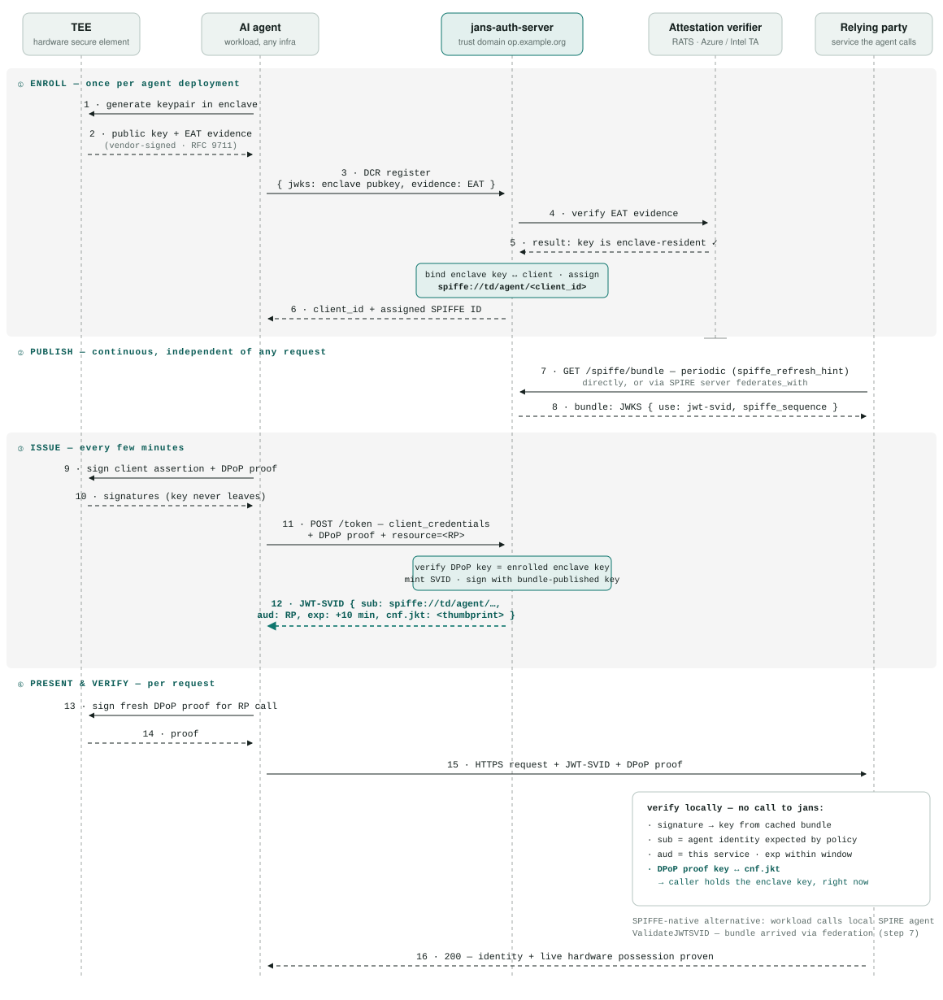
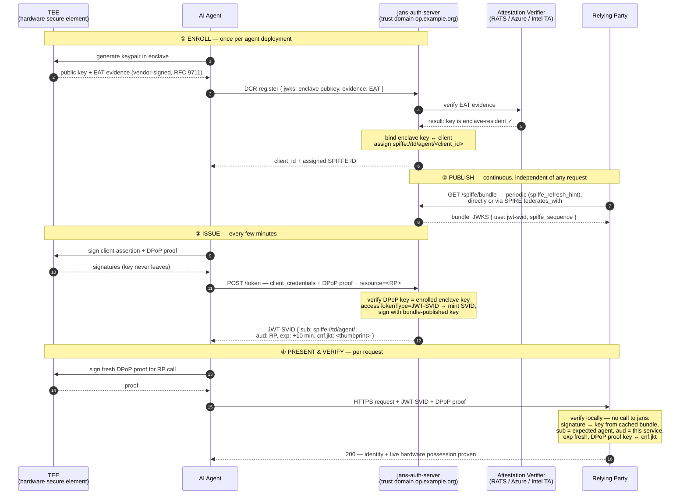
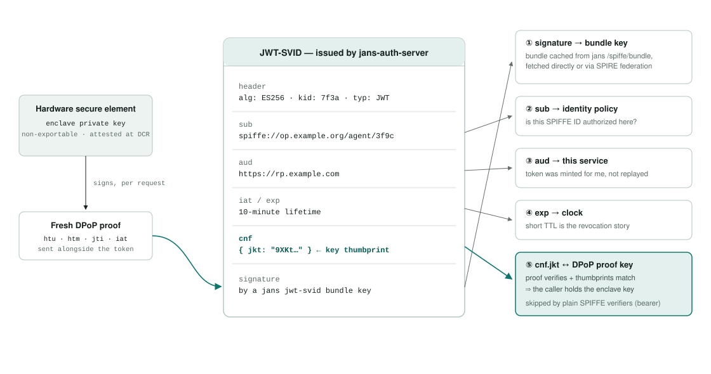
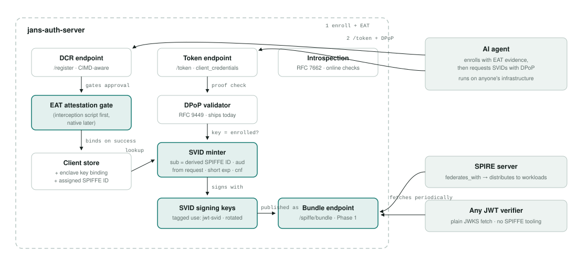
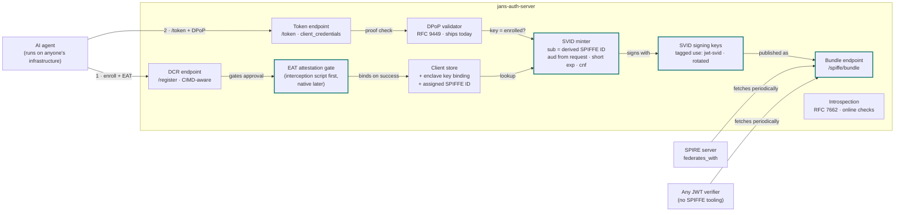

---
tags:
  - administration
  - auth-server
  - oauth
  - feature
  - spiffe
  - agent
  - design
---

# Agent Identity via JWT-SVID (Design Plan)

> **Status: design plan, not yet implemented.** This document describes how jans-auth-server will
> issue hardware-bound SPIFFE identities (JWT-SVIDs) to AI agents, publish its own SPIFFE trust
> bundle, and let anyone — SPIRE deployments, plain JWT verifiers, other agents — prove who an
> agent is even when it runs on someone else's infrastructure. It builds on the shipped
> [SPIFFE-Based Client Authentication](./spiffe-client-auth.md) feature
> (draft-ietf-oauth-spiffe-client-auth).

## 1. The goal in one paragraph

An operator enrolls an AI agent with jans-auth-server. The agent generates a keypair inside a
hardware secure element (TEE / TPM / enclave) — the private key never leaves it. jans-auth-server
binds that key to the agent's registration, and from then on mints short-lived **JWT-SVIDs** for
it: standard SPIFFE tokens whose `sub` is the agent's SPIFFE ID and whose `cnf` claim pins the
token to the enclave key. jans-auth-server publishes its signing keys as a **SPIFFE trust
bundle**, so any relying party — including federated SPIRE deployments — can verify the token
offline. Presenting the token *plus a proof signed by the bound key* proves not just "jans vouched
for this identity" but "the caller, right now, holds the hardware-sealed key that identity was
issued to."

## 2. The trust chain at a glance

Each link answers one question a relying party implicitly asks. Break any link and trust stops
there — which is the point: the chain makes explicit what each party vouches for.

| # | Link | Who | What happens | Artifact |
|---|------|-----|--------------|----------|
| 1 | ROOT | TEE hardware | Enclave generates a non-exportable keypair; vendor (AMD, Intel, TPM, cloud CVM) signs evidence over it | EAT evidence |
| 2 | ENROLL | DCR at jans | Agent registers; attestation (RFC 9711 EAT) proves the key is enclave-resident. jans stores key ↔ client binding, assigns SPIFFE ID | `spiffe://td/agent/<id>` |
| 3 | ISSUE | /token + DPoP | `client_credentials`, authenticated and proofed with the enclave key. jans mints a short-lived JWT-SVID with `cnf` = key thumbprint | JWT-SVID + `cnf.jkt` |
| 4 | PUBLISH | Bundle endpoint | jans serves its jwt-svid signing keys in SPIFFE bundle format at a stable HTTPS URL | JWKS · `use: jwt-svid` |
| 5 | PRESENT | Agent, anywhere | Running on third-party infra, the agent calls a service with the JWT-SVID plus a fresh proof signed by the enclave key | token + PoP proof |
| 6 | VERIFY | Relying party | Validates signature via the bundle (fetched directly, or via SPIRE federation), checks `sub`/`aud`/`exp`, and demands the `cnf` proof | trust established |

Steps 1–2 happen once per agent deployment. Steps 3–6 repeat continuously; tokens live 5–15
minutes, so possession of the enclave key — not any long-lived secret — is the durable credential.

## 3. What jans-auth-server already has

This plan is smaller than it looks, because most of the machinery shipped with earlier features:

- **Inbound SPIFFE client auth** (draft-ietf-oauth-spiffe-client-auth): `SpiffeIdUtil`,
  `SpiffeBundleService` (consumes exactly the bundle format we'll now serve, including
  stale-serving and negative caching on fetch failure), `spiffe_id` / `spiffe_bundle_endpoint`
  client metadata, X.509-SVID and JWT-SVID validation, the `spiffe_client_auth` feature flag, and
  the admin-configured `spiffeTrustDomains` trust model.
- **DPoP (RFC 9449)**, fully implemented across the token endpoint, grants, and introspection —
  the entire key-binding and per-request-proof mechanism for the issuance step already exists. If
  the DPoP key is enclave-resident, the token is hardware-bound with no new protocol work.
- **Introspection (RFC 7662)** — the online verification path for relying parties that want a
  live check.
- **DCR + CIMD + custom interception scripts** — the enrollment surface, and the extension point
  (`ExternalDynamicClientRegistrationService`) where an attestation-verification prototype can
  live without touching core code.

## 4. Lifecycle: enroll once, issue continuously, verify anywhere

Four phases with different cadences. Enrollment (①) happens once per agent deployment and anchors
everything after it. Publication (②) runs on its own clock. Issuance (③) and presentation (④)
repeat for the life of the agent.



The mermaid source for the diagram above:



Steps 1–7 run once and establish the hardware binding; if the attestation check fails, no identity
is ever assigned. Steps 8–9 run on the bundle's own refresh cadence — SPIRE (or any verifier)
polls jans periodically, never per token. The rest is the steady state: every token is short-lived
and pinned to the enclave key via `cnf`, so a stolen token is useless without the hardware.

The SPIFFE-native alternative for step ④ verification: the relying party's workload calls its
local SPIRE agent's `ValidateJWTSVID`, using the bundle that arrived via federation.

## 5. How the JWT-SVID gets verified — how and where

Three offline-capable paths, in order of preference. In all three, the answer to "does SPIRE call
the auth server?" is: **yes, but only periodically for the bundle — never per token.**
Verification is local.

| Path | Who it's for | How it works |
|------|--------------|--------------|
| **SPIRE federation** | Relying parties inside a SPIFFE/SPIRE ecosystem | SPIRE server adds a `federates_with` block pointing at the jans bundle endpoint (`https_web` profile), fetches on the refresh-hint cadence, distributes to its agents; workloads validate via the Workload API's `ValidateJWTSVID` |
| **Direct bundle fetch** | Ordinary services, gateways, tools people run agents with | The bundle is a JWKS. Any JWT library can fetch it, verify the signature, and check `sub` (SPIFFE ID), `aud`, `exp`. No SPIFFE tooling required |
| **Introspection** | High-assurance checks and debugging | RFC 7662 introspection at jans-auth-server, for a live authoritative answer or the closest thing to revocation the short-TTL model offers |

### Configuring SPIRE to trust jans

On the relying party's SPIRE server — this is the entire integration; SPIRE handles fetch,
caching, and distribution to its agents from here:

```hcl
server {
    trust_domain = "rp-company.example"
    # ...
    federation {
        federates_with "op.example.org" {
            bundle_endpoint_url = "https://op.example.org/jans-auth/restv1/spiffe/bundle"
            bundle_endpoint_profile "https_web" {}
        }
    }
}
```

### Bearer vs. bound

Signature + claims checks alone treat the token as bearer — anyone who steals it can replay it for
its lifetime. A verifier that wants the hardware-binding guarantee additionally demands a fresh
proof (DPoP-style) signed by the key in the token's `cnf` claim. Plain SPIFFE verifiers ignore
`cnf` (unknown claims are additive), so the token stays spec-valid for both audiences.

### Anatomy: what the relying party actually checks



| Claim | Check | Roots in |
|-------|-------|----------|
| signature | verifies against a `jwt-svid` key | bundle cached from jans `/spiffe/bundle`, fetched directly or via SPIRE federation |
| `sub` | `spiffe://op.example.org/agent/3f9c` — is this SPIFFE ID authorized here? | relying party's identity policy |
| `aud` | must equal this service — minted for me, not replayed | the service's own identifier |
| `iat`/`exp` | fresh (≤ 15 min old) — short TTL is the revocation story | clock |
| `cnf.jkt` | DPoP proof verifies **and** proof key thumbprint matches ⇒ the caller holds the enclave key, right now | the hardware secure element, attested at enrollment |

Checks 1–4 are the standard SPIFFE JWT-SVID validation any verifier performs. Check 5 is the
addition this plan makes; it's skipped by plain SPIFFE verifiers (bearer semantics). The `cnf`
path is the entire "1:1 hardware relationship": it exists because enrollment attested that key,
and it holds because the key cannot leave the enclave.

## 6. What's new inside jans-auth-server

Most of the pipeline ships today. The highlighted boxes are the plan: an attestation gate on
registration, an SVID minter behind the token endpoint, dedicated signing keys, and the bundle
endpoint that makes them publicly verifiable.



The mermaid source for the diagram above:



The existing `SpiffeBundleService` (the consumer built for inbound SPIFFE client auth) doubles as
the integration test for the new bundle endpoint: a second jans instance must be able to fetch and
use what this one serves. Deliberately absent: any CA or X.509-SVID issuance, and any gRPC
Workload API — agents are ordinary OAuth clients over HTTPS.

## 7. Access token type selection: `access_token_type` replaces `access_token_as_jwt`

No new `grant_type` is introduced. A grant type answers "on what basis is the client authorized to
receive a token," and for the agent flow that basis is unchanged: the client authenticates as
itself and receives a token about itself — exactly what `client_credentials` means. Only the
*format* of the issued token changes, and format is a registration-time client property — the same
model jans already uses to choose between bearer and JWT access tokens today.

### Today

| `access_token_as_jwt` | Issued access token |
|-----------------------|---------------------|
| `false` (default) | opaque bearer (reference) token |
| `true` | JWT access token |

### Proposal

Deprecate the `access_token_as_jwt` client property (`accessTokenAsJwt`) and introduce
`access_token_type` (`accessTokenType`):

| `access_token_type` | Issued access token |
|---------------------|---------------------|
| `BEARER` | opaque bearer token — **default** when the value is missing or not set during DCR |
| `JWT` | JWT access token — equivalent of today's `access_token_as_jwt=true` |
| `JWT-SVID` | SPIFFE JWT-SVID — new value for SPIFFE-based agent identity |

### Precedence and migration

- If `access_token_type` is present, it **always takes priority** over `access_token_as_jwt`.
- If `access_token_type` is absent, behavior falls back to `access_token_as_jwt` (`JWT` if `true`,
  `BEARER` otherwise) — existing clients are unaffected.
- `access_token_as_jwt` is scheduled for **removal in the next major release**.
- Both DCR (`/register`) and the swagger definition must document both properties during the
  deprecation window; config-api and TUI follow.

### Constraints when `access_token_type=JWT-SVID`

- Requires the `SPIFFE_SVID_ISSUANCE` feature flag (see Phase 1) — otherwise registration with
  this value is rejected.
- Grant type restricted to `client_credentials` (initially).
- The token request must carry a DPoP proof signed by the enrolled enclave key, and an explicit
  audience via the RFC 8707 `resource` parameter — requests missing either are rejected.

## 8. Implementation phases

### Phase 1 — Host our own SPIFFE bundle *(small · days)*

New endpoint (e.g. `/jans-auth/restv1/spiffe/bundle`) serving jans's jwt-svid signing keys as a
SPIFFE bundle. Gated by a new feature flag (e.g. `SPIFFE_SVID_ISSUANCE`, sibling of the existing
`SPIFFE_CLIENT_AUTH`). Swagger + docs land in the same change.

Response shape:

```json
{
  "keys": [
    { "kty": "EC", "crv": "P-256", "x": "…", "y": "…",
      "kid": "7f3a", "use": "jwt-svid" }
  ],
  "spiffe_sequence": 42,
  "spiffe_refresh_hint": 300
}
```

New configuration:

```json
{
  "spiffeOwnTrustDomain": "op.example.org",
  "spiffeBundleRefreshHintSeconds": 300,
  "spiffeSvidSigningKeyAlgs": ["ES256"]
}
```

- **Dedicated keys**, tagged `use: jwt-svid` — not the OIDC `/jwks` keys — so SVID key rotation
  policy is decoupled from OIDC token signing. During rotation the bundle serves old + new keys
  for one overlap window and bumps `spiffe_sequence`.
- `spiffeOwnTrustDomain` must be stable forever (renaming breaks every federated verifier);
  default from the issuer host, warn on change.
- **Dogfood test:** point a second jans instance's existing `SpiffeBundleService` at this
  endpoint — the consumer we already ship must accept the bundle we serve.

### Phase 2 — Issue JWT-SVIDs at /token *(medium · 1–2 wks)*

`client_credentials` grant for a client registered with `access_token_type=JWT-SVID` (section 7):

```text
POST /jans-auth/restv1/token
DPoP: <proof JWT signed by the enclave key>          ← Phase 3

grant_type=client_credentials
&client_id=3f9c…
&client_assertion_type=urn:ietf:params:oauth:client-assertion-type:jwt-bearer
&client_assertion=<private_key_jwt signed by the enclave key>
&resource=https://rp.example.com
```

Issued token (decoded):

```json
{
  "iss": "https://op.example.org",
  "sub": "spiffe://op.example.org/agent/3f9c…",
  "aud": "https://rp.example.com",
  "iat": 1788888000,
  "exp": 1788888600,
  "jti": "…",
  "cnf": { "jkt": "9XKt…" }
}
```

Three deliberate rules:

1. `sub` is **derived** as `spiffe://<td>/agent/<client_id>` — never taken from the existing
   `spiffe_id` attribute, which means the opposite thing (an external identity the client
   authenticates *in* with). Derivation makes spoofing and collisions structurally impossible.
2. `aud` comes from the RFC 8707 `resource` parameter and is **required** — reject SVID requests
   without an explicit audience. This is the reverse of the inbound validator
   (`SpiffeJwtSvidAssertion`), where `aud` must equal our own issuer.
3. Short TTL: new `spiffeSvidLifetimeSeconds` property, default 600, hard cap (e.g. 3600). This —
   not a revocation list — is the revocation story.

### Phase 3 — Key binding via cnf + DPoP *(small–medium · ~1 wk)*

Require DPoP (RFC 9449) on the SVID issuance request and embed `cnf.jkt` (RFC 7800) — the JWK
thumbprint of the agent's enclave key — in the issued JWT-SVID. Mostly wiring: jans's DPoP
implementation already validates proofs, tracks `jti` replay, and supports the server nonce
challenge; the new work is stamping `cnf` into the SVID and writing the verifier guidance.

- Issuance rule: the DPoP proof key **must equal the enrolled enclave key** — reject an SVID
  request proofed with any other key, otherwise the hardware chain silently breaks at issuance.
- Verifier contract (documented): validate the DPoP proof (signature, `htu`/`htm` match the
  request, `iat` fresh, `jti` unseen), then compare the proof key's thumbprint to `cnf.jkt`.
- Introspection response includes `cnf`, so online verifiers get the binding too.

### Phase 4 — Hardware attestation gate at enrollment *(spike first · 2–3 wks)*

The 1:1 hardware binding is established here: at DCR, the agent presents EAT evidence (RFC 9711)
proving its public key is enclave-resident and non-exportable. jans verifies it — or delegates to
a RATS Verifier — before approving registration and recording the key binding.

Enrollment request (shape; field name and encoding to be aligned with
draft-ietf-oauth-attestation-based-client-auth as it stabilizes):

```json
{
  "client_name": "fraud-check agent",
  "grant_types": ["client_credentials"],
  "token_endpoint_auth_method": "private_key_jwt",
  "access_token_type": "JWT-SVID",
  "jwks": { "keys": [ { "…": "enclave public key" } ] },
  "evidence": "<EAT: COSE/CWT or JWT, base64url>"
}
```

What the gate checks:

- EAT signature chains to a configured hardware root of trust (AMD VCEK chain, Intel TDX quote
  verification, TPM manufacturer CA, or a cloud attestation service's signing key).
- Freshness — a nonce jans issued for this enrollment, echoed in the evidence, so recorded
  evidence can't be replayed.
- Key binding — the attested key **is** the key in the registration `jwks`; evidence about some
  other key proves nothing about this client.
- Measurement policy — which platform states / measurements the operator accepts
  (admin-configured allowlist).

Delivery strategy:

- **Prototype** as a DCR interception script — the checks above, no core changes, fastest path to
  learning what real evidence looks like per platform.
- **Delegate, don't parse:** for v1, prefer sending evidence to the platform's own verifier
  (Azure Attestation, Intel Trust Authority) and validating the signed *result* — verifying raw
  SEV-SNP/TDX quote chains in-process is large security surface for little gain.
- **Productize** later as native support aligned with the attestation-based client auth draft —
  the same dependency the SPIFFE docs already flag as the WIT-SVID prerequisite, so two roadmap
  items converge.
- Target IETF specs and vendor verifiers directly — not agentrust-io SDKs. Their TRACE spec
  profiles the same EAT standard, so interop comes free if that ecosystem matures.

### Phase 5 — Interop, docs, swagger *(small · with each phase)*

- Federation test against a real SPIRE server (section 5 snippet), asserting a jans-issued SVID
  validates through SPIRE's Workload API.
- End-to-end demo: enroll an agent, run it on "foreign" infrastructure, have an unrelated
  third-party service verify it via each of the three verification paths.
- This documentation page and `swagger.yaml` updated in the same change as each endpoint.

## 9. Failure modes — what breaks, and what happens

A trust design is judged by its failure behavior. Each row is a link of the section-2 chain under
attack or outage.

| Event | Outcome |
|-------|---------|
| JWT-SVID stolen in transit or from a log | Replay fails at any `cnf`-checking verifier: the attacker cannot produce a DPoP proof without the enclave key. At bearer-only verifiers the token works until `exp` — which is why the TTL is minutes and why high-value RPs should check `cnf` |
| Agent host compromised, attacker tries to exfiltrate the key | The key is non-exportable; the attacker can only ask the enclave to sign while resident on the box. Short proof freshness windows (`iat`/`jti`) and short SVID TTLs bound the abuse window; disabling the client registration ends it |
| Forged or replayed attestation at enrollment | EAT signature must chain to the hardware vendor's root, and must echo the jans-issued enrollment nonce — recorded evidence and software-simulated enclaves fail the gate; no identity is ever assigned |
| Agent decommissioned or compromised | Admin disables the client registration: issuance stops immediately; outstanding tokens die within the TTL; introspection reports `active: false` at once for online verifiers |
| jans bundle endpoint unreachable | Verifiers keep using their cached bundle until refresh succeeds (SPIRE does this natively; jans's own `SpiffeBundleService` already serves stale-with-negative-cache, and custom verifiers should do the same). Verification degrades only after cached keys rotate out |
| SVID signing key rotated | Bundle serves old + new keys for an overlap window and bumps `spiffe_sequence`; tokens signed with either key verify. Only an emergency rotation that drops the old key immediately invalidates in-flight tokens — by design |
| Client tries to register its own SPIFFE ID or a foreign trust domain | Impossible by construction: the issued `sub` is derived from `client_id` under jans's own trust domain, never taken from client metadata. The inbound `spiffe_id` attribute plays no role in issuance |

## 10. Specs to follow

No invention anywhere in the design — every link in the chain has a published spec, and half are
already implemented in jans.

| Spec | Role in this plan | Status in jans |
|------|-------------------|----------------|
| SPIFFE JWT-SVID (spiffe.io standards) | Token format: `sub`, `aud`, `exp`, signing rules | Validated inbound; new: issue outbound |
| SPIFFE Trust Domain & Bundle | Bundle document format we serve | Consumed by `SpiffeBundleService`; new: serve |
| SPIFFE Federation | `https_web` bundle endpoint profile; how SPIRE federates with us | New |
| RFC 9449 — DPoP | Proof-of-possession at issuance and presentation | **Already implemented** |
| RFC 7800 — cnf claim | Binding the SVID to the enclave key | New (thin layer over DPoP) |
| RFC 8707 — Resource Indicators | The `resource` parameter carrying the SVID audience | New usage |
| RFC 9711 — EAT (+ RFC 9334 RATS architecture) | Hardware attestation evidence at enrollment | New (Phase 4 spike) |
| draft-ietf-oauth-attestation-based-client-auth | Standard shape for presenting attestation to an AS | Planned; also unblocks WIT-SVID |
| draft-ietf-wimse-s2s-protocol (WIMSE WIT) | Where IETF is converging on key-bound workload JWTs; align claim semantics | Track; verify current draft text |
| RFC 7662 — Introspection | Online verification path | **Already implemented** |
| draft-ietf-oauth-spiffe-client-auth | Inbound SPIFFE client authentication | **Shipped** |

## 11. Resolved decisions and open questions

### Resolved

- **No new `grant_type`.** Token format is orthogonal to authorization basis; `client_credentials`
  stays. See section 7.
- **Format selection is a client property**, `access_token_type=JWT-SVID`, consistent with how
  bearer vs. JWT is chosen today; `access_token_as_jwt` is deprecated in its favor. See section 7.

### Open

- **Trust domain naming and stability.** One trust domain per deployment, stable forever.
  Proposal: explicit `spiffeOwnTrustDomain` config, defaulted from the issuer host, with a
  startup warning if it ever changes.
- **WIMSE alignment.** A JWT-SVID with `cnf` is functionally a WIMSE WIT, but WIT may mandate its
  own `typ` header, which would make it *not* a JWT-SVID. Proposal: issue plain JWT-SVID +
  additive `cnf` now; revisit dual-format once the WIMSE draft stabilizes. Verify current draft
  text before Phase 3.
- **Attestation verifier: build or delegate?** Verifying SEV-SNP/TDX/TPM evidence chains
  in-process is real security surface. Delegating to the platform's attestation service (Azure
  Attestation, Intel Trust Authority) per deployment is likely the right v1; the Phase 4 spike
  should settle this per platform.
- **Revocation story.** SPIFFE's answer is short TTLs — compromised agents stop getting new
  tokens. Disable the client registration to cut issuance; introspection covers verifiers that
  need an online check inside the TTL window. Confirm this is acceptable before promising
  anything stronger.
- **SPIFFE ID path shape.** `spiffe://<td>/agent/<client_id>` is the proposed default. Do
  operators need human-meaningful paths (e.g. `/agent/fraud-check/3f9c`)? If so, allow an
  admin-approved path *segment* in registration while keeping the `client_id` suffix mandatory,
  so uniqueness stays structural.

## 12. What this plan deliberately excludes

- **X.509-SVID issuance / a CA.** JWT-SVIDs cover the agent use case without jans becoming a
  certificate authority. Revisit only with a concrete mTLS-between-agents requirement.
- **The SPIFFE Workload API** (gRPC over Unix socket). Agents fetch tokens over HTTPS from
  `/token` like any OAuth client; we don't replace SPIRE Agent.
- **Coupling to agentrust-io.** Their agent-manifest/TRACE work is early (v0.2, developer
  preview). We target the IETF standards it profiles (EAT/RATS); interop follows if that
  ecosystem matures. An agent-manifest could later be one accepted *input* at enrollment — never
  a protocol dependency.
- **Node/workload attestation plugins à la SPIRE.** EAT is the single standard envelope replacing
  that plugin zoo for our purposes.
