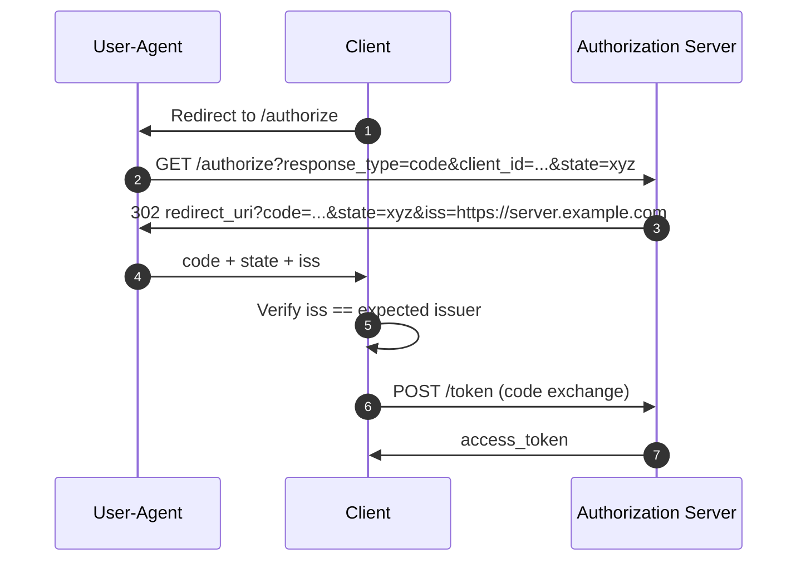

---
tags:
  - administration
  - auth-server
  - oauth
  - feature
  - rfc9207
  - issuer-identification
---

# Authorization Server Issuer Identification (RFC 9207)

Janssen Server supports OAuth 2.0 Authorization Server Issuer Identification as defined in
[RFC 9207](https://datatracker.ietf.org/doc/html/rfc9207). When enabled, the authorization
server includes its own issuer identifier (`iss`) in every authorization response — both
successful responses and redirect-based error responses — so that clients can detect and
reject mix-up attacks.

## The Mix-Up Attack

Without issuer identification, a client interacting with multiple authorization servers can
be deceived into accepting an authorization response that originated from a different server
than the one it intended to use. An attacker can exploit this by redirecting the victim's
browser from a legitimate server to a malicious one that shares the same redirect URI,
causing the client to submit a code or token issued by the attacker's server.

RFC 9207 counters this by having the authorization server stamp its own identity (`iss`)
directly into every redirect response. The client compares this value against the issuer it
expected, and rejects the response if they do not match.

## How It Works

When `authorizationResponseIssParameterSupported` is set to `true` in Janssen Server
configuration, the `iss` parameter is appended to every authorization redirect sent back to
the client's `redirect_uri`.

### Successful Authorization Response

A standard authorization code response with issuer identification looks like:

```text
HTTP/1.1 302 Found
Location: https://client.example.com/cb?
  code=SplxlOBeZQQYbYS6WxSbIA
  &state=af0ifjsldkj
  &iss=https%3A%2F%2Fserver.example.com
```

### Error Response

Error responses redirected to the `redirect_uri` also carry `iss`:

```text
HTTP/1.1 302 Found
Location: https://client.example.com/cb?
  error=access_denied
  &state=af0ifjsldkj
  &iss=https%3A%2F%2Fserver.example.com
```

### Flow Diagram



### Discovery Metadata

When issuer identification is enabled, the Janssen Server advertises this capability in
the OpenID Connect discovery document at `/.well-known/openid-configuration`:

```json
{
  "issuer": "https://server.example.com",
  "authorization_response_iss_parameter_supported": true,
  ...
}
```

Clients that read this metadata entry know they MUST validate the `iss` parameter in every
authorization response they receive from this server.

## Relationship to JARM

When [JWT Secured Authorization Response Mode (JARM)](https://openid.net/specs/oauth-v2-jarm.html)
is used, the authorization response is wrapped in a signed JWT that already contains an
`iss` claim. RFC 9207 explicitly recognises this: the `iss` JWT claim serves the same
protective purpose as the plain `iss` query parameter.

Janssen Server therefore does **not** add a redundant plain-text `iss` parameter when the
negotiated response mode is one of `query.jwt`, `fragment.jwt`, `form_post.jwt`, or `jwt`.
The issuer is already secured inside the JWT.

## Configuring Janssen Server

Issuer identification is **opt-in** and disabled by default so that existing deployments
are unaffected. To enable it, set the following property:

| Property | Type | Default | Description |
|---|---|---|---|
| `authorizationResponseIssParameterSupported` | Boolean | `false` | When `true`, the `iss` parameter is added to all authorization redirect responses per RFC 9207. |

### Using the TUI

Navigate to **Auth Server → Configuration → Properties** and set
`authorizationResponseIssParameterSupported` to `true`.

### Using the Config API

```bash
curl -X PATCH https://<jans-host>/jans-config-api/api/v1/jans-auth-server/config \
  -H "Authorization: Bearer <access_token>" \
  -H "Content-Type: application/json-patch+json" \
  -d '[{"op":"replace","path":"/authorizationResponseIssParameterSupported","value":true}]'
```

See the [configuration reference](../../../janssen-server/reference/json/properties/janssenauthserver-properties.md#authorizationresponseissparametersupported)
for the full property description.

## Client-Side Validation

When a client receives an authorization response from a server that has advertised
`authorization_response_iss_parameter_supported: true`, it MUST:

1. Extract the `iss` parameter from the redirect response.
2. Compare its value to the expected issuer identifier using simple string comparison
   (as defined in [RFC 3986 §6.2.1](https://datatracker.ietf.org/doc/html/rfc3986#section-6.2.1)).
3. Reject the response if `iss` is absent or does not match the expected value.

For OpenID Connect flows where an ID Token is returned, the client should also verify that
the `iss` parameter matches the `iss` claim inside the ID Token.

!!! note
    Clients MUST ensure that no two authorization servers in their configuration share
    the same issuer identifier. Duplicate issuers would defeat the protection that RFC 9207
    provides.

## Have questions in the meantime?

While this documentation is in progress, you can ask questions through
[GitHub Discussions](https://github.com/JanssenProject/jans/discussions) or the
[community chat on Zulip](https://chat.gluu.org/join/wnsm743ho6byd57r4he2yihn/).
Any questions you have will help determine what information our documentation should cover.

## Want to contribute?

If you have content you'd like to contribute to this page, you can get started with our
[Contribution guide](https://docs.jans.io/head/CONTRIBUTING/).
