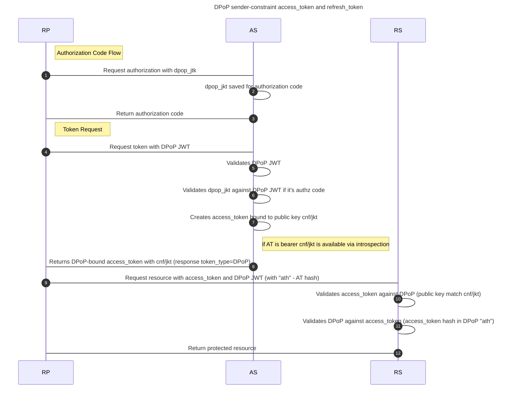

---
tags:
  - administration
  - auth-server
  - oauth
  - feature
  - dpop
---

# DPoP (Demonstrating Proof-of-Possession at the Application Layer)

Janssen Server supports `DPoP` (Demonstrating Proof-of-Possession) at the Application Layer, which is OAuth 2.0 feature
to enhance the security of resources protected by access tokens.

When DPoP is being used, the Janssen Server checks whether the presenter of the access token is the one to whom the
access token was issued. Hence, making sure that a stolen access token is not being used by someone
else to access the protected resource. OAuth 2.0 DPoP specification is available
[here](https://www.ietf.org/archive/id/draft-ietf-oauth-dpop-16.html)

Janssen Server also supports OAuth [MTLS(Mutual TLS)](./mtls.md) as a mechanism to ensure that the token presenting
party is legitimate. While **MTLS should be preferred** whenever it is possible to use it, for other cases like single
page application(SPA), DPoP can be used.

## Using DPoP

## Using DPoP Proof JWT

To use DPoP protection, the client needs to create DPoP Proof JWT (or DPoP Proof) and send it using `DPoP`
request header to Janssen Server when:

1. Requesting for a new access token
2. Accessing a protected resource using the access token

DPoP proofs are created differently for the cases listed above. DPoP specification describes
[how](https://www.ietf.org/archive/id/draft-ietf-oauth-dpop-16.html#name-dpop-proof-jwts).

When an access token is requested with the DPoP header (1 above), the Janssen Server returns an access token (or refresh token) that
is bound(mapped) to the public key attached with the DPoP proof.

Subsequently, when the client uses the access token to access the protected resource (2 above), it again creates and
attaches the DPoP Proof with the request. The resource server checks the validity of the request by ensuring that the
access token used is bound to the same public key which is presented in the DPoP proof in the request. The resource
server uses steps laid out in the
[specification](https://www.ietf.org/archive/id/draft-ietf-oauth-dpop-16.html#name-checking-dpop-proofs) to acertain 
this.



### Authorization Code Binding to DPoP Key

Authorization Endpoint supports `dpop_jkt` parameter for DPoP binding of authorization code.

```text
 GET /authorize?response_type=code&client_id=s6BhdRkqt3&state=xyz\
     &redirect_uri=https%3A%2F%2Fclient%2Eexample%2Ecom%2Fcb\
     &code_challenge=E9Melhoa2OwvFrEMTJguCHaoeK1t8URWbuGJSstw-cM\
     &code_challenge_method=S256\
     &dpop_jkt=NzbLsXh8uDCcd-6MNwXF4W_7noWXFZAfHkxZsRGC9Xs HTTP/1.1
 Host: server.example.com
```

For PAR, both ways of binging are supported:

- Via `dpop_jkt`
- Via `DPoP` header where `dpop_jkt` is calculated out of `DPoP` header value

### Using Introspection Endpoint

Janssen Server [introspection endpoint](../../auth-server/endpoints/introspection.md) supports the JWK thumbprint
confirmation method. Using this, the resource server can introspect an access token and obtain the hash of the public
key associated with the access token. Response from the introspection endpoint will share this information in the format
recommended in the
[specificaiton](https://www.ietf.org/archive/id/draft-ietf-oauth-dpop-16.html#name-jwk-thumbprint-confirmation-)

## Janssen Server Configuration for DPoP

Following properties of the Janssen Server can be used to tailor the behavior concerning DPoP.

- [dpopJtiCacheTime](../../../janssen-server/reference/json/properties/janssenauthserver-properties.md#dpopjticachetime)
- [dpopSigningAlgValuesSupported](../../../janssen-server/reference/json/properties/janssenauthserver-properties.md#dpopsigningalgvaluessupported)
- [dpopTimeframe](../../../janssen-server/reference/json/properties/janssenauthserver-properties.md#dpoptimeframe)
- [dpopUseNonce](../../../janssen-server/reference/json/properties/janssenauthserver-properties.md#dpopusenonce)
- [dpopNonceCacheTime](../../../janssen-server/reference/json/properties/janssenauthserver-properties.md#dpopnoncecachetime)
- [dpopJktForceForAuthorizationCode](../../../janssen-server/reference/json/properties/janssenauthserver-properties.md#dpopjktforceforauthorizationcode)


## Have questions in the meantime?

While this documentation is in progress, you can ask questions through [GitHub Discussions](https://github.com/JanssenProject/jans/discussions) or the [community chat on Gitter](https://gitter.im/JanssenProject/Lobby). Any questions you have will help determine what information our documentation should cover.

## Want to contribute?

If you have content you'd
like to contribute to this page in the meantime, you can get started with our [Contribution guide](https://docs.jans.io/head/CONTRIBUTING/).