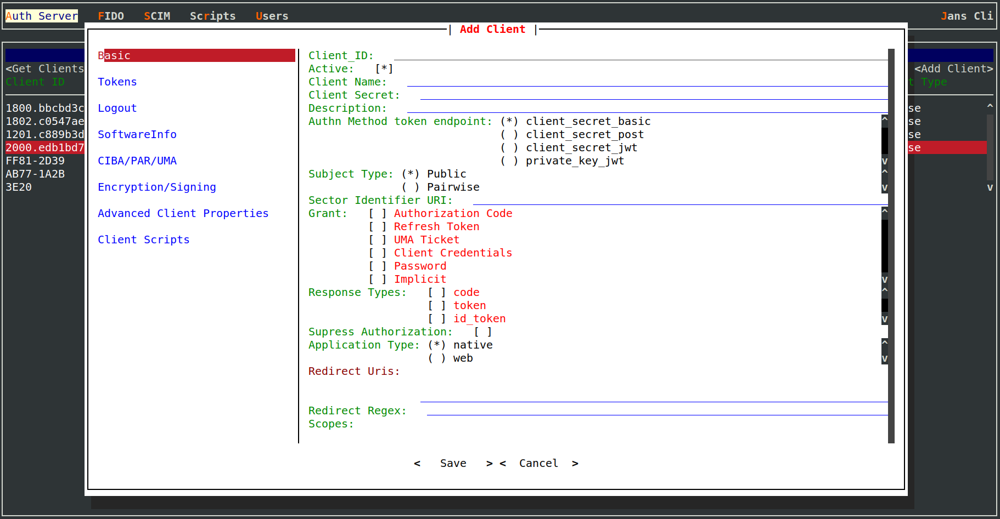

---
tags:
  - administration
  - auth-server
  - oauth
  - feature
  - grant
  - password
---

# Password Grant

Janssen Server supports the password grant. At the same time, inline with
[OAuth 2.0 security best practices](https://oauth.net/2/oauth-best-practice/), this password grant should never be used
in practice. [OAuth 2.1](https://datatracker.ietf.org/doc/html/draft-ietf-oauth-v2-1-08) has removed this grant type.

## Configuration

A client can use the password grant if it is enabled in the configuration. An administrator can use
[TUI](../../config-guide/config-tools/jans-tui/README.md) to enable password grant for a client.

## Usage

Using the password grant involves sharing user credentials with a third-party application. This third-party app which has
registered with Janssen Server as a client, will then use user-id/password credentials from the user to obtain an
access token from Janssen Server.

Janssen Server also requires the client to authenticate itself based on the client configuration.

Since sharing user credentials with a third-party app is a security risk and against the basic purpose of OAuth, this
grant type shall not be used.

## Want to contribute?

If you have content you'd like to contribute to this page in the meantime, you can get started with our [Contribution guide](https://docs.jans.io/head/CONTRIBUTING/).