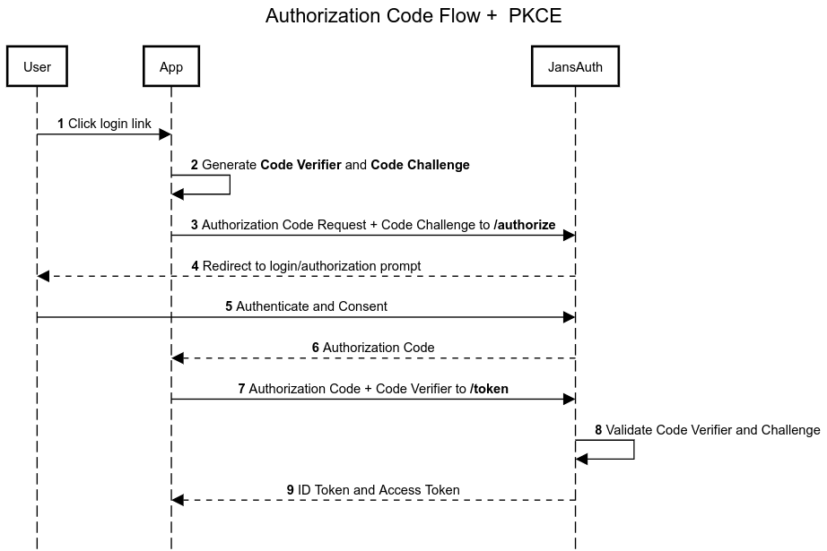
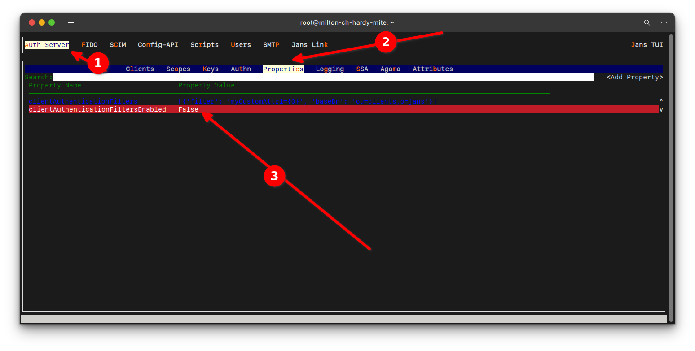

---
tags:
  - administration
  - auth-server
  - oauth
  - feature
  - pkce
---

# PKCE (Proof Key for Code Exchange)

PKCE(Proof Key for Code Exchange) is an extension to the Authorization on Code
flow to prevent `CSRF` and authorization code injection attacks. Authorization
code flow with PKCE is defined in [this](https://datatracker.ietf.org/doc/html/rfc7636) specification.

Public clients (**Single Page Apps (SPA)** or **Mobile Apps**), have a serious
problem obtaining access tokens. In the case of `SPA` you cannot securely store
a secret key, because its source is available in the browser. The same
will happen with **Mobile Apps**, since decompiling the application will reveal
the secret keys.

This is where `PKCE` comes in to solve the problem.

The authorization code flow with PKCE is considered as best practice when
using **Single Page Apps (SPA)** or **Mobile Apps**.

Let's see in the following diagram how it works:



[Source](https://sequencediagram.org/index.html#initialData=C4S2BsFMAIEEFdgAsD2AnEAvAhqFA7aAYRQBMYAxcFAd2gGppoAFAaSIFEAoLgB2zSgAxiH75g0AKoBnSGj4Dho7OLi9eCwSBFiJAKRXSEyHtkQF4AWwBGcnjLkBaAHyx1ALmLhtAa2jUAcxBCb3wfLjdeF0jPAHFIfDlcGAAqFJJyaAA1ORAAMxA5NOgVUmg0jJgiJGxwKHwAyDSI9RcDfCNEJE9jVAwcPEJK6AAlSABHeEhpCUZh6tr6xuhgFHKUgHozZHQsJpSuds7kRxcHNE8x0hA0SCEJVf8UIPwtrt2BkAJoXjQUS14wC45zahl6PS6CWEyRK+DKJA6UMOYK6p1cHjg736uC+QzIkBaUWcR3BmJ22MGxHxDCpmRyGAKchWazSG1WPgSzRJqOJKOQniytRApBhw3p+UKaFh8JqdQSjWRHV6aJi0AAkgARaAAFRQHMIpTgQiE02kOr1CS4QA)

## PKCE Configuration

For this flow to work, we must make the following configuration in
Janssen Server.

We need to set the `clientAuthenticationFiltersEnabled` property to `false`, it
defaults to `true`. We can use
[TUI](../../config-guide/config-tools/jans-tui/README.md) to change this
configuration as shown below:



AS requires PKCE if `requirePkce` global AS configuration property is set to `true` or otherwise if 
client involved in request has `requirePkce` set to `true` in client attributes ( inside `jansAttrs` json).

## Authorization Code Flow + PKCE

In this flow, we will execute the following steps:

1. Generate **Code Verifier** and **Code Challenge**
2. Register new client
3. Call `authorize` endpoint
4. Call `token` endpoint

### 1. Generate Code Verifier and Code Challenge

It is necessary to generate these codes for this flow, since this data will be
sent in the `authorize` and `token` endpoints.

#### Code Verifier

The It is a random string of length `N`, and is denoted by the field `code_verifier`.

The following command generates a `code_verifier` of length `128`.

```bash
tr -dc 'A-Za-z0-9-._' </dev/urandom | head -c 128; echo
```

Output example:

```bash
root@jans:~# tr -dc 'A-Za-z0-9-._' </dev/urandom | head -c 128; echo
MW54l5Ma7i8n6QsetI_dnJhfMQ6gIfBNJiWFINu6rtD0zvZUXG3STWoolT5HFatjWu2Vj1L-Au4PtRzkear088FJLzq.6tAg10wikJrIqn75HCJ7V1b_p8io_ugkPkkr
```

#### Code Challenge

To generate the `code_challenge` we need to know what type of method we will be using, so this field is accompanied by
the `code_challenge_method` field.

Janssen Server supports two methods of `code_challenge_method`:

- `plain`: When using this method, the `code_challenge` is the same as the `code_verifier`.
- `s256`: When using this method, `code_challenge` must be encoded using the `code_verifier` with **sha256** and *
  *base64Url**.

The following command generates the `code_challenge` using `s256`.

!!! Note
    To execute command the command below, you need to have `openssl`, `basenc`
and `tr` installed.

```bash
echo -n "MW54l5Ma7i8n6QsetI_dnJhfMQ6gIfBNJiWFINu6rtD0zvZUXG3STWoolT5HFatjWu2Vj1L-Au4PtRzkear088FJLzq.6tAg10wikJrIqn75HCJ7V1b_p8io_ugkPkkr" | openssl dgst -binary -sha256 | basenc --base64url | tr -d '='
```

Output example:

```bash
root@jans:~# echo -n "MW54l5Ma7i8n6QsetI_dnJhfMQ6gIfBNJiWFINu6rtD0zvZUXG3STWoolT5HFatjWu2Vj1L-Au4PtRzkear088FJLzq.6tAg10wikJrIqn75HCJ7V1b_p8io_ugkPkkr" | openssl dgst -binary -sha256 | basenc --base64url | tr -d '='
zyI60XbvMetJJuAzyRR_jnxoJkyfxXSqY-mTG4FtBtg
```

### 2. Register new client

``` text title="Request"
POST <YOUR_DOMAIN>/jans-auth/restv1/register HTTP/1.1
Content-Type: application/json

{
  "client_name": "PKCE Test Client",
  "application_type": "web",
  "token_endpoint_auth_method": "none",
  "scope": [
    "openid",
    "profile",
    "email"
  ],
  "grant_types": [
    "authorization_code"
  ],
  "response_types": [
    "code",
    "token",
    "id_token"
  ],
  "redirect_uris": [
    "https://<YOUR_DOMAIN>/jans-auth-rp/home.htm"
  ]
}
```

!!! Note
    Notee that the `token_endpoint_auth_method` field is `none`.

```text title="Response"
HTTP/1.1 201 Created
Date: Fri, 17 Nov 2023 22:51:13 GMT
Server: Apache/2.4.41 (Ubuntu)
X-Xss-Protection: 1; mode=block
X-Content-Type-Options: nosniff
Strict-Transport-Security: max-age=31536000; includeSubDomains
Expires: Thu, 01 Jan 1970 00:00:00 GMT
Cache-Control: no-store
Content-Type: application/json
Pragma: no-cache
Content-Length: 1541
Set-Cookie: X-Correlation-Id=d92eddf5-ab08-4b4f-a8f1-10af67e83dbd; Secure; HttpOnly;HttpOnly
Connection: close

{
  "allow_spontaneous_scopes": false,
  "application_type": "web",
  "rpt_as_jwt": false,
  "registration_client_uri": "https://<YOUR_DOMAIN>/jans-auth/restv1/register?client_id=057c3abf-a1a7-49cc-9e4e-8737e898ac72",
  "tls_client_auth_subject_dn": "",
  "run_introspection_script_before_jwt_creation": false,
  "registration_access_token": "659ccbf9-ac98-437a-b952-33bfc0366fc2",
  "client_id": "f48fbdfa-4c07-49e5-938b-10463980e145",
  "token_endpoint_auth_method": "none",
  "scope": "email openid profile",
  "client_secret": "a656a654-c930-4b52-9edb-68ead50d046e",
  "client_id_issued_at": 1700261473,
  "backchannel_logout_uri": "",
  "backchannel_logout_session_required": false,
  "client_name": "PKCE Test Client",
  "par_lifetime": 600,
  "spontaneous_scopes": [],
  "id_token_signed_response_alg": "RS256",
  "access_token_as_jwt": false,
  "grant_types": [
    "implicit",
    "refresh_token",
    "authorization_code"
  ],
  "subject_type": "pairwise",
  "additional_token_endpoint_auth_methods": [],
  "keep_client_authorization_after_expiration": false,
  "require_par": false,
  "redirect_uris": [
    "https://<YOUR_DOMAIN>/jans-auth-rp/home.htm"
  ],
  "redirect_uris_regex": "",
  "additional_audience": [],
  "frontchannel_logout_session_required": false,
  "client_secret_expires_at": 1700347873,
  "access_token_signing_alg": "RS256",
  "response_types": [
    "code",
    "token",
    "id_token"
  ]
}
```

### 3. Call `authorize` endpoint

From your browser of choice call the following url:

``` text title="Request"
https://<YOUR_DOMAIN>/jans-auth/restv1/authorize?
response_type=code&
client_id=f48fbdfa-4c07-49e5-938b-10463980e145&
scope=openid+profile+email&
redirect_uri=https://<YOUR_DOMAIN>/jans-auth-rp/home.htm&
state=bf1af4a1-8713-49c6-b229-537bf4cf712d&
nonce=f2265e46-6d93-4d36-850b-8fd990cccd04&
code_challenge=<YOUR_CODE_CHALLENGE>&
code_challenge_method=<YOUR_CODE_CHALLENGE_METHOD>
```

!!! Note
    Remember that this **endpoint** is where you must send the `code_challenge` and `code_challenge_method`
parameters.

The field we need to obtain is the `code`.


### 4. Call `token` endpoint

Previously we have obtained the `code` field, we will use this value to call the endpoint `token`.

```text title="Request"
POST <YOUR_DOMAIN>/jans-auth/restv1/token HTTP/1.1
Content-Type: application/x-www-form-urlencoded

grant_type=authorization_code&
redirect_uri=https://<YOUR_DOMAIN>/jans-auth-rp/home.htm&
client_id=f48fbdfa-4c07-49e5-938b-10463980e145&
code_verifier=<YOUR_CODE_VERIFIER>&
code=<YOUR_CODE>
```

```json title="Response"
{
  "access_token": "38abc903-9a68-48f9-9ccc-bf1b50fe8152",
  "refresh_token": "e945e8ab-19c1-4073-b3c1-913bb090459a",
  "id_token": "eyJraWQiOiJjb25uZWN0XzZmZmJkZTQ3LTU5MDgtNDljMy04MGVkLTFjODNhNGEyNWJmOF9zaWdfcnMyNTYiLCJ0eXAiOiJqd3QiLCJhbGciOiJSUzI1NiJ9.eyJhdF9oYXNoIjoiTndiVXg2NlFaUzFvMG1SMmdyRGxKZyIsInN1YiI6IkcxM2ZtQ3RDQkJ0VDN5TzBMWUY0eng3X1ROUktZeGhGNUd6cGFYOUFiZlkiLCJhbXIiOlsiMTAiXSwiaXNzIjoiaHR0cHM6Ly9taWx0b24tY2gtaGFyZHktbWl0ZS5nbHV1LmluZm8iLCJub25jZSI6IjRlOWVhZjdjLWZlMjUtNDlkMC05OGU1LTM2ZTNjYzJhMWNiZCIsInNpZCI6IjIwZThmNTAzLWZmN2EtNGU3OS05OTY3LTUxMTU5NTk1N2JhYiIsImphbnNPcGVuSURDb25uZWN0VmVyc2lvbiI6Im9wZW5pZGNvbm5lY3QtMS4wIiwiYXVkIjoiN2M3OGE0MmUtNTc4YS00OWE2LWExNzAtZTg1N2E0NWYzNTBjIiwicmFuZG9tIjoiZGU0NjE5NDEtNzIzOC00YjZjLWI2NTQtNjg2OTU0MmZlZjc3IiwiYWNyIjoiYmFzaWMiLCJjX2hhc2giOiJ1eFlZWDc5a3c2S2llX0NvaTZERi1RIiwiYXV0aF90aW1lIjoxNzAwMzYxMzA1LCJleHAiOjE3MDAzNjY5MjIsImdyYW50IjoiYXV0aG9yaXphdGlvbl9jb2RlIiwiaWF0IjoxNzAwMzYzMzIyfQ.IRgf6L4HsTHwgIGY_i3Af1dUnS-fLkMz8ND2r6Fgux-W7lkfQYXrpAqyEn-bUZ-L47PhaNWaLIV2bCl8Bxtbk1RhOS0-Sq8YnATkCgsSTCC5gtcZx42N67oQahoInSA4QuySdz1OAChZhlgUHRWn2bnAm07gCf7jfBdqRwCY11GcJrkR4n714tKcr5olxSDok2MJKmkbTi4VPfQXKfTYb7p-mMoqg3cr7w53IrEvQrOM94tYVJs1sUX_HGLwD99d1kRZN8SW2fMUxDsXw4hcDtnL4ktVp1rzc9tseGeu8tWzbNqQHESodOSPYqsl_SaPhuLip2FNFbStqJDc1vjnlg",
  "token_type": "Bearer",
  "expires_in": 299
}
```


