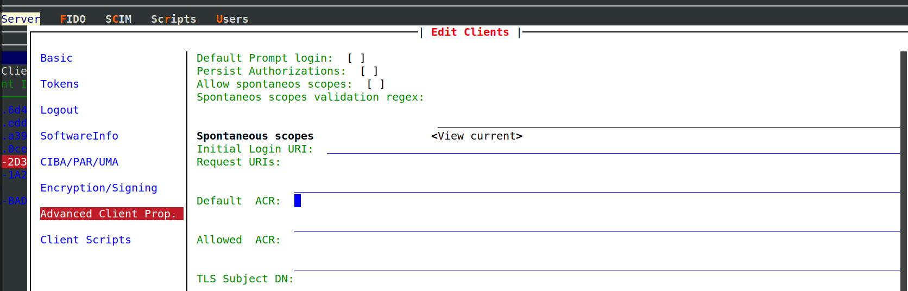
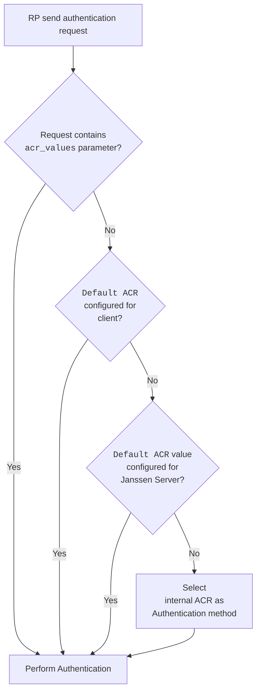

---
tags:
  - administration
  - auth-server
  - openidc
  - feature
  - acr
---

# ACR

ACR(Authentication Context Class Reference) is defined by   [OpenId Connect Specification](https://openid.net/specs/openid-connect-core-1_0.html#Terminology).

Using ACRs and ACR configuration, the client application can define end-user authentication experience while ensuring
required level of security for the application.

## Supported ACRs

Janssen Server lists supported ACRs in the response from Janssen Server's well-known
[configuration endpoint](../endpoints/configuration.md) given below. Only ACRs that are supported and enabled by configuration
will be part of the list.

```text
https://janssen.server.host/jans-auth/.well-known/openid-configuration
```

The `acr_values_supported` claim in the response shows the list of supported and enabled ACRs for particular Janssen Server
deployment.

## ACR categories:

ACRs available in Janssen Server can be broadly put into three categories. These categories are just for ease of
understanding.

### 1. Internal Janssen Server ACR

Janssen server will use internal ACR only if no other authentication method is set or could be invoked.
This internal ACR, `simple_password_auth`, is set to level -1. This means that it has lower
priority than any other script. This ACR is always available and enabled on any Janssen Server deployment.

This ACR is a simple user-id and password-based authentication mechanism. It authenticates the end-user
against the backend datastore.

### 2. Pre-packaged ACR for authenticating using external LDAP or Active Directory

All Janssen Server deployments have `default_ldap_server` ACR which can be enabled to perform authentication against a
remote LDAP-based IDP (e.g. ActiveDirectory). By default, this ACR is disabled. This ACR can only authenticate against
LDAP-based IDP.

Use the instructions provided in jans-cli [LDAP configuration options](../../config-guide/auth-server-config/ldap-configuration.md) documentation to learn how to enable and configure ACRs that use external LDAP as IDP.

### 3. Script-based ACRs

To offer highly flexible and pluggable authentication flows, Janssen Server uses script-based ACRs. These ACRs are
associated with a corresponding [person authentication script](../../../script-catalog/person_authentication/person-authentication.md). To use these ACRs
in the authentication flow, the associated [script should be enabled](../../../script-catalog/person_authentication/person-authentication.md#enabling-an-authentication-mechanism).

### 4. Agama ACRs

Agama acrs starts from `agama_` prefix. All of them invoke underlying agama bridge script called `agama`.
General pattern is `agama_<flow name>`.

## Configuring ACRs in the JANS AS:

ACRs can be configured on two levels:
### 1. Client Level ACR

The client can configure a specific ACR that should be used if the authentication request is missing `acr_values`
parameter. This can be configured using `Default ACR` attribute of the client configuration.

Also, the client can restrict ACR values that authentication requests can have as part of `acr_values` parameter. This can be configured using `Allowed ACRs`.

Using the Janssen Text base UI (TUI) configuration tool, these values can be configured by navigating to
`Auth Server`->`clients`->`get clients`->`choose a client and press enter`->`Advanced Client Prop`. On this screen
populate ACR values in `Default ACR` and `Allowed ACRs`:



### 2. Server Level ACR

Janssen Server administrator can configure an ACR that should be invoked if ACR for incoming requests can not be
determined using client-level configuration. This is the default authentication mechanism exposed to all the clients
that send end-users to the Janssen Server for sign-in.

To configure this parameter using Janssen Text base UI (TUI) configuration
tool, navigate to `Auth Server`->`Authn`->`Default ACR` as shown below:


## ACR Precedence Levels

Each authentication mechanism (script) has a "Level" assigned to it which describes how secure and reliable it is.
**The higher the "Level" represents higher reliability.** Though several mechanisms(ACRs) can be
enabled for the same Janssen server deployment at the same time, for any specific user's session only one of them can be
set as the current ACR (and will be returned as `acr` claim of id_token).

After the creation of the initial session, if RP sends a new request with a different ACR, then ACR's "Level" will be compared
to that of the method associated with the current session. If the requested method's "Level" is lower or equal to current
ACR's level, nothing is changed and the usual SSO behavior is observed. If the new level is higher (i.e. a more secure
method is requested), and it's not possible to serve such a request using the existing session's context, then the user
must re-authenticate to continue. If the user succeeds, a new session with a new ACR gets associated.

## ACR mappings (aliases)

There is `acrMappings` AS configuration property which allows to specify aliases for acrs.
`acrMappings` contains simple map in key-value form.

Lets say RP sends request with `acr_values=loginWithOtpCheck`. If `acrMappings` contains mapping "loginWithOtpCheck":"otp" then
AS will map `loginWithOtpCheck` to `otp` and will use `acr_values=otp` for actual processing on server side. 
It means that custom script must be called `otp` in this case on AS side and not `loginWithOtpCheck` (because `loginWithOtpCheck` is alias to `otp`). 

ACR mappings are published on discovery page `GET /.well-known/openid-configuration HTTP/1.1`

```json
{
  ...
  "acr_mappings":{"alias1":"acr1", "loginWithOtpCheck": "otp"}
  ...
}
```

## Flowchart : How the Jans AS derives an ACR value for a user session



- When authentication request is received from a client(RP), the Janssen Server looks for `acr_values` parameter in
  the request. This parameter is defined in the OpenId Connect core specification,
  section [3.1.2.1](https://openid.net/specs/openid-connect-core-1_0.html#AuthRequest).
- If the `acr_values` parameter is not received with the request, then Janssen Server uses the
  value from the `Default ACR` configuration [from the client](#1-client-level-acr)
- If Janssen Server doesn't find `acr_values` request parameter nor does it find the `Default ACR` configured for the
  client, then the Janssen Server checks the server configuration property
  [useHighestLevelScriptIfAcrScriptNotFound](../../reference/json/properties/janssenauthserver-properties.md#usehighestlevelscriptifacrscriptnotfound).
  If this property is set to true, then Janssen Server invokes the authentication mechanism for which the corresponding
  [person authentication script](#3-script-based-acrs) is enabled. Choosing the script with the highest
  [level](#acr-precedence-levels).
- If no script can be invoked or the `useHighestLevelScriptIfAcrScriptNotFound` property is set to false,
  then the Janssen Server authenticates using the [default ACR for the server](#2-server-level-acr).
- If the default ACR for the server is not configured by the Janssen Server administrator, or it can not be invoked due
  to any reason, then the Janssen Server uses the [internal server ACR](#1-internal-janssen-server-acr) to authenticate
  the end-user.

## Errors 

### unmet_authentication_requirements

If authorization request is sent to Authorization Endpoint with `acr_values` for which 
AS it not able to find "Person Authentication" custom script, it returns "unmet_authentication_requirements"
with detail log in `jans-auth.log`.

## Want to contribute?

If you have content you'd like to contribute to this page in the meantime, you can get started with our [Contribution guide](https://docs.jans.io/head/CONTRIBUTING/).
