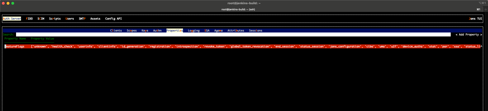
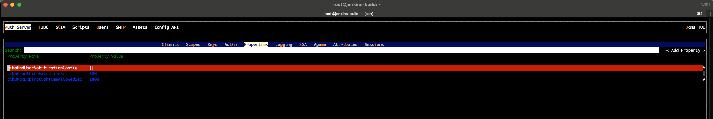
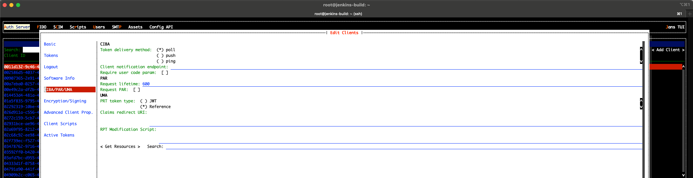

---
tags:
  - administration
  - auth-server
  - openidc
  - feature
  - ciba
  - backchannel
---

# CIBA (Client Initiated Backchannel Authentication)

CIBA decouples the device the user *interacts on* (the Authentication
Device, AD — typically the user's phone) from the device that *initiates*
the request (the Consumption Device, CD — a call-center agent terminal,
a kiosk, a smart TV, etc.). The Relying Party (RP) asks the
Authorization Server to authenticate a named end-user out-of-band; the AS
contacts the user on their AD, gets consent, and returns tokens to the RP
through one of three delivery channels.

Janssen Authorization Server implements the
[OpenID Connect Client Initiated Backchannel Authentication Flow — Core 1.0](https://openid.net/specs/openid-client-initiated-backchannel-authentication-core-1_0.html)
specification. This page covers the Janssen-specific pieces — feature
flag, server properties, per-client metadata, endpoints, and the custom
script that drives notifications. For protocol semantics (parameter
rules, error codes, JWT signing requirements) read the spec.

## High-level flow

```text
   Relying Party (CD)            Janssen AS               End User (AD)
         |                            |                          |
         | 1. POST /bc-authorize      |                          |
         |    (login_hint, scope,     |                          |
         |     binding_message, ...)  |                          |
         |--------------------------->|                          |
         |                            |                          |
         |  auth_req_id, expires_in,  |                          |
         |    interval                |                          |
         |<---------------------------|                          |
         |                            |                          |
         |                            | 2. Notify end-user       |
         |                            |    (push / out-of-band)  |
         |                            |------------------------->|
         |                            |                          |
         |                            |   user authenticates &   |
         |                            |   approves the request   |
         |                            |<-------------------------|
         |                            |                          |
         |  3. token delivery depends on the mode:               |
         |     - poll: RP polls /token with auth_req_id          |
         |     - ping: AS pings client_notification_endpoint,    |
         |             RP then calls /token                      |
         |     - push: AS POSTs id_token+access_token+refresh    |
         |             to client_notification_endpoint           |
         |                            |                          |
```

## Token delivery modes

Janssen supports the three delivery modes defined by the spec. The mode
is **a per-client setting**, but the AS-wide list of allowed modes is
controlled by the `backchannelTokenDeliveryModesSupported` server
property.

| Mode   | Who calls whom for tokens                                                                 | RP must expose a callback?       |
|--------|-------------------------------------------------------------------------------------------|----------------------------------|
| `poll` | RP polls `/token` with `grant_type=urn:openid:params:grant-type:ciba` and `auth_req_id`. | No.                              |
| `ping` | AS POSTs a `ping` to `backchannel_client_notification_endpoint`; RP then polls `/token`. | Yes — for the ping notification. |
| `push` | AS POSTs the full token response (id_token, access_token, refresh_token) to the RP.       | Yes — for the token delivery.    |

Prefer `ping` or `push` in production; `poll` is simpler to integrate
but creates load proportional to the number of pending requests.

## Enabling CIBA

CIBA is gated by a feature flag. With the flag off, the
`bc-authorize` and `bc-deviceRegistration` endpoints reject requests
and the `backchannel_*` keys are stripped from the discovery document.

1. **Toggle the `ciba` feature flag** — via
   [Janssen TUI](../../config-guide/config-tools/jans-tui/README.md):
   *Auth Server → Properties → featureFlags* and add `ciba`. The same
   flag is settable through the
   [config-api](../../config-guide/config-tools/config-api/README.md)
   under `/jans-config-api/api/v1/jans-auth-server/config`.
   
2. **Set the CIBA server properties** (see the next section).
   
3. **Configure each CIBA-enabled client** (see "Per-client configuration"
   below). A client whose `backchannel_token_delivery_mode` is unset
   cannot use CIBA, regardless of the server-wide flag.
   


## Server-level properties

All properties below are fields of `AppConfiguration`. The descriptions
and default values are kept in sync with the source in the
[generated properties reference](../../reference/json/properties/janssenauthserver-properties.md);
the table here groups them by purpose so an admin can see what to touch
together.

### Endpoints

| Property                              | Purpose                                                 |
|---------------------------------------|---------------------------------------------------------|
| [`backchannelAuthenticationEndpoint`](../../reference/json/properties/janssenauthserver-properties.md#backchannelauthenticationendpoint) | URL of the `bc-authorize` endpoint published in discovery. |
| [`backchannelDeviceRegistrationEndpoint`](../../reference/json/properties/janssenauthserver-properties.md#backchanneldeviceregistrationendpoint) | URL of the `bc-deviceRegistration` endpoint. |

### Identity used by the AS to drive authorization

These are used internally when the AS bridges the CIBA flow into the
standard authorization endpoint (for the user-facing authentication and
consent step on the AD).

| Property                       | Purpose                                                                                   |
|--------------------------------|-------------------------------------------------------------------------------------------|
| [`backchannelClientId`](../../reference/json/properties/janssenauthserver-properties.md#backchannelclientid)           | Internal client used by the EndUserNotification script to construct authorize requests.    |
| [`backchannelRedirectUri`](../../reference/json/properties/janssenauthserver-properties.md#backchannelredirecturi)        | Redirect URI for that internal client.                                                    |

### Request-format policy

| Property                                                       | Purpose                                                                                                       |
|----------------------------------------------------------------|---------------------------------------------------------------------------------------------------------------|
| [`backchannelAuthenticationRequestSigningAlgValuesSupported`](../../reference/json/properties/janssenauthserver-properties.md#backchannelauthenticationrequestsigningalgvaluessupported) | Algorithms the AS will accept on a signed CIBA authentication request.                                        |
| [`backchannelUserCodeParameterSupported`](../../reference/json/properties/janssenauthserver-properties.md#backchannelusercodeparametersupported)                  | Whether the AS accepts the `user_code` parameter (extra factor for high-assurance CIBA flows).                |
| [`backchannelBindingMessagePattern`](../../reference/json/properties/janssenauthserver-properties.md#backchannelbindingmessagepattern)                            | Regex the `binding_message` parameter must match. Use it to constrain what an RP can render on the user's AD. |

### Timing

| Property                                                | Purpose                                                                                                                              |
|---------------------------------------------------------|--------------------------------------------------------------------------------------------------------------------------------------|
| [`backchannelAuthenticationResponseExpiresIn`](../../reference/json/properties/janssenauthserver-properties.md#backchannelauthenticationresponseexpiresin) | Lifetime (seconds) of `auth_req_id`. The RP must complete the flow before this expires.                                              |
| [`backchannelAuthenticationResponseInterval`](../../reference/json/properties/janssenauthserver-properties.md#backchannelauthenticationresponseinterval)  | Minimum poll interval the AS advertises to RPs in `poll`/`ping` modes; below this the AS returns `slow_down`.                        |
| [`cibaGrantLifeExtraTimeSec`](../../reference/json/properties/janssenauthserver-properties.md#cibagrantlifeextratimesec)                                  | Extra seconds the resulting grant lives beyond `auth_req_id` expiry; covers clock skew.                                              |
| [`cibaMaxExpirationTimeAllowedSec`](../../reference/json/properties/janssenauthserver-properties.md#cibamaxexpirationtimeallowedsec)                      | Upper bound on `requested_expiry` the RP can ask for. Keep this conservative.                                                        |

### Login-hint resolution

| Property                          | Purpose                                                                                                            |
|-----------------------------------|--------------------------------------------------------------------------------------------------------------------|
| [`backchannelLoginHintClaims`](../../reference/json/properties/janssenauthserver-properties.md#backchannelloginhintclaims) | When `login_hint_token` is used, the claim names in this list are matched against the user directory.             |

### Background processor

The AS runs a background worker that fans out notifications and drives
state transitions (`expired`, `denied`, `granted`) for pending CIBA
requests.

| Property                                                       | Purpose                                                                       |
|----------------------------------------------------------------|-------------------------------------------------------------------------------|
| [`backchannelRequestsProcessorJobIntervalSec`](../../reference/json/properties/janssenauthserver-properties.md#backchannelrequestsprocessorjobintervalsec) | How often the processor wakes up.                                             |
| [`backchannelRequestsProcessorJobChunkSize`](../../reference/json/properties/janssenauthserver-properties.md#backchannelrequestsprocessorjobchunksize)     | How many pending requests it processes per iteration. Tune for throughput.    |

### Notification configuration

| Property                                       | Purpose                                                                                                                          |
|------------------------------------------------|----------------------------------------------------------------------------------------------------------------------------------|
| [`cibaEndUserNotificationConfig`](../../reference/json/properties/janssenauthserver-properties.md#cibaendusernotificationconfig) | Endpoint URL, encrypted key, and other knobs consumed by the EndUserNotification script (e.g. Firebase Cloud Messaging settings). |

## Per-client configuration

CIBA is opt-in per client. Set these in TUI under *Clients → (your
client) → CIBA*, or include them in a `/register`
([dynamic registration](https://docs.jans.io/head/admin/reference/openapi/#operation/jans-auth-register))
request:

| Client attribute                                | Required for CIBA? | Notes                                                                                                                                       |
|-------------------------------------------------|--------------------|---------------------------------------------------------------------------------------------------------------------------------------------|
| `backchannel_token_delivery_mode`               | Yes                | One of `poll`, `ping`, `push`. Must also appear in the server-wide `backchannelTokenDeliveryModesSupported`.                                |
| `backchannel_client_notification_endpoint`      | Yes for `ping`/`push` | HTTPS URL the AS calls. Must be reachable from the AS and TLS-trusted.                                                                      |
| `backchannel_authentication_request_signing_alg`| Recommended        | Signing algorithm for the JWT-form `request` parameter. Restrict to your fleet's strongest supported asymmetric algorithm.                  |
| `backchannel_user_code_parameter`               | Optional           | `true` if the client will provide `user_code` on every CIBA request.                                                                       |
| `grant_types`                                   | Yes                | Must include `urn:openid:params:grant-type:ciba`.                                                                                          |

## Endpoints

Janssen exposes two CIBA-specific endpoints, both under the standard
`/jans-auth/restv1` prefix:

- **`POST /jans-auth/restv1/bc-authorize`** — the CIBA Authentication
  Endpoint per spec §7. Full request/response schema in the
  [OpenAPI spec — `bc-authorize`](https://docs.jans.io/head/admin/reference/openapi/#operation/bc-authorize).
  Returns `auth_req_id`, `expires_in`, `interval`.
- **`POST /jans-auth/restv1/bc-deviceRegistration`** — Janssen-specific
  endpoint used to register a device push token (Firebase, APNs) so the
  AS can later notify it. See the
  [OpenAPI spec — `bc-deviceRegistration`](https://docs.jans.io/head/admin/reference/openapi/#operation/bc-deviceRegistration).
- **`POST /jans-auth/restv1/token`** with
  `grant_type=urn:openid:params:grant-type:ciba` and `auth_req_id` is
  how `poll` and `ping` clients pick up the issued tokens. See the
  [token endpoint documentation](../endpoints/token.md).

When CIBA is enabled the AS publishes the corresponding metadata
(`backchannel_authentication_endpoint`, supported delivery modes,
supported signing algorithms, `backchannel_user_code_parameter_supported`)
in `/.well-known/openid-configuration`.

## End User Notification custom script

The AS does not hard-code a notification mechanism. When a CIBA request
arrives, it invokes the **EndUserNotification** interception script with
the request context; the script is responsible for actually reaching the
user's AD (Firebase Cloud Messaging, APNs, SMS, email, etc.) and returning
`true`/`false` to indicate success.

For the script interface, examples, and how to register a script
configuration, see the script catalog page:
[CIBA End User Notification script](../../../script-catalog/ciba/ciba.md).

## Use cases

- **Call-center agent–assisted login.** Agent terminal (CD) initiates
  CIBA; the customer authenticates and consents on their phone (AD).
  Agent never sees the customer's credentials.
- **Mobile-as-second-factor for web checkout.** Web RP submits a CIBA
  request after the user enters their identifier; the user approves the
  transaction on their already-trusted mobile app. `binding_message`
  carries a short purchase summary so the user knows what they're
  approving.
- **Constrained-input device sign-in.** Smart TV, kiosk, or set-top box
  with no usable keyboard initiates CIBA against the user's phone; no
  device-code QR step required.
- **Step-up authentication for a sensitive operation.** A long-lived web
  session triggers a CIBA flow with a high `acr_values` requirement
  whenever a high-risk action is attempted.

## Recommendations

- **Prefer `ping` or `push` over `poll`.** Polling is the easiest mode
  to implement but the most expensive at scale; it also adds latency
  bounded by `backchannelAuthenticationResponseInterval`.
- **Require signed authentication requests in production.** Use the
  `request` parameter (JWT) and restrict
  `backchannelAuthenticationRequestSigningAlgValuesSupported` to one
  strong asymmetric algorithm (e.g. `PS256` or `ES256`); reject `none`.
- **Set `cibaMaxExpirationTimeAllowedSec` conservatively.** The longer
  an `auth_req_id` is valid, the larger the window for replay or
  abandoned-request abuse.
- **Constrain `binding_message`.** Use
  `backchannelBindingMessagePattern` to enforce a regex (length, allowed
  characters) so a malicious RP can't render arbitrary content on a
  user's AD.
- **Lock down the notification endpoint.** For `ping`/`push` the AS
  POSTs to a URL the RP controls; TLS must terminate with a certificate
  the AS trusts, and the RP should validate the bearer token the AS
  sends with each notification.
- **Audit-log `auth_req_id`.** It correlates `bc-authorize` →
  notification → token issuance across logs and is invaluable when
  diagnosing a stuck CIBA request.

## Troubleshooting

Logs of interest:

- `/opt/jans/jetty/jans-auth/logs/jans-auth.log` — AS-side request
  handling.
- `/opt/jans/jetty/jans-auth/logs/jans-auth_script.log` — output of the
  EndUserNotification script.

| Symptom                                                                                  | Likely cause                                                                                                  |
|------------------------------------------------------------------------------------------|---------------------------------------------------------------------------------------------------------------|
| `bc-authorize` returns `unknown_user_id`                                                 | `login_hint` / `login_hint_token` / `id_token_hint` resolution failed. Check `backchannelLoginHintClaims` and the user directory. |
| RP gets repeated `slow_down`                                                             | Poll interval is below `backchannelAuthenticationResponseInterval`. Honor `interval` in the bc-authorize response. |
| `expired_token` immediately after `authorization_pending`                                 | `backchannelAuthenticationResponseExpiresIn` is too short for the user to reach their AD; increase it.        |
| Script returns `false` for every notification                                            | Misconfigured `cibaEndUserNotificationConfig` (wrong URL or key). Inspect `jans-auth_script.log`.             |
| RP never receives `push` callback                                                        | `backchannel_client_notification_endpoint` not reachable from the AS, or TLS chain not trusted by the AS JVM. |

## Want to contribute?

If you have content you'd like to contribute to this page, you can get
started with our [Contribution guide](https://docs.jans.io/head/CONTRIBUTING/).
