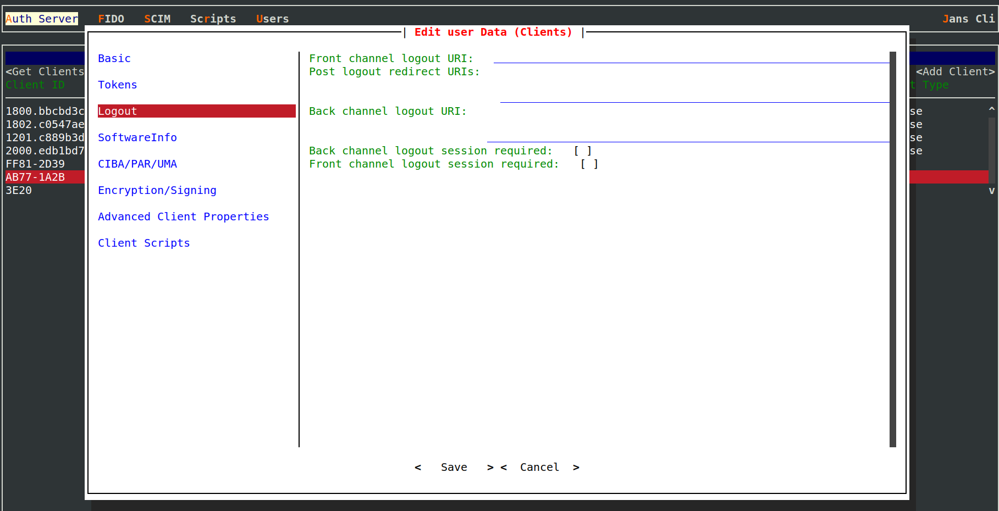

---
tags:
  - administration
  - auth-server
  - openidc
  - feature
  - logout
  - front channel logout
  - back channel logout
  - RP initiated logout
---

# Logout

Janssen Server supports various end-user logout mechanisms by implementing OpenID Connect specifications. OpenID Connect
specifications for [RP-Initiated Logout](https://openid.net/specs/openid-connect-rpinitiated-1_0.html),
[Front-Channel Logout](https://openid.net/specs/openid-connect-frontchannel-1_0.html) and
[Back-Channel Logout](https://openid.net/specs/openid-connect-backchannel-1_0.html) can be leveraged by
applications(RPs) to implement end-user logout. Simpler logout scenarios can be fulfilled by using features of one of the
specifications (just using RP-initiated logout for example), but for more complex scenarios like single sign-out,
features from multiple specifications may have to be used in combination.

To understand how various logout mechanisms work, it is important to first understand

- [How Janssen Server manages sessions?](https://docs.jans.io/v1.0.14/admin/auth-server/session-management/)
- [OpenID Connect Session management specification](https://openid.net/specs/openid-connect-session-1_0.html)

User logout can be initiated either at RP (application) first or at the OpenID Provider (OP) first. Whichever party
(RP or OP) gets the logout request first, and has to inform the other party about the event so that both the RP and OP
sessions get properly terminated. RP-initiated logout is RP's method to let OP know about the event while
Front-channel logout or back-channel logouts are the mechanisms used by OP to initiate logout and let RP know.

## Client Configuration

Which kind of logout mechanism is used by the client(RP) is dictated by the client's configuration on Janssen Server.

When using
[Janssen Text-based UI(TUI)](../../../config-guide/config-tools/jans-tui/README.md) to configure the client, navigate via `Auth Server`->
`Clients`->`logout` as shown in the image below:

## Janssen Server Configuration Properties

Following properties drive how Janssen Server as OpenID Connect Provider (OP) will execute logout.

- [allowPostLogoutRedirectWithoutValidation](../../../reference/json/properties/janssenauthserver-properties.md#allowpostlogoutredirectwithoutvalidation)
- [frontChannelLogoutSessionSupported](../../../reference/json/properties/janssenauthserver-properties.md#frontchannellogoutsessionsupported)
- [removeRefreshTokensForClientOnLogout](../../../reference/json/properties/janssenauthserver-properties.md#removerefreshtokensforclientonlogout)

## RP-Initiated Logout

RP can initiate logout for a user by redirecting the user-agent to Janssen Server's `end_session_endpoint`. This URL can be
obtained as the value of the `end_session_endpoint` claim in the OpenID Connect
[.well-known metadata](../../endpoints/configuration.md) endpoint response. Please read about `end_session_endpoint` in
more details [here](../../endpoints/end-session.md)

A request to the `end_session_endpoint` endpoint of OP will clear the user session on OP. Along with this, it is important
that RP also removes the local user session. RP can do this before redirecting the user agent to `end_session_endpoint`. In
case RP is configured to receive an intimation from the OP about user logouts
(either via front or backchannel logout mechanisms), then RP may choose to remove the local session after OP informs
the RP about the successful logout.

### Configuration Properties

Client configuration property of `Post Logout Redirection URIs` plays an important role when using RP-initiated logout.
After successful logout from Janssen Server, the server will redirect the user-agent to the URI specified in this property.

## Front-Channel Logout

Although Jans Auth Server has a `session_id` for each person who has authenticated,
applications generally have their *own* sessions. Upon logout from an OpenID Provider, ideally, all RPs are notified,
so they can also remove their local sessions. The OpenID solution to implement logout is currently described in
the [OpenID Connect Front Channel Logout specification](http://openid.net/specs/openid-connect-frontchannel-1_0.html).

In practice, here's how it works:

- From the user-agent when the end-user initiates logout, the Janssen Server `end_session` endpoint is called.
- `end_session` endpoint returns an HTML page, which contains an iFrame for each application to
  which the user has authenticated.
- The iFrame contains a link to each application's respective logout URL.
- The special HTML page should be loaded in the background and not displayed to the user.
- The iFrame URLs should be loaded by the browser.
- Now, upon logout, the user is calling the logout page of each application, the local cookies are cleared,
  and the user is signed out of all applications.

### Configuration Properties

A client can use configuration values of `Front Channel Logout URI` to specify URI to be used by Janssen Server to
render in the iFrame at the time of logout. These
configuration values can be updated using TUI as shown [here](#client-configuration)

Janssen Server also provides a feature flag
[END_SESSION](../../../reference/json/feature-flags/janssenauthserver-feature-flags.md#end_session)
that enables or disables this endpoint. If this flag is enabled, it has the same effect as having
`frontchannel_logout_supported` and `frontchannel_logout_session_supported` metadata values set to `true`. These
metadata values are defined [here](https://openid.net/specs/openid-connect-frontchannel-1_0.html#OPLogout) in
`OpenID Connect Front-Channel Logout 1.0` specification.

## Back-Channel Logout

Janssen Server supports back-channel logout as a mechanism for OP to intimate the RP about user logout. As against
front-channel logout, where OP intimates RP about user logout using user-agent, the back-channel logout uses
direct message communication over HTTP with RP to convey the logout.

Since this approach doesn't depend on the user-agent, it is more reliable. At the same time, it is more complex to implement
since clearing the user-agent state has to be taken care of separately by RP.

Central to the back-channel logout approach is the `logout token`. This token along with claims like `sid`, `sub`, and `iss`
are sent by OP to RP to indicate that the subject or the session identified in the logout token has been logged out.
Janssen Server follows recommendations published in the
[specification](https://openid.net/specs/openid-connect-backchannel-1_0.html#LogoutToken) in order to construct the
logout token.

Upon receipt of the logout token, the RP should
[validate the token](https://openid.net/specs/openid-connect-backchannel-1_0.html#Validation) and
[perform appropriate actions](https://openid.net/specs/openid-connect-backchannel-1_0.html#BCActions). It should also
send
[an appropriate response](https://openid.net/specs/openid-connect-backchannel-1_0.html#BCResponse) to OP informing the
OP that logout has been successfully executed by RP.

### Configuration Properties

If an RP has specified `Back channel logout URL` as part of its [client configuration](#client-configuration) then
Janssen Server uses this URI to send the HTTP logout request. The client can also enable
`backchannel_logout_session_required` as specified
[here](https://openid.net/specs/openid-connect-backchannel-1_0.html#BCRegistration) by using client configuration.

Janssen Server also provides a feature flag
[END_SESSION](../../../reference/json/feature-flags/janssenauthserver-feature-flags.md#end_session)
that enables or disables this endpoint. If this flag is enabled, it has the same effect as having
`backchannel_logout_supported` and `backchannel_logout_session_supported` metadata values set to `true`. These
metadata values are defined [here](https://openid.net/specs/openid-connect-backchannel-1_0.html#BCSupport) in
`OpenID Connect Back-Channel Logout 1.0` specification.