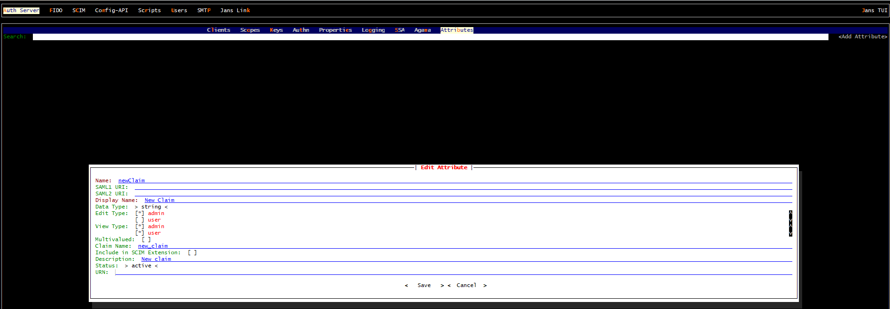
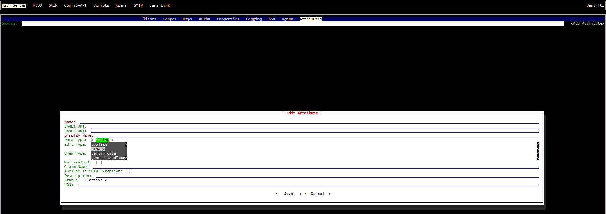
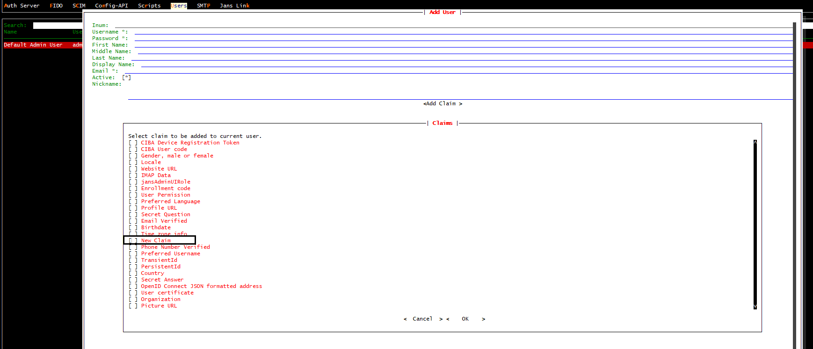

---
tags:
  - administration
  - auth-server
  - openidc
  - feature
  - claims
  - custom-claims
---

# Custom Claims

Custom claims provide the flexibility to include application-specific or user-specific information in the authentication process.Custom claims serve to enrich the information available to the relying party (RP), which is the application or service that relies on the identity provided by the OIDC provider. While standard claims provide basic user information, custom claims allow for the inclusion of domain-specific attributes or application-specific data that might be required for user personalization, authorization, or other business logic. User claims should be unique and non-null or empty.

## Adding a new custom user claim

### MySQL persistence

#### Step 1: Create a custom attribute

Create a new custom attribute using 
[Text User Interface](../../../config-guide/config-tools/jans-tui/README.md) or 
[CURL commands](../../../config-guide/config-tools/jans-cli/README.md), 
superb tools provided in Janssen. The attribute-name should be the claim-name.



#### Step 2: Make entry of the claim in MySQL Schema

- Add a column to table `jansPerson` in MySQL. Command will be `ALTER TABLE jansPerson ADD COLUMN <claimName> <dataType>`;

**Example**
```
mysql> ALTER TABLE jansPerson ADD COLUMN newClaim VARCHAR(100);
```

**Choose dataType according to the following table**

|TUI dataType|SQL dataType|
|---|---|
|Text|VARCHAR() string value to be kept, SIZE is an integer for max string size|
|Numeric|INT|
|Boolean|SMALLINT|
|Binary|BINARY|
|Certificate|TEXT|
|Date|DATETIME(3)|
|Numeric|INT|
|Multivalued|JSON|



!!!warning 
    If the attribute is Multivalued, dataType should be JSON regardless of what you will choose for Type in Janssen TUI.

The above steps will create the custom user claim in the MySQL persistence.


Once the user claim is added, it can be used in user management.

