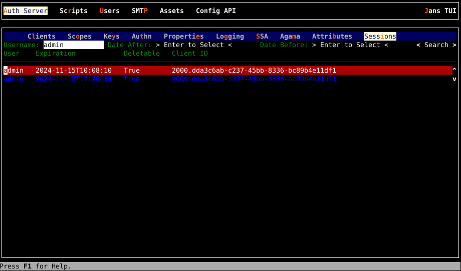

---
tags:
  - administration
  - auth-server
  - session
---

# Overview

A session is a reference identifier on the Jans Auth Server that connects to a
person's authentication state. During an authentication workflow, Auth Server writes a cookie with the `session_id` in the person's browser. OpenID Native
SSO defines a way for mobile apps from the same vendor to use the iOS or Android
protected secret storage to store the `session_id`. By correlating the session,
the IDP can return an identity assertion (id_token) to a client without needing
to re-authenticate the person. SSO ensues.

For example, let's say a person uses a browser to navigate to the website of
Relying Party (RP1), which redirects to Jans Auth Server for authentication.
Once the person is authenticated, the OP creates a `session_id` cookie, sets the
state to `authenticated`, and places it in the cache. If the person mavigates
their browser to the website of RP2, it redirects to the OP for authentication; since the `session_id` detected via the cookie is already authenticated, the OP
authenticates the person automatically for RP2 (without an authentication
prompt).

Jans Auth Server stores user session data in its cache. Auth Server performance
retrieving the session will vary depending on whether the session is stored in memory, Redis, Memcached or the database, as controlled by the
`cacheProviderType` Auth Server configuration property.

The Auth Server session can have one of two states:

- `unauthenticated` - a browser that has started, but not completed an authentication workflow.
- `authenticated` - when a person has successfully authenticated

The following Auth Server configuration properties are related to sessions:

- **sessionIdCookieLifetime** - The lifetime of `session_id` cookie in seconds. If 0 or -1 then expiration is not set. session_id cookie expires when browser session ends. Default value is `86400`.
- **sessionIdLifetime** - lifetime of the OP session in seconds (server side object). If not set, falls back to `session_id` cookie expiration set by `sessionIdCookieLifetime` configuration property.
- **sessionIdUnusedLifetime** - unused OP session lifetime in seconds. If an OP session is not used for a given amount of time, the OP session is removed.
Default value is `86400`.
- **sessionIdUnauthenticatedUnusedLifetime** - lifetime in seconds of `unauthenticated` OP session. This determines how long the user can be on the login page while unauthenticated. Default value is `120`.
- **sessionIdRequestParameterEnabled** - Boolean value specifying whether to enable `session_id` HTTP request parameter. Default value is `False`.
- **sessionIdPersistOnPromptNone** - specifies whether to persist or update the session object with data if `prompt=none`. Default value is `True`.
- **invalidateSessionCookiesAfterAuthorizationFlow** - this is special property which specifies whether to invalidate `session_id` and `consent_session_id` cookies right after successful or unsuccessful authorization.
- **changeSessionIdOnAuthentication** - Using a different session after the user authenticates improves security. The default value is `True`.
- **sessionIdPersistInCache** - If True, sessions are stored according to `cacheProviderType`. Otherwise, sessions are persisted in the database.
 Default value is `False`.
- **sessionIdPersistInCache** Default value is `False`.

For both `unused` properties, Jans Auth Server calculates this period as `currentUnusedPeriod = now - session.lastUsedAt`. So for OP session with states:

- `unauthenticated` - if `currentUnusedPeriod` >= `sessionIdUnauthenticatedUnusedLifetime`, then the session object is removed.
- `authenticated` - if `currentUnusedPeriod` >= `sessionIdUnusedLifetime`, then the session object is removed.

Jans Auth Server updates `lastUsedAt` property of the session object:

- During creation
- For each Auth Server authentication attempt (regardless of success)

## Killing Sessions

The [End Session endpoint](../endpoints/end-session.md) (`/end_session`)
is where the user can end their own session. See [OpenID Logout](../openid-features/logout/README.md) for more information.

To end another person's session, Jans Auth Server supports both [Session Revocation Endpoint](../endpoints/session-revocation.md) (`/revoke_session`) and [Global Session Revocation Endpoint](../endpoints/global-token-revocation.md) (`/global-token-revocation`').

## Session Event Interception Scripts

It is possible to add custom business logic as Jans Auth Server detects
session events, see:

  * [Application Session](../../developer/scripts/application-session.md)
  * [End Session](../../developer/scripts/end-session.md)

## Session data structure in Persistence

### MySQL 
All session information is saved in this table : https://github.com/JanssenProject/jans/blob/main/docs/admin/reference/database/mysql-schema.md#janssessid 

### TUI

To start searching and deleting sessions, navigate to
`Auth Server`->`Sessions`.  This brings up a screen as shown below
with searching and deleting sessions.

After entering search criterias, navigate to **< Search >** button end press **Enter**.
To delete a session, select it and press **delete** key.

Refer to complete documentation [here](../../config-guide/config-tools/jans-tui/README.md)

## FAQ

### How can we force the user to log out if the user is idle on the RP for 4 hours?

The OP doesn't know anything about end-user activity on the RP. Therefore, the RP has to track activity internally, and when the inactivity period is reached (in this case, 4 hours) the RP should perform front-channel logout.

### How can we force the user to log out if the browser is closed?

Setting `sessionIdLifetime` to `-1` value sets the `session_id` cookie value to `expires=session`, and sets the OP session object to not have an expiration time. Most browsers clear cookies with `expires=session` when the browser is closed, removing the session object at that time. Javascript may be necessary to override
undesirable default browser behavior.

### Can we have a single session across multiple browsers?

Unfortunately, each browser has its own session cookies, and therefore its own sessions.
