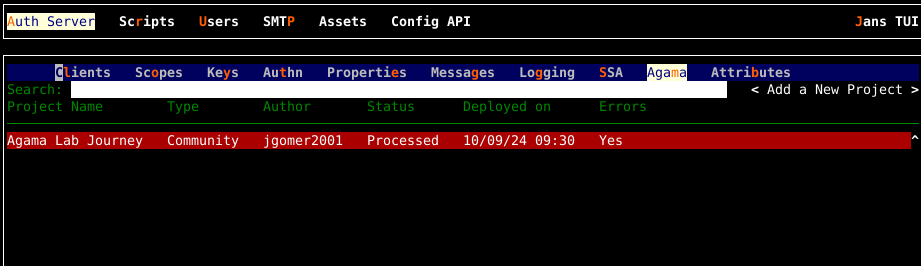

---
tags:
  - administration
  - configuration
  - agama project
subtitle: Learn how to manage and change Agama project configuration 
---

# Agama project configuration

Agama project configuration involves adding and removing Agama projects to 
Janssen Server along with configuring and troubleshooting these project 
deployments.

The Janssen Server provides multiple configuration tools to perform these
tasks.

=== "Use Command-line"

    Use the command line to perform actions from the terminal. Learn how to 
    use Jans CLI [here](../config-tools/jans-cli/README.md) or jump straight to 
    the [configuration steps](#using-command-line)

=== "Use Text-based UI"

    Use a fully functional text-based user interface from the terminal. 
    Learn how to use Jans Text-based UI (TUI) 
    [here](../config-tools/jans-tui/README.md) or jump straight to the
    [configuration steps](#using-text-based-ui)

=== "Use REST API"

    Use REST API for programmatic access or invoke via tools like CURL or 
    Postman. Learn how to use Janssen Server Config API 
    [here](../config-tools/config-api/README.md) or Jump straight to the
    [configuration steps](#using-configuration-rest-api)


##  Using Command Line

In the Janssen Server, you can deploy and customize the Agama project using the
command line. To get the details of Janssen command line operations relevant to
Agama projects, you can check the operations under `Agama` task using the
command below:

```bash title="Command"
jans cli --info Agama
```

It will show the details of the available operation-ids for Agama.

```text
Operation ID: get-agama-prj-by-name
  Description: Fetches deployed the Agama project based on the name.
  Parameters:
  name: Agama project name [string]
Operation ID: post-agama-prj
  Description: Deploy an Agama project.
  Parameters:
  name: Agama project name [string]
Operation ID: delete-agama-prj
  Description: Delete a deployed Agama project.
  Parameters:
  name: Agama project name [string]
Operation ID: get-agama-prj-configs
  Description: Retrieve the list of configs based on name.
  Parameters:
  name: Agama project name [string]
Operation ID: put-agama-prj
  Description: Update an Agama project.
  Parameters:
  name: Agama project name [string]
  Parameters:
    type: Description not found for this property
    additionalProperties: Description not found for this property
Operation ID: get-agama-prj
  Description: Retrieve the list of projects deployed currently.
  Parameters:
  start: No description is provided for this parameter [integer]
  count: No description is provided for this parameter [integer]
```

In the sections below, we will see how to configure and manage Agama
projects via the command line using the above operations.

### List Deployed Projects

Use the `get-agama-prj` operation to retrieve the list of deployed Agama
projects:

```bash title="Command"
jans cli --operation-id get-agama-prj
```

The output will list Agama projects that are added to this Janssen Server
deployment.

```json title="Sample Output" linenums="1"
{
  "start": 0,
  "totalEntriesCount": 1,
  "entriesCount": 1,
  "entries": [
    {
      "dn": "jansId=46546e9a-fed6-34d0-ba63-b615233b2115,ou=deployments,ou=agama,o=jans",
      "id": "46546e9a-fed6-34d0-ba63-b615233b2115",
      "createdAt": "2023-08-13T14:45:27",
      "taskActive": false,
      "finishedAt": "2023-08-13T14:45:43",
      "details": {
        "error": "There were problems processing one or more flows",
        "flowsError": {
          "mmrraju.np.test.me": null,
          "mmrraju.test2.agama": null,
          "mmrraju.u2f.me": "Syntax error: mismatched input '<EOF>' expecting {'|', 'Log', 'Trigger', 'Call', 'RRF', 'When', 'Repeat', 'Iterate over', 'Match', 'Finish', 'RFAC', ALPHANUM, QNAME, DOTEXPR, DOTIDXEXPR, WS}\nSymbol: [@9,43:42='<EOF>',<-1>,2:23]\nLine: 2\nColumn: 24"
        },
        "projectMetadata": {
          "projectName": "user_pass_auth",
          "author": "mmrraju",
          "type": "community",
          "description": "This is password based authentication",
          "version": "1.0.34",
          "configs": null
        }
      },
      "baseDn": "jansId=46546e9a-fed6-34d0-ba63-b615233b2115,ou=deployments,ou=agama,o=jans"
    }
  ]
}
```

#### Endpoint Arguments

Endpoint arguments are parameters passed to an API or function to specify
how and what data to retrieve or process.

There are two endpoint arguments available to the `get-agama-prj` operation.

- `start`: Should be an integer value. It's an index value of the starting point 
  of the list.

- `count`: Should be an integer value. Total entries number you want to display.

For example, to fetch details of the project at index 1 only, use the command
below.

```bash title="Command"
jans cli --operation-id get-agama-prj --endpoint-args start:1,count:1
```

```json title="Sample Output" linenums="1"
{
  "start": 1,
  "totalEntriesCount": 3,
  "entriesCount": 1,
  "entries": [
    {
      "dn": "jansId=3a0e91a4-b79b-37c2-9df7-122247e8ed9c,ou=deployments,ou=agama,o=jans",
      "id": "3a0e91a4-b79b-37c2-9df7-122247e8ed9c",
      "createdAt": "2023-08-15T05:56:19",
      "taskActive": false,
      "finishedAt": "2023-08-15T05:56:42",
      "details": {
        "error": "Archive missing web and/or code subdirectories",
        "flowsError": null,
        "projectMetadata": {
          "projectName": "testAuth",
          "configs": null
        }
      },
      "baseDn": "jansId=3a0e91a4-b79b-37c2-9df7-122247e8ed9c,ou=deployments,ou=agama,o=jans"
    }
  ]
}

```

### View Agama Project By Name

You can get the details of an Agama project deployed in the Janssen Server
by the project name. The command line for this operation is as below:

```bash title="Sample Command"
jans cli --operation-id get-agama-prj-by-name --url-suffix="agama-project-name"
```

**Example:**
```bash title="Sample Command"
jans cli --operation-id get-agama-prj-by-name --url-suffix="testAuth"
```

```json title="Sample Output" linenums="1"
{
  "dn": "jansId=3a0e91a4-b79b-37c2-9df7-122247e8ed9c,ou=deployments,ou=agama,o=jans",
  "id": "3a0e91a4-b79b-37c2-9df7-122247e8ed9c",
  "createdAt": 1687247278717,
  "taskActive": false,
  "finishedAt": 1687247288646,
  "assets": null,
  "details": {
    "folders": null,
    "libs": [],
    "flowsError": {
      "imShakil.co.basicAuth": null
    },
    "error": null,
    "projectMetadata": {
      "projectName": "testAuth",
      "author": "imShakil",
      "type": "community",
      "description": "testing authentication with janssen server",
      "version": "1.0.0",
      "configs": null
    }
  },
  "baseDn": "jansId=3a0e91a4-b79b-37c2-9df7-122247e8ed9c,ou=deployments,ou=agama,o=jans"
}
```

### Post Agama Project in Janssen

You can deploy the Agama project in the Janssen Server through the command line
using the `post-agama-prj` operation. Here the `agama-project-file` is an
archive file that holds the bundled Agama project and follows the
[.gama](../../../agama/gama-format.md) specification.

```bash title="Sample Command"
jans cli --operation-id post-agama-prj \
--url-suffix="name:project-name" --data agama-project-file
```

**Example:**

Let's upload [a test project](../../../assets/agama/journey.zip) Zip file.
This zip file contains the artifacts of an Agama project and follows the `.gama`
specification.
Assuming that the zip file has been downloaded in the folder at
path `/tmp/journey.zip`, the command below will upload a new Agama project with
specified name in the Janssen Server.

```bash title="Sample Command"
jans cli --operation-id=post-agama-prj \
--url-suffix="name:Agama Lab Journey" --data /tmp/journey.zip
```

```json title="Sample Output" 
{
  "message": "A deployment task for project Agama Lab Journey has been queued. Use the GET endpoint to poll status"
}
```

Now the project should be available in the
[list of deployed projects](#list-deployed-projects).

### Retrieve Agama Project Configuration

To retrieve the Agama project configuration, use the `get-agama-prj-configs`
operation.

```bash title="Sample Command"
jans cli --operation-id get-agama-prj-configs \
--url-suffix="name:agama-project-name"
```

### Update Agama Project

Let's update the configuration for project that we uploaded in
[the section above](#post-agama-project-in-janssen):

Take the
[sample project configuration](../../../assets/agama/journey-configs.json) and
keep it under `/tmp/journey-configs.json`.

Make a few test changes to the configuration and run the command below to
update the configuration:

```bash title="Command"
jans cli --operation-id=put-agama-prj \
--url-suffix "name:Agama Lab Journey" --data /tmp/journey-configs.json 
```

```json title="Sample Output" linenums="1"
{
  "io.jans.agamaLab.registration": true,
  "io.jans.agamaLab.main": true,
  "io.jans.agamaLab.credsEnrollment.otp": true,
  "io.jans.agamaLab.authenticator.super_gluu": true,
  "io.jans.agamaLab.credsEnrollment.super_gluu": true,
  "io.jans.agamaLab.githubAuthn": true
}
```


### Delete Agama Project

To delete an Agama project by its name, use the `delete-agama-prj` operation.

```bash title="Sample Command"
jans cli --operation-id delete-agama-prj --url-suffix="agama-project-name"
```

### Agama Flow Configuration

`AgamaConfiguration` task groups operations that help understand the correctness
of the deployed Agama project configuration.

```bash title="Command"
jans cli --info AgamaConfiguration
```

```text title="Sample Output" linenums="1"
Operation ID: agama-syntax-check
  Description: Determine if the text passed is valid Agama code
  Parameters:
  qname: Agama Flow name [string]
```

#### Agama Flow DSL Syntax

To check if a deployed Agama project is running into Agama
DSL related errors, use the `agama-syntax-check` operation as below:

```bash title="Sample Command"
jans cli --operation-id agama-syntax-check \
--url-suffix qname:"fully-qualified-flow-name"
```

***Example***:

```bash title="Command"
jans cli --operation-id agama-syntax-check --url-suffix qname:"imShakil.co.test"
```

```json title="Sample Output" linenums="1"
{
  "error": "mismatched input 'newline' expecting 'Flow'",
  "symbol": "[@0,0:-1='newline',<9>,1:0]",
  "line": 1,
  "column": 0,
  "message": "Syntax error: mismatched input 'newline' expecting 'Flow'\nSymbol: [@0,0:-1='newline',<9>,1:0]\nLine: 1\nColumn: 1"
}
```

##  Using Text-based UI

In Janssen, You can deploy and customize an Agama project using
the [Text-Based UI](../config-tools/jans-tui/README.md) also.

You can start TUI using the command below:

```bash title="Command"
jans tui
```

### Agama Project Screen

Navigate to `Auth Server` -> `Agama` to open the Agama projects screen as shown 
in the image below.



* To get the list of currently added projects, bring the control to `Search` box
  (using the tab key), and press `Enter`. Type the search string to search for
  projects with matching names.

* Add a new project using `Add a New Project` button. It will open a dialogue where
  you can either deploy a local project or deploy an Agama Lab community project
  as shown in the image below.

  

  1. If you select the first option, it'll open the explore
    dialogue. Using this dialogue, navigate the file system and select
    the `.gama` archive for the new project.

  2. If you select the second option, it'ill collect a list of Agama Lab
    community projects from GitHub and display a selection list as shown in
    the image below.

    


### Agama Project Help Menu

TUI provides key-press commands to open various dialogues that help manage and
configure Agama projects. All the key-press commands are listed in the help menu.
Press `F1` to bring up the help menu as shown in the screen below.


### Agama Project Detail Screen

Use the appropriate key-press command from [help screen](#agama-project-help-menu)
to bring up the project detail screen which is shown in the image below.


The project details screen shows important details about the Agama project.
In case the project deployment is facing an error, this screen also shows
these errors and the corresponding flows.

All the flows in the project are also listed by their fully qualified names.
Fully qualified names are useful when invoking flows.

The project details screen also shows the JSON configuration by navigating to and
pressing the `View Configuration` button.


### Agama Project Configuration Screen

Use the appropriate key-press command from [help screen](#agama-project-help-menu)
to bring up the Agama project configuration screen which is shown in the image 
below.

* The screen allows the export and import of the configuration.
* The sample configuration can serve as a template. Export it into a file, then
  make the necessary changes to it and import it back to correctly
  configure the project.


## Using Configuration REST API

Janssen Server Configuration REST API exposes relevant endpoints for managing
and configuring Agama projects. Endpoint details are published in the [Swagger
document](./../../reference/openapi.md).
