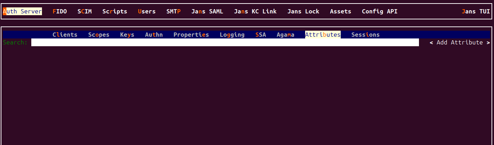
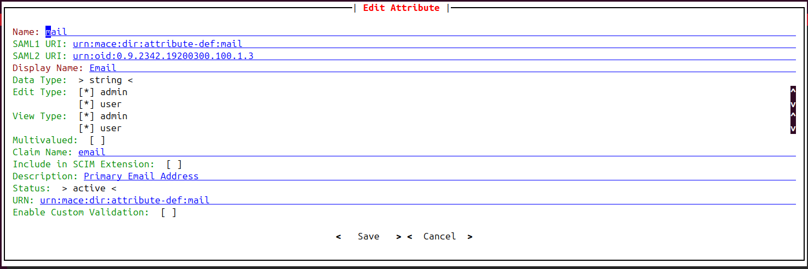

---
tags:
  - administration
  - configuration
  - attributes
  - custom user claims
---

!!! Note
    `Attribute` and `User Claims` refer to the same user data fields in 
    the Janssen Server.


# Attribute

User claims are individual pieces of user data, like `uid` or `email`, that are required 
by applications in order to identify a user and grant access to protect resources. 

Janssen server's default configuration comes with certain user claims already configured. In addition to these, custom user claims can be added as required. The Janssen Server provides multiple configuration tools to perform these tasks.


=== "Use Command-line"

    Use the command line to perform actions from the terminal. Learn how to 
    use Jans CLI [here](../config-tools/jans-cli/README.md) or jump straight to 
    the [Using Command Line](#using-command-line)
  
=== "Use Text-based UI"

    Use a fully functional text-based user interface from the terminal. 
    Learn how to use Jans Text-based UI (TUI) [here](../config-tools/jans-tui/README.md) or jump straight to the
    [Using Text-based UI](#using-text-based-ui)

=== "Use REST API"

    Use REST API for programmatic access or invoke via tools like CURL or 
    Postman. Learn how to use Janssen Server Config API  [here](../config-tools/config-api/README.md) 
    or Jump straight to the [Using Configuration REST API](#using-configuration-rest-api)


##  Using Command Line


To get the details of Janssen command line operations relevant to user claims configuration, you can check the operations under `Attribute` task using 
the command below:


First thing, let's get the information for `Attribute`:
```shell title="Command"
jans cli --info Attribute
```
In return, we get a list of operations IDs as below:

```text title="Sample Output" linenums="1"
Operation ID: get-attributes
  Description: Gets a list of Gluu attributes.
  Parameters:
  limit: Search size - max size of the results to return [integer]
  pattern: Search pattern [string]
  status: Status of the attribute [string]
  startIndex: The 1-based index of the first query result [integer]
  sortBy: Attribute whose value will be used to order the returned response [string]
  sortOrder: Order in which the sortBy param is applied. Allowed values are "ascending" and "descending" [string]
  fieldValuePair: Field and value pair for seraching [string]
Operation ID: put-attributes
  Description: Updates an existing attribute
  Schema: JansAttribute
Operation ID: post-attributes
  Description: Adds a new attribute
  Schema: JansAttribute
Operation ID: get-attributes-by-inum
  Description: Gets an attribute based on inum
  Parameters:
  inum: Attribute Id [string]
Operation ID: delete-attributes-by-inum
  Description: Deletes an attribute based on inum
  Parameters:
  inum: Attribute Id [string]
Operation ID: patch-attributes-by-inum
  Description: Partially modify a JansAttribute
  Parameters:
  inum: Attribute Id [string]
  Schema: Array of PatchRequest

To get sample schema type jans cli --schema <schma>, for example jans cli --schema PatchRequest
```


### Get Custom User Claims


The user claims 
that the available in your Janssen Server can be found by using this operation-ID. If we look at 
the description below:

```text
Operation ID: get-attributes
  Description: Gets a list of Gluu attributes.
  Parameters:
  limit: Search size - max size of the results to return [integer]
  pattern: Search pattern [string]
  status: Status of the attribute [string]
  startIndex: The 1-based index of the first query result [integer]
  sortBy: Attribute whose value will be used to order the returned response [string]
  sortOrder: Order in which the sortBy param is applied. Allowed values are "ascending" and "descending" [string]
  fieldValuePair: Field and value pair for seraching [string]
```

To get all the user claims without any arguments, run the following command:
```bash title="Command"
jans cli --operation-id get-attributes
```

To get user claims with passing the arguments, let's retrieve randomly limit:1:

```bash title="Command"
jans cli --operation-id get-attributes --endpoint-args limit:1
```

It will return only one user claim details randomly:
```json title="Sample Output" linenums="1"
{
  "start": 0,
  "totalEntriesCount": 72,
  "entriesCount": 1,
  "entries": [
    {
      "dn": "inum=002A,ou=attributes,o=jans",
      "selected": false,
      "inum": "002A",
      "name": "eduPersonScopedAffiliation",
      "displayName": "eduPersonScopedAffiliation",
      "description": "Specifies the person's affiliation within a particular security domainin broad categories such as student, faculty, staff, alum, etc. Thevalues consistof a left and right component separated by an \"@\" sign. The left component is one ofthe values from the eduPersonAffiliation controlledvocabulary.This right-hand side syntaxof eduPersonScopedAffiliation intentionally matches that used for the right-hand sidevalues for eduPersonPrincipalName since both identify a security domain. Multiple \"@\" signsare not recommended, but in any case, the first occurrence of the \"@\" sign starting from theleft is to be taken as the delimiter between components. Thus, user identifier is to the left,security domain to the right of the first \"@\".",
      "origin": "eduPerson",
      "dataType": "string",
      "editType": [
        "admin"
      ],
      "viewType": [
        "admin"
      ],
      "claimName": "edu_person_scoped_affiliation",
      "status": "inactive",
      "saml1Uri": "urn:mace:dir:attribute-def:eduPersonScopedAffiliation",
      "saml2Uri": "urn:oid:1.3.6.1.4.1.5923.1.1.1.9",
      "urn": "oid:1.3.6.1.4.1.5923.1.1.1.9",
      "oxMultiValuedAttribute": false,
      "custom": false,
      "adminCanView": true,
      "adminCanEdit": true,
      "userCanView": false,
      "userCanEdit": false,
      "adminCanAccess": true,
      "userCanAccess": false,
      "whitePagesCanView": false,
      "baseDn": "inum=002A,ou=attributes,o=jans"
    }
  ]
}
```

To get user claim with `pattern & status`:

```bash title="Command"
jans cli --operation-id get-attributes \
--endpoint-args limit:3,pattern:profile,status:ACTIVE
```
In return, we get a list of claims that are matched with the given `pattern` and `status`:

```json title="Sample Output" linenums="1"
{
  "start": 0,
  "totalEntriesCount": 2,
  "entriesCount": 2,
  "entries": [
    {
      "dn": "inum=64A0,ou=attributes,o=jans",
      "selected": false,
      "inum": "64A0",
      "name": "profile",
      "displayName": "Profile URL",
      "description": "URL of the End-User's profile page. The contents of this Web page SHOULD be about the End-User.",
      "origin": "jansPerson",
      "dataType": "string",
      "editType": [
        "user",
        "admin"
      ],
      "viewType": [
        "user",
        "admin"
      ],
      "claimName": "profile",
      "status": "active",
      "saml1Uri": "urn:mace:dir:attribute-def:profile",
      "saml2Uri": "urn:oid:1.3.6.1.4.1.48710.1.3.321",
      "urn": "http://openid.net/specs/openid-connect-core-1_0.html/StandardClaims/profile",
      "oxMultiValuedAttribute": false,
      "custom": false,
      "adminCanView": true,
      "adminCanEdit": true,
      "userCanView": true,
      "userCanEdit": true,
      "adminCanAccess": true,
      "userCanAccess": true,
      "whitePagesCanView": false,
      "baseDn": "inum=64A0,ou=attributes,o=jans"
    },
    {
      "dn": "inum=EC3A,ou=attributes,o=jans",
      "selected": false,
      "inum": "EC3A",
      "name": "picture",
      "displayName": "Picture URL",
      "description": "URL of the End-User's profile picture",
      "origin": "jansPerson",
      "dataType": "string",
      "editType": [
        "user",
        "admin"
      ],
      "viewType": [
        "user",
        "admin"
      ],
      "claimName": "picture",
      "status": "active",
      "saml1Uri": "urn:mace:dir:attribute-def:picture",
      "saml2Uri": "urn:oid:1.3.6.1.4.1.48710.1.3.322",
      "urn": "http://openid.net/specs/openid-connect-core-1_0.html/StandardClaims/picture",
      "oxMultiValuedAttribute": false,
      "custom": false,
      "adminCanView": true,
      "adminCanEdit": true,
      "userCanView": true,
      "userCanEdit": true,
      "adminCanAccess": true,
      "userCanAccess": true,
      "whitePagesCanView": false,
      "baseDn": "inum=EC3A,ou=attributes,o=jans"
    }
  ]
}

```

### Creating a Custom User Claims 

While standard claims provide basic user 
information, custom user claims allow for the inclusion of domain-specific attributes or 
application-specific data that might be required for user personalization, authorization, 
or other business logic. A user claim should be unique and non-null or empty. Follow the steps below to add a custom user claim to the Janssen Server.

#### Add entry into persistence

In order to support the new custom claim, add a column to table `jansPerson` in the persistence backend. 

Command will be similar to the one below:

```sql title="MySQL"
ALTER TABLE  jansPerson  ADD COLUMN <claimName> <dataType>
```

[Restart](https://docs.jans.io/vreplace-janssen-version/janssen-server/vm-ops/jans-command/#restart) the Janssen services below in order to make this change effective:

```
jans-auth.service
```

```
jans-config-api.service
```

#### Configure custom user claim in the Janssen Server

Add and configure the custom claim using `post-attributes` operation-ID. As shown in the [output](#using-command-line) 
for the `--info` command, the `post-attributes` operation requires data to be sent 
according to the `JansAttribute` schema. 

To see the schema, use the command below:

```bash title="Command"
jans cli --schema JansAttribute
```

The Janssen Server also provides an example of data that adheres to the above schema. 
To fetch the example, use the command below.

```bash title="Command"
jans cli --schema-sample JansAttribute
```

Using the schema and the example above, add the below data to the file /tmp/custom-claim.json.

??? note "About datatypes"

    `JansAttribute` schema requires to specify a datatype. This datatype should map
    correctly to the datatype of the persistence column added above. 

    Use the mapping table to below to correctly specify the datatype in the 
    Janssen Server configuration. 

    |Janssen dataType|SQL dataType|
    |---|---|
    |Text|VARCHAR() string value to be kept, SIZE is an integer for max string size|
    |Numeric|INT|
    |Boolean|SMALLINT|
    |Binary|BINARY|
    |Certificate|TEXT|
    |Date|DATETIME(3)|
    |Numeric|INT|
    |Multivalued|JSON|


Example:

```json title="Input" linenums="1"  
{
  "dn": "string",
  "inum": "string",
  "sourceAttribute": "string",
  "nameIdType": "string",
  "name": "newClaim",
  "displayName": "New Claim",
  "description": "string",
  "origin": "string",
  "dataType": "json",
  "editType": [
    "whitePages"
  ],
  "viewType": [
    "user"
  ],
  "usageType": [
    "openid"
  ],
  "claimName": "string",
  "seeAlso": "string",
  "status": "active",
  "saml1Uri": "string",
  "saml2Uri": "string",
  "urn": "string",
  "scimCustomAttr": false,
  "oxMultiValuedAttribute": false,
  "jansHideOnDiscovery": false,
  "custom": true,
  "attributeValidation": {
    "minLength": 85,
    "maxLength": 20,
    "regexp": "string"
  },
  "tooltip": "string",
  "selected": true,
  "adminCanView": true,
  "adminCanEdit": false,
  "userCanView": true,
  "userCanEdit": true,
  "userCanAccess": false,
  "adminCanAccess": true,
  "whitePagesCanView": true,
  "baseDn": "string"
}

```

Run the following command to add the custom claim:

```bash title="Command"
jans cli --operation-id post-attributes --data /tmp/custom-claim.json
```

```json title="Sample Output" linenums="1"
{
  "dn": "inum=bc50c4c4-64c8-45b3-9f38-e8527ddbf833,ou=attributes,o=jans",
  "selected": false,
  "inum": "bc50c4c4-64c8-45b3-9f38-e8527ddbf833",
  "sourceAttribute": "string",
  "nameIdType": "string",
  "name": "newClaim",
  "displayName": "New Claim",
  "description": "string",
  "origin": "string",
  "dataType": "json",
  "editType": [
    "whitePages"
  ],
  "viewType": [
    "user"
  ],
  "usageType": [
    null
  ],
  "claimName": "string",
  "seeAlso": "string",
  "status": "active",
  "saml1Uri": "string",
  "saml2Uri": "string",
  "urn": "string",
  "scimCustomAttr": false,
  "oxMultiValuedAttribute": false,
  "jansHideOnDiscovery": false,
  "custom": false,
  "attributeValidation": {
    "minLength": 85,
    "maxLength": 20,
    "regexp": "string"
  },
  "tooltip": "string",
  "adminCanView": false,
  "adminCanEdit": false,
  "userCanView": true,
  "userCanEdit": false,
  "adminCanAccess": false,
  "userCanAccess": true,
  "whitePagesCanView": false,
  "baseDn": "inum=bc50c4c4-64c8-45b3-9f38-e8527ddbf833,ou=attributes,o=jans"
}

```

## Updating a User Claim

To update the configuration, follow the steps below.

1. Get the [user claim](#get-attribute-by-inum) and store it into a file for editing. 
The following command will retrieve the existing user claim in the required schema file.
  ```bash title="command"
   jans cli -no-color --operation-id get-attributes-by-inum \
   --url-suffix inum:bc50c4c4-64c8-45b3-9f38-e8527ddbf833  \
   > /tmp/update-claim.json
  ```
2. Update values as desired. Updates must adhere to the `JansAttribute` schema as mentioned [here](#using-command-line).
3. Use the updated file to send the update to the Janssen Server using the command below.
```bash title="Command"
jans cli --operation-id put-attributes --data /tmp/update-claim.json
```
Upon successful execution of the update, the Janssen Server responds with updated configuration.

## Get User Claim by `inum`

With the `get-attributes-by-inum` operation-id, we can get any specific user claim matched with `Inum`. If we know the `inum`, we can use the below command:

```bash title="Command"
jans cli --operation-id get-attributes-by-inum \
--url-suffix inum:bc50c4c4-64c8-45b3-9f38-e8527ddbf833
```
## Delete Custom Claim

Delete a user claim using its `inum`. 

```bash title="Command"
jans cli --operation-id delete-attributes-by-inum --url-suffix inum:EC3A 
```

## Patch Custom Claim

Using `operation-id patch-attributes-by-inum`, we can modify a custom user claim partially for its properties.


To use this operation, specify the `inum` of the claim that needs to be updated using the `--url-suffix` and the property and the new value using the [JSON Patch](https://jsonpatch.com/#the-patch). Refer [here](../../config-guide/config-tools/jans-cli/README.md#patch-request-schema) to know more about schema.

In this example, we will add the `jansHideOnDiscovery` and its value is `true`.

```json title="Input"
[
  {
    "op": "add",
    "path": "jansHideOnDiscovery",
    "value": true
  }
]

```

Now let's do the operation with the command line.

```bash title="Command"
jans cli --operation-id patch-attributes-by-inum \
--url-suffix inum:bc50c4c4-64c8-45b3-9f38-e8527ddbf833 \
--data /tmp/patch.json
```


## Using Text Based UI

Start TUI using the command below:

```bash title="Command"
jans tui
```


### Attribute/User Claims Screen

Navigate to `Auth Server` -> `Attributes` to open the client screen as shown
in the image below.



To get the list of currently added user claims, bring the control to the `Search` 
box (using the tab key), and press the `Enter` key. Type the search string to search 
for the user claim with the matching claim name.


### Add-Update Attribute/User Claims screen

* [Add a new column](#add-entry-into-persistence) in the persistence
* Use the `Add Attributes` button to create a new user claim.
* After adding the valid data using the `Save` button, add a new user claim.
* Update the user claim as well.
* To update the user claim, bring the control to the specific `User Claim` row and press the 
Enter key, then it will show the edit screen. 

!!!warning 
    If the attribute is `Multivalued` enabled in TUI, datatype should be JSON.



Close and reopen the TUI. The new custom user claim can now be added to any user 
from [user management](../../usermgmt/usermgmt-cli-tui.md).


### Delete Screen

* To delete the user claim, bring the control to the specific `Claim` row and press the 
`Delete` key. Then it will show the Delete confirmation box.

  

Close and reopen TUI before proceeding with further configuration.

## Using Configuration REST API

Janssen Server Configuration REST API exposes relevant endpoints for managing
and configuring the user claim. Endpoint details are published in the [Swagger
document](../../reference/openapi.md).