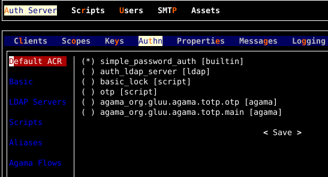

---
tags:
 - administration
 - configuration
 - default authentication
 - ACR
 - authentication method
---

# Authentication Method Configuration

The Janssen Server allows administrators to set and manage the default
authentication method for the authentication server.
The Janssen Server provides multiple configuration tools to perform these tasks.

!!! Note
    Only one of the available authentication methods can be set as the default.
    While setting the Default authentication method, the Janssen Server 
    checks if the same authentication is available and active.
    
 See 
 [script documentation](../custom-scripts-config.md#update-an-existing-custom-script) 
 to know how to enable/disable authentication methods using custom scripts.


 If the script is not active then the following error notification is 
 returned by API.
 ```{
 "code": "400",
 "message": "INVALID_ACR",
 "description": "Authentication script {acr} is not active"
 }
 ```

 Also, to understand how Janssen Server picks the authentication method *in the absence* of the default authentication method, refer to 
 [ACR documentation](../../auth-server/openid-features/acrs.md)

=== "Use Command-line"

      Use the command line to perform actions from the terminal. Learn how to
      use Jans CLI [here](../config-tools/jans-cli/README.md) or jump straight to
      the [Using Command Line](#using-command-line)

=== "Use Text-based UI"

      Use a fully functional text-based user interface from the terminal.
      Learn how to use Jans Text-based UI (TUI)
      [here](../config-tools/jans-tui/README.md) or jump straight to the
      [Using Text-based UI](#using-text-based-ui)

=== "Use REST API"

      Use REST API for programmatic access or invoke via tools like CURL or 
      Postman. Learn how to use Janssen Server Config API 
      [here](../config-tools/config-api/README.md) or Jump straight to the
      [Using Configuration REST API](#using-configuration-rest-api)

##  Using Command Line

Operations to manage the default authentication method are grouped under the
`DefaultAuthenticationMethod` task. To get information about those operations
use the command below.

```bash title="Command"
jans cli --info DefaultAuthenticationMethod
```
```text title="Output"
Operation ID: get-acrs
 Description: Gets default authentication method.
Operation ID: put-acrs
 Description: Updates default authentication method.
 Schema: AuthenticationMethod

To get sample schema type jans cli --schema <schma>, for example jans cli --schema /components/schemas/AuthenticationMethod
```

### Find Current Authentication Method

To get the current default authentication method use the command below.
```bash title="Command"
jans cli --operation-id get-acrs
```
```json title="Sample Output"
{
  "defaultAcr": "simple_password_auth"
}
```

### Update Default Authentication Method

Let's update the _Default Authentication Method_ using the Janssen CLI command line.
To perform the _put-acrs_ operation, we have to use its schema.
To get its schema:

```bash title="Command"
jans cli --schema AuthenticationMethod > /tmp/patch-default-auth.json
```
The schema can now be found in the patch-default-auth.json file.

For your information, you can obtain the format of the `AuthenticationMethod`
schema by running the aforementioned command without a file.

```text title="Schema Format"
defaultAcr   string
```
you can also use the following command for `AuthenticationMethod` schema example.

```bash title="Command"
jans cli --schema-sample AuthenticationMethod
```
```json title="Schema Example"
{
"defaultAcr": "string"
}
```

We need to modify the patch-default-auth.json file.
We have seen that our default authentication method is `simple_password_auth`.
We are going to update it with `passport_saml` authentication method.

```json title="input"
{
  "defaultAcr": "passport_saml"
}

```

Now let's trigger the operation using the above file.

```bash title="Command"
jans cli --operation-id put-acrs --data /tmp/patch-default-auth.json
```

It will show the updated result.

```json title="Sample Output"
{
  "defaultAcr": "passport_saml"
}
```

##  Using Text-based UI

In Janssen, You can manage the default authentication method using
the [Text-Based UI](../config-tools/jans-tui/README.md) also.

You can start TUI using the command below:

```bash title="Command"
jans tui
```

### Find Current Default Authentication Method

Navigate to `Auth Server` -> `Authn` to open the `Authn` screen as shown
in the image below. In **Default ACR** sub-tab, available authentication 
methods are listed
as radio buttons.



To update the default authentication method, bring the tab focus to the 
authentication method,
and navigate to the new default method with **Up** and **Down** keys. 
To choose hit **Space** key.
Navigate to **Save** button and hit **Enter** key


### Basic Authentication Method

This tab displays the basic, builtin, authentication method as shown in the image below.


You can set basic as the default authentication method by selecting 
**Default Authn Method**,
navigate to **Save** button and hit **Enter** key

### LDAP Servers As Authentication Method

In this tab you can add and modify LDAP Servers are to be used as the
default authentication method. See below image


To add a new LDAP server, navigate to **Add Source LDAP Server** button and 
hit **Enter**. A popup screen will
be displayed as shown in the image below.


Fill in the fields provided in the popup. Before saving LDAP server, it is 
recommended to test it by navigating 
**Test** button and hitting **Enter**. If the test is successful, chose 
**Save** button and hit **Enter**. If you want the current edited LDAP server 
as the default authentication method, select **Default Authn Method** before 
saving.

### Authentication Methods Enabled By Scripts

All enabled **Person Authentication** scripts are listed in this tab as below


To edit **Level** and/or **Properties** of the authentication script, 
navigate to the script in the list by hitting **tab** key
and hit **Enter**. You will see a popup like in the image below


If the script you want to use as the default authentication method is not in 
the list, you should enable the script by
navigating **Scripts** in the main tab. Find the script you want to 
enable and hit **Enter**, you will get a popup where
you can select **Enabled** checkbox and **Save** it as shown in the image below:


### Configure Aliases For Authencation Methods

Authentication aliases are listed in this tab. You can modify aliases by navigating to the list and hitting **Enter**.
If you want to add a new alias, choose **Add Alias** button and hit **Enter**

### Authentication Methods Enabled by Agama Flows

If you deployed an Agama project, ACR values for the project are displayed in this tab as shown below:


## Using Configuration REST API

Janssen Server Configuration REST API exposes relevant endpoints for managing
and configuring the Default Authentication Method. Endpoint details are published
in the [Swagger document](./../../reference/openapi.md).

