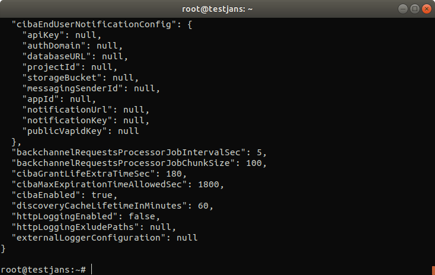

---
tags:
  - administration
  - configuration
  - jans-auth-server
---

# Janssen Authorization Server

> Prerequisite: Know how to use the Janssen CLI in [command-line mode](../config-tools/jans-cli/README.md)

To get info about Jans Authorization Server operations:

```text
jans cli --info ConfigurationProperties


Operation ID: get-properties
  Description: Gets all Jans authorization server configuration properties.
Operation ID: patch-properties
  Description: Partially modifies Jans authorization server AppConfiguration properties.
  Schema: Array of JsonPatch
Operation ID: get-properties-persistence
  Description: Returns persistence type configured for Jans authorization server.

To get sample schema type jans cli --schema <schma>, for example jans cli --schema JsonPatch
```

Jans Authorization server has two operations `id` to `get/modify` its properties.

Table of Contents
=================

- [Janssen Authorization Server](#janssen-authorization-server)
- [Table of Contents](#table-of-contents)
  - [Get All Jans Auth Server Configuration Properties](#get-all-jans-auth-server-configuration-properties)
  - [Partially Modify Jans Auth Server Configuration Properties](#partially-modify-jans-auth-server-configuration-properties)
  - [Get Persistence type for Jans Auth](#get-persistence-type-for-jans-auth-configuration)


## Get All Jans Auth Server Configuration Properties

It returns all the information of the Jans Authorization server.

```text
 jans cli --operation-id get-properties
 ```
 
 You will get output like below
```json
{
  "issuer": "https://example.jans.io",
  "baseEndpoint": "https://example.jans.io/jans-auth/restv1",
  "authorizationEndpoint": "https://example.jans.io/jans-auth/restv1/authorize",
  "authorizationChallengeEndpoint":"https://example.jans.io/jans-auth/restv1/authorize-challenge",
  "tokenEndpoint": "https://example.jans.io/jans-auth/restv1/token",
  "tokenRevocationEndpoint": "https://example.jans.io/jans-auth/restv1/revoke",
  "userInfoEndpoint": "https://example.jans.io/jans-auth/restv1/userinfo",
  "clientInfoEndpoint": "https://example.jans.io/jans-auth/restv1/clientinfo",
  "checkSessionIFrame": "https://example.jans.io/jans-auth/opiframe.htm",
  "endSessionEndpoint": "https://example.jans.io/jans-auth/restv1/end_session",
  "jwksUri": "https://example.jans.io/jans-auth/restv1/jwks",
  "registrationEndpoint": "https://example.jans.io/jans-auth/restv1/register",
  "openIdDiscoveryEndpoint": "https://example.jans.io/.well-known/webfinger",
  "openIdConfigurationEndpoint": "https://example.jans.io/.well-known/openid-configuration",
  "idGenerationEndpoint": "https://example.jans.io/jans-auth/restv1/id",
  "introspectionEndpoint": "https://example.jans.io/jans-auth/restv1/introspection",
  "parEndpoint": "https://example.jans.io/jans-auth/restv1/par",
  "requirePar": false,
  "deviceAuthzEndpoint": "https://example.jans.io/jans-auth/restv1/device_authorization",
  "requireRequestObjectEncryption": false,
  "requirePkce": false,
  "allowAllValueForRevokeEndpoint": false,
  "sectorIdentifierCacheLifetimeInMinutes": 1440,
  "umaConfigurationEndpoint": "https://example.jans.io/jans-auth/restv1/uma2-configuration",
  "umaRptAsJwt": false,
  "umaRptLifetime": 3600,
  "umaTicketLifetime": 3600,
  "umaPctLifetime": 1728000,
  "umaResourceLifetime": 1728000,
  "umaAddScopesAutomatically": true,
  "umaValidateClaimToken": false,
  "umaGrantAccessIfNoPolicies": false,
  "umaRestrictResourceToAssociatedClient": false,
  "statTimerIntervalInSeconds": 0,
  "statAuthorizationScope": "jans_stat",
  "allowSpontaneousScopes": false,
  "spontaneousScopeLifetime": 86400,
  "openidSubAttribute": "inum",
  "publicSubjectIdentifierPerClientEnabled": true,
  "subjectIdentifiersPerClientSupported": [
    "mail",
    "uid"
  ],
  "responseTypesSupported": [
    [
      "code",
      "id_token"
    ],
    [
      "code",
      "token"
    ],
    [
      "code"
    ],
    [
      "token",
      "id_token"
    ],
    [
      "token"
    ],
    [
      "code",
      "token",
      "id_token"
    ],
    [
      "id_token"
    ]
  ],
  "responseModesSupported": [
    "form_post.jwt",
    "form_post",
    "fragment",
    "query.jwt",
    "fragment.jwt",
    "jwt",
    "query"
  ],
  "grantTypesSupported": [
    "urn:ietf:params:oauth:grant-type:uma-ticket",
    "implicit",
    "urn:ietf:params:oauth:grant-type:token-exchange",
    "urn:ietf:params:oauth:grant-type:device_code",
    "urn:ietf:params:oauth:grant-type:jwt-bearer",
    "client_credentials",
    "refresh_token",
    "authorization_code",
    "password",
    "tx_token"
  ],
  "subjectTypesSupported": [
    "public",
    "pairwise"
  ],
  "defaultSubjectType": "pairwise",
  "authorizationSigningAlgValuesSupported": [
    "HS256",
    "HS384",
    "HS512",
    "RS256",
    "RS384",
    "RS512",
    "ES256",
    "ES384",
    "ES512",
    "ES512",
    "PS256",
    "PS384",
    "PS512"
  ],
  "authorizationEncryptionAlgValuesSupported": [
    "RSA1_5",
    "RSA-OAEP",
    "A128KW",
    "A256KW"
  ],
  "authorizationEncryptionEncValuesSupported": [
    "A128CBC+HS256",
    "A256CBC+HS512",
    "A128GCM",
    "A256GCM"
  ],
  "userInfoSigningAlgValuesSupported": [
    "HS256",
    "HS384",
    "HS512",
    "RS256",
    "RS384",
    "RS512",
    "ES256",
    "ES384",
    "ES512",
    "ES512",
    "PS256",
    "PS384",
    "PS512"
  ],
  "userInfoEncryptionAlgValuesSupported": [
    "RSA1_5",
    "RSA-OAEP",
    "A128KW",
    "A256KW"
  ],
  "userInfoEncryptionEncValuesSupported": [
    "A128CBC+HS256",
    "A256CBC+HS512",
    "A128GCM",
    "A256GCM"
  ],
  "idTokenSigningAlgValuesSupported": [
    "none",
    "HS256",
    "HS384",
    "HS512",
    "RS256",
    "RS384",
    "RS512",
    "ES256",
    "ES384",
    "ES512",
    "ES512",
    "PS256",
    "PS384",
    "PS512"
  ],
  "idTokenEncryptionAlgValuesSupported": [
    "RSA1_5",
    "RSA-OAEP",
    "A128KW",
    "A256KW"
  ],
  "idTokenEncryptionEncValuesSupported": [
    "A128CBC+HS256",
    "A256CBC+HS512",
    "A128GCM",
    "A256GCM"
  ],
  "accessTokenSigningAlgValuesSupported": [
    "none",
    "HS256",
    "HS384",
    "HS512",
    "RS256",
    "RS384",
    "RS512",
    "ES256",
    "ES384",
    "ES512",
    "ES512",
    "PS256",
    "PS384",
    "PS512"
  ],
  "forceSignedRequestObject": false,
  "requestObjectSigningAlgValuesSupported": [
    "none",
    "HS256",
    "HS384",
    "HS512",
    "RS256",
    "RS384",
    "RS512",
    "ES256",
    "ES384",
    "ES512",
    "ES512",
    "PS256",
    "PS384",
    "PS512"
  ],
  "requestObjectEncryptionAlgValuesSupported": [
    "RSA1_5",
    "RSA-OAEP",
    "A128KW",
    "A256KW"
  ],
  "requestObjectEncryptionEncValuesSupported": [
    "A128CBC+HS256",
    "A256CBC+HS512",
    "A128GCM",
    "A256GCM"
  ],
  "tokenEndpointAuthMethodsSupported": [
    "client_secret_basic",
    "client_secret_post",
    "client_secret_jwt",
    "private_key_jwt",
    "tls_client_auth",
    "self_signed_tls_client_auth"
  ],
  "tokenEndpointAuthSigningAlgValuesSupported": [
    "HS256",
    "HS384",
    "HS512",
    "RS256",
    "RS384",
    "RS512",
    "ES256",
    "ES384",
    "ES512",
    "ES512",
    "PS256",
    "PS384",
    "PS512"
  ],
  "displayValuesSupported": [
    "page",
    "popup"
  ],
  "claimTypesSupported": [
    "normal"
  ],
  "jwksAlgorithmsSupported": [
    "RS256",
    "RS384",
    "RS512",
    "ES256",
    "ES384",
    "ES512",
    "PS256",
    "PS384",
    "PS512",
    "RSA1_5",
    "RSA-OAEP"
  ],
  "serviceDocumentation": "http://jans.org/docs",
  "claimsLocalesSupported": [
    "en"
  ],
  "idTokenTokenBindingCnfValuesSupported": [
    "tbh"
  ],
  "uiLocalesSupported": [
    "en",
    "bg",
    "de",
    "es",
    "fr",
    "it",
    "ru",
    "tr"
  ],
  "claimsParameterSupported": false,
  "requestParameterSupported": true,
  "requestUriParameterSupported": true,
  "requestUriHashVerificationEnabled": false,
  "requireRequestUriRegistration": false,
  "requestUriBlockList": [
    "localhost",
    "127.0.0.1"
  ],
  "opPolicyUri": "https://example.jans.io/opPolicy",
  "opTosUri": "https://example.jans.io/tos",
  "authorizationCodeLifetime": 60,
  "refreshTokenLifetime": 14400,
  "txTokenLifetime": 180,
  "idTokenLifetime": 3600,
  "idTokenFilterClaimsBasedOnAccessToken": false,
  "accessTokenLifetime": 300,
  "cleanServiceInterval": 60,
  "cleanServiceBatchChunkSize": 10000,
  "keyRegenerationEnabled": true,
  "keyRegenerationInterval": 48,
  "defaultSignatureAlgorithm": "RS256",
  "jansOpenIdConnectVersion": "openidconnect-1.0",
  "jansId": "https://example.jans.io/oxid/service/jans/inum",
  "dynamicRegistrationExpirationTime": -1,
  "dynamicRegistrationPersistClientAuthorizations": true,
  "trustedClientEnabled": true,
  "skipAuthorizationForOpenIdScopeAndPairwiseId": false,
  "dynamicRegistrationScopesParamEnabled": true,
  "dynamicRegistrationPasswordGrantTypeEnabled": false,
  "personCustomObjectClassList": [
    "jansCustomPerson",
    "jansPerson"
  ],
  "persistIdToken": false,
  "persistRefreshToken": true,
  "allowPostLogoutRedirectWithoutValidation": false,
  "invalidateSessionCookiesAfterAuthorizationFlow": false,
  "returnClientSecretOnRead": true,
  "rotateClientRegistrationAccessTokenOnUsage": false,
  "rejectJwtWithNoneAlg": true,
  "expirationNotificatorEnabled": false,
  "useNestedJwtDuringEncryption": true,
  "expirationNotificatorMapSizeLimit": 100000,
  "expirationNotificatorIntervalInSeconds": 600,
  "redirectUrisRegexEnabled": true,
  "useHighestLevelScriptIfAcrScriptNotFound": false,
  "authenticationFiltersEnabled": false,
  "clientAuthenticationFiltersEnabled": false,
  "clientRegDefaultToCodeFlowWithRefresh": true,
  "grantTypesAndResponseTypesAutofixEnabled": false,
  "authenticationFilters": [
    {
      "filter": "(&(mail=*{0}*)(inum={1}))",
      "bind": false,
      "baseDn": "ou=people,o=jans"
    },
    {
      "filter": "uid={0}",
      "bind": true,
      "bindPasswordAttribute": "pwd",
      "baseDn": "ou=people,o=jans"
    }
  ],
  "clientAuthenticationFilters": [
    {
      "filter": "myCustomAttr1={0}",
      "baseDn": "ou=clients,o=jans"
    }
  ],
  "corsConfigurationFilters": [
    {
      "filterName": "CorsFilter",
      "corsEnabled": true,
      "corsAllowedOrigins": "*",
      "corsAllowedMethods": "GET,POST,HEAD,OPTIONS",
      "corsAllowedHeaders": "Origin,Authorization,Accept,X-Requested-With,Content-Type,Access-Control-Request-Method,Access-Control-Request-Headers",
      "corsSupportCredentials": true,
      "corsLoggingEnabled": false,
      "corsPreflightMaxAge": 1800,
      "corsRequestDecorate": true
    }
  ],
  "sessionIdUnusedLifetime": 86400,
  "sessionIdUnauthenticatedUnusedLifetime": 7200,
  "sessionIdPersistOnPromptNone": true,
  "sessionIdRequestParameterEnabled": false,
  "changeSessionIdOnAuthentication": true,
  "sessionIdPersistInCache": false,
  "includeSidInResponse": false,
  "disablePromptLogin": false,
  "disablePromptConsent": false,
  "sessionIdLifetime": 86400,
  "sessionIdCookieLifetime": 86400,
  "configurationUpdateInterval": 3600,
  "enableClientGrantTypeUpdate": true,
  "grantTypesSupportedByDynamicRegistration": [
    "urn:ietf:params:oauth:grant-type:uma-ticket",
    "implicit",
    "urn:ietf:params:oauth:grant-type:token-exchange",
    "urn:ietf:params:oauth:grant-type:device_code",
    "client_credentials",
    "refresh_token",
    "authorization_code",
    "tx_token"
  ],
  "metricReporterInterval": 300,
  "metricReporterKeepDataDays": 15,
  "pairwiseIdType": "algorithmic",
  "pairwiseCalculationKey": "9jwJNNXd9mMua666QDhfEKGcR",
  "pairwiseCalculationSalt": "aUn2q1HDtsUXtmTNovNeN1QTk",
  "shareSubjectIdBetweenClientsWithSameSectorId": true,
  "webKeysStorage": "keystore",
  "dnName": "CN=Jans Auth CA Certificates",
  "keyStoreFile": "/etc/certs/jans-auth-keys.pkcs12",
  "keyStoreSecret": "S63ogThoRsEf",
  "keySelectionStrategy": "OLDER",
  "keySignWithSameKeyButDiffAlg": false,
  "introspectionAccessTokenMustHaveUmaProtectionScope": false,
  "introspectionAccessTokenMustHaveIntrospectionScope": false,
  "introspectionSkipAuthorization": false,
  "endSessionWithAccessToken": false,
  "clientWhiteList": [
    "*"
  ],
  "clientBlackList": [
    "*.attacker.com/*"
  ],
  "legacyIdTokenClaims": false,
  "customHeadersWithAuthorizationResponse": true,
  "frontChannelLogoutSessionSupported": true,
  "loggingLevel": "INFO",
  "loggingLayout": "text",
  "updateUserLastLogonTime": false,
  "updateClientAccessTime": false,
  "logClientIdOnClientAuthentication": true,
  "logClientNameOnClientAuthentication": false,
  "disableJdkLogger": true,
  "authorizationRequestCustomAllowedParameters": [
    {
      "paramName": "customParam3",
      "returnInResponse": false
    },
    {
      "paramName": "customParam4",
      "returnInResponse": true
    },
    {
      "paramName": "customParam5",
      "returnInResponse": true
    },
    {
      "paramName": "customParam1",
      "returnInResponse": false
    },
    {
      "paramName": "customParam2",
      "returnInResponse": false
    }
  ],
  "openidScopeBackwardCompatibility": false,
  "disableU2fEndpoint": false,
  "rotateDeviceSecret": false,
  "returnDeviceSecretFromAuthzEndpoint": false,
  "dcrSignatureValidationEnabled": false,
  "dcrAuthorizationWithClientCredentials": false,
  "dcrAuthorizationWithMTLS": false,
  "useLocalCache": true,
  "fapiCompatibility": false,
  "forceIdTokenHintPresence": false,
  "rejectEndSessionIfIdTokenExpired": false,
  "allowEndSessionWithUnmatchedSid": false,
  "forceOfflineAccessScopeToEnableRefreshToken": true,
  "errorReasonEnabled": false,
  "removeRefreshTokensForClientOnLogout": true,
  "skipRefreshTokenDuringRefreshing": false,
  "refreshTokenExtendLifetimeOnRotation": false,
  "checkUserPresenceOnRefreshToken": false,
  "consentGatheringScriptBackwardCompatibility": false,
  "introspectionScriptBackwardCompatibility": false,
  "introspectionResponseScopesBackwardCompatibility": false,
  "softwareStatementValidationType": "script",
  "authenticationProtectionConfiguration": {
    "attemptExpiration": 15,
    "maximumAllowedAttemptsWithoutDelay": 4,
    "delayTime": 2,
    "bruteForceProtectionEnabled": false
  },
  "errorHandlingMethod": "remote",
  "keepAuthenticatorAttributesOnAcrChange": false,
  "deviceAuthzRequestExpiresIn": 1800,
  "deviceAuthzTokenPollInterval": 5,
  "deviceAuthzResponseTypeToProcessAuthz": "code",
  "backchannelRedirectUri": "https://example.jans.io/jans-auth/ciba/home.htm",
  "backchannelAuthenticationEndpoint": "https://example.jans.io/jans-auth/restv1/bc-authorize",
  "backchannelDeviceRegistrationEndpoint": "https://example.jans.io/jans-auth/restv1/bc-deviceRegistration",
  "backchannelTokenDeliveryModesSupported": [
    "poll",
    "ping",
    "push"
  ],
  "backchannelUserCodeParameterSupported": false,
  "backchannelBindingMessagePattern": "^[a-zA-Z0-9]{4,8}$",
  "backchannelAuthenticationResponseExpiresIn": 3600,
  "backchannelAuthenticationResponseInterval": 2,
  "backchannelLoginHintClaims": [
    "inum",
    "uid",
    "mail"
  ],
  "cibaEndUserNotificationConfig": {},
  "backchannelRequestsProcessorJobIntervalSec": 5,
  "backchannelRequestsProcessorJobChunkSize": 100,
  "cibaGrantLifeExtraTimeSec": 180,
  "cibaMaxExpirationTimeAllowedSec": 1800,
  "dpopSigningAlgValuesSupported": [
    "RS256",
    "RS384",
    "RS512",
    "ES256",
    "ES384",
    "ES512",
    "ES512",
    "PS256",
    "PS384",
    "PS512"
  ],
  "dpopTimeframe": 5,
  "dpopJtiCacheTime": 3600,
  "allowIdTokenWithoutImplicitGrantType": false,
  "discoveryCacheLifetimeInMinutes": 60,
  "discoveryDenyKeys": [
    "id_generation_endpoint",
    "auth_level_mapping",
    "scope_to_claims_mapping",
    "op_policy_uri"
  ],
  "httpLoggingEnabled": false,
  "agamaConfiguration": {
    "enabled": false,
    "rootDir": "/opt/jans/jetty/jans-auth/agama",
    "templatesPath": "/ftl",
    "scriptsPath": "/scripts",
    "serializerType": "KRYO",
    "maxItemsLoggedInCollections": 9,
    "pageMismatchErrorPage": "mismatch.ftlh",
    "interruptionErrorPage": "timeout.ftlh",
    "crashErrorPage": "crash.ftlh",
    "finishedFlowPage": "finished.ftlh",
    "bridgeScriptPage": "agama.xhtml",
    "defaultResponseHeaders": {
      "Cache-Control": "max-age=0, no-store"
    }
  },
  "ssaConfiguration": {
    "ssaEndpoint": "https://example.jans.io/jans-auth/restv1/ssa",
    "ssaSigningAlg": "RS256",
    "ssaExpirationInDays": 30
  },
  "blockWebviewAuthorizationEnabled": false,
  "dateFormatterPatterns": {
    "birthdate": "yyyy-MM-dd"
  },
  "httpLoggingResponseBodyContent": false,
  "fapi": false,
  "allResponseTypesSupported": [
    "code",
    "id_token",
    "token"
  ],
  "connectionServiceConfiguration": {
    "maxTotal": 200,
    "maxPerRoute": 50,
    "validateAfterInactivity": 0
  }  
}

```


## Partially Modify Jans Auth Server Configuration Properties

```text
Operation ID: patch-properties
  Description: Partially modifies Jans authorization server AppConfiguration properties.
  Schema: Array of /components/schemas/PatchRequest

To get sample shema type jans cli --schema <schma>, for example jans cli --schema /components/schemas/PatchRequest
```
Let's look at the schema first:

```text
jans cli --schema /components/schemas/PatchRequest > /tmp/patch-jans-auth.json
```

It will create a `.json` file in `/tmp` with schema.

Let's modify this schema:
`nano /tmp/patch-jans-auth.json`


This schema has three properties; `op`, `path` & `value`.
Let's perform a `replace` operation at `cibaEnabled` to change it from `false` to `true`.
So, the `.json` file will look like this:

```text
[
  {
    "op": "replace",
    "path": "cibaEnabled",
    "value": true
  }
]
```

Don't forget to use **square brackets** (`[]`). Otherwise, it won't work.

Now, let's do the operation.

```commandline
jans cli --operation-id patch-properties --data /tmp/patch-jans-auth.json
```

If you run the following command line, you must see that `cibaEnabled` is `true`:



## Get Persistence type for Jans Auth Configuration

You can get the persistence details for jans auth server.
```
jans cli --operation-id get-properties-persistence
```

Default persistence type is `MySQL`.
```
Please wait while retrieving data ...
{
  "persistenceType": "sql"
}
```


