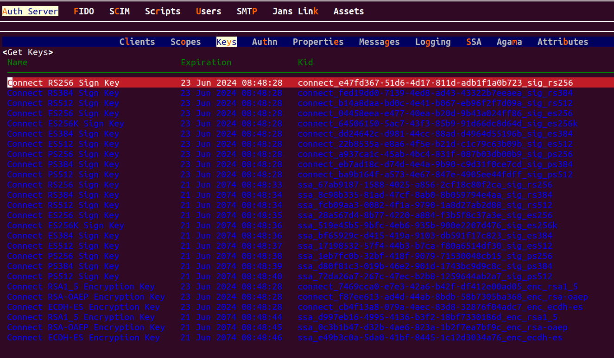

---
tags:
  - administration
  - configuration
  - JWK
  - json web keys
  - JWKS
---

# JSON Web Key (JWK)

The Janssen Server provides multiple configuration tools to perform these
tasks.

=== "Use Command-line"

    Use the command line to perform actions from the terminal. Learn how to 
    use Jans CLI [here](../config-tools/jans-cli/README.md) or jump straight to 
    the [Using Command Line](#using-command-line)

=== "Use Text-based UI"

    Use a fully functional text-based user interface from the terminal. 
    Learn how to use Jans Text-based UI (TUI) 
    [here](../config-tools/jans-tui/README.md) or jump straight to the
    [Using Text-based UI](#using-text-based-ui)

=== "Use REST API"

    Use REST API for programmatic access or invoke via tools like CURL or 
    Postman. Learn how to use Janssen Server Config API 
    [here](../config-tools/config-api/README.md) or Jump straight to the
    [Using Configuration REST API](#using-configuration-rest-api)


## Using Command Line


In the Janssen Server, you can deploy and manage the JSON Web keys using the
command Line. To get the details of Janssen command line operations relevant to
JSON Web Key, you can check the operations under `ConfigurationJwkJsonWebKeyJwk` task using the
command below:


```bash title="Command"
jans cli --info ConfigurationJwkJsonWebKeyJwk
```

```text title="Sample Output"
Operation ID: get-jwk-by-kid
 Description: Get a JSON Web Key based on kid
 Parameters:
 kid: The unique identifier for the key [string]
Operation ID: delete-config-jwk-kid
 Description: Delete a JSON Web Key based on kid
 Parameters:
 kid: The unique identifier for the key [string]
Operation ID: patch-config-jwk-kid
 Description: Patch a specific JSON Web Key based on kid
 Parameters:
 kid: The unique identifier for the key [string]
 Schema: Array of JsonPatch
Operation ID: get-config-jwks
 Description: Gets list of JSON Web Key (JWK) used by server
Operation ID: put-config-jwks
 Description: Replaces JSON Web Keys
 Schema: WebKeysConfiguration
Operation ID: patch-config-jwks
 Description: Patches JSON Web Keys
 Schema: Array of JsonPatch
Operation ID: post-config-jwks-key
 Description: Configuration – JWK - JSON Web Key (JWK)
 Schema: JSONWebKey

To get sample schema type jans cli --schema <schema>, for example jans cli --schema JSONWebKey
```


### Get Configurations list of JWKs

We can get list of all configurations of the jwk configuration using a command like this:

```bash title="Command"
jans cli --operation-id get-config-jwks
```
It will return all the jwk configuration information as below:

```json title="Sample Output"
{
  "keys": [
    {
      "descr": "Signature Key: RSA RSASSA-PKCS1-v1_5 using SHA-256",
      "kty": "RSA",
      "e": "AQAB",
      "use": "sig",
      "key_ops_type": [
        "connect"
      ],
      "kid": "connect_e47fd367-51d6-4d17-811d-adb1f1a0b723_sig_rs256",
      "x5c": [
        "MIIDCjCCAfKgAwIBAgIhAInuAAbxL2O7H+/V0lm3bbEdCmdPdgJh+OqljtWpwi7wMA0GCSqGSIb3DQEBCwUAMCQxIjAgBgNVBAMMGUphbnMgQXV0aCBDQSBDZXJ0aWZpY2F0ZXMwHhcNMjQwNjIxMDg0ODE5WhcNMjQwNjIzMDg0ODI4WjAkMSIwIAYDVQQDDBlKYW5zIEF1dGggQ0EgQ2VydGlmaWNhdGVzMIIBIjANBgkqhkiG9w0BAQEFAAOCAQ8AMIIBCgKCAQEA1RCY0ZfJ/SHZ+jojCyStBjIh4upkLXuMgZLi6b7k0fQ8/oNmCBEsOKMPUubHFEHrDHZLbXj7w5gEdMPZOiLaBP8Pv0JD8IbOUtoSXEawE33LRldKiof296nlBJFsX00ipiLq3ANXuTDXtP4+pd+lvIufv1nBXpqqrN4MOsSsKuvKvxRPCg6JusHVU5hsiqbwh9y3X7sPFwqw4LJFa0U3Z4RoX7vCsS/axPPSyUi9x0zsF4S7ZGHclBReC6IipOnGyGeSEQdpuchhoZs382md+wejIf4hVtusRbEHz+wwZFhnrfh/nvHCvrWCcxBgeEntAin+ig1RlR8N4x9Ox9K01wIDAQABoycwJTAjBgNVHSUEHDAaBggrBgEFBQcDAQYIKwYBBQUHAwIGBFUdJQAwDQYJKoZIhvcNAQELBQADggEBACkrKROjAIf6n1PKpXFTRQVov32EFcwhi1YSao/MZHURV2ruYXjh/S6HuvHWWofV8R6muLnD938GytS2mRjr+X7DOZj/bsDT7amd810SDvFUCh6IoPt46FeXFZMV4XyL4DQKoNxOEGGDVnD41NVC6k5GLzPwcVBwX11+b7wRfy/KoPP9aoSXjyWnNbhwClFQ9oTJYkNtaNeh2kJZ2j1UIqO51vyhUjpSM9awqV2u+ouxDKCT4h9xRcDwkOUlVXtBwn+dfJHnG6riLzT59MiPtWeo037hESUxIvJxLQP6jV97eEi/CMhSb1y6YJPFjnTBmCpzeHRp5+DNu65KPaGntB8="
      ],
      "name": "Connect RS256 Sign Key",
      "exp": 1719132508905,
      "alg": "RS256",
      "n": "1RCY0ZfJ_SHZ-jojCyStBjIh4upkLXuMgZLi6b7k0fQ8_oNmCBEsOKMPUubHFEHrDHZLbXj7w5gEdMPZOiLaBP8Pv0JD8IbOUtoSXEawE33LRldKiof296nlBJFsX00ipiLq3ANXuTDXtP4-pd-lvIufv1nBXpqqrN4MOsSsKuvKvxRPCg6JusHVU5hsiqbwh9y3X7sPFwqw4LJFa0U3Z4RoX7vCsS_axPPSyUi9x0zsF4S7ZGHclBReC6IipOnGyGeSEQdpuchhoZs382md-wejIf4hVtusRbEHz-wwZFhnrfh_nvHCvrWCcxBgeEntAin-ig1RlR8N4x9Ox9K01w"
    },
    {
      "descr": "Signature Key: RSA RSASSA-PKCS1-v1_5 using SHA-384",
      "kty": "RSA",
      "e": "AQAB",
      "use": "sig",
      "key_ops_type": [
        "connect"
      ],
      "kid": "connect_fed19dd0-7139-4ed8-ad43-43322b7eeaea_sig_rs384",
      "x5c": [
        "MIIDCjCCAfKgAwIBAgIhAKLBm5p06uGv/lXT4tKLgjsS5kosfHb1rgO50fdLAFRoMA0GCSqGSIb3DQEBDAUAMCQxIjAgBgNVBAMMGUphbnMgQXV0aCBDQSBDZXJ0aWZpY2F0ZXMwHhcNMjQwNjIxMDg0ODE5WhcNMjQwNjIzMDg0ODI4WjAkMSIwIAYDVQQDDBlKYW5zIEF1dGggQ0EgQ2VydGlmaWNhdGVzMIIBIjANBgkqhkiG9w0BAQEFAAOCAQ8AMIIBCgKCAQEAkIt6G/MDIyfp1uTERxFYoY1nGuq3FhZG7xdPYi7eHoyM+PAbq+8rKeIRcJWJi37TazbqqLViGbejaD6rRxOihzoMPo1LtBuqGGw8m6fI1UJlvnt1NHd+du3Q6065WufL+nXn2Osmg962TF+gSvExgxr+HFeAgjP/kyG99dzSv4mUFbikegK8Dql1K36fZ427vDQ7mGRrR1vBsbMPqW5d9huXhl+iy11AOtYNNcfRDu47Hzae5Srzp32si36+Da/dEwntuMXnK7BwxDp/BGoOuWLPFoVctH6PDoIYzXUiTbj+XiQ8zFgPydt+x/2ZEGyq61Ewebjkpj9b0g+yHk/2aQIDAQABoycwJTAjBgNVHSUEHDAaBggrBgEFBQcDAQYIKwYBBQUHAwIGBFUdJQAwDQYJKoZIhvcNAQEMBQADggEBAHnfO3jItuXdSr5Js3kj/7kI1OElwcU4fco53ThSilbtq6FBOk5GzonaZOHFQayzjo3Qp5qe/uShSknFQ+sjEmhGTVPiQFssNTXxEnEw1WrTvEc/09I9oTNg9jitppn1z4/QT/wP0X3erRIjBQvFe4ov1wL/atjs5Mg8KRHqGttze5xN1pY3r0hrUiIxYiA7F5DUigGD4hYGGXKXymr0SgEoMZQx9Duxn8wxtX5l3fcC0FA53vn/4ZDd/ikhQRqTyz/C7ffHsVcOxnlWd3pm37+W9swGhkb9EaKRg2gJOdA5+Vw62tJA4Gp8WOIeMrRiXvtn2AVks5nyG7oiWt0ldYk="
      ],
      "name": "Connect RS384 Sign Key",
      "exp": 1719132508905,
      "alg": "RS384",
      "n": "kIt6G_MDIyfp1uTERxFYoY1nGuq3FhZG7xdPYi7eHoyM-PAbq-8rKeIRcJWJi37TazbqqLViGbejaD6rRxOihzoMPo1LtBuqGGw8m6fI1UJlvnt1NHd-du3Q6065WufL-nXn2Osmg962TF-gSvExgxr-HFeAgjP_kyG99dzSv4mUFbikegK8Dql1K36fZ427vDQ7mGRrR1vBsbMPqW5d9huXhl-iy11AOtYNNcfRDu47Hzae5Srzp32si36-Da_dEwntuMXnK7BwxDp_BGoOuWLPFoVctH6PDoIYzXUiTbj-XiQ8zFgPydt-x_2ZEGyq61Ewebjkpj9b0g-yHk_2aQ"
    }
  ]
```

### Adds new JSON Web key (JWK)

To add a new key, we can use `post-config-jwks-key` operation id. 
As shown in the [output](#using-command-line) for `--info` command, the
 `post-config-jwks-key` operation requires data to be sent 
 according to `JSONWebKey` schema.

To see the schema, use the command below:

```bash title="Command"
jans cli --schema JSONWebKey
```
The Janssen Server also provides an example of data that adheres to 
the above schema. To fetch the example, use the command below.

```bash title="Command"
jans cli --schema-sample JSONWebKey
```
Using the schema and the example above, we have added below key data to the file `/tmp/jwk.json`.


```bash title="Input"
"name": "Connect RSA-OAEP Encryption Key 2",
"descr": "Encryption Key 2: Elliptic Curve Diffie-Hellman Ephemeral Static key agreement using Concat KDF",
"kid": "dd550214-7969-41b9-b919-2a0cfa36047b_enc_rsa1_5",
"kty": "RSA",
"use": "enc",
"alg": "RSA-OAEP",
"crv": "",
"exp": 1622245655163,
"x5c": [
  "MIIDCjCCAfKgAwIBAgIhANYLiviUTmgOsf9Bf+6N/pr6H4Mis5ku1VXNj7VW/CMbMA0GCSqGSIb3DQEBCwUAMCQxIjAgBgNVBAMMGUphbnMgQXV0aCBDQSBDZXJ0aWZpY2F0ZXMwHhcNMjEwNTI2MjM0NzI5WhcNMjEwNTI4MjM0NzM1WjAkMSIwIAYDVQQDDBlKYW5zIEF1dGggQ0EgQ2VydGlmaWNhdGVzMIIBIjANBgkqhkiG9w0BAQEFAAOCAQ8AMIIBCgKCAQEArlD19ib3J2bKYr2iap1d/gCmbXocMJTk5o7o3h9jJKXbh9pdf2gd3ZOE6wc5XwGx/CfHSgdEmACCXMiG7sQt80DPM67dlbtv/pEnWrHk4fwwst83OF+HXTSi4Sd9QWhDtBvaUu8Rp8ir+x2D0RK8YNGs0prA+qGR8O/h6Y+ascz4VNbbDlbJ+w7DJYeWU1HVp/5Lt8O5i4Q6I8KZEAytwvspF5y8m8DCrfYXF6Kz14vXgqr08hj0l0Aj4O3y/9i8kf2pmznpu5QEDimj1yxEB+G5WEYuHD/+qRTV85OXDIQJz6fgNM4kEimv7pmspcDfk/KKB7/KT0rEOn7T2rXW9QIDAQABoycwJTAjBgNVHSUEHDAaBggrBgEFBQcDAQYIKwYBBQUHAwIGBFUdJQAwDQYJKoZIhvcNAQELBQADggEBAKrtlIPhvDBxBfcqS9Xy39QqE1WOPiNQooa/FVVOsCROdRZrHhFcP27HpxO9e6genQSJ6nBRaJ4ykEf0oM535Ker5jZcDWzCwPIyt+5Kc6qeacZI5FxEHRldYkSd4lF1OTzQNvGLOPKnNWnYnXwj48ZxO50lJUsRFspVbP79E6llVNOPexrZ2GOzWghyY1E74f4uGr6fzcXQk2aFaIfLusoJlvbROPTnDu68Jt+IW4WZcO4F0tl0JIcuaqSmLS6McJW0Mpmu4wqEPV6E45zRAuX0kJUkKDMzM/lYW1MZ8QaSTt/pCmlknX1+KTgb6Sf9zZJEya8AyKML/NCpc4sfn8g="
],
"n": "rlD19ib3J2bKYr2iap1d_gCmbXocMJTk5o7o3h9jJKXbh9pdf2gd3ZOE6wc5XwGx_CfHSgdEmACCXMiG7sQt80DPM67dlbtv_pEnWrHk4fwwst83OF-HXTSi4Sd9QWhDtBvaUu8Rp8ir-x2D0RK8YNGs0prA-qGR8O_h6Y-ascz4VNbbDlbJ-w7DJYeWU1HVp_5Lt8O5i4Q6I8KZEAytwvspF5y8m8DCrfYXF6Kz14vXgqr08hj0l0Aj4O3y_9i8kf2pmznpu5QEDimj1yxEB-G5WEYuHD_-qRTV85OXDIQJz6fgNM4kEimv7pmspcDfk_KKB7_KT0rEOn7T2rXW9Q",
"e": "AQAB",
"x": null,
"y": null
```

Now let's post this key to the Janssen Server to be added to the existing set:

```bash title="Command"
jans cli --operation-id post-config-jwks-key --data /tmp/jwk.json
```

## Replace JSON Web Key Set

To replace the current JWKS configuration, use the `put-config-jwks` operation.
This operation replaces the current set of JWK with the provided set.

```text
 Operation ID: put-config-jwks
 Description: Replaces JSON Web Keys
 Schema: WebKeysConfiguration
```

To get the schema file:

```bash title="Command"
 jans cli --schema WebKeysConfiguration
```

As suggested in the schema, we have to provide an array of keys in a json 
file containing `key-value` pairs. The properties in the key are defined by 
the JWK specification [RFC 7517](https://datatracker.ietf.org/doc/html/rfc7517), 
and for algorithm-specific properties, in [RFC 7518](https://datatracker.ietf.org/doc/html/rfc7518).

#### Properties

|name|Description|
|:---:|:---|
|`kid`| It's a unique identifier for the key configuration.|
|`kty`| It's used to define the type of the specific cryptographic algorithms |
|`use`| This parameter identifies the intended use of the public key. `sig` for signature and `enc` for encryption|
|`alg`| The specific algorithm used with the key|
|`crv`|  |
|`exp`| The exponent for the RSA public key. |
|`x5c`| The `x5c` parameter contains a chain of one or more PKIX certificates [RFC5280](https://datatracker.ietf.org/doc/html/rfc5280) |
|`n`| The modulus for the [RSA public key](https://datatracker.ietf.org/doc/html/rfc7518#section-6.3.1.1). |
|`e`| The "e" (exponent) parameter contains the exponent value for the [RSA public key](https://datatracker.ietf.org/doc/html/rfc7518#section-6.3.1.2).  It is represented as a Base64urlUInt-encoded value. |
|`x`| The "x" (x coordinate) parameter contains the x coordinate for the [Elliptic Curve point](https://datatracker.ietf.org/doc/html/rfc7518#section-6.2.1.2). |
|`y`| The "y" (y coordinate) parameter contains the y coordinate for the [Elliptic Curve point](https://datatracker.ietf.org/doc/html/rfc7518#section-6.2.1.3). |

Let's update the json file to create a new key configuration.


```json title="Input Key"
{
   "keys":
   [{
      "kid": "dd550214-7969-41b9-b919-2a0cfa36047b_enc_rsa1_5",
      "kty": "RSA",
      "use": "enc",
      "alg": "RSA-OAEP",
      "crv": "",
      "exp": 1622245655163,
      "x5c": [
        "MIIDCjCCAfKgAwIBAgIhANYLiviUTmgOsf9Bf+6N/pr6H4Mis5ku1VXNj7VW/CMbMA0GCSqGSIb3DQEBCwUAMCQxIjAgBgNVBAMMGUphbnMgQXV0aCBDQSBDZXJ0aWZpY2F0ZXMwHhcNMjEwNTI2MjM0NzI5WhcNMjEwNTI4MjM0NzM1WjAkMSIwIAYDVQQDDBlKYW5zIEF1dGggQ0EgQ2VydGlmaWNhdGVzMIIBIjANBgkqhkiG9w0BAQEFAAOCAQ8AMIIBCgKCAQEArlD19ib3J2bKYr2iap1d/gCmbXocMJTk5o7o3h9jJKXbh9pdf2gd3ZOE6wc5XwGx/CfHSgdEmACCXMiG7sQt80DPM67dlbtv/pEnWrHk4fwwst83OF+HXTSi4Sd9QWhDtBvaUu8Rp8ir+x2D0RK8YNGs0prA+qGR8O/h6Y+ascz4VNbbDlbJ+w7DJYeWU1HVp/5Lt8O5i4Q6I8KZEAytwvspF5y8m8DCrfYXF6Kz14vXgqr08hj0l0Aj4O3y/9i8kf2pmznpu5QEDimj1yxEB+G5WEYuHD/+qRTV85OXDIQJz6fgNM4kEimv7pmspcDfk/KKB7/KT0rEOn7T2rXW9QIDAQABoycwJTAjBgNVHSUEHDAaBggrBgEFBQcDAQYIKwYBBQUHAwIGBFUdJQAwDQYJKoZIhvcNAQELBQADggEBAKrtlIPhvDBxBfcqS9Xy39QqE1WOPiNQooa/FVVOsCROdRZrHhFcP27HpxO9e6genQSJ6nBRaJ4ykEf0oM535Ker5jZcDWzCwPIyt+5Kc6qeacZI5FxEHRldYkSd4lF1OTzQNvGLOPKnNWnYnXwj48ZxO50lJUsRFspVbP79E6llVNOPexrZ2GOzWghyY1E74f4uGr6fzcXQk2aFaIfLusoJlvbROPTnDu68Jt+IW4WZcO4F0tl0JIcuaqSmLS6McJW0Mpmu4wqEPV6E45zRAuX0kJUkKDMzM/lYW1MZ8QaSTt/pCmlknX1+KTgb6Sf9zZJEya8AyKML/NCpc4sfn8g="
      ],
      "n": "rlD19ib3J2bKYr2iap1d_gCmbXocMJTk5o7o3h9jJKXbh9pdf2gd3ZOE6wc5XwGx_CfHSgdEmACCXMiG7sQt80DPM67dlbtv_pEnWrHk4fwwst83OF-HXTSi4Sd9QWhDtBvaUu8Rp8ir-x2D0RK8YNGs0prA-qGR8O_h6Y-ascz4VNbbDlbJ-w7DJYeWU1HVp_5Lt8O5i4Q6I8KZEAytwvspF5y8m8DCrfYXF6Kz14vXgqr08hj0l0Aj4O3y_9i8kf2pmznpu5QEDimj1yxEB-G5WEYuHD_-qRTV85OXDIQJz6fgNM4kEimv7pmspcDfk_KKB7_KT0rEOn7T2rXW9Q",
      "e": "AQAB",
      "x": null,
      "y": null
  }, 
  {
     "descr": "Signature Key: RSA RSASSA-PKCS1-v1_5 using SHA-256",
     "kty": "RSA",
     "e": "AQAB",
     "use": "sig",
     "key_ops_type": [
       "connect"
       ],
     "kid": "connect_e47fd367-51d6-4d17-811d-adb1f1a0b723_sig_rs256",
     "x5c": [/janssen-server/config-guide/auth-server-config/json-web-key-config
         "MIIDCjCCAfKgAwIBAgIhAInuAAbxL2O7H+/V0lm3bbEdCmdPdgJh+OqljtWpwi7wMA0GCSqGSIb3DQEBCwUAMCQxIjAgBgNVBAMMGUphbnMgQXV0aCBDQSBDZXJ0aWZpY2F0ZXMwHhcNMjQwNjIxMDg0ODE5WhcNMjQwNjIzMDg0ODI4WjAkMSIwIAYDVQQDDBlKYW5zIEF1dGggQ0EgQ2VydGlmaWNhdGVzMIIBIjANBgkqhkiG9w0BAQEFAAOCAQ8AMIIBCgKCAQEA1RCY0ZfJ/SHZ+jojCyStBjIh4upkLXuMgZLi6b7k0fQ8/oNmCBEsOKMPUubHFEHrDHZLbXj7w5gEdMPZOiLaBP8Pv0JD8IbOUtoSXEawE33LRldKiof296nlBJFsX00ipiLq3ANXuTDXtP4+pd+lvIufv1nBXpqqrN4MOsSsKuvKvxRPCg6JusHVU5hsiqbwh9y3X7sPFwqw4LJFa0U3Z4RoX7vCsS/axPPSyUi9x0zsF4S7ZGHclBReC6IipOnGyGeSEQdpuchhoZs382md+wejIf4hVtusRbEHz+wwZFhnrfh/nvHCvrWCcxBgeEntAin+ig1RlR8N4x9Ox9K01wIDAQABoycwJTAjBgNVHSUEHDAaBggrBgEFBQcDAQYIKwYBBQUHAwIGBFUdJQAwDQYJKoZIhvcNAQELBQADggEBACkrKROjAIf6n1PKpXFTRQVov32EFcwhi1YSao/MZHURV2ruYXjh/S6HuvHWWofV8R6muLnD938GytS2mRjr+X7DOZj/bsDT7amd810SDvFUCh6IoPt46FeXFZMV4XyL4DQKoNxOEGGDVnD41NVC6k5GLzPwcVBwX11+b7wRfy/KoPP9aoSXjyWnNbhwClFQ9oTJYkNtaNeh2kJZ2j1UIqO51vyhUjpSM9awqV2u+ouxDKCT4h9xRcDwkOUlVXtBwn+dfJHnG6riLzT59MiPtWeo037hESUxIvJxLQP6jV97eEi/CMhSb1y6YJPFjnTBmCpzeHRp5+DNu65KPaGntB8="
         ],
     "name": "Connect RS256 Sign Key",
     "exp": 1719132508905,
     "alg": "RS256",
     "n": "1RCY0ZfJ_SHZ-jojCyStBjIh4upkLXuMgZLi6b7k0fQ8_oNmCBEsOKMPUubHFEHrDHZLbXj7w5gEdMPZOiLaBP8Pv0JD8IbOUtoSXEawE33LRldKiof296nlBJFsX00ipiLq3ANXuTDXtP4-pd-lvIufv1nBXpqqrN4MOsSsKuvKvxRPCg6JusHVU5hsiqbwh9y3X7sPFwqw4LJFa0U3Z4RoX7vCsS_axPPSyUi9x0zsF4S7ZGHclBReC6IipOnGyGeSEQdpuchhoZs382md-wejIf4hVtusRbEHz-wwZFhnrfh_nvHCvrWCcxBgeEntAin-ig1RlR8N4x9Ox9K01w"
     }
     
     
   ]
}
```

Now let's put the new keys into the Janssen server.

```bash title="Command"
 jans cli --operation-id put-config-jwks --data /tmp/path-jwk.json
```

Please remember that this operation replaces all JWKs in
the Janssen server with new ones. So, in this case,
if you want to keep old JWKs, you have to put them as well in the input file.

```json title="Output Sample"
{
  "keys": [
    {
      "kty": "RSA",
      "e": "AQAB",
      "use": "enc",
      "key_ops_type": [],
      "kid": "dd550214-7969-41b9-b919-2a0cfa36047b_enc_rsa1_5",
      "x5c": [
        "MIIDCjCCAfKgAwIBAgIhANYLiviUTmgOsf9Bf+6N/pr6H4Mis5ku1VXNj7VW/CMbMA0GCSqGSIb3DQEBCwUAMCQxIjAgBgNVBAMMGUphbnMgQXV0aCBDQSBDZXJ0aWZpY2F0ZXMwHhcNMjEwNTI2MjM0NzI5WhcNMjEwNTI4MjM0NzM1WjAkMSIwIAYDVQQDDBlKYW5zIEF1dGggQ0EgQ2VydGlmaWNhdGVzMIIBIjANBgkqhkiG9w0BAQEFAAOCAQ8AMIIBCgKCAQEArlD19ib3J2bKYr2iap1d/gCmbXocMJTk5o7o3h9jJKXbh9pdf2gd3ZOE6wc5XwGx/CfHSgdEmACCXMiG7sQt80DPM67dlbtv/pEnWrHk4fwwst83OF+HXTSi4Sd9QWhDtBvaUu8Rp8ir+x2D0RK8YNGs0prA+qGR8O/h6Y+ascz4VNbbDlbJ+w7DJYeWU1HVp/5Lt8O5i4Q6I8KZEAytwvspF5y8m8DCrfYXF6Kz14vXgqr08hj0l0Aj4O3y/9i8kf2pmznpu5QEDimj1yxEB+G5WEYuHD/+qRTV85OXDIQJz6fgNM4kEimv7pmspcDfk/KKB7/KT0rEOn7T2rXW9QIDAQABoycwJTAjBgNVHSUEHDAaBggrBgEFBQcDAQYIKwYBBQUHAwIGBFUdJQAwDQYJKoZIhvcNAQELBQADggEBAKrtlIPhvDBxBfcqS9Xy39QqE1WOPiNQooa/FVVOsCROdRZrHhFcP27HpxO9e6genQSJ6nBRaJ4ykEf0oM535Ker5jZcDWzCwPIyt+5Kc6qeacZI5FxEHRldYkSd4lF1OTzQNvGLOPKnNWnYnXwj48ZxO50lJUsRFspVbP79E6llVNOPexrZ2GOzWghyY1E74f4uGr6fzcXQk2aFaIfLusoJlvbROPTnDu68Jt+IW4WZcO4F0tl0JIcuaqSmLS6McJW0Mpmu4wqEPV6E45zRAuX0kJUkKDMzM/lYW1MZ8QaSTt/pCmlknX1+KTgb6Sf9zZJEya8AyKML/NCpc4sfn8g="
      ],
      "exp": 1622245655163,
      "alg": "RSA-OAEP",
      "n": "rlD19ib3J2bKYr2iap1d_gCmbXocMJTk5o7o3h9jJKXbh9pdf2gd3ZOE6wc5XwGx_CfHSgdEmACCXMiG7sQt80DPM67dlbtv_pEnWrHk4fwwst83OF-HXTSi4Sd9QWhDtBvaUu8Rp8ir-x2D0RK8YNGs0prA-qGR8O_h6Y-ascz4VNbbDlbJ-w7DJYeWU1HVp_5Lt8O5i4Q6I8KZEAytwvspF5y8m8DCrfYXF6Kz14vXgqr08hj0l0Aj4O3y_9i8kf2pmznpu5QEDimj1yxEB-G5WEYuHD_-qRTV85OXDIQJz6fgNM4kEimv7pmspcDfk_KKB7_KT0rEOn7T2rXW9Q"
    },
    {
      "descr": "Signature Key: RSA RSASSA-PKCS1-v1_5 using SHA-256",
      "kty": "RSA",
      "e": "AQAB",
      "use": "sig",
      "key_ops_type": [
        "connect"
      ],
      "kid": "connect_e47fd367-51d6-4d17-811d-adb1f1a0b723_sig_rs256",
      "x5c": [
        "MIIDCjCCAfKgAwIBAgIhAInuAAbxL2O7H+/V0lm3bbEdCmdPdgJh+OqljtWpwi7wMA0GCSqGSIb3DQEBCwUAMCQxIjAgBgNVBAMMGUphbnMgQXV0aCBDQSBDZXJ0aWZpY2F0ZXMwHhcNMjQwNjIxMDg0ODE5WhcNMjQwNjIzMDg0ODI4WjAkMSIwIAYDVQQDDBlKYW5zIEF1dGggQ0EgQ2VydGlmaWNhdGVzMIIBIjANBgkqhkiG9w0BAQEFAAOCAQ8AMIIBCgKCAQEA1RCY0ZfJ/SHZ+jojCyStBjIh4upkLXuMgZLi6b7k0fQ8/oNmCBEsOKMPUubHFEHrDHZLbXj7w5gEdMPZOiLaBP8Pv0JD8IbOUtoSXEawE33LRldKiof296nlBJFsX00ipiLq3ANXuTDXtP4+pd+lvIufv1nBXpqqrN4MOsSsKuvKvxRPCg6JusHVU5hsiqbwh9y3X7sPFwqw4LJFa0U3Z4RoX7vCsS/axPPSyUi9x0zsF4S7ZGHclBReC6IipOnGyGeSEQdpuchhoZs382md+wejIf4hVtusRbEHz+wwZFhnrfh/nvHCvrWCcxBgeEntAin+ig1RlR8N4x9Ox9K01wIDAQABoycwJTAjBgNVHSUEHDAaBggrBgEFBQcDAQYIKwYBBQUHAwIGBFUdJQAwDQYJKoZIhvcNAQELBQADggEBACkrKROjAIf6n1PKpXFTRQVov32EFcwhi1YSao/MZHURV2ruYXjh/S6HuvHWWofV8R6muLnD938GytS2mRjr+X7DOZj/bsDT7amd810SDvFUCh6IoPt46FeXFZMV4XyL4DQKoNxOEGGDVnD41NVC6k5GLzPwcVBwX11+b7wRfy/KoPP9aoSXjyWnNbhwClFQ9oTJYkNtaNeh2kJZ2j1UIqO51vyhUjpSM9awqV2u+ouxDKCT4h9xRcDwkOUlVXtBwn+dfJHnG6riLzT59MiPtWeo037hESUxIvJxLQP6jV97eEi/CMhSb1y6YJPFjnTBmCpzeHRp5+DNu65KPaGntB8="
      ],
      "name": "Connect RS256 Sign Key",
      "exp": 1719132508905,
      "alg": "RS256",
      "n": "1RCY0ZfJ_SHZ-jojCyStBjIh4upkLXuMgZLi6b7k0fQ8_oNmCBEsOKMPUubHFEHrDHZLbXj7w5gEdMPZOiLaBP8Pv0JD8IbOUtoSXEawE33LRldKiof296nlBJFsX00ipiLq3ANXuTDXtP4-pd-lvIufv1nBXpqqrN4MOsSsKuvKvxRPCg6JusHVU5hsiqbwh9y3X7sPFwqw4LJFa0U3Z4RoX7vCsS_axPPSyUi9x0zsF4S7ZGHclBReC6IipOnGyGeSEQdpuchhoZs382md-wejIf4hVtusRbEHz-wwZFhnrfh_nvHCvrWCcxBgeEntAin-ig1RlR8N4x9Ox9K01w"
    }
  ]
}
```
Now use the [Get Configurations list of JWKs](#get-configurations-list-of-jwks) to confirm the replacement.

### Get a JSON Web Key Based on kid

With `get-jwk-by-kid` operation-id, we can get any specific jwk matched with `kid`.
If we know the `kid`, we can simply use the below command:

```bash title="Command"
jans cli --operation-id get-jwk/janssen-server/config-guide/auth-server-config/json-web-key-config-by-kid \
--url-suffix kid:dd550214-7969-41b9-b919-2a0cfa36047b_enc_rsa1_5

```

It returns the details as below:

```json title="Sample Output"
{
  "kid": "dd550214-7969-41b9-b919-2a0cfa36047b_enc_rsa1_5",
  "kty": "RSA",
  "use": "enc",
  "alg": "RSA-OAEP",
  "exp": 1622245655163,
  "x5c": [
    "MIIDCjCCAfKgAwIBAgIhANYLiviUTmgOsf9Bf+6N/pr6H4Mis5ku1VXNj7VW/CMbMA0GCSqGSIb3DQEBCwUAMCQxIjAgBgNVBAMMGUphbnMgQXV0aCBDQSBDZXJ0aWZpY2F0ZXMwHhcNMjEwNTI2MjM0NzI5WhcNMjEwNTI4MjM0NzM1WjAkMSIwIAYDVQQDDBlKYW5zIEF1dGggQ0EgQ2VydGlmaWNhdGVzMIIBIjANBgkqhkiG9w0BAQEFAAOCAQ8AMIIBCgKCAQEArlD19ib3J2bKYr2iap1d/gCmbXocMJTk5o7o3h9jJKXbh9pdf2gd3ZOE6wc5XwGx/CfHSgdEmACCXMiG7sQt80DPM67dlbtv/pEnWrHk4fwwst83OF+HXTSi4Sd9QWhDtBvaUu8Rp8ir+x2D0RK8YNGs0prA+qGR8O/h6Y+ascz4VNbbDlbJ+w7DJYeWU1HVp/5Lt8O5i4Q6I8KZEAytwvspF5y8m8DCrfYXF6Kz14vXgqr08hj0l0Aj4O3y/9i8kf2pmznpu5QEDimj1yxEB+G5WEYuHD/+qRTV85OXDIQJz6fgNM4kEimv7pmspcDfk/KKB7/KT0rEOn7T2rXW9QIDAQABoycwJTAjBgNVHSUEHDAaBggrBgEFBQcDAQYIKwYBBQUHAwIGBFUdJQAwDQYJKoZIhvcNAQELBQADggEBAKrtlIPhvDBxBfcqS9Xy39QqE1WOPiNQooa/FVVOsCROdRZrHhFcP27HpxO9e6genQSJ6nBRaJ4ykEf0oM535Ker5jZcDWzCwPIyt+5Kc6qeacZI5FxEHRldYkSd4lF1OTzQNvGLOPKnNWnYnXwj48ZxO50lJUsRFspVbP79E6llVNOPexrZ2GOzWghyY1E74f4uGr6fzcXQk2aFaIfLusoJlvbROPTnDu68Jt+IW4WZcO4F0tl0JIcuaqSmLS6McJW0Mpmu4wqEPV6E45zRAuX0kJUkKDMzM/lYW1MZ8QaSTt/pCmlknX1+KTgb6Sf9zZJEya8AyKML/NCpc4sfn8g="
  ],
  "n": "rlD19ib3J2bKYr2iap1d_gCmbXocMJTk5o7o3h9jJKXbh9pdf2gd3ZOE6wc5XwGx_CfHSgdEmACCXMiG7sQt80DPM67dlbtv_pEnWrHk4fwwst83OF-HXTSi4Sd9QWhDtBvaUu8Rp8ir-x2D0RK8YNGs0prA-qGR8O_h6Y-ascz4VNbbDlbJ-w7DJYeWU1HVp_5Lt8O5i4Q6I8KZEAytwvspF5y8m8DCrfYXF6Kz14vXgqr08hj0l0Aj4O3y_9i8kf2pmznpu5QEDimj1yxEB-G5WEYuHD_-qRTV85OXDIQJz6fgNM4kEimv7pmspcDfk_KKB7_KT0rEOn7T2rXW9Q",
  "e": "AQAB"
}

```

### Patch JSON Web Key (JWK) by kid

Using `patch-config-jwks` operation, we can modify JSON Web Keys partially for its properties.

```text
Operation ID: patch-config-jwks
 Description: Patches JSON Web Keys
 Schema: Array of JsonPatch
```

To use this operation, specify the id of the key that needs to be updated using the `--url-suffix`
and the property and the new value using the [JSON Patch ](https://jsonpatch.com/#the-patch). 
Refer [here](https://docs.jans.io/vreplace-janssen-version/admin/config-guide/config-tools/jans-cli/#patch-request-schema) to know more about schema.

In this example; We will change the value of the property `use` from `enc` to `sig`. 

```json title="Input"
[
{
  "op": "replace",
  "path": "use",
  "value": "sig"
}
]
```

Now let's do the operation with the command line.

```bash title="Command"
jans cli --operation-id patch-config-jwk-kid \
--url-suffix kid:dd550214-7969-41b9-b919-2a0cfa36047b_enc_rsa1_5 --data /tmp/schema.json
```

Updated Json Web Key:

```json title="Key"
{
  "kid": "dd550214-7969-41b9-b919-2a0cfa36047b_enc_rsa1_5",
  "kty": "RSA",
  "use": "sig",
  "alg": "RSA-OAEP",
  "exp": 1622245655163,
  "x5c": [
    "MIIDCjCCAfKgAwIBAgIhANYLiviUTmgOsf9Bf+6N/pr6H4Mis5ku1VXNj7VW/CMbMA0GCSqGSIb3DQEBCwUAMCQxIjAgBgNVBAMMGUphbnMgQXV0aCBDQSBDZXJ0aWZpY2F0ZXMwHhcNMjEwNTI2MjM0NzI5WhcNMjEwNTI4MjM0NzM1WjAkMSIwIAYDVQQDDBlKYW5zIEF1dGggQ0EgQ2VydGlmaWNhdGVzMIIBIjANBgkqhkiG9w0BAQEFAAOCAQ8AMIIBCgKCAQEArlD19ib3J2bKYr2iap1d/gCmbXocMJTk5o7o3h9jJKXbh9pdf2gd3ZOE6wc5XwGx/CfHSgdEmACCXMiG7sQt80DPM67dlbtv/pEnWrHk4fwwst83OF+HXTSi4Sd9QWhDtBvaUu8Rp8ir+x2D0RK8YNGs0prA+qGR8O/h6Y+ascz4VNbbDlbJ+w7DJYeWU1HVp/5Lt8O5i4Q6I8KZEAytwvspF5y8m8DCrfYXF6Kz14vXgqr08hj0l0Aj4O3y/9i8kf2pmznpu5QEDimj1yxEB+G5WEYuHD/+qRTV85OXDIQJz6fgNM4kEimv7pmspcDfk/KKB7/KT0rEOn7T2rXW9QIDAQABoycwJTAjBgNVHSUEHDAaBggrBgEFBQcDAQYIKwYBBQUHAwIGBFUdJQAwDQYJKoZIhvcNAQELBQADggEBAKrtlIPhvDBxBfcqS9Xy39QqE1WOPiNQooa/FVVOsCROdRZrHhFcP27HpxO9e6genQSJ6nBRaJ4ykEf0oM535Ker5jZcDWzCwPIyt+5Kc6qeacZI5FxEHRldYkSd4lF1OTzQNvGLOPKnNWnYnXwj48ZxO50lJUsRFspVbP79E6llVNOPexrZ2GOzWghyY1E74f4uGr6fzcXQk2aFaIfLusoJlvbROPTnDu68Jt+IW4WZcO4F0tl0JIcuaqSmLS6McJW0Mpmu4wqEPV6E45zRAuX0kJUkKDMzM/lYW1MZ8QaSTt/pCmlknX1+KTgb6Sf9zZJEya8AyKML/NCpc4sfn8g="
  ],
  "n": "rlD19ib3J2bKYr2iap1d_gCmbXocMJTk5o7o3h9jJKXbh9pdf2gd3ZOE6wc5XwGx_CfHSgdEmACCXMiG7sQt80DPM67dlbtv_pEnWrHk4fwwst83OF-HXTSi4Sd9QWhDtBvaUu8Rp8ir-x2D0RK8YNGs0prA-qGR8O_h6Y-ascz4VNbbDlbJ-w7DJYeWU1HVp_5Lt8O5i4Q6I8KZEAytwvspF5y8m8DCrfYXF6Kz14vXgqr08hj0l0Aj4O3y_9i8kf2pmznpu5QEDimj1yxEB-G5WEYuHD_-qRTV85OXDIQJz6fgNM4kEimv7pmspcDfk_KKB7_KT0rEOn7T2rXW9Q",
  "e": "AQAB"
}

```

We see it has replaced the value of the `use` property from `enc` to `sig`.

Please read about [patch method](../config-tools/jans-cli/README.md#quick-patch-operations),
You can get some idea of how this patch method works to modify particular properties of any task.

### Delete Json Web Key using kid

It's pretty simple to delete json web key using its `kid`. The command line is:

```bash title="Command"
jans cli --operation-id delete-config-jwk-kid \
--url-suffix kid:dd550214-7969-41b9-b919-2a0cfa36047b_enc_rsa1_5
```

It will delete the jwk if it matches with the given `kid`.


## Using Text-based UI

In Janssen, you can view the JSON web keys using
the [Text-Based UI](../config-tools/jans-tui/README.md) also.

You can start TUI using the command below:

```bash title="Command"
jans tui
```

### JSON Web Key (JWK) Screen

Navigate to `Auth Server` -> `Keys` to open the JSON Web Key screen as shown
in the image below.

* After clicking on `Get keys`,
You can view Key's list on this page. You cannot perform any operations in text-based UI.

* Only you can perform operations using the command line.




## Using Configuration REST API

Janssen Server Configuration REST API exposes relevant endpoints for managing
and configuring the Json Web key. Endpoint details are published in the 
[Swagger document](./../../reference/openapi.md).