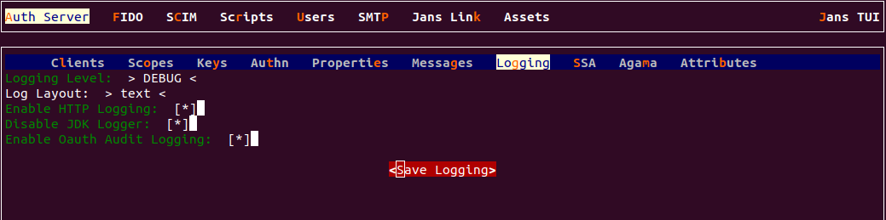
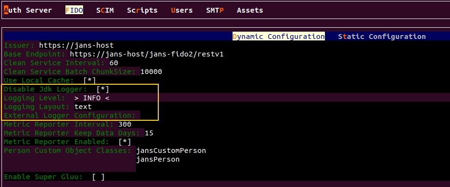
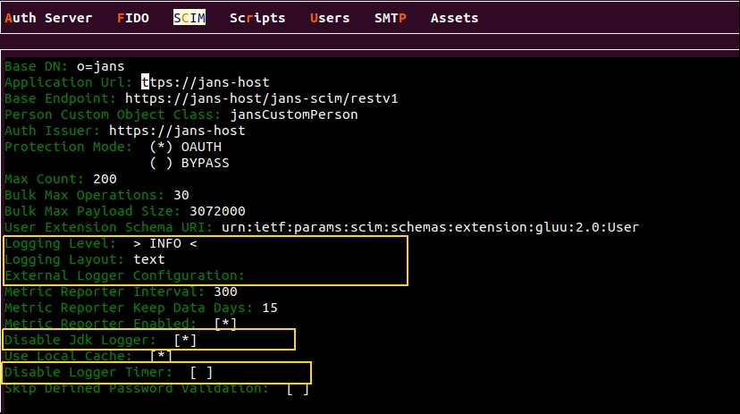

---
tags:
  - administration
  - configuration
  - logging
---

# Log Management

Logging for Janssen Server modules is managed at the individual module level.
Meaning there is no single switch or configuration that will enable or disable
logs for all modules. Each module can be individually configured and can be
configured differently when it comes to logging.

## Log Configuration For jans-auth

=== "Use Command-line"

    Use the command line to perform actions from the terminal. Learn how to 
    use Jans CLI [here](../config-tools/jans-cli/README.md) or jump straight to 
    the [Using Command Line](#using-command-line)

=== "Use Text-based UI"

    Use a fully functional text-based user interface from the terminal. 
    Learn how to use Jans Text-based UI (TUI) 
    [here](../config-tools/jans-tui/README.md) or jump straight to the
    [Using-text-based-ui](#using-text-based-ui)


=== "Use REST API"

    Use REST API for programmatic access or invoke via tools like CURL or 
    Postman. Learn how to use Janssen Server Config API 
    [here](../config-tools/config-api/README.md) or Jump straight to the
    [Using Configuration REST API](#using-configuration-rest-api)

##  Using Command Line

In the Janssen Server, you can deploy and customize the Logging Configuration 
using the command line. To get the details of Janssen command line operations 
relevant to Logging configuration, you can check the operations under 
`ConfigurationLogging` task using the
command below:

```bash title="Command"
jans cli --info ConfigurationLogging
```

```text title="Sample Output"
Operation ID: get-config-logging
  Description: Returns Jans Authorization Server logging settings
Operation ID: put-config-logging
  Description: Updates Jans Authorization Server logging settings
  Schema: Logging

To get sample schema type jans cli --schema <schema>, for example jans cli --schema Logging
```

### Find Logging Configuration

```bash title="Command"
jans cli --operation-id get-config-logging
```

```json title="Sample Output" linenums="1"
{
  "loggingLevel": "DEBUG",
  "loggingLayout": "string",
  "httpLoggingEnabled": true,
  "disableJdkLogger": true,
  "enabledOAuthAuditLogging": true,
  "externalLoggerConfiguration": "string",
  "httpLoggingExcludePaths": [
    "string"
  ]
}

```


### Update Logging Configuration

To update the configuration follow the steps below.

1. Get the current logging configuration and store it in a file for editing.
   The following command will retrieve the current logging configuration and 
   store it in a file.
   ```bash title="Command"
   jans cli -no-color --operation-id get-config-logging > /tmp/log-config.json
   ```
2. Update the configuration with desired value in the file while 
      keeping other properties and values unchanged. Updates must adhere to the
      `Logging` schema as mentioned [here](#using-command-line).
      The schema details can be retrieved using the command below.
      The schema defines what values and datatypes are acceptable for each 
      property value.
   ```bash title="Command"
   jans cli --schema Logging 
   ```
3. Use the updated file to send the update to the Janssen Server using the 
    command below
   ```bash title="Command"
   jans cli --operation-id put-config-logging --data /tmp/log-config.json
   ```
   Upon successful execution of the update, the Janssen Server responds with 
   updated configuration.

## Using-text-based-ui

Start TUI using the command below:

```bash title="Command"
jans tui
```
### Logging Configuration for Auth Server

* Navigate to `Auth Server` -> `Logging` to open the Logging screen as shown
in the image below to change the logging properties configuration.



### Logging Configuration for FIDO

* Navigate to `FIDO` to open the Logging screen as shown
in the image below to change the logging properties configuration.



### Logging Configuration for SCIM

* Navigate to `SCIM` to open the Logging screen as shown
in the image below to change the logging properties configuration.



## Using Configuration REST API

Janssen Server Configuration REST API exposes relevant endpoints for managing
and configuring logging. Endpoint details are published in the [Swagger
document](./../../reference/openapi.md).

## Default Log Location

On a VM installation, logs for `jans-auth` module are generated at
`/opt/jans/jetty/jans-auth/logs/`. Similarly, logs for FIDO2 and SCIM modules
are generated under `/opt/jans/jetty/jans-fido2/logs/` and 
`/opt/jans/jetty/jans-scim/logs/` respectively.

## Cloud-Native Deployments

Logging configuration for a cloud-native deployment is 
[detailed here](../../kubernetes-ops/logs.md)