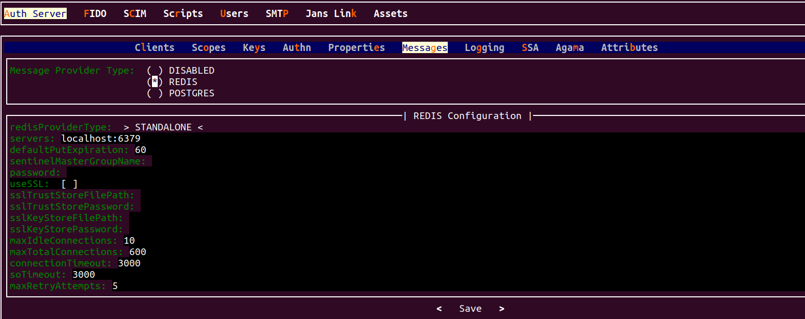

---
tags:
  - administration
  - configuration
  - messaging
---

# Messaging Configuration

The Janssen server provides messaging infrastructure for publish-subscribe message flows. 
Messaging infrastructure is configurable to the level where it can be enabled or disabled.
When enabled, the configuration also allows a choice of providers and supplying configuration
for those providers. 

The Janssen Server provides multiple configuration tools
to perform these tasks.


=== "Use Command-line"

    Use the command line to perform actions from the terminal. Learn how to 
    use Jans CLI [here](../config-tools/jans-cli/README.md) or jump straight to 
    the [Using Command Line](#using-command-line)

=== "Use Text-based UI"

    Use a fully functional text-based user interface from the terminal. 
    Learn how to use Jans Text-based UI (TUI) 
    [here](../config-tools/jans-tui/README.md) or jump straight to the
    [configuration steps](#using-text-based-ui)

=== "Use REST API"

    Use REST API for programmatic access or invoke via tools like CURL or 
    Postman. Learn how to use Janssen Server Config API 
    [here](../config-tools/config-api/README.md) or Jump straight to the
    [configuration steps](#using-configuration-rest-api)


## Using Command Line

To get the details of Janssen command line operations relevant to
the messaging configuration, you can check the operations under
`MessageConfiguration` using the command below:

```bash title="Command"
/opt/jans/jans-cli/config-cli.py --info MessageConfiguration
```
It prints below two operations:

```text title="Output" linenums="1"
Operation ID: get-config-message
 Description: Returns message configuration.
Operation ID: patch-config-message
 Description: Patch message configuration
 Schema: Array of JsonPatch

To get sample schema type /opt/jans/jans-cli/config-cli.py --schema-sample <schema>, for example /opt/jans/jans-cli/config-cli.py --schema-sample JsonPatch

```

#### Get Messaging Configuration

You can get the Messaging Configuration 
of the Janssen Server by performing this operation.

```bash title="Command"
/opt/jans/jans-cli/config-cli.py --operation-id get-config-message
```

```json title="Sample Output" linenums="1"
{
  "messageProviderType": "DISABLED",
  "nullConfiguration": {},
  "redisConfiguration": {
    "redisProviderType": "STANDALONE",
    "servers": "localhost:6379",
    "defaultPutExpiration": 60,
    "useSSL": false,
    "maxIdleConnections": 10,
    "maxTotalConnections": 500,
    "connectionTimeout": 3000,
    "soTimeout": 3000,
    "maxRetryAttempts": 5
  },
  "postgresConfiguration": {
    "dbSchemaName": "public",
    "connectionUri": "jdbc:postgresql://localhost:5432/jansdb",
    "authUserName": "jans",
    "authUserPassword": "U45+dbPl4eRjH1yXkp5NlQ==",
    "messageWaitMillis": 100,
    "messageSleepThreadTime": 200
  }
}
```

#### Patch Messaging Configuration

To patch update the messaging configuration, use 
the `patch-config-message` operation.

The `patch-config-message` operation uses the
[JSON Patch](https://jsonpatch.com/#the-patch) schema to describe
the configuration change. Refer
[here](../config-tools/jans-cli/README.md#patch-request-schema) 
to know more about schema.


For instance, to perform a `replace` operation and change the 
`messageProviderType` from `DISABLED` to `REDIS`,
the JSON Patch data would be like below:


```json title="Input" linenums="1"
[
  {
  "op": "replace",
  "path": "messageProviderType",
  "value": "REDIS"
  }
]
```

Store the above JSON Patch data in a file, for instance,
`/tmp/message-patch.json`

Using the above file, perform the operation as below:


```bash title="Sample Command"
/opt/jans/jans-cli/config-cli.py --operation-id patch-config-message \
--data /tmp/message-patch.json
```

```bash title="Sample Output" linenums="1"
{
  "messageProviderType": "REDIS",
  "nullConfiguration": {},
  "redisConfiguration": {
    "redisProviderType": "STANDALONE",
    "servers": "localhost:6379",
    "defaultPutExpiration": 60,
    "useSSL": false,
    "maxIdleConnections": 10,
    "maxTotalConnections": 500,
    "connectionTimeout": 3000,
    "soTimeout": 3000,
    "maxRetryAttempts": 5
 },
  "postgresConfiguration": {
    "dbSchemaName": "public",
    "connectionUri": "jdbc:postgresql://localhost:5432/jansdb",
    "authUserName": "jans",
    "authUserPassword": "U45+dbPl4eRjH1yXkp5NlQ==",
    "messageWaitMillis": 100,
    "messageSleepThreadTime": 200
 }
}
```

### Messaging Configuration For Postgres

When `Postgres` is being used as a messaging provider,
use the operations under the task
`MessageConfigurationPostgres` to configure and manage the provider.

```bash title="Command"
/opt/jans/jans-cli/config-cli.py --info MessageConfigurationPostgres
```

```text title="Output" linenums="1"
Operation ID: get-config-message-postgres
 Description: Returns Postgres message configuration.
Operation ID: put-config-message-postgres
 Description: Updates Postgres message configuration
 Schema: PostgresMessageConfiguration
Operation ID: patch-config-message-postgres
 Description: Patch Postgres message configuration
 Schema: Array of JsonPatch
```

#### Get Postgres Messaging Configuration  


You can get the Postgres messaging configuration
of the Janssen Server by performing this operation.

```bash title="Command"
/opt/jans/jans-cli/config-cli.py --operation-id get-config-message-postgres
```

It will show the configuration details as below.

```json title="Sample Output" linenums="1" 
{
  "dbSchemaName": "public",
  "connectionUri": "jdbc:postgresql://localhost:5432/jansdb",
  "authUserName": "jans",
  "authUserPassword": "U45+dbPl4eRjH1yXkp5NlQ==",
  "messageWaitMillis": 100,
  "messageSleepThreadTime": 200
}
```

#### Update Postgres Messaging Configuration


To update the configuration follow the steps below.

1. [Get the current Postgres messaging configuration](#get-postgres-messaging-configuration) 
and store it in a file for editing using the command [below].
   ```bash
   /opt/jans/jans-cli/config-cli.py -no-color --operation-id get-config-message-postgres >\
    /tmp/postgres.json
   ```
2. Edit and update the desired configuration values in the file while
 keeping other properties and values unchanged.Updates must adhere 
 to the `PostgresMessageConfiguration` schema as mentioned 
 [here](#messaging-configuration-for-postgres). 
 The schema details can be retrieved using the command below. 
 The schema defines what values and datatypes are acceptable for each property 
 value.
   ```text title="Command"
 /opt/jans/jans-cli/config-cli.py --schema PostgresMessageConfiguration
   ```
3. The Janssen Server also provides an example of data that adheres to the above
 schema.
 To fetch the example, use the command below.
   ```bash title="Command"
   /opt/jans/jans-cli/config-cli.py --schema-sample PostgresMessageConfiguration
   ```
   
4. Use the updated file to send the update to the Janssen Server using the command below
 ```bash title="Command"
  /opt/jans/jans-cli/config-cli.py --operation-id put-config-message-postgres \
 --data /tmp/postgres.json
 ```

#### Patch Postgres Message  Configuration

To update the messaging configuration use the 
`patch-config-message-postgres` operation.

The `patch-config-message-postgres` operation uses the
[JSON Patch](https://jsonpatch.com/#the-patch) schema to describe
the configuration change. Refer
[here](../config-tools/jans-cli/README.md#patch-request-schema)
to know more about schema.


For instance, to perform a `replace` operation at
`messageWaitMillis` and change it from `100` to `1000`,
the JSON Patch data would look like below:


```json title="Input" linenums="1"
[
  {
  "op": "replace",
  "path": "messageWaitMillis",
  "value": "1000"
  }
]
```

Store the above JSON Patch data in a file, for instance,
`/tmp/patch-postgres.json`

Using the above file, perform the operation as below:


```bash title="Sample Command"
/opt/jans/jans-cli/config-cli.py --operation-id patch-config-message-postgres \
--data /tmp/patch-postgres.json
```

```json title="Sample Output" linenums="1"
{
  "dbSchemaName": "public",
  "connectionUri": "jdbc:postgresql://localhost:5432/jansdb",
  "authUserName": "jans-postgres",
  "authUserPassword": "U45+dbPl4eRjH1yXkp5NlQ==",
  "messageWaitMillis": 1000,
  "messageSleepThreadTime": 200
}

```


### Messaging Configuration For Redis

To manage the Redis messaging configuratio, check the operations under
the task `MessageConfigurationRedis` using the command below:

```bash title="Command"
/opt/jans/jans-cli/config-cli.py --info MessageConfigurationRedis
```

```text title="Output" linenums="1"
Operation ID: get-config-message-redis
 Description: Returns Redis message configuration
Operation ID: put-config-message-redis
 Description: Updates Redis message configuration
 Schema: RedisMessageConfiguration
Operation ID: patch-config-message-redis
 Description: Patch Redis message configuration
 Schema: Array of JsonPatch

To get sample schema type /opt/jans/jans-cli/config-cli.py --schema-sample <schema>, for example /opt/jans/jans-cli/config-cli.py --schema-sample JsonPatch

```

#### Get Redis Messaging Configuration

You can get the Redis message configuration
of your Janssen Server by performing this operation.

```bash title="Command"
/opt/jans/jans-cli/config-cli.py --operation-id get-config-message-redis
```
It will show the configuration details.

```json title="Sample Output" linenums="1"
{
  "redisProviderType": "STANDALONE",
  "servers": "localhost:6379",
  "defaultPutExpiration": 60,
  "useSSL": false,
  "maxIdleConnections": 10,
  "maxTotalConnections": 500,
  "connectionTimeout": 3000,
  "soTimeout": 3000,
  "maxRetryAttempts": 5
}
```


#### Update Redis Message Configuration


To update the configuration follow the steps below.

1. [Get the current Redis Message configuration](#get-redis-messaging-configuration) 
 and store it into a file for editing
   ```bash
   /opt/jans/jans-cli/config-cli.py -no-color --operation-id get-config-message-redis >\
    /tmp/redis.json
   ```
2. Edit and update the desired configuration values in the file while keeping 
 other properties and values unchanged. Updates must adhere to 
 the `RedisMessageConfiguration` schema as mentioned [here](#messaging-configuration-for-redis).
 The schema details can be retrieved using the command below. 
 The schema defines what values and datatypes are acceptable for each property value.
   ```text title="Command"
 /opt/jans/jans-cli/config-cli.py --schema RedisMessageConfiguration
   ```
3. The Janssen Server also provides an example of data that 
 adheres to the above schema.To fetch the example, use the command below.
   ```bash title="Command"
   /opt/jans/jans-cli/config-cli.py --schema-sample RedisMessageConfiguration
   ```

4. Use the updated file to send the update to the Janssen 
 Server using the command below
 ```bash title="Command"
  /opt/jans/jans-cli/config-cli.py --operation-id put-config-message-redis \
 --data /tmp/redis.json
 ```


#### Patch Redis Message Configuration

You may need to update the messaging configuration, In that case
`patch-config-message-redis` can be used to modify the configuration.

The `patch-config-message-redis` operation uses the
[JSON Patch](https://jsonpatch.com/#the-patch) schema to describe
the configuration change. Refer
[here](../config-tools/jans-cli/README.md#patch-request-schema)
to know more about schema.


For instance, to perform a `replace` operation at
`maxTotalConnections` and change it from `500` to `600`,
the JSON Patch data would look like below:


```json title="Input" linenums="1"
[
  {
  "op": "replace",
  "path": "maxTotalConnections",
  "value": "600"
  }
]
```

Store the above JSON Patch data in a file, for instance,
`/tmp/patch-redis.json`

Using the above file, perform the operation as below:


```bash title="Sample Command"
/opt/jans/jans-cli/config-cli.py --operation-id patch-config-message-redis \
--data /tmp/patch-redis.json
```

```json title="Sample Output" linenums="1"
{
   "redisProviderType": "STANDALONE",
   "servers": "localhost:6379",
   "defaultPutExpiration": 60,
   "useSSL": false,
   "maxIdleConnections": 10,
   "maxTotalConnections": 600,
   "connectionTimeout": 3000,
   "soTimeout": 3000,
   "maxRetryAttempts": 5
}
```

## Using Text-based UI

In the Janssen Server, You can manage Message Configuration using
the [Text-Based UI](../config-tools/jans-tui/README.md) also.

You can start TUI using the command below:

```bash title="Command"
sudo /opt/jans/jans-cli/jans_cli_tui.py
```

Navigate to `Auth Server` -> `Messages` to open the Message screen as shown
in the image below. There are three different message configuration options 
accessible on this screen. You can update the details of these messages.



## Using Configuration REST API

Janssen Server Configuration REST API exposes relevant endpoints for
managing and configuring the Messages Configuration. Endpoint details
are published in the [Swagger document](./../../reference/openapi.md).