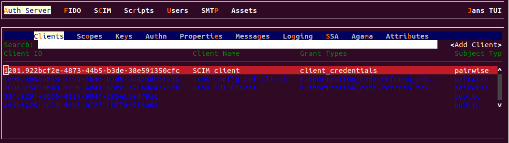
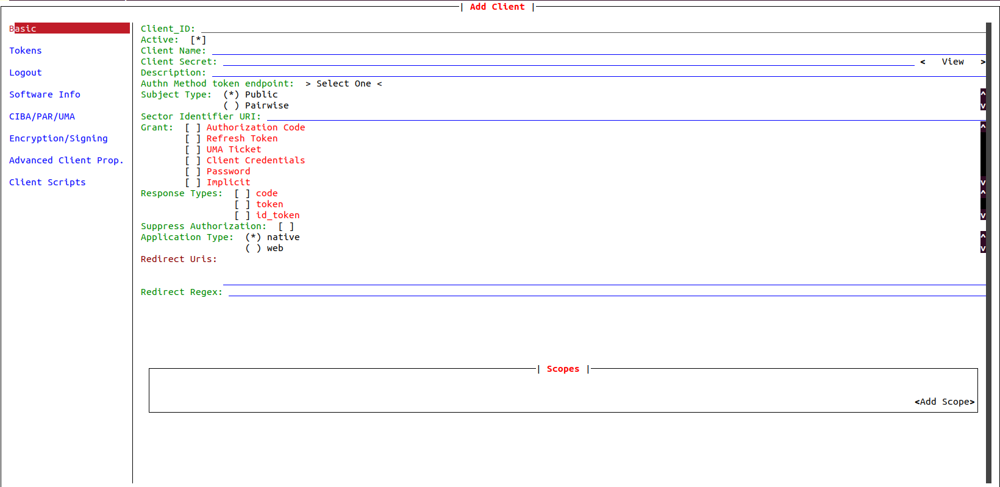
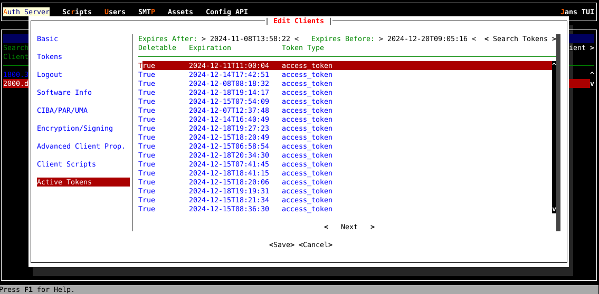

---
tags:
 - administration
 - configuration
 - openid-connect
---

# OpenID Connect Configuration


The Janssen Server provides multiple configuration tools to perform these
tasks.

=== "Use Command-line"

    Use the command line to perform actions from the terminal. Learn how to 
    use Jans CLI [here](../config-tools/jans-cli/README.md) or jump straight to 
    the [Using Command Line](#using-command-line)

=== "Use Text-based UI"

    Use a fully functional text-based user interface from the terminal. 
    Learn how to use Jans Text-based UI (TUI) 
    [here](../config-tools/jans-tui/README.md) or jump straight to the
    [Using Text-based UI](#using-text-based-ui)

=== "Use REST API"

    Use REST API for programmatic access or invoke via tools like CURL or 
    Postman. Learn how to use Janssen Server Config API 
    [here](../config-tools/config-api/README.md) or Jump straight to the
    [Using Configuration REST API](#using-configuration-rest-api)


## Using Command Line

In the Janssen Server, you can deploy and manage the OpenID Connect Client using the
command Line. To get the details of Janssen command line operations relevant to
OpenID Connect Client, you can check the operations under `OauthOpenidConnectClients` 
task using the command below:

Let's get the information about OpenID Connect Client Configuration:
```bash title="Command"
jans cli --info OauthOpenidConnectClients
```
```text title="Sample Output" linenums="1"
Operation ID: get-oauth-openid-clients
 Description: Gets list of OpenID Connect clients
 Parameters:
 limit: Search size - max size of the results to return [integer]
 pattern: Search pattern [string]
 startIndex: The 1-based index of the first query result [integer]
 sortBy: Attribute whose value will be used to order the returned response [string]
 sortOrder: Order in which the sortBy param is applied. Allowed values are "ascending" and "descending" [string]
 fieldValuePair: Field and value pair for seraching [string]
Operation ID: put-oauth-openid-client
 Description: Update OpenId Connect client
 Schema: Client
Operation ID: post-oauth-openid-client
 Description: Create new OpenId Connect client
 Schema: Client
Operation ID: get-oauth-openid-clients-by-inum
 Description: Get OpenId Connect Client by Inum
 Parameters:
 inum: Client identifier [string]
Operation ID: delete-oauth-openid-client-by-inum
 Description: Delete OpenId Connect client
 Parameters:
 inum: Client identifier [string]
Operation ID: patch-oauth-openid-client-by-inum
 Description: Patch OpenId Connect client
 Parameters:
 inum: Client identifier [string]
 Schema: Array of JsonPatch

To get sample schema type jans cli --schema-sample <schema>, for example jans cli --schema-sample JsonPatch
```

### Get List of OpenID Connect Clients

To get the list of OpenID Connect clients, run the following command:

```bash title="Command"
jans cli --operation-id get-oauth-openid-clients
```

```json title="Sample Output" linenums="1"
{
  {
  "start": 0,
  "totalEntriesCount": 3,
  "entriesCount": 3,
  "entries": [
 {
      "dn": "inum=1800.ca57f8f8-e163-4cdc-96f2-e2760e627bfe,ou=clients,o=jans",
      "deletable": false,
      "clientSecret": "qAnnHv5Yxw6I+xHXJI6kj6f4pogINrnw7Z/sDPXSW10=",
      "frontChannelLogoutUri": "null",
      "frontChannelLogoutSessionRequired": false,
      "redirectUris": [
        "https://www.google.com/"
 ],
      "claimRedirectUris": [],
      "responseTypes": [
        "code"
 ],
      "grantTypes": [
        "authorization_code",
        "refresh_token",
        "client_credentials"
 ],
      "applicationType": "web",
      "contacts": [],
      "clientName": "Jans Config Api Client",
      "clientNameLocalized": {},
      "logoUriLocalized": {},
      "clientUriLocalized": {},
      "policyUriLocalized": {},
      "tosUriLocalized": {},
      "subjectType": "pairwise",
      "idTokenSignedResponseAlg": "RS256",
      "tokenEndpointAuthMethod": "client_secret_basic",
      "defaultAcrValues": [],
      "postLogoutRedirectUris": [],
      "requestUris": [],
      "scopes": [
        "inum=1800.01.75,ou=scopes,o=jans",
        "inum=1800.01.76,ou=scopes,o=jans",
        "inum=1800.01.77,ou=scopes,o=jans",
        "inum=1800.01.78,ou=scopes,o=jans",
        "inum=1800.01.71,ou=scopes,o=jans",
        "inum=1800.01.72,ou=scopes,o=jans",
 ],
      "claims": [],
      "trustedClient": false,
   ....
   ....
   ....
  
      "baseDn": "inum=1800.ca57f8f8-e163-4cdc-96f2-e2760e627bfe,ou=clients,o=jans",
      "inum": "1800.ca57f8f8-e163-4cdc-96f2-e2760e627bfe"
 },
 {
      "dn": "inum=478049e2-210d-4b64-bc16-10440c973f65,ou=clients,o=jans",
      "deletable": false,
      "clientSecret": "37983639-0586-4ed3-8644-b5bc41c4ce49",
      "frontChannelLogoutSessionRequired": false,
      "redirectUris": [
        "https://www.google.com/"
 ],
      "grantTypes": [],
      "applicationType": "web",
      "clientNameLocalized": {},
      "logoUriLocalized": {},
      "clientUriLocalized": {},
      "policyUriLocalized": {},
      "tosUriLocalized": {},
      "subjectType": "public",
      "tokenEndpointAuthMethod": "client_secret_basic",
      "trustedClient": false,
     .....
     .....
     .....
      ],
      "baseDn": "inum=478049e2-210d-4b64-bc16-10440c973f65,ou=clients,o=jans",
      "inum": "478049e2-210d-4b64-bc16-10440c973f65"
 },
 {
      "dn": "inum=ec53d411-5243-4c76-b91c-661b35853cd0,ou=clients,o=jans",
      "deletable": false,
      "clientSecret": "456e1c1e-796d-4dc0-9f16-7b54c9e4eb5b",
      "frontChannelLogoutSessionRequired": false,
      "redirectUris": [
        "https://docs.jans.io/"
 ],
      "grantTypes": [],
      "applicationType": "web",
      "clientNameLocalized": {},
      "logoUriLocalized": {},
      "clientUriLocalized": {},
      "policyUriLocalized": {},
      "tosUriLocalized": {},
      "subjectType": "public",
      "tokenEndpointAuthMethod": "client_secret_basic",
      "trustedClient": false,
      .....
      .....
      .....
      
      "baseDn": "inum=ec53d411-5243-4c76-b91c-661b35853cd0,ou=clients,o=jans",
      "inum": "ec53d411-5243-4c76-b91c-661b35853cd0"
 }
 ]
}

```

To search using parameters, use the command below:

```bash title="Command"
jans cli --operation-id get-oauth-openid-clients \
--endpoint-args limit:2
```


### Creating a New OpenID Connect Clients

To add an OpenID Connect client, we can use `post-oauth-openid-client` operation id.
As shown in the [output](#using-command-line) for `--info` command, the
`post-oauth-openid-client` operation requires data to be sent
according to `Client` schema.

To see the schema, use the command below:

```bash title="Command"
jans cli --schema Client
```

The Janssen Server also provides an example of data that adheres to
the above schema. To fetch the example, use the command below.

```bash title="Command"
jans cli --schema-sample Client
```

Using the schema and the example above, we have added OpenID Connect 
client data to the file `/tmp/openid-connect.json`. An OpenID Connect client may have many properties, but we are going to fill only the required properties as shown below:

```json title="Input" 
{
  "redirectUris": [
    "https://www.google.com/"
 ]
}
```
Now let's post an OpenID Connect client to the Janssen Server to be 
added to the existing set:

```bash title="Command"
jans cli --operation-id post-oauth-openid-client \
--data /tmp/openid-connect.json
```

### Update OpenId Connect client

To update the configuration follow the steps below.

1. [Get the existing OpenID Connect Client](#get-openid-connect-client-by-inum) and store 
it into a file for editing. The following command will retrieve the existing 
OpenID Connect Client in the schema file.
```bash title="Command"
jans cli -no-color \
--operation-id get-oauth-openid-clients-by-inum \
--url-suffix inum:1800.ca57f8f8-e163-4cdc-96f2-e2760e627bfe > /tmp/update-client.json
```
2. Edit and update the desired configuration values in the file while keeping
 other properties and values unchanged. Updates must adhere to the `Client`
 schema as mentioned [here](#using-command-line).
3. We have changed in `parLifetime` only the `600` to `700`. Use the updated file 
to send the update to the Janssen Server using the command below
```bash title="Command"
jans cli --operation-id put-oauth-openid-client \
--data /tmp/update-client.json
```

Upon successful execution of the update, the Janssen Server responds with 
updated configuration


### Patch OpenID Connect Client by inum  

Using `patch-oauth-openid-client-by-inum`, we can modify OpenID Connect Clients 
partially for its properties.

To use this operation, specify the `inum` of the OpenID Connect Client that needs to be updated 
using the `--url-suffix` and the property and the new value using the 
[JSON Patch](https://jsonpatch.com/#the-patch). Refer [here](../../config-guide/config-tools/jans-cli/README.md#patch-request-schema) 
to know more about schema.

In this example; We will change the value of the property `applicationType` 
from `web` to `native`.

```bash title="Input" linenums="1"
[
{
  "op": "replace",
  "path": "applicationType",
  "value": "native"
}
]
```

Now let's do the operation with the command line.

```bash 
jans cli \
--operation-id patch-oauth-openid-client-by-inum \
--url-suffix inum:1800.ca57f8f8-e163-4cdc-96f2-e2760e627bfe --data /tmp/schema.json
```

### Get OpenID Connect Client by Inum

With `get-oauth-openid-clients-by-inum` operation-id, we can get any specific 
OpenID Connect Client matched with `Inum`. If we know the `inum`, we can use the 
below command:


```bash 
jans cli \
--operation-id get-oauth-openid-clients-by-inum \
--url-suffix inum:1800.ca57f8f8-e163-4cdc-96f2-e2760e627bfe
```
The result will only show details of client with 
`inum:1800.ca57f8f8-e163-4cdc-96f2-e2760e627bfe`.


### Delete OpenID Connect client

Delete the OpenID Connect client using its `inum`. The command line is:

```bash title="Command"
jans cli \
--operation-id delete-oauth-openid-client-by-inum \
--url-suffix inum:a89b5c29-2a91-48b5-bf27-1bf786954a06
```
It will delete the OpenID Connect client if it matches with the given `inum`.

## Using Text Based UI

Start TUI using the command below:

```bash title="Command"
jans tui
```

### Client Screen

Navigate to `Auth Server` -> `Clients` to open the client screen as shown
in the image below.



* This screen shows the OpenID Connect Clients list. 
* To get the list of currently added clients, bring the control to `Search` box 
(using the tab key), and press the `Enter` key. Type the search string to search 
for the client with the matching client name.


### Add-Update Client screen

* Use the `Add Client` button to create a new client.
* After adding the valid data using the `Save` button, add a new OpenID Connect client.

* Update the OpenID Connect client as well.
* To update the client, bring the control to the Specific `Client` row and press the
`Enter` key, then it will show the edit client screen. 



* If you are editing a client, you will have **Active Tokens** where you can search
and delete tokens related to the edited client as shown image below.



To view client details in json format, press key **v** on keyboard, to delete
press **delete** (or **d**) key.

### Delete Screen

* To delete the client, bring the control to the Specific `Client` row and press the `Delete` key.
Then it will show the Delete confirmation box.


## Using Configuration REST API

Janssen Server Configuration REST API exposes relevant endpoints for managing
and configuring the OpenID Connect Client. Endpoint details are published in the [Swagger
document](../../reference/openapi.md).
