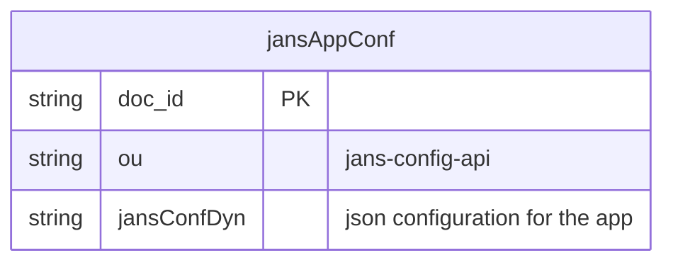
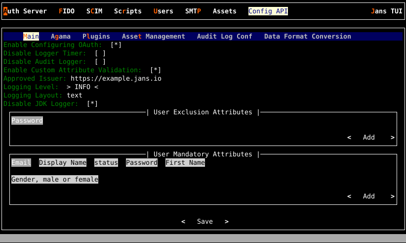

---
tags:
 - administration
 - tools
 - configuration
 - config-api
---


# Janssen Config-API Configuration

The Janssen Server provides multiple configuration tools to perform these 
tasks.

=== "Use Command-line"

    Use the command line to perform actions from the terminal. Learn how to 
    use Jans CLI [here](../jans-cli/README.md) or jump straight to 
    the [Using Command Line](#using-command-line)

=== "Use Text-based UI"

    Use a fully functional text-based user interface from the terminal. 
    Learn how to use Jans Text-based UI (TUI) 
    [here](../jans-tui/README.md) or jump straight to the
    [Using Text-based UI](#using-text-based-ui)


=== "Use REST API"

    Use REST API for programmatic access or invoke via tools like CURL or 
    Postman. Learn how to use Janssen Server Config API 
    [here](../config-api/README.md) or Jump straight to the
    [Using Configuration REST API](#using-configuration-rest-api)


##  Using Command Line


In the Janssen Server, you can deploy and customize the Config-API Configuration 
using the command line. To get the details of Janssen command line operations 
relevant to Config-API Configuration, you can check the operations under 
`ConfigurationConfigApi` task using the command below:


```bash title="Command"
jans tui --info ConfigurationConfigApi
```

It will show the details of the available operation-ids for Config-API.

```text title="Sample Output"
Operation ID: get-config-api-properties
 Description: Gets config-api configuration properties.
Operation ID: patch-config-api-properties
 Description: Partially modifies config-api Configuration properties.
 Schema: Array of JsonPatch

To get sample schema type jans tui --schema-sample <schema>, for example jans tui --schema-sample JsonPatch
```

### Get The Current Config-API Configuration

Configuration for Config-API is a set of key-value pairs, called properties. When we retrieve the configuration, these properties and their current values are returned as a JSON document. To get the properties of Janssen Config-API Configuration, run the command below:

```bash title="Command"
jans tui --operation-id=get-config-api-properties
```

It will return the result as below:

```json title="Sample Output" linenums="1"
{
  "serviceName": "jans-config-api",
  "configOauthEnabled": true,
  "disableLoggerTimer": false,
  "disableAuditLogger": false,
  "customAttributeValidationEnabled": true,
  "acrValidationEnabled": true,
  "apiApprovedIssuer": [
    "https://example.jans.io"
 ],
  "apiProtectionType": "oauth2",
  "apiClientId": "1800.b62cb614-a09d-4163-a6bc-32e38a51c4d2",
  "apiClientPassword": "CN8ggRUhMkw9K0ocQ+LXbA==",
  "endpointInjectionEnabled": false,
  "authIssuerUrl": "https://example.jans.io",
  "authOpenidConfigurationUrl": "https://example.jans.io/.well-known/openid-configuration",
  "authOpenidIntrospectionUrl": "https://example.jans.io/jans-auth/restv1/introspection",
  "authOpenidTokenUrl": "https://example.jans.io/jans-auth/restv1/token",
  "authOpenidRevokeUrl": "https://example.jans.io/jans-auth/restv1/revoke",
  "exclusiveAuthScopes": [
    "jans_stat",
    "https://jans.io/scim/users.read",
    "https://jans.io/scim/users.write"
 ],
  "corsConfigurationFilters": [
 {
      "filterName": "CorsFilter",
      "corsEnabled": true,
      "corsAllowedOrigins": "*",
      "corsAllowedMethods": "GET,PUT,POST,DELETE,PATCH,HEAD,OPTIONS",
      "corsSupportCredentials": true,
      "corsLoggingEnabled": false,
      "corsPreflightMaxAge": 1800,
      "corsRequestDecorate": true
 }
 ],
  "loggingLevel": "INFO",
  "loggingLayout": "text",
  "disableJdkLogger": true,
  "maxCount": 200,
  "acrExclusionList": [
    "simple_password_auth"
 ],
  "userExclusionAttributes": [
    "userPassword"
 ],
  "userMandatoryAttributes": [
    "mail",
    "displayName",
    "status",
    "userPassword",
    "givenName"
 ],
  "agamaConfiguration": {
    "mandatoryAttributes": [
      "qname",
      "source"
 ],
    "optionalAttributes": [
      "serialVersionUID",
      "enabled"
 ]
 },
  "auditLogConf": {
    "enabled": true,
    "headerAttributes": [
      "User-inum"
 ]
 },
  "dataFormatConversionConf": {
    "enabled": true,
    "ignoreHttpMethod": [
      "@jakarta.ws.rs.GET()"
 ]
 },
  "plugins": [
 {
      "name": "admin",
      "description": "admin-ui plugin",
      "className": "io.jans.ca.plugin.adminui.rest.ApiApplication"
 },
 {
      "name": "fido2",
      "description": "fido2 plugin",
      "className": "io.jans.configapi.plugin.fido2.rest.ApiApplication"
 },
 {
      "name": "scim",
      "description": "scim plugin",
      "className": "io.jans.configapi.plugin.scim.rest.ApiApplication"
 },
 {
      "name": "user-management",
      "description": "user-management plugin",
      "className": "io.jans.configapi.plugin.mgt.rest.ApiApplication"
 },
 {
      "name": "jans-link",
      "description": "jans-link plugin",
      "className": "io.jans.configapi.plugin.link.rest.ApiApplication"
 },
 {
      "name": "saml",
      "description": "saml plugin",
      "className": "io.jans.configapi.plugin.saml.rest.ApiApplication"
 },
 {
      "name": "kc-link",
      "description": "kc-link plugin",
      "className": "io.jans.configapi.plugin.kc.link.rest.ApiApplication"
 },
 {
      "name": "lock",
      "description": "lock plugin",
      "className": "io.jans.configapi.plugin.lock.rest.ApiApplication"
 }
 ],
  "assetMgtConfiguration": {
    "assetMgtEnabled": true,
    "assetServerUploadEnabled": true,
    "fileExtensionValidationEnabled": true,
    "moduleNameValidationEnabled": true,
    "assetBaseDirectory": "/opt/jans/jetty/%s/custom",
    "jansServiceModule": [
      "jans-auth",
      "jans-config-api",
      "jans-fido2",
      "jans-scim"
 ],
    "assetDirMapping": [
 {
        "directory": "i18n",
        "type": [
          "properties"
 ],
        "description": "Resource bundle file."
 },
 {
        "directory": "libs",
        "type": [
          "jar"/opt/jans/jans-cli/config-cli.py --info ConfigurationConfigApi

 ],
        "description": "java archive library."
 },
 {
        "directory": "pages",
        "type": [
          "xhtml"
 ],
        "description": "Web pages."
 },
 {
        "directory": "static",
        "type": [
          "js",
          "css",
          "png",
          "gif",
          "jpg",
          "jpeg"
 ],
        "description": "Static resources like Java-script, style-sheet and images."
 }
 ]
 }
}
```

### Update Config-API Configuration Properties

To update the configuration, we will use [JSON patch](https://datatracker.ietf.org/doc/html/rfc6902) schema as shown below. 

Let's say we want to stop the file extension validation done
by config-api's asset management module. This can be done by
setting the `fileExtensionValidationEnabled` property to 
`false`. To do that, write a text file (`config-api-assetmgt-patch.json`) with the content that follows the JSON patch schema.

```json title="config-api-assetmgt-patch.json" linenums="1"
[
 {
    "op": "replace",
    "path": "/assetMgtConfiguration/fileExtensionValidationEnabled",
    "value": false
 }
]
```

Now, execute the following command to apply this patch:
 ```bash title="Command"
  jans tui \
 --operation-id=patch-config-api-properties --data ./config-api-assetmgt-patch.json
 ```
 Upon successful execution of the update, the Janssen Server responds with 
 updated configuration.

#### Updating multi-valued property

Let's say we want to 
update the configuration property  **userMandatoryAttributes**. This property's value is a list of attributes. We want to remove an attribute from the list. For this, we will have to create a JSON patch file that 
contains the new list and then run a command to push the update
to the Janssen Server. Let's do this step-by-step:

1. Get the current value list for **userMandatoryAttributes** property using steps mentioned in [Get the current configuration](#get-the-current-config-api-configuration) section
2. Using the current list of values as a starting point,  create a JSON patch  file `config-api-patch.json` as below. Update the list as desired by adding or removing items from the list:

 ```json title="Sample Contents" linenums="1"
 [
 {
    "op": "replace",
    "path": "/userMandatoryAttributes",
    "value": [
      "mail",
      "displayName",
      "status",
      "userPassword",
      "givenName",
      "gender"
 ]
 }
 ]
 ```
 
Now, execute the following command to apply this patch:
 ```bash title="Command"
  jans tui \
 --operation-id=patch-config-api-properties --data ./config-api-patch.json
 ```

### Config API Configuration Parameters:

The table below outlines the key 
configuration parameters for the Jans Config API. It details settings for 
OAuth2, security, endpoints, logging, and plugin management.

| Field named | Example | Description|
|--|--|--|
|configOauthEnabled| true | property can be used to enable or disable the oAuth2 authorization. By default, it is set to true.|
|apiApprovedIssuer| ["https://<jans.auth.server>,https://<gluu.server>,https://<anyAuth.server>"] | Enables to set more than one authorization servers. By default, the current auth-server is set. You can add more servers separated by commas. |
|apiProtectionType | oauth2| Currently support mechanism is OAuth 2.0 tokens. |
|apiClientId | 1800.52eb1bed-ab5c-4ba6-b87e-90aad26058d0| Jans Config API Client. |
|apiClientPassword | lwI/8mcMkF63mvueYTZ0mQ==| Encrypted secret of Jans Config API Client|
|endpointInjectionEnabled |false| To be used if the endpoint needs to be injected. |
|authIssuerUrl| https://my-jans-server.jans.io  | URL of underlying auth-server.|
|authOpenidConfigurationUrl| https://my-jans-server.jans.io/.well-known/openid-configuration | Metadata URL of the authorization server.|
|authOpenidIntrospectionUrl| https://my-jans-server.jans.io/jans-auth/restv1/introspection | Authorization server endpoint to check the state of an OAuth 2.0 token and to determine meta-information about the token.|
|authOpenidTokenUrl| https://my-jans-server.jans.io/jans-auth/restv1/token | Authorization server endpoint to obtain an Access Token, an ID Token, and optionally a Refresh Token.|
|authOpenidRevokeUrl| https://my-jans-server.jans.io/jans-auth/restv1/token | Authorization server endpoint to notify an OAuth 2.0 authorization server that a previously obtained refresh or access token is no longer needed, allowing the server to clean up security credentials.|
|smallryeHealthRootPath| /health-check | Deprecated param for health-check|
|exclusiveAuthScopes| ["jans_stat","https://jans.io/scim/users.read","https://jans.io/scim/users.write"] | Scopes that are only validated against the underlying Janssen Authorization server.|
|corsConfigurationFilters| [{"filterName":"CorsFilter","corsEnabled":true,"corsAllowedOrigins":"*","corsAllowedMethods":"GET,PUT,POST,DELETE,PATCH,HEAD,OPTIONS","corsAllowedHeaders":"","corsExposedHeaders":"","corsSupportCredentials":true,"corsLoggingEnabled":false,"corsPreflightMaxAge":1800,"corsRequestDecorate":true}] | This list specifies the CORS configuration filters.  |
|exclusiveAuthScopes| ["jans_stat","https://jans.io/scim/users.read","https://jans.io/scim/users.write"] | Scopes that are only validated against the underlying Janssen Authorization server.|
|loggingLevel | "INFO" or "TRACE" or "DEBUG" | Logging level for Config API.|
|loggingLayout |"text"|Contents of logs as plain text format.|
|externalLoggerConfiguration||Path to external log4j2 logging configuration.|
|disableJdkLogger|true|Boolean to disable JDK loggers.|
|maxCount|200|To be used to set maximum records returned in response.|
|userExclusionAttributes|["userPassword"]|List of attributes to be excluded in User response.|
|userMandatoryAttributes|["mail","displayName","jansStatus","userPassword","givenName"]|List of attributes mandatory for creating a User.|
|agamaConfiguration|{"mandatoryAttributes":["qname","source"],"optionalAttributes":["serialVersionUID","enabled"]}|Configuration parameters like mandatory, optional, etc for agama flow.|
|auditLogConf|{"enabled":true,"ignoreHttpMethod":[],"headerAttributes":["User-inum"]}|Audit Log configuration.|
|dataFormatConversionConf|{"enabled":true,"ignoreHttpMethod":["@jakarta.ws.rs.GET()"]}|DB specific data format conversion configuration for Date field.|
|plugins|[{"name":"admin","description":"admin-ui plugin","className":"io.jans.ca.plugin.adminui.rest.ApiApplication"},{"name":"fido2","description":"fido2 plugin","className":"io.jans.configapi.plugin.fido2.rest.ApiApplication"},{"name":"scim","description":"scim plugin","className":"io.jans.configapi.plugin.scim.rest.ApiApplication"},{"name":"user-management","description":"user-management plugin","className":"io.jans.configapi.plugin.mgt.rest.ApiApplication"}]|List of configured plugin.|


### Two options to make effect any manual changes done to the configuration
1. Restart jans-config-api 
2. Increment the `jansRevision` property of the configuration without restarting 
the application. The timer job will detect the change and fetch the latest 
configuration from the DB.

### Locating Config API configuration in the Persistence Layer

While it is not recommended that an administrator directly edits a configuration 
at the persistence layer, it may be useful information for a developer.

#### MySQL



### Important attributes

#### OAuth authorization

`configOauthEnabled` property can be used to enable or disable the oAuth2 
authorization. By default, it is set to true.

```javascript
  
 "configOauthEnabled": true
  
```

#### Api protection 

`apiProtectionType` property states the protocol used for API authorization. 
The currently supported value is `oauth2`.

```javascript
  
 "apiProtectionType": "oauth2"
  
```


### Api protection auth server

`apiApprovedIssuer` property enables to set more than one authorization servers. 
By default, the current auth-server is set. You can add more servers separated 
by commas.

```javascript
 apiApprovedIssuer": ["https://<jans.auth.server>,https://<gluu.server>,https://<anyAuth.server>"]
```


### Logging level 

`loggingLevel` property can be used to change the logging level to the 
desired values `(TRACE, DEBUG, INFO, WARN, ERROR)`. By default, the level is 
set to `INFO`

 ```javascript
  
 "loggingLevel":"DEBUG",
  
```


### Scopes other than the one defined by config-api

Config API endpoints are oAuth2 protected. These scopes are created during 
installation. However, few endpoints require scopes defined 
by other modules like auth-server. 

A list of these scopes is maintained in the configuration in order to avoid 
the creation of these scopes during Config API start-up. `exclusiveAuthScopes` 
property can be used to change the logging level to the desired value 
`(TRACE, DEBUG, INFO, WARN, ERROR)`. By default, the level is set to `INFO`

 ```javascript
  
  "exclusiveAuthScopes": [
    "jans_stat",
    "https://jans.io/scim/users.read",
    "https://jans.io/scim/users.write"
 ],
  
 ```


### User - Mandatory and exclusion attributes

#### MandatoryAttributes 

`userMandatoryAttributes` can be used to define mandatory attributes 
for User while creating and updating.

 ```javascript
  
   "userMandatoryAttributes": [
  "mail",
  "displayName",
  "jansStatus",
  "userPassword",
  "givenName"
 ],
  
 ```

#### Exclusion attributes

`userExclusionAttributes` can be used to define User attributes that are not 
to be returned in the API response. More attributes that are to be skipped in 
response can be added to the list.

```javascript
  
  "userExclusionAttributes": [
    "userPassword"
 ],
```


### Agama flow configuration

`agamaConfiguration` stores Agama-related configuration used in Agama related 
endpoints.

`mandatoryAttributes` list defines the required attributes for Agama flow creation 
and update.
`optionalAttributes` list specifies the optional attributes.

```javascript
  
  "agamaConfiguration": {
     "mandatoryAttributes": [
   "qname",
   "source"
 ],
   "optionalAttributes": [
   "serialVersionUID",
   "enabled"
 ]
 }
  
```


##  Using Text-based UI


You can start TUI using the command below:

```bash title="Command"
jans tui
```

Navigate to `Config API` section where administrators can update 
Config-API configurations in six sub-tabs, namely 
**Main**, **Agama**, **Plugins**, **Asset Management**, **Audit Log Conf**, 
**Data Format Conversion**




## Using Configuration REST API

Janssen Server Configuration REST API exposes relevant endpoints for 
managing and configuring the Config-API Configuration. Endpoint details 
are published in the [Swagger document](../../../../janssen-server/reference/openapi.md), 
see endpoint `/api/v1/api-config`
