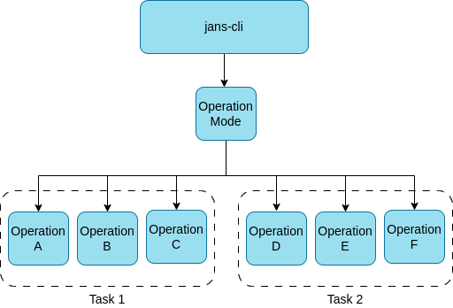

---
tags:
  - administration
  - configuration
  - tools
  - cli
  - commandline
---

# Janssen CLI

`jans-cli` module is a command line interface for configuring the Janssen 
Server. This module interacts with Janssen Server via 
[RESTful configuration APIs](./../config-api/README.md)
that server exposes. `jans-cli` can be used to retrieve and update configuration
of Janssen Server.

## Installation

### On The Janssen Server

On a Janssen Server instance, the `jans-cli` will be already installed.

It can be invoked executing following command on Janssen Server.

```shell
/opt/jans/jans-cli/config-cli.py
```

### Stand-alone Installation

`jans-cli` can be installed on any other machine and then use it to configure
remote server where Janssen Server is installed.

- Follow [these instructions](../jans-tui/README.md#1-build-pyz-self-executable-file) and create a self-executable file
- Run the file as shown in the example below to enter CLI mode. Here, supplying the argument `--no-tui` is necessary,
  otherwise it will switch to TUI mode.
   ```
   $ ./jans-cli-tui.pyz --no-tui --host test.jans.io --client-id 2000.562981df-1623-4136-b1d0-aaa277edc48c --client-secret KU6ydImJZK6S --operation-id get-acrs
   Please wait while retrieving data ...
   Access token was not found.
   Please visit verification url https://test.jans.io/device-code?user_code=LKHC-PBTR and authorize this device within 1800 secods
   Please press «Enter» when ready
   {
     "defaultAcr": "simple_password_auth"
   }
   ```

## CLI Tool Configuration

Janssen CLI tool stores its configuration under `<install-path>/.config`
directory. Various settings for CLI tool can be found under this directory,
for example [logging levels](../../../../contribute/developer-faq.md#how-to-enable-debug-logs-for-jans-cli-and-tui-configuration-tools).

This directory also contains SALT used by Janssen CLI tool.

### CLI Authorization
To run operations on Janssen Server, CLI client will need to be authenticated and authorized by the server. Since CLI has limited input capabilities, it uses [Device Authorization Grant](https://datatracker.ietf.org/doc/html/rfc8628) flow to get required permissions in form of an access token. After successfully receiving the token, CLI can run operations on the Janssen server while the token is valid. The steps below will summarize this process.

1. Execution of CLI command will return the following message if a valid token is not found.
   ```
   Access token was not found.
   Please visit verification url <Janssen-server-device-code-url> and enter user code CGFZ-RTZR in 1800 seconds
   Please press <<Enter>> when ready
   ```
2. Take `<Janssen-server-device-code-url>` from the message above and use any browser to access it from a different device
3. User will be presented with a page where the user has to authenticate using id and password
4. After successful user authentication, the next screen allows the user to enter the user code. Use the user code presented on command-line instruction in step 1 above.
5. After successful code validation, the user is presented with OAuth permissions screen. This screen would list all the permissions requested by Jans CLI. The user can choose to `Allow` or `Not Allow` granting of these permissions.
6. After allowing the grant of requested permissions, the user should come back to the command-line interface and hit <<Enter>> as instructed. This will enable CLI to run operations on the corresponding Janssen server.

## Getting Help

CLI `--help` switch prints all options available from CLI to configure Janssen
Server. Run command below

```shell
/opt/jans/jans-cli/config-cli.py --help
```
To see all options as below:
```
usage: config-cli.py [-h] [--host HOST] [--client-id CLIENT_ID] [--client-secret CLIENT_SECRET] [--access-token ACCESS_TOKEN] [--plugins PLUGINS] [-debug] [--debug-log-file DEBUG_LOG_FILE]
                     [--operation-id OPERATION_ID] [--url-suffix URL_SUFFIX]
                     [--info {AdminUiConfiguration,AdminUiLicense,AdminUiPermission,AdminUiRole,AdminUiRolePermissionsMapping,AdminUiWebhooks,Agama,AgamaConfiguration,Attribute,AuthServerHealthCheck,AuthSessionManagement,CacheConfiguration,CacheConfigurationInMemory,CacheConfigurationMemcached,CacheConfigurationNativePersistence,CacheConfigurationRedis,ClientAuthorization,ConfigurationConfigApi,ConfigurationJwkJsonWebKeyJwk,ConfigurationLogging,ConfigurationProperties,ConfigurationSmtp,ConfigurationUserManagement,CustomScripts,DatabaseLdapConfiguration,DefaultAuthenticationMethod,Fido2Configuration,Fido2Registration,HealthCheck,JansAssets,JansLinkConfiguration,KcLinkConfiguration,LockAudit,LockConfiguration,LockLog,MessageConfiguration,MessageConfigurationPostgres,MessageConfigurationRedis,OauthOpenidConnectClients,OauthScopes,OauthUmaResources,OrganizationConfiguration,Plugins,SamlConfiguration,SamlIdentityBroker,SamlTrustRelationship,ScimConfigManagement,StatisticsUser,Token}]
                     [--op-mode {get,post,put,patch,delete}] [--endpoint-args ENDPOINT_ARGS] [--schema-sample SCHEMA_SAMPLE] [--schema SCHEMA] [-CC CONFIG_API_MTLS_CLIENT_CERT]
                     [-CK CONFIG_API_MTLS_CLIENT_KEY] [--key-password KEY_PASSWORD] [-noverify] [-use-test-client] [--patch-add PATCH_ADD] [--patch-replace PATCH_REPLACE] [--patch-remove PATCH_REMOVE]
                     [-no-color] [--log-dir LOG_DIR] [--tmp-dir TMP_DIR] [-revoke-session] [-scim] [-auth] [--data DATA] [--output-access-token]

options:
  -h, --help            show this help message and exit
  --host HOST           Hostname of server
  --client-id CLIENT_ID
                        Jans Config Api Client ID
  --client-secret CLIENT_SECRET, --client_secret CLIENT_SECRET
                        Jans Config Api Client ID secret
  --access-token ACCESS_TOKEN
                        JWT access token or path to file containing JWT access token
  --plugins PLUGINS     Available plugins separated by comma
  -debug                Run in debug mode
  --debug-log-file DEBUG_LOG_FILE
                        Log file name when run in debug mode
  --operation-id OPERATION_ID
                        Operation ID to be done
  --url-suffix URL_SUFFIX
                        Argument to be added api endpoint url. For example inum:2B29
  --info {AdminUiConfiguration,AdminUiLicense,AdminUiPermission,AdminUiRole,AdminUiRolePermissionsMapping,AdminUiWebhooks,Agama,AgamaConfiguration,Attribute,AuthServerHealthCheck,AuthSessionManagement,CacheConfiguration,CacheConfigurationInMemory,CacheConfigurationMemcached,CacheConfigurationNativePersistence,CacheConfigurationRedis,ClientAuthorization,ConfigurationConfigApi,ConfigurationJwkJsonWebKeyJwk,ConfigurationLogging,ConfigurationProperties,ConfigurationSmtp,ConfigurationUserManagement,CustomScripts,DatabaseLdapConfiguration,DefaultAuthenticationMethod,Fido2Configuration,Fido2Registration,HealthCheck,JansAssets,JansLinkConfiguration,KcLinkConfiguration,LockAudit,LockConfiguration,LockLog,MessageConfiguration,MessageConfigurationPostgres,MessageConfigurationRedis,OauthOpenidConnectClients,OauthScopes,OauthUmaResources,OrganizationConfiguration,Plugins,SamlConfiguration,SamlIdentityBroker,SamlTrustRelationship,ScimConfigManagement,StatisticsUser,Token}
                        Help for operation
  --op-mode {get,post,put,patch,delete}
                        Operation mode to be done
  --endpoint-args ENDPOINT_ARGS
                        Arguments to pass endpoint separated by comma. For example limit:5,status:INACTIVE
  --schema-sample SCHEMA_SAMPLE
                        Get sample json schema template
  --schema SCHEMA       Get the operation schema which describes all the keys of the schema and its values in detail.
  -CC CONFIG_API_MTLS_CLIENT_CERT, --config-api-mtls-client-cert CONFIG_API_MTLS_CLIENT_CERT
                        Path to SSL Certificate file
  -CK CONFIG_API_MTLS_CLIENT_KEY, --config-api-mtls-client-key CONFIG_API_MTLS_CLIENT_KEY
                        Path to SSL Key file
  --key-password KEY_PASSWORD
                        Password for SSL Key file
  -noverify             Ignore verifying the SSL certificate
  -use-test-client      Use test client without device authorization
  --patch-add PATCH_ADD
                        Colon delimited key:value pair for add patch operation. For example loggingLevel:DEBUG
  --patch-replace PATCH_REPLACE
                        Colon delimited key:value pair for replace patch operation. For example loggingLevel:DEBUG
  --patch-remove PATCH_REMOVE
                        Key for remove patch operation. For example imgLocation
  -no-color             Do not colorize json dumps
  --log-dir LOG_DIR     Log directory
  --tmp-dir TMP_DIR     Directory for storing temporary files
  -revoke-session       Revokes session
  -scim                 SCIM Mode
  -auth                 Jans OAuth Server Mode
  --data DATA           Path to json data file
  --output-access-token
                        Prints jwt access token and exits

```

## CLI Command Structure

CLI operations are structurally grouped by `Operation Modes` and within 
these modes, they are logically grouped together by tasks. Diagram below 
depicts this structure.



### Operation Modes

CLI offer three operation modes, JCA, SCIM and AUTH. JCA is the default mode.
To use SCIM and AUTH modes, the CLI command specifies `-scim` or `-auth` 
switches. Use `-h` switch to get help on each mode.

```shell
/opt/jans/jans-cli/config-cli.py -scim -h
```

The modes usually have different task(and hence operations).


### Tasks
`Tasks` are logical grouping of operation-ids so that users can easily list
all the operational-ids relevant to a particular aspect of Janssen Server
configuration using `--info` switch. For instance,
all the operation-ids related to attribute management are grouped under
`attribute` task. As mentioned, tasks are logical groupings, they don't perform
any operation on the server. Tasks can only be used with `--info` switch.

Execute following command to see what all tasks are offered by jans-cli:

```shell
/opt/jans/jans-cli/config-cli.py --help
```

Options listed for `--info` switch are tasks groups available. For example:

```shell
usage: config-cli.py [-h] [--host HOST] [--client-id CLIENT_ID] [--client-secret CLIENT_SECRET] [--access-token ACCESS_TOKEN] [--plugins PLUGINS] [-debug] [--debug-log-file DEBUG_LOG_FILE]
                     [--operation-id OPERATION_ID] [--url-suffix URL_SUFFIX]
                     [--info {AdminUiConfiguration,AdminUiLicense,AdminUiPermission,AdminUiRole,AdminUiRolePermissionsMapping,AdminUiWebhooks,Agama,AgamaConfiguration,Attribute,AuthServerHealthCheck,AuthSessionManagement,CacheConfiguration,CacheConfigurationInMemory,CacheConfigurationMemcached,CacheConfigurationNativePersistence,CacheConfigurationRedis,ClientAuthorization,ConfigurationConfigApi,ConfigurationJwkJsonWebKeyJwk,ConfigurationLogging,ConfigurationProperties,ConfigurationSmtp,ConfigurationUserManagement,CustomScripts,DatabaseLdapConfiguration,DefaultAuthenticationMethod,Fido2Configuration,Fido2Registration,HealthCheck,JansAssets,JansLinkConfiguration,KcLinkConfiguration,LockAudit,LockConfiguration,LockLog,MessageConfiguration,MessageConfigurationPostgres,MessageConfigurationRedis,OauthOpenidConnectClients,OauthScopes,OauthUmaResources,OrganizationConfiguration,Plugins,SamlConfiguration,SamlIdentityBroker,SamlTrustRelationship,ScimConfigManagement,StatisticsUser,Token}]
                     [--op-mode {get,post,put,patch,delete}] [--endpoint-args ENDPOINT_ARGS] [--schema-sample SCHEMA_SAMPLE] [--schema SCHEMA] [-CC CONFIG_API_MTLS_CLIENT_CERT]
                     [-CK CONFIG_API_MTLS_CLIENT_KEY] [--key-password KEY_PASSWORD] [-noverify] [-use-test-client] [--patch-add PATCH_ADD] [--patch-replace PATCH_REPLACE] [--patch-remove PATCH_REMOVE]
                     [-no-color] [--log-dir LOG_DIR] [--tmp-dir TMP_DIR] [-revoke-session] [-scim] [-auth] [--data DATA] [--output-access-token]
```

To see operation-id available under a task, execute the command below with
the task name as an argument:

```shell
/opt/jans/jans-cli/config-cli.py --info Attribute
```

Above will list all the operations under `Attribute` group.

```shell
Operation ID: get-attributes
  Description: Gets a list of Jans attributes.
  Parameters:
  limit: Search size - max size of the results to return [integer]
  pattern: Search pattern [string]
  status: Status of the attribute [string]
  startIndex: The 1-based index of the first query result [integer]
  sortBy: Attribute whose value will be used to order the returned response [string]
  sortOrder: Order in which the sortBy param is applied. Allowed values are "ascending" and "descending" [string]
  fieldValuePair: Field and value pair for seraching [string]
Operation ID: put-attributes
  Description: Updates an existing attribute
  Schema: JansAttribute
Operation ID: post-attributes
  Description: Adds a new attribute
  Schema: JansAttribute
Operation ID: get-attributes-by-inum
  Description: Gets an attribute based on inum
  Parameters:
  inum: Attribute Id [string]
Operation ID: delete-attributes-by-inum
  Description: Deletes an attribute based on inum
  Parameters:
  inum: Attribute Id [string]
Operation ID: patch-attributes-by-inum
  Description: Partially modify a JansAttribute
  Parameters:
  inum: Attribute Id [string]
  Schema: Array of PatchRequest
```
### Operation-ids
jans-cli's unit of work, or a command, is known as `operation-id`. Each
operation id is a configuration retrieval/update action on the Janssen Server.
For example: `get-attributes` is an operation that `Gets a list of Janssen
Server attributes`.

To perform any operation, you have to run command line with the operation id. 
For example:

```shell
/opt/jans/jans-cli/config-cli.py --operation-id get-acrs
```

It returns:

```text
Getting access token for scope https://jans.io/oauth/config/acrs.readonly
{
  "defaultAcr": "simple_password_auth"
}
```

Certain operations need data to be able to execute while for others just the 
operation id is enough. For instance in above example `get-acrs` operation did
not require any data to be passed and worked only with operation id. While 
operations like `delete-attributes-by-inum`, `post-attributes` need additional
data to be able to execute. For example, for `delete-attributes-by-inum` to 
execute, it needs to know the `inum` of the attribute to be deleted.

For operations which need data the data elements are
passed to the operation in form of `parameters` and/or `schema`.
Operation description provided by `--info` switch details out what parameters
and schemas are applicable to each operation.

`Parameters` allow simple string based values to be passed to the operation, 
while `schema` allows JSON structured data to be passed to the operation. 
For examples of how operations can be used with parameters and schema, refer to
[Attribute](../../auth-server-config//attribute-configuration.md). Read more about schema in [this
detail section](#about-schemas).

## Basic command-line switches

1. `-h` or `--help` to get all the formations of command line argument (ex; `/opt/jans/jans-cli/config-cli.py -h`)
2. `--info` to get formations about some operations id for a specific task (ex; `opt/jans/jans-cli/config-cli.py --info User`)
3. `--operation-id` usage to operate each of the sub-task
4. `--endpoint-args` advanced usage for operation-id
5. `--data` usage to share data in operations

## About Schemas


### Patch Request (schema)

This schema file can be found in `/components/schemas/PatchRequest` for those which one support this operation.

When you examine this sample schema, you will see three properties in an object: op, path, and value.

* __op__: operation to be done, one of `add`, `remove`, `replace`, `move`, `copy`, `test`
* __path__: Path of the property to be changed. use path separator `/` for config or `.` for SCIM to change a property inside an object.
* __value__: New value to be assigned for each property defined in `path`

### Multiple Patch Request (schema)

When we need to perform multiple patch operations on any configuration endpoint, Instead of doing one by one, we can create a json file including all individual operation into an array. To clarify, please see below json file:


```
[
    {
        "op": "operation-name",
        "path": "configuration-path",
        "value": "Value"
    },
    {
        "op": "operation-name",
        "path": "configuration-path",
        "value": "value"
    },
    {
        "op": "operation-name",
        "path": "configuration-path",
        "value": "value"
    }
    ...
    ...
    ...
    {
        "op": "operation-name",
        "path": "configuration-path",
        "value": "value"
    }
]
```

This file contains multiple individual patch operation. In [Patch Request (schema)](README.md#patch-request-schema) we explained about each of these keys in the above json file.

After creating the json file, just run the patch operation command.

```
/opt/jans/jans-cli/config-cli.py --operation-id [patch operation id name] --data [json file absolute url]
```

### Quick Patch Operations

There is another patch request feature. It is a single line patch-request command line. It supports three types of operations:

- `patch-replace`: to replace value with new one.
- `patch-add`: it will add value into the key path.
- `patch-remove`: to remove value from any key path.

The command line looks like below:

```
/opt/jans/jans-cli/config-cli.py --operation-id [patch-operation-id] --[patch-operation-name] key:value
```

for example:

```
/opt/jans/jans-cli/config-cli.py --operation-id patch-config-cache --patch-replace memcachedConfiguration/bufferSize:32788
```

In this command line:
- `patch-config-cache` is a operation-id from *Cache Configurations* task.
- `patch-replace` type of operation; used to replace values in
- `memcachedConfiguration/bufferSize:32788` is a `key:value` pair

Multi valued arguments can be privede as `key:value1,key:vlaue2`, for example 
```
/opt/jans/jans-cli/config-cli.py --operation-id=get-config-scripts  --endpoint-args="fieldValuePair:scriptType=dynamic_scope,fieldValuePair:level=100"
```


