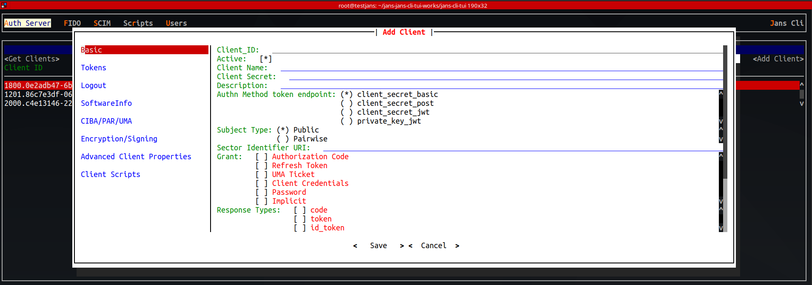

---
tags:
- administration
- configuration
- tools
- config
- tui
- text base UI
---

# TUI - Text based User Interface

The "Text User Interface" or "TUI" is a tool for admins to perform *ad
hoc* configuration of the Janssen Project software components.

You can run it by executing:

```
sudo /opt/jans/jans-cli/jans_cli_tui.py
```

The TUI calls the Jans Config API. A TUI client is configured out of the
box when you run either the VM or container Jans setup. The TUI utilizes the
OAuth Device Flow for user authentication--the default `admin` user created
during setup has the correct roles to use all the TUI features. Client
credentials, tokens and other data is stored in file `~/.config/jans-cli.ini` in
encoded format. The user-role mappings roles are defined in a Jans Auth Server
[introspection script](https://github.com/JanssenProject/jans/blob/main/docs/script-catalog/introspection/introspection-role-based-scope/introspection_role_based_scope.py)

```
~/.config/jans-cli.ini
```

## Plugins

It's possible to extend the TUI by writing a plugin. Each plugin is loaded
dynamically according to the numeric priority of the folders in
`/opt/jans/jans-cli/plugins`. To enable a plugin, you need to edit
`jans-cli.ini`. The default plugins are:

```
jca_plugins = user-mgt,scim,fido2,admin-ui

```

## Administration

When you run the TUI, this is the home panel:


### Auth Server

The most complicated configuration belongs to Auth Server. This should be no
surprise, because this component is responsible for the implementation of
OpenID Provider, OAuth Authorization Server, and UMA Authorization Server
endpoints.

- In below screenshot, we are getting the list of existing clients. 
- It's possible to get details of any client as well. Just hit enter on any client and  you will see information like this. 
- With the button which is located on right upper side named "Add Client", it's possible to create new client. 

### FIDO

The Janssen FIDO Server implements FIDO 2 and FIDO U2F endpoints. Using the
TUI, you can view/update details of the FIDO configuration.

There are two configurations included here:

- Dynamic Configuration 
- Static Configuration 

### SCIM

System for Cross-domain Identity Management, in short SCIM, is a specification
that simplifies the exchange of user identity information across different
domains. The Janssen Server provides implementation for the SCIM specification.

With Janssen CLI-TUI, it's possible to view / update SCIM configuration. 

## Command Line Logs
Jans TUI logs all write (post/put/patch) activities to file `<log-dir>/cli_cmd.log`, default `log-dir` is home directory 
of user executing TUI. Consider that we create a user as below


We will have following line in `cli_cmd.log`:

```
/usr/bin/python3 /opt/jans/jans-cli/cli/config_cli.py --operation-id post-user --data '{"customObjectClasses": ["top", "jansPerson"], "customAttributes": [{"name": "middleName", "multiValued": false, "values": [""]}, {"name": "sn", "multiValued": false, "values": ["Watts"]}, {"name": "nickname", "multiValued": false, "values": [""]}], "mail": "ewatts@foo.org", "userId": "ewatts", "displayName": "Emelia Watts", "givenName": "Emelia", "userPassword": "TopSecret", "jansStatus": "active"}'
```

By using this line, you can create user via `jans-config.py`, [see for example](using-command-line-log.md)


## Standalone Installation

Configure the Janssen server using the `jans-cli-tui` a Text based User Interface app which can be installed on any remote Linux machine.
There are two ways of achieving this:


### 1. Build pyz self executable file

```
pip3 install shiv
wget https://github.com/JanssenProject/jans/archive/refs/heads/main.zip -O jans-main.zip
unzip jans-main.zip
cd jans-main/jans-cli-tui/
make zipapp
```

After build you can execute as

```
./jans-cli-tui.pyz
```

You will be prompted for credentials if you do not have ` ~/.config/jans-cli.ini`. 
Contact your administrator for credentials. Administrator can obtain credidentials on Janssen Server as follows:

```
cat /opt/jans/jans-setup/setup.properties.last | grep tui_client
tui_client_encoded_pw=4jnkODv3KRV6xNm1oGQ8+g\=\=
tui_client_id=2000.eac308d1-95e3-4e38-87cf-1532af310a9e
tui_client_pw=GnEkCqg4Vsks
```

`tui_client_id` is the **Client ID** and `tui_client_pw` is the **Client Secret**


### 2. Installing with pip from GitHub

```
pip3 install https://github.com/JanssenProject/jans/archive/refs/heads/main.zip#subdirectory=jans-cli-tui
```

Execute:

```
jans-cli-tui
```
