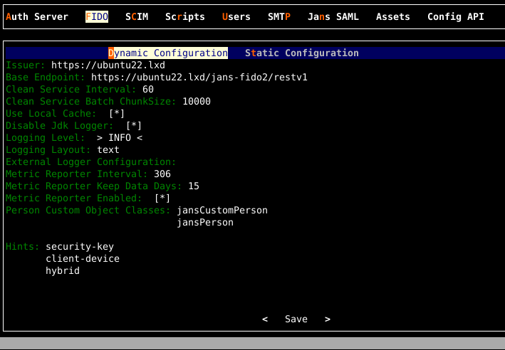

---
tags:
  - administration
  - configuration
  - fido2
---

# Janssen FIDO2 Configuration

The Janssen Server provides multiple configuration tools to perform these 
tasks.

=== "Use Command-line"

    Use the command line to perform actions from the terminal. Learn how to 
    use Jans CLI [here](../config-tools/jans-cli/README.md) or jump straight to 
    the [Using Command Line](#using-command-line)

=== "Use Text-based UI"

    Use a fully functional text-based user interface from the terminal. 
    Learn how to use Jans Text-based UI (TUI) 
    [here](../config-tools/jans-tui/README.md) or jump straight to the
    [Using Text-based UI](#using-text-based-ui)

=== "Use REST API"

    Use REST API for programmatic access or invoke via tools like CURL or 
    Postman. Learn how to use Janssen Server Config API 
    [here](../config-tools/config-api/README.md) or Jump straight to the
    [Using Configuration REST API](#using-configuration-rest-api)

##  Using Command Line


In the Janssen Server, you can deploy and customize the FIDO2 Configuration using the
command line. To get the details of Janssen command line operations relevant to
FIDO2 Configuration, you can check the operations under `Fido2Configuration` task using the
command below:


```bash title="Command"
jans cli --info Fido2Configuration
```

It will show the details of the available operation-ids for Fido2.

```text title="Sample Output"
Operation ID: get-properties-fido2
  Description: Gets Jans Authorization Server Fido2 configuration properties
Operation ID: put-properties-fido2
  Description: Updates Fido2 configuration properties
  Schema: Fido2:AppConfiguration

To get sample schema type jans cli --schema <schema>, for example jans cli --schema Fido2:AppConfiguration
```

### Get The Current Fido2 Configuration

To get the properties of Janssen Fido2 Configuration, run the command below:

```bash title="Command"
jans cli --operation-id get-properties-fido2
```

It will return the result as below:

```json title="Sample Output" linenums="1"
{
  "issuer": "https://jans-project.lxd",
  "baseEndpoint": "https://jans-project.lxd/jans-fido2/restv1",
  "cleanServiceInterval": 60,
  "cleanServiceBatchChunkSize": 10000,
  "useLocalCache": true,
  "disableJdkLogger": true,
  "loggingLevel": "INFO",
  "loggingLayout": "text",
  "metricReporterInterval": 300,
  "metricReporterKeepDataDays": 15,
  "metricReporterEnabled": true,
  "personCustomObjectClassList": [
    "jansCustomPerson",
    "jansPerson"
  ],
  "sessionIdPersistInCache": false,
  "errorReasonEnabled": false,
  "fido2Configuration": {
    "authenticatorCertsFolder": "/etc/jans/conf/fido2/authenticator_cert",
    "mdsCertsFolder": "/etc/jans/conf/fido2/mds/cert",
    "mdsTocsFolder": "/etc/jans/conf/fido2/mds/toc",
    "checkU2fAttestations": false,
    "debugUserAutoEnrollment": false,
    "unfinishedRequestExpiration": 180,
    "authenticationHistoryExpiration": 1296000,
    "serverMetadataFolder": "/etc/jans/conf/fido2/server_metadata",
    "enabledFidoAlgorithms": [
      "RS256",
      "ES256"
    ],
    "rp": [
      {
        "id": "https://jans-project.lxd",
        "origins": [
          "jans-project.lxd"
        ]
      }
    ],
    "disableMetadataService": false,
    "attestationMode": "monitor",
    "assertionOptionsGenerateEndpointEnabled": true
  }
}

```

### Update FIDO2 Configuration Properties

To update the configuration follow the steps below.

1. [Get the current configuration](#get-the-current-fido2-configuration) and store it into a file for editing
2. Edit and update the desired configuration values in the file while keeping other properties and values unchanged. Updates must adhere to the `Fido2:AppConfiguration` schema as mentioned [here](#using-command-line). The schema details can be retrieved using the command below. The schema defines what values and datatypes are acceptable for each property value.
 ```text title="Command"
 jans cli --schema Fido2:AppConfiguration
 ```
3. Use the updated file to send the update to the Janssen Server using the command below
 ```bash title="Command"
  jans cli --operation-id put-properties-fido2 --data /tmp/conf-data.json
 ```
 Upon successful execution of the update, the Janssen Server responds with updated configuration.


##  Using Text-based UI

In the Janssen Server, You can manage FIDO2 Configuration using 
the [Text-Based UI](../config-tools/jans-tui/README.md) also.

You can start TUI using the command below:

```bash title="Command"
jans tui
```

Navigate to `FIDO` section where administrators can update dynamic and static
configurations.




## Using Configuration REST API

Janssen Server Configuration REST API exposes relevant endpoints for 
managing and configuring the FIDO2 Configuration. Endpoint details 
are published in the [Swagger document](./../../reference/openapi.md).