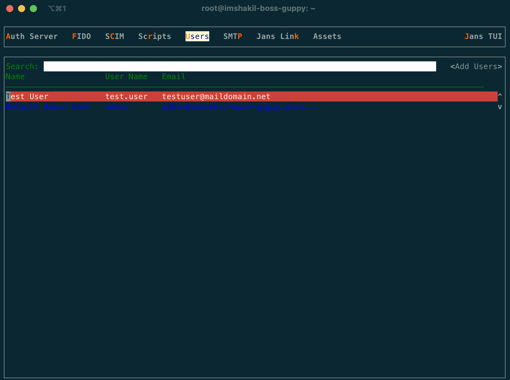
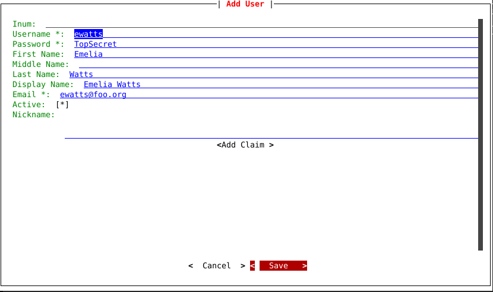
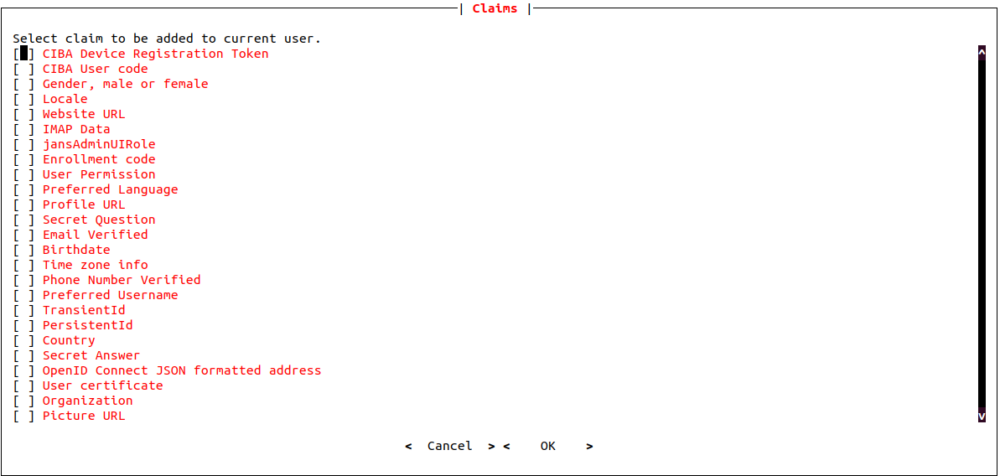
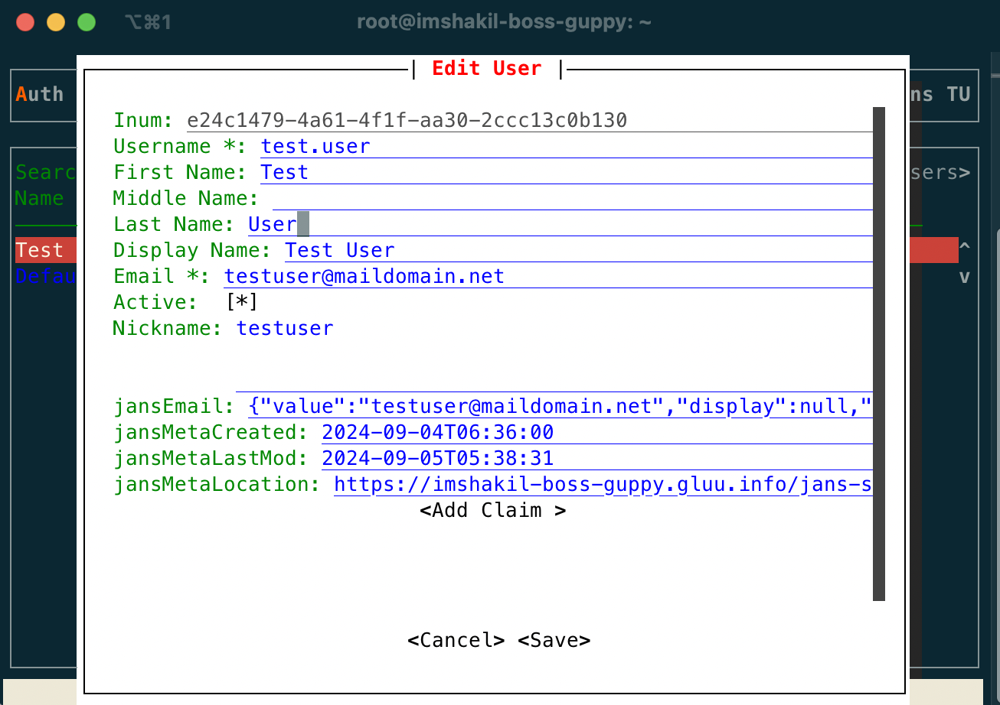
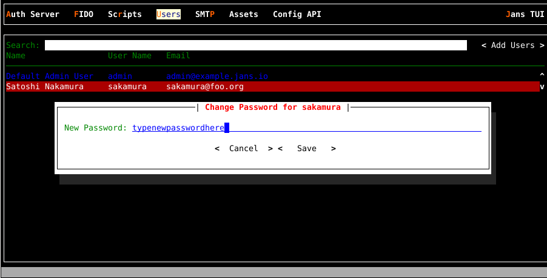
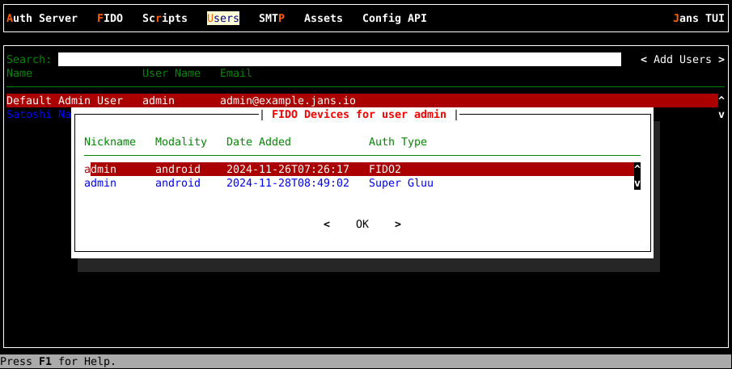
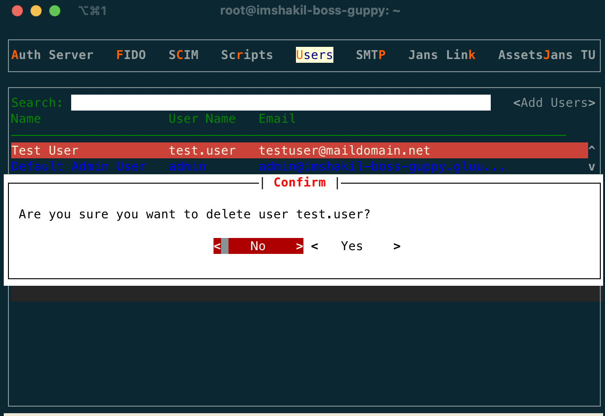

---
tags:
  - administration
  - configuration
  - user
---

# User Management

The Janssen Server provides multiple configuration tools to perform these
tasks.

=== "Use Command-line"

    Use the command line to perform actions from the terminal. Learn how to 
    use Jans CLI [here](../config-tools/jans-cli/README.md) or jump straight to 
    the [Using Command Line](#using-command-line)

=== "Use Text-based UI"

    Use a fully functional text-based user interface from the terminal. 
    Learn how to use Jans Text-based UI (TUI) 
    [here](../config-tools/jans-tui/README.md) or jump straight to the
    [Using Text-based UI](#using-text-based-ui)

=== "Use REST API"

    Use REST API for programmatic access or invoke via tools like CURL or 
    Postman. Learn how to use Janssen Server Config API 
    [here](../config-tools/config-api/README.md) or Jump straight to the
    [Using Configuration REST API](#using-configuration-rest-api)

## Using Command Line

In the Janssen Server, you can do CRUD operations for user management using its command line tool. To get the details of command line for CRUD operations relevant to User Management, you can find the `operation-id` under the `User` task using the Jans CLI in scim mode. The following command line:

```bash title="Command"
jans cli -scim --info User
```

```text title="Sample Output" linenums="1"
Operation ID: get-users
  Description: Query User resources (see section 3.4.2 of RFC 7644)
  Parameters:
  attributes: A comma-separated list of attribute names to return in the response [string]
  excludedAttributes: When specified, the response will contain a default set of attributes minus those listed here (as a comma-separated list) [string]
  filter: An expression specifying the search criteria. See section 3.4.2.2 of RFC 7644 [string]
  startIndex: The 1-based index of the first query result [integer]
  count: Specifies the desired maximum number of query results per page [integer]
  sortBy: The attribute whose value will be used to order the returned responses [string]
  sortOrder: Order in which the sortBy param is applied. Allowed values are "ascending" and "descending" [string]
Operation ID: create-user
  Description: Allows creating a User resource via POST (see section 3.3 of RFC 7644)
  Parameters:
  attributes: A comma-separated list of attribute names to return in the response [string]
  excludedAttributes: When specified, the response will contain a default set of attributes minus those listed here (as a comma-separated list) [string]
  Schema: UserResource
  Schema: UserResource
Operation ID: get-user-by-id
  Description: Retrieves a User resource by Id (see section 3.4.1 of RFC 7644)
  Parameters:
  attributes: A comma-separated list of attribute names to return in the response [string]
  excludedAttributes: When specified, the response will contain a default set of attributes minus those listed here (as a comma-separated list) [string]
  id: No description is provided for this parameter [string]
Operation ID: update-user-by-id
  Description: Updates a User resource (see section 3.5.1 of RFC 7644). Update works in a replacement fashion; every attribute value found in the payload sent will replace the one in the existing resource representation. Attributes not passed in the payload will be left intact.
  Parameters:
  attributes: A comma-separated list of attribute names to return in the response [string]
  excludedAttributes: When specified, the response will contain a default set of attributes minus those listed here (as a comma-separated list) [string]
  id: No description is provided for this parameter [string]
  Schema: UserResource
  Schema: UserResource
Operation ID: delete-user-by-id
  Description: Deletes a user resource
  Parameters:
  id: Identifier of the resource to delete [string]
Operation ID: patch-user-by-id
  Description: Updates one or more attributes of a User resource using a sequence of additions, removals, and replacements operations. See section 3.5.2 of RFC 7644
  Parameters:
  attributes: A comma-separated list of attribute names to return in the response [string]
  excludedAttributes: When specified, the response will contain a default set of attributes minus those listed here (as a comma-separated list) [string]
  id: No description is provided for this parameter [string]
  Schema: PatchRequest
  Schema: PatchRequest
Operation ID: search-user
  Description: Query User resources (see section 3.4.2 of RFC 7644)
  Schema: SearchRequest
  Schema: SearchRequest

To get sample schema type jans cli -scim --schema-sample <schema>, for example jans cli -scim --schema-sample SearchRequest
```

### Get Users List

This operation is used to get list of the users and its properties. The following command line: 
  
```bash title="Command"
jans cli -scim --operation-id get-users
```

```json title="Sample Output" linenums="1"
{
  "schemas": [
    "urn:ietf:params:scim:api:messages:2.0:ListResponse"
  ],
  "totalResults": 1,
  "startIndex": 1,
  "itemsPerPage": 1,
  "Resources": [
    {
      "schemas": [
        "urn:ietf:params:scim:schemas:core:2.0:User"
      ],
      "id": "f764391d-56de-4b74-b0a2-f32814706dcc",
      "meta": {
        "resourceType": "User",
        "location": "https://imshakil-boss-guppy.gluu.info/jans-scim/restv1/v2/Users/f764391d-56de-4b74-b0a2-f32814706dcc"
      },
      "userName": "admin",
      "name": {
        "familyName": "User",
        "givenName": "Admin",
        "middleName": "Admin",
        "formatted": "Admin Admin User"
      },
      "displayName": "Default Admin User",
      "nickName": "Admin",
      "active": true,
      "emails": [
        {
          "value": "admin@imshakil-boss-guppy.gluu.info",
          "primary": false
        }
      ],
      "groups": [
        {
          "value": "60B7",
          "display": "Janssen Manager Group",
          "type": "direct",
          "$ref": "https://imshakil-boss-guppy.gluu.info/jans-scim/restv1/v2/Groups/60B7"
        }
      ]
    }
  ]
}

```

As shown in the [output](#using-command-line) for `--info` command, `get-users` operation-id also supports parameters for the advanced search. Those parameters are:

    1. attributes
    2. excludeAttributes
    3. filter
    4. count [define maximum number of query]
    5. sortBy [attribute]
    6. sortOrder ['ascending', 'descending']

This is an example with `endpoint-args`:

```bash title="Command"
jans cli -scim --operation-id get-users --endpoint-args attributes:emails
```

```json title="Sample Output" linenums="1"
{
  "schemas": [
    "urn:ietf:params:scim:api:messages:2.0:ListResponse"
  ],
  "totalResults": 1,
  "startIndex": 1,
  "itemsPerPage": 1,
  "Resources": [
    {
      "schemas": [
        "urn:ietf:params:scim:schemas:core:2.0:User"
      ],
      "id": "f764391d-56de-4b74-b0a2-f32814706dcc",
      "emails": [
        {
          "value": "admin@imshakil-boss-guppy.gluu.info",
          "primary": false
        }
      ]
    }
  ]
}
```

### Creating a New User

To create a new user using Jans CLI, we can use `create-user` operation-id. As shown in the [output](#using-command-line) for `--info` command, the `create-user` operation requires data to be sent according to `UserResource` schema. To see the schema, use the command as below:

```bash title="Command"
jans cli -scim --schema UserResource
```

The Janssen Server also provides sample data for the above schema. Let's run the following command to get the sample schema:

```bash title="Command"
jans cli -scim --schema-sample UserResource
```

From the above example of schema file, we can fill required values in a data file `/tmp/user.json`. As we have seen in the sample schema there are lot of properties, but we are going to fill minimum to create a `test user`:

```json title="user.json" linenums="1"
{
  "userName": "test.user",
  "displayName": "Test User",
  "nickName": "testu",
  "active": true,
  "password": "pass@word",
  "emails": [
	  {
		  "value": "testuser@maildomain.net",
		  "primary": true
	  }
  ]
}
```

Let's run the following command to create user in Janssen Server:

```bash title="Command"
jans cli -scim --operation-id create-user --data /tmp/user.json
```

```json title="Output"
{
  "schemas": [
    "urn:ietf:params:scim:schemas:core:2.0:User"
  ],
  "id": "e24c1479-4a61-4f1f-aa30-2ccc13c0b130",
  "meta": {
    "resourceType": "User",
    "created": "2024-09-04T06:36:00.882Z",
    "lastModified": "2024-09-04T06:36:00.882Z",
    "location": "https://imshakil-boss-guppy.gluu.info/jans-scim/restv1/v2/Users/e24c1479-4a61-4f1f-aa30-2ccc13c0b130"
  },
  "userName": "test.user",
  "displayName": "Test User",
  "nickName": "testu",
  "active": true,
  "emails": [
    {
      "value": "testuser@maildomain.net",
      "primary": true
    }
  ]
}
```

### Find User by Id

We can retrieve user details using user's `id`. For example in the above created user id is `e24c1479-4a61-4f1f-aa30-2ccc13c0b130`. To get the user details by user id, We can use the `get-user-by-id` operation as below:

```bash title="Command"
jans cli -scim --operation-id get-user-by-id \
--url-suffix="id:e24c1479-4a61-4f1f-aa30-2ccc13c0b130"
```

```json title="Output"
{
  "schemas": [
    "urn:ietf:params:scim:schemas:core:2.0:User"
  ],
  "id": "e24c1479-4a61-4f1f-aa30-2ccc13c0b130",
  "meta": {
    "resourceType": "User",
    "created": "2024-09-04T06:36:00.882Z",
    "lastModified": "2024-09-04T06:36:00.882Z",
    "location": "https://imshakil-boss-guppy.gluu.info/jans-scim/restv1/v2/Users/e24c1479-4a61-4f1f-aa30-2ccc13c0b130"
  },
  "userName": "test.user",
  "displayName": "Test User",
  "nickName": "testu",
  "active": true,
  "emails": [
    {
      "value": "testuser@maildomain.net",
      "primary": true
    }
  ]
}
```

### Update User by Id

Using Jans CLI, We can update user information. As shown in the [output](#using-command-line) command, the `update-user-by-id` operation requires user data that needs to be changed. You can find details of user properties in [schema](#creating-a-new-user). Let's change the `nickname` for the above `Test user`. First,we need to put the update data into a json file `/tmp/update-user.json`:


```json title='update-user.json
{
  "nickName": "testuser"
 }
```

Let's run the following command:

```bash title="Command"
jans cli -scim --operation-id update-user-by-id \
--url-suffix="id:e24c1479-4a61-4f1f-aa30-2ccc13c0b130" --data /tmp/update-user.json
```


```json title="Sample Output"
{
  "schemas": [
    "urn:ietf:params:scim:schemas:core:2.0:User"
  ],
  "id": "e24c1479-4a61-4f1f-aa30-2ccc13c0b130",
  "meta": {
    "resourceType": "User",
    "created": "2024-09-04T06:36:00.882Z",
    "lastModified": "2024-09-05T05:38:31.491Z",
    "location": "https://imshakil-boss-guppy.gluu.info/jans-scim/restv1/v2/Users/e24c1479-4a61-4f1f-aa30-2ccc13c0b130"
  },
  "userName": "test.user",
  "displayName": "Test User",
  "nickName": "testuser",
  "active": true,
  "emails": [
    {
      "value": "testuser@maildomain.net",
      "primary": true
    }
  ]
}
```

### Patch User by Id

Using `patch-user-by-id` operation, We can modify user properties partially. As we have seen in the [Output](#using-command-line) of `--info` command, `patch-user-by-id` operation requires `PatchRequest` [schema](../config-tools/jans-cli/README.md#about-schemas) definition for payload data. To get the sample `PatchRequest` schema, run the followwing command:

```bash titl="Command"
jans cli -scim --schema-sample PatchRequest
```

For example, In the above `test user`, we are going to `add` one more email, `remove` nickName and `replace` displayName. Let's put all the operations in a json file `/tmp/patch-user.json`:

```json title="patch-user.json"
{
    "schemas": [
        "urn:ietf:params:scim:api:messages:2.0:PatchOp"
    ],
    "Operations": [
        {
            "op": "replace",
            "path": "displayName",
            "value": "Test User"
        },
        {
            "op": "add",
            "path": "emails",
            "value": [
                {
                    "value": "test.user@example.jans.io",
                    "primary": true
                }
            ]
        },
        {
            "op": "remove",
            "path": "nickName"
        }
    ]
}
```

The command line to run all of these operations:

```bash title="Command"
jans cli -scim --operation patch-user-by-id \
--url-suffix="id:e24c1479-4a61-4f1f-aa30-2ccc13c0b130" \
--data /tmp/patch-user.json
```

### Delete User by ID

To delete the, run the following command with the specific user ID as `--url-suffix=id:user-id`. For example, let's delete the `test user` we have created earlier:

```bash title="Command"
jans cli -scim --operation-id delete-user-by-id \
--url-suffix="id:e24c1479-4a61-4f1f-aa30-2ccc13c0b130"
```

## Using Text-based UI

Using TUI, We can add, update and deleter users in the Janssen Server. To do that, Let's start TUI using the command below:

```bash title="Command"
/opt/jans/jans-cli/jans_cli_tui.py
```

Navigate to `Users` to open the users tab as shown in the image below:



- We can see the list of users from search option
- To get the list of users available in the Janssen Server, bring the control to `Search` box (using `tab` key) and press `Enter` key.

Let's see at a glance of available user attributes.

|Attributes|Description|
|---|---|
|Username|...| 
|Password |...|
|First Name|...|
|Middle Name|...|
|Last Name|...|
|Display Name|...|
|Email |...|
|Active|...|
|Nickname|...|
|CIBA Device Registration Token|...|
|CIBA User code|...|
|Locale|...|      
|Website URL|...| 
|IMAP Data|...|   
|jansAdminUIRole|...|
|Enrollment code|...|
|User Permission|...|
|Preferred Language|...|
|Profile URL|...|
|Secret Question|...|
|Email Verified|...|
|Birthdate|...|   
|Time zone info|...|
|Phone Number verified|...|
|Preferred Username|...|
|TransientId|...| 
|PersistentId|...|
|Country|...|     
|Secret Answer|...|
|OpenID Connect JSON formatted address|...|
|User certificate|...|
|Organization|...|
|Picture URL|...| 

### Add User

Let's add an user by selecting `Add Users` tab. Initially we can provide bellow attributes value,



We can add extra claims simply by slecting `Add Claim`



Finally `save` and exit. We will get an unique `inum`

### Update User

To modify any user properties, find the user from search box and hit `Enter` to pop-up user details, update user details and finally hit on `Save` button to update the changes. 



### Change User Password
No chance to recover user password, but you can change.
To change password of a user navigate/or search user and press key `p` when the target user is higlighted.
In the figure below, passowrd of user **sakamura** is being changed.



Once you write new password (it will be displayed while you type), go to button `< Save >` and press Enter.

### Manage User FIDO Devices
To view and manage users registered FIDO devices, first navigate/or search user and press key  `f` on the keyboard.
If user has any registered FIDO device, a popup will appears as in image below:



You can veiw details of a device by pressing Enter. To delete a device press key `d`, you will be
prompted for confirmation.


### Delete User

To delete user, bring the control on the specific user row and press `delete` or `d` key from keyboard. It will show a pop-up for confirmation as below:



## Using Configuration REST API

Janssen Server Configuration REST API exposes relevant endpoints for managing
and configuring the OpenID Connect Client. Endpoint details are published in the [Swagger
document](../../reference/openapi.md).

### Get SCIM Client

Let's obtain the credentials of this client first. In TUI, navigate to `Auth Server > Clients`. In the search field type SCIM (uppercase). Highlight the row that matches a client named "SCIM Client" and press Enter. To see in `JSON` formate please press `d`.

From the "Basic" section, grab the "client id" and "client secret". This secret is encrypted, to decrypt it, in a terminal run `/opt/jans/bin/encode.py -D ENCRYPTED-SECRET-HERE`.

### Get Access token

Let's get a token,

```
curl -k -u 'CLIENT_ID:DECRYPTED_CLIENT_SECRET' -k -d grant_type=client_credentials -d scope='https://jans.io/scim/users.read https://jans.io/scim/users write' https://<jans-server>/jans-auth/restv1/token > /tmp/token.json
```

In response `token.json` we will get `access_token`

```
{
"access_token":"11a76589-7955-4247-9ca5-f3ad7884305...",
"scope":"https://jans.io/scim/users.read",
"token_type":"Bearer",
"expires_in":299
}
```

### Retrive existing User 

To get an existing user 

```
curl -k -G -H 'Authorization: Bearer ACCESS_TOKEN' --data-urlencode 'filter=displayName co "Admin"' https://<jans-server>/jans-scim/restv1/v2/Users > /tmp/user.json
```
In response `user.json` we will get 
```
{
  "schemas": [
    "urn:ietf:params:scim:api:messages:2.0:ListResponse"
  ],
  "totalResults": 1,
  "startIndex": 1,
  "itemsPerPage": 1,
  "Resources": [
    {
      "schemas": [
        "urn:ietf:params:scim:schemas:core:2.0:User"
      ],
      "id": "5fdbb720-a1fd-477f-af92-b7c054f02c98",
      "meta": {
        "resourceType": "User",
        "created": "2023-06-12T14:54:09.531Z",
        "location": "https://raju.jans13.me/jans-scim/restv1/v2/Users/5fdbb720-a1fd-477f-af92-b7c054f02c98"
      },
      "userName": "admin",
      "name": {
        "familyName": "...",
        "givenName": "...",
        "middleName": "...",
        "formatted": "..."
      },
      "displayName": "Admin",
      "active": true,
      "emails": [
        {
          "value": "example@gluu.org",
          "primary": false
        }
      ],
      "groups": [
        {
          "value": "60B7",
          "display": "Jannsen Manager Group",
          "type": "direct",
          "$ref": "https://raju.jans13.me/jans-scim/restv1/v2/Groups/60B7"
        }
      ]
    }
  ]
}
```

### Create an User

Let's start creating a dummy user. A client sends a POST request containing a "User" to the "/Users" endpoint. 
```
POST /Users  HTTP/1.1
Host: example.com
Accept: application/scim+json
Content-Type: application/scim+json
Authorization: Bearer h480djs93hd8..
Content-Length: ...

{
  "schemas": [
    "urn:ietf:params:scim:schemas:core:2.0:User"
  ],
  "userName": "bjensen",
  "externalId": "bjensen",
  "name": {
    "formatted": "Ms. Barbara J Jensen III",
    "familyName": "Jensen",
    "givenName": "Barbara"
  }
}
```
Open a text editor and copy paste the json body, name as `input.json`.
Hit on your terminal with bellow command.
```
curl -k -H 'Authorization: Bearer ACCESS_TOKEN' -H 'Content-Type: application/scim+json' -d @input.json -o output.json https://<jans-server>/jans-scim/restv1/v2/Users
```
response looks like 
```
{
    "schemas": [
        "urn:ietf:params:scim:schemas:core:2.0:User"
    ],
    "id": "e3009115-b890-4d8b-bd63-bbfef34aa583",
    "externalId": "bjensen",
    "meta": {
        "resourceType": "User",
        "created": "2023-06-26T19:43:32.945Z",
        "lastModified": "2023-06-26T19:43:32.945Z",
        "location": "https://raju.jans13.me/jans-scim/restv1/v2/Users/e3009115-b890-4d8b-bd63-bbfef34aa583"
    },
    "userName": "bjensen",
    "name": {
        "familyName": "Jensen",
        "givenName": "Barbara",
        "formatted": "Ms. Barbara J Jensen III"
    }
}
```

This new user has been given an `id`. If possible, inspect your `ou=people` branch and find the entry whose `inum` matches the `id` given. An easier option would be to via **Jans TUI** and go to `Users` and search "bjensen" to see the recently created user.

### Updating a User(PUT)

Overwrite your `input.json` with the following. Replace content in angle brackets accordingly:

```
{
  "schemas": [
    "urn:ietf:params:scim:schemas:core:2.0:User"
  ],
  "id": "e3009115-b890-4d8b-bd63-bbfef34aa583",
  "userName": "bjensen",
  "externalId": "bjensen",
  "name": {
    "formatted": "Ms. Barbara J Jensen III",
    "familyName": "Jensen",
    "givenName": "Barbara"
  },
  "displayName": "Jensen Barbara",
  "emails": [
    {
      "value": "jensen@example.com",
      "type": "work",
      "primary": true
    }
  ]
}
```

**PUT with curl**:

```
curl -k -X PUT -H 'Authorization: Bearer ACCESS_TOKEN' -H 'Content-Type: application/scim+json' -d @input.json -o output.json https://<jans-server>/jans-scim/restv1/v2/Users/<user-inum>
```

Response `(output.json)` will show the same contents of a full retrieval.

Please verify changes were applied whether by inspecting LDAP or issuing a GET. If you have followed the steps properly, you should notice a new e-mail added and the change in `displayName` attribute


### Updating a User (PATCH)

With patching, you can be very precise about the modifications you want to apply. Patching syntax follows JSON Patch spec (RFC 6902) closely. While it's not a must to read the RFC to learn how patch works, see section 3.5.2 of SCIM protocol (RFC 7644) to get the grasp.

If you prefer reading code, [patch test cases](https://github.com/JanssenProject/jans/tree/main/jans-scim/client/src/test/java/io/jans/scim2/client/patch) found in the Java scim-client project are worth to look at.

The following is a simple example that illustrates the kind of modifications developers can achieve via `PATCH`. Overwrite your `input.json` with the following:

```
{
  "schemas": [
    "urn:ietf:params:scim:api:messages:2.0:PatchOp"
  ],
  "Operations": [
    {
      "op": "replace",
      "value": {
        "name": {
          "givenName": "Joey"
        }
      }
    },
    {
      "op": "replace",
      "path": "emails[type eq \"work\" or primary eq false].value",
      "value": "jensen@example.com"
    },
    {
      "op": "add",
      "value": {
        "name": {
          "middleName": "Jhon"
        }
      }
    },
    {
      "op": "add",
      "value": {
        "emails": [
          {
            "primary": true,
            "value": "my@own.mail"
          }
        ],
        "phoneNumbers": [
          {
            "type": "home",
            "value": "5 123 8901"
          },
          {
            "value": "5 123 8902"
          }
        ]
      }
    },
    {
      "op": "remove",
      "path": "name.middleName"
    },
    {
      "op": "remove",
      "path": "phoneNumbers[value ew \"01\"].type"
    }
  ]
}
```

A collection of modification are provided under "Operations". They are processed in order of appearance. Also, every operation has a type; patching supports add, remove and replace.

The first operations states the following: replace the value of `givenName` subattribute (that belongs to complex attribute `name`) with the string "Joey".

Operations are easier to understand when using a "path". The second operation replaces the value subattribute inside the complex multi-valued attribute emails. Inside the square brackets, we find a filter expression, so the replacement does not apply to all emails in the list but only to those matching the criterion.

So the second operation can be read as "set the value of value subattribute to string `jensen@example.com` where the type subattribute of the `email` equals to string "work" or if primary attribute is false".

The third operation is similar to the first. It sets the value of a subattribute which was unassigned (null). You could have used "replace" operation in this case and results would have been identical.

The fourth operation is more interesting. It adds to the current list of emails a new one. It supplies a couple of subattributes for the email to include: primary and value. Additionally, we set the value of (previously unassigned) phoneNumbers multi-valued attribute passing a list of elements.

In the fifth operation, we remove the `middleName` attribute that was set in operation three. Note how we make explicit the path of data to nullify: "name.middleName".

The sixth operation allows us to remove a specific subattribute of `phoneNumbers`. The aim is to nullify the "type" of the item whose phone number value ends with "01". The remove operation can also be used to remove a complete item from a list, or empty the whole list by providing a suitable value for "path".

Now let's see it in action:


```
curl -k -X PATCH -H 'Authorization: Bearer ACCESS_TOKEN' -H 'Content-Type: application/scim+json' -d @input.json -o output.json https://<jans-server>/jans-scim/restv1/v2/Users/<user-inum>
```

So far our resource look like this

```
{
  "schemas": [
    "urn:ietf:params:scim:schemas:core:2.0:User"
  ],
  "id": "e3009115-b890-4d8b-bd63-bbfef34aa583",
  "externalId": "bjensen",
  "meta": {
    "resourceType": "User",
    "created": "2023-06-26T19:43:32.945Z",
    "lastModified": "2023-06-26T22:34:27.465Z",
    "location": "https://raju.jans13.me/jans-scim/restv1/v2/Users/e3009115-b890-4d8b-bd63-bbfef34aa583"
  },
  "userName": "bjensen",
  "name": {
    "familyName": "Jensen",
    "givenName": "Joey",
    "formatted": "Ms. Barbara J Jensen III"
  },
  "displayName": "Jensen Barbara",
  "active": false,
  "emails": [
    {
      "value": "my@own.mail",
      "primary": true
    },
    {
      "value": "jensen@example.com",
      "type": "work",
      "primary": false
    }
  ],
  "phoneNumbers": [
    {
      "value": "5 123 8901"
    },
    {
      "value": "5 123 8902"
    }
  ]
}
```

Note the primary subattribute accompanying `email` "my@own.mail" is false but when inserted we provided `true`. This is because the SCIM specification states that after modifications are applied to resources **(PUT or PATCH)**, there cannot be more than one item in a multi-valued attribute with primary value set as `true`.

To see more sample `JSON` payloads, check the `.json` files used by the scim-client test cases referenced above.

### Deleting Users

For deleting, the `DELETE `method of `HTTP` is used.

No input file is used in this case. A delete request could be the following:

```
curl -k -X DELETE -H 'Authorization: Bearer ACCESS_TOKEN' https://<jans-server>/jans-scim/restv1/v2/Users/<user-inum>
```

Use the inum of our dummy user, **Jensen Barbara**.

Check your LDAP or via Jans TUI to see that **Bjensen** is gone.