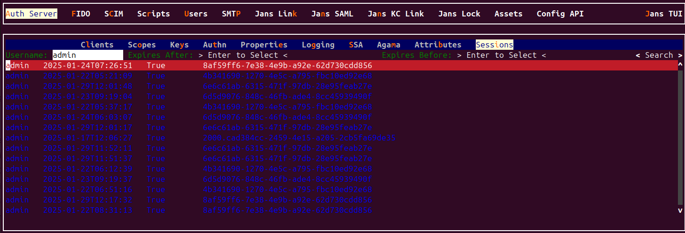
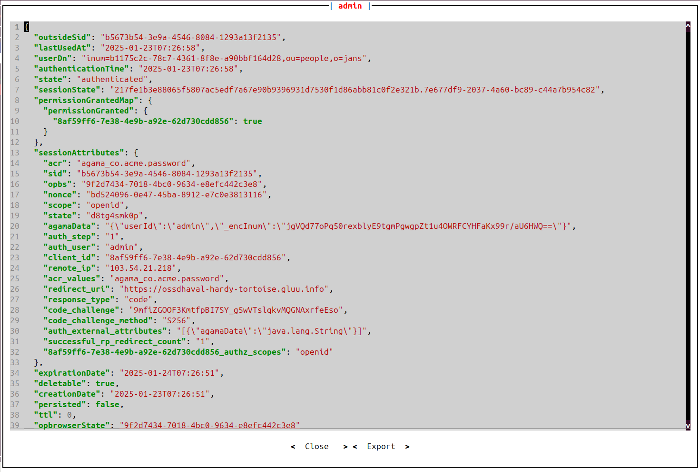

---
tags:

 - administration
 - configuration
 - session
---


# Session

The Janssen Server provides multiple configuration tools to manage the session.

=== "Use Command-line"

    Use the command line to perform actions from the terminal. Learn how to
    use Jans CLI [here](../config-guide/config-tools/jans-cli/README.md) or jump straight to
    the [Using Command Line](#using-the-command-line)

=== "Use Text-based UI"

    Use a fully functional text-based user interface from the terminal.
    Learn how to use Jans Text-based UI (TUI)
    [here](../config-guide/config-tools/jans-tui/README.md) or jump straight to the
    [Using Text-based UI](#using-text-based-ui)

=== "Use REST API"

    Use REST API for programmatic access or invoke it via tools like CURL or
    Postman. Learn how to use Janssen Server Config API
    [here](../config-guide/config-tools/config-api/README.md) or jump straight to the
    [Using Configuration REST API](#using-configuration-rest-api)


## Using The Command Line


In the Janssen Server, you can get session detail using the
command line. To get the details of Janssen command line operations relevant to
the session, check the operations under the `AuthSessionManagement` task using the
command below.


```bash title="Command"
jans cli --info AuthSessionManagement
```

```text title="Sample Output" linenums="1"
Operation ID: get-session-by-id
  Description: Get session by id.
  Parameters:
  sid: Session identifier. [string]
Operation ID: delete-session
  Description: Delete a session.
  Parameters:
  sid: Session identifier. [string]
Operation ID: revoke-user-session
  Description: Revoke all sessions by userDn
  Parameters:
  userDn: User domain name [string]
Operation ID: get-sessions
  Description: Return all session
Operation ID: search-session
  Description: Search session
  Parameters:
  limit: Search size - max size of the results to return [integer]
  pattern: Search pattern [string]
  startIndex: The 1-based index of the first query result [integer]
  sortBy: Attribute whose value will be used to order the returned response [string]
  sortOrder: Order in which the sortBy param is applied. Allowed values are "ascending" and "descending" [string]
  fieldValuePair: Field and value pair for seraching [string]

```


### Get All Sessions

Use the operation ID get-sessions to get all the sessions on the Janssen Server.


```bash title="Command"
jans cli --operation-id get-sessions
```


```json title="Sample Output" linenums="1"
{
  "start": 0,
  "totalEntriesCount": 57,
  "entriesCount": 50,
  "entries": [
    {
      "outsideSid": "52aaa70c-f526-43fb-bf0d-3fb86fbd171c",
      "lastUsedAt": "2025-01-22T09:11:35",
      "authenticationTime": "2025-01-22T09:11:35",
      "state": "unauthenticated",
      "sessionState": "752d881d793fa7ee8c0e93d55d64ea091783dd0aa34087dd35eeb15d85e356dc.01d7ca76-a5fa-4fa0-b8a4-40ea6506f596",
      "permissionGrantedMap": {
        "permissionGranted": {
          "6d5d9076-848c-46fb-ade4-8cc45939490f": false
        }
      },
      "sessionAttributes": {
        "acr": "agama_co.acme.password",
        "opbs": "3e2343ab-f53f-462a-85c1-54ee2fab282d",
        "scope": "openid",
        "auth_step": "1",
        "client_id": "6d5d9076-848c-46fb-ade4-8cc45939490f",
        "remote_ip": "103.54.21.218",
        "acr_values": "agama_co.acme.password",
        "redirect_uri": "https://ossdhaval-hardy-tortoise.gluu.info",
        "response_type": "code"
      },
      "expirationDate": "2025-01-22T11:11:35",
      "deletable": true,
      "creationDate": "2025-01-22T09:11:35",
      "persisted": false,
      "ttl": 0,
      "opbrowserState": "3e2343ab-f53f-462a-85c1-54ee2fab282d"
    },
    {
      "outsideSid": "b5673b54-3e9a-4546-8084-1293a13f2135",
      "lastUsedAt": "2025-01-23T07:26:58",
      "userDn": "inum=b1175c2c-78c7-4361-8f8e-a90bbf164d28,ou=people,o=jans",
      "authenticationTime": "2025-01-23T07:26:58",
      "state": "authenticated",
      "sessionState": "217fe1b3e88065f5807ac5edf7a67e90b9396931d7530f1d86abb81c0f2e321b.7e677df9-2037-4a60-bc89-c44a7b954c82",
      "permissionGrantedMap": {
        "permissionGranted": {
          "8af59ff6-7e38-4e9b-a92e-62d730cdd856": true
        }
      },
    }
.....
.....
.....

```


### Get Session by ID


We can view the specific session details through its `sid` using `get-session-by-id` operation.
For example, we can use `sid:bdb46abb-06e6-453e-9251-b0b697070d6a` with `--url-suffix` to retrieve 
the session details.

The following command is below:

```bash title="Command"
jans cli --operation-id get-session-by-id \
--url-suffix="sid:bdb46abb-06e6-453e-9251-b0b697070d6a"
```


```json title="Command Output" linenums="1"
{
  "outsideSid": "bdb46abb-06e6-453e-9251-b0b697070d6a",
  "lastUsedAt": "2025-01-17T06:05:59",
  "userDn": "inum=b1175c2c-78c7-4361-8f8e-a90bbf164d28,ou=people,o=jans",
  "authenticationTime": "2025-01-17T06:05:59",
  "state": "authenticated",
  "sessionState": "b74bda0d78e525b5066b73dc6421247a27902490193b2729b037c09b5da82151.07f309ef-413f-46e1-9a14-c571d3d3117f",
  "permissionGrantedMap": {
    "permissionGranted": {
      "61589e3d-bed3-42b2-8153-06a93e851644": true
    }
  },
  "sessionAttributes": {
    "acr": "agama_org.gluu.agama.pw.main",
    "sid": "bdb46abb-06e6-453e-9251-b0b697070d6a",
    "opbs": "870cd8ae-80da-40b5-b739-443f013285b9",
    "scope": "openid",
    "agamaData": "{\"userId\":\"admin\",\"_encInum\":\"jgVQd77oPq50rexblyE9tgmPgwgpZt1u4OWRFCYHFaKx99r/aU6HWQ==\"}",
    "auth_step": "1",
    "auth_user": "admin",
    "client_id": "61589e3d-bed3-42b2-8153-06a93e851644",
    "remote_ip": "103.54.21.218",
    "acr_values": "agama_org.gluu.agama.pw.main",
    "redirect_uri": "https://ossdhaval-hardy-tortoise.gluu.info",
    "response_type": "code",
    "auth_external_attributes": "[{\"agamaData\":\"java.lang.String\"}]",
    "successful_rp_redirect_count": "1",
    "61589e3d-bed3-42b2-8153-06a93e851644_authz_scopes": "openid"
  },
  "expirationDate": "2025-01-18T06:05:28",
  "deletable": true,
  "creationDate": "2025-01-17T06:05:28",
  "persisted": false,
  "ttl": 0,
  "opbrowserState": "870cd8ae-80da-40b5-b739-443f013285b9"
}


```


### Search session

We can search the session based on the `limit` using the `search-session` operation.
For example, if we set the limit to 2, we will receive the details of two sessions.

```bash title="Command"
jans cli --operation-id search-session \
--endpoint-args limit:2
```


```json title="Command Output" linenums="1"
{
  "start": 0,
  "totalEntriesCount": 57,
  "entriesCount": 2,
  "entries": [
    {
      "outsideSid": "52aaa70c-f526-43fb-bf0d-3fb86fbd171c",
      "lastUsedAt": "2025-01-22T09:11:35",
      "authenticationTime": "2025-01-22T09:11:35",
      "state": "unauthenticated",
      "sessionState": "752d881d793fa7ee8c0e93d55d64ea091783dd0aa34087dd35eeb15d85e356dc.01d7ca76-a5fa-4fa0-b8a4-40ea6506f596",
      "permissionGrantedMap": {
        "permissionGranted": {
          "6d5d9076-848c-46fb-ade4-8cc45939490f": false
        }
      },
      "sessionAttributes": {
        "acr": "agama_co.acme.password",
        "opbs": "3e2343ab-f53f-462a-85c1-54ee2fab282d",
        "scope": "openid",
        "auth_step": "1",
        "client_id": "6d5d9076-848c-46fb-ade4-8cc45939490f",
        "remote_ip": "103.54.21.218",
        "acr_values": "agama_co.acme.password",
        "redirect_uri": "https://ossdhaval-hardy-tortoise.gluu.info",
        "response_type": "code"
      },
      "expirationDate": "2025-01-22T11:11:35",
      "deletable": true,
      "creationDate": "2025-01-22T09:11:35",
      "persisted": false,
      "ttl": 0,
      "opbrowserState": "3e2343ab-f53f-462a-85c1-54ee2fab282d"
    },
    {
      "outsideSid": "b5673b54-3e9a-4546-8084-1293a13f2135",
      "lastUsedAt": "2025-01-23T07:26:58",
      "userDn": "inum=b1175c2c-78c7-4361-8f8e-a90bbf164d28,ou=people,o=jans",
      "authenticationTime": "2025-01-23T07:26:58",
      "state": "authenticated",
      "sessionState": "217fe1b3e88065f5807ac5edf7a67e90b9396931d7530f1d86abb81c0f2e321b.7e677df9-2037-4a60-bc89-c44a7b954c82",
      "permissionGrantedMap": {
        "permissionGranted": {
          "8af59ff6-7e38-4e9b-a92e-62d730cdd856": true
        }
      },
      "sessionAttributes": {
        "acr": "agama_co.acme.password",
        "sid": "b5673b54-3e9a-4546-8084-1293a13f2135",
        "opbs": "9f2d7434-7018-4bc0-9634-e8efc442c3e8",
        "nonce": "bd524096-0e47-45ba-8912-e7c0e3813116",
        "scope": "openid",
        "state": "d8tg4smk0p",
        "agamaData": "{\"userId\":\"admin\",\"_encInum\":\"jgVQd77oPq50rexblyE9tgmPgwgpZt1u4OWRFCYHFaKx99r/aU6HWQ==\"}",
        "auth_step": "1",
        "auth_user": "admin",
        "client_id": "8af59ff6-7e38-4e9b-a92e-62d730cdd856",
        "remote_ip": "103.54.21.218",
        "acr_values": "agama_co.acme.password",
        "redirect_uri": "https://ossdhaval-hardy-tortoise.gluu.info",
        "response_type": "code",
        "code_challenge": "9mfiZGOOF3KmtfpBI7SY_g5wVTslqkvMQGNAxrfeEso",
        "code_challenge_method": "S256",
        "auth_external_attributes": "[{\"agamaData\":\"java.lang.String\"}]",
        "successful_rp_redirect_count": "1",
        "8af59ff6-7e38-4e9b-a92e-62d730cdd856_authz_scopes": "openid"
      },
      "expirationDate": "2025-01-24T07:26:51",
      "deletable": true,
      "creationDate": "2025-01-23T07:26:51",
      "persisted": false,
      "ttl": 0,
      "opbrowserState": "9f2d7434-7018-4bc0-9634-e8efc442c3e8"
    }
  ]
}
```


### Delete a session

We can delete the specific session through its `sid` using delete-session` operation.
For example, We can use `sid:bdb46abb-06e6-453e-9251-b0b697070d6a` with `--url-suffix` to delete the session.
The following command is below:


```bash title="Command"
jans cli --operation-id delete-session /
--url-suffix="sid:bdb46abb-06e6-453e-9251-b0b697070d6a"
```


This message will be displayed:

```
Object was successfully deleted.
```

### Revoke all sessions by userDn


We can revoke the session for the user through its `userDn` using `revoke-user-session` operation.
For example, We can use `userDn:inum=b1175c2c-78c7-4361-8f8e-a90bbf164d28,ou=people,o=jans` with `--url-suffix` to revoke the session.
The following command is below:


```bash title="Command"
jans cli --operation-id revoke-user-session /
--url-suffix="userDn:inum=b1175c2c-78c7-4361-8f8e-a90bbf164d28,ou=people,o=jans"
```


This message will be displayed:

```
Object was successfully deleted.
```


## Using Text-based UI

Start TUI using the command below:

```bash title="Command"
jans tui
```


### Session screen

Navigate to `Auth Server` -> `Session` to open the Session screen as shown in the image below.
This screen provides the available search session functionality.
where we can search sessions by user with filters for `expires after`
and `expires before` dates.




To get the detail of any session, bring the control on that session (using the tab key), and press `v` key.
You can also `export` the details.

To delete a session, bring the control on that session (using the tab key), and press `Delete` key.




## Using Configuration REST API

Janssen Server Configuration REST API exposes relevant endpoints for managing
and configuring the session. Endpoint details are published in the [Swagger
document](./../reference/openapi.md).