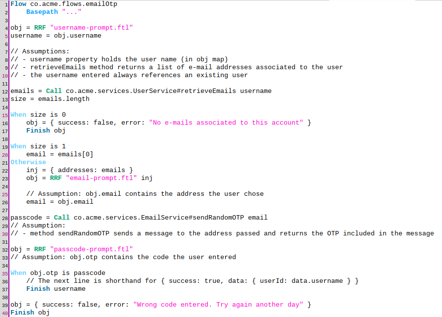

---
tags:
  - developer
  - agama
  - native apps
  - challenge endpoint
---

# Agama flows in native applications

Agama is a framework primarily focused on web flows, however, with the [Authorization Challenge](../../../script-catalog/authorization_challenge/authorization-challenge.md) endpoint of Jans Server, developers can  now run their flows outside the browser. This makes possible to offer secure, multi-step authentication flows from desktop and mobile applications without resorting to mechanisms like Web Views that  substantially degrade the user experience.

Additionally, the same already-familiar tools for authoring and deploying Agama projects can be used for the job. Moreover, the flows built for the web can be run in the native world without modification, requiring only to code the respective native UI and the logic that interacts with the Authorization Challenge endpoint, called "the endpoint" hereafter.

In this document, we present an overview of how the endpoint works to make your Agama flows run without a web browser. Preliminar acquaintance with the following topics is recommended:

- Agama [DSL](../../../agama/introduction.md#dsl) and `.gama` [format](../../../agama/gama-format.md)
- Agama projects [deployment](../../config-guide/auth-server-config/agama-project-configuration.md) in the Janssen Server 
- [Execution rules](../../../agama/execution-rules.md) in the Jans Agama [engine](./jans-agama-engine.md)
- A basic understanding of [OAuth 2.0 for First-Party Applications](https://www.ietf.org/archive/id/draft-parecki-oauth-first-party-apps-02.html)

## How do flows actually run?

Before getting into the technicalities, let's cover some key preliminar concepts.

The engine - the piece of software that actually runs flows - is eminently driven by HTTP requests. This is unsurprising because the main "consumers" of the engine are web browsers. When targetting native apps, the engine remains the same, and flows still run at the server side. This means native apps won't hold any business logic, or make computations of significance. 

The [RRF](../../../agama/language-reference.md#rrf) (render-reply-fetch) Agama instruction is of paramount importance in flows. In a regular web setting, it involves three steps:

- Injecting some data to a UI template in order to generate HTML markup. This is known as _rendering_
- Reply the markup to the web browser - this will display a web page
- At the server side, retrieve data the user may have provided in his interaction with the page. This is, _fetch_ 

In a native setting no HTML markup is suppossed to be generated and replied - it's the app that is in charge of displaying the UI now. For this purpose, it will receive (from the endpoint) the data that would be originally injected into the template. Most of times, this will carry information gathered at earlier stages of the flow and that is relevant to properly show or update the UI. 

Likewise, the "data submission" for the _fetch_ phase of RRF is performed by the app too. In this case, the relevant data grabbed from the user interaction is sent to the server side (via challenge endpoint) and becomes the result of the RRF (the value for the variable on the left-hand side of the instruction). Note both the input ("injected" data) and the output (result) is specified in JSON format.

Once the _fetch_ occurs, the flow proceeds its execution until another RRF instruction is hit, where the procedure described above takes place again.

Note this approach has two big benefits:

1. Regular web flows can be reused in the native world without modifications
1. The mindset for flows design remain the same

There is a subtle exception regarding the first statement and has to do with flows containing RFAC instructions. [RFAC](../../../agama/language-reference.md#rfac) is used to redirect to external sites, and as such, it requires a web browser. In the case of native apps, flows will crash once an RFAC instruction is hit.   

### Inversion of control in apps

The above concepts bring an important constraint to app design that should be accounted before undertaking any project: control is inverted. 

Normally, an app "knows" exactly what to do at each step of its workflow, and eventually delegates data retrieval tasks to the server side. When using the endpoint, the server side drives the logic: the app does not "take decisions" and instead "reacts" to the received data. This will be demostrated later through a practical example.

## About the example: OTP via e-mail

To avoid a rather abstract explanation, we'll use an example to illustrate the steps required to run a flow from a native app. Suppose an authentication flow operating in the following manner:

- A username is prompted
- If the corresponding user has no e-mail associated to his account, the flow ends with an error message
- If the user has exactly one e-mail in his profile, a random one-time passcode (OTP) is sent to his registered address
- If the user has more than one e-mail, a screen is shown to pick the address where he would like the OTP be sent to
- The user is prompted to enter the passcode sent. If supplied correctly, the flow ends and the user is authenticated, otherwise the flow ends with an error

This hypothetical flow is simple but will give you a good idea on how to interact with the endpoint.

### The flow code

The below depicts the implementation:



<!--
Flow co.acme.flows.emailOtp
    Basepath "..."
    
obj = RRF "username-prompt.ftl"
username = obj.username

// Assumptions:
// - username property holds the user name (in obj map)
// - retrieveEmails method returns a list of e-mail addresses associated to the user
// - the username entered always references an existing user 

emails = Call co.acme.services.UserService#retrieveEmails username
size = emails.length

When size is 0
    obj = { success: false, error: "No e-mails associated to this account" }
    Finish obj
    
When size is 1
    email = emails[0]
Otherwise    
    inj = { addresses: emails }
    obj = RRF "email-prompt.ftl" inj
    
    // Assumption: obj.email contains the address the user chose
    email = obj.email
    
passcode = Call co.acme.services.EmailService#sendRandomOTP email
// Assumption: 
// - method sendRandomOTP sends a message to the address passed and returns the OTP included in the message

obj = RRF "passcode-prompt.ftl"
// Assumption: obj.otp contains the code the user entered

When obj.otp is passcode
    // The next line is shorthand for { success: true, data: { userId: data.username } }
    Finish username
    
obj = { success: false, error: "Wrong code entered. Try again another day" }
Finish obj

-->

Flow `co.acme.flows.emailOtp` is self-explanatory and does not require further insight. Note the templates referenced in RRF directives don't necessarily have to exist, however, the template names will be included in the output of the endpoint as the flow executes. This serves as a hint or reference for the app to know the current point of execution and determine what should be shown in the UI. It will be more clearly seen in the next section.

## Running the flow

### Requisites

To be able to run an Agama flow from a native app using the endpoint, it is required to register an OAuth Client in the Jans server with at least the `authorization_challenge` scope. The process of client registration is beyond the scope of this document.

All HTTP requests exemplified here make use of `curl`. Ensure this tool is familiar to you.

### Workflow

Requests to the endpoint are all issued to the URL `https://<jans-hostname>/jans-auth/restv1/authorize-challenge` using the POST verb. Responses will contain JSON content whose structure will vary depending on the result of the operation as we will see.

Once the first request is sent, the flow will start and all instructions will be executed until an RRF is found. Here the flow will be paused, and the endpoint will respond with the data that was passed to RRF: the template path and the "injected" data. Let's start issuing real requests now.

### Initial request

In the first request, at least the following parameters must be passed:

|Name|Value|
|-|-|
|`acr_values`|agama_challenge|
|`use_auth_session`|true|
|`client_id`|The client identifier of a previously registered client|
|`flow_name`|The qualified name of the flow to launch|

So in our example, it may look like:

```
curl -i -d acr_values=agama_challenge -d use_auth_session=true
     -d flow_name=co.acme.flows.emailOtp -d client_id=<client-id>
     https://<jans-hostname>/jans-auth/restv1/authorize-challenge
```

!!! Note
    This command, as all others following has been split into several lines for better readability.
    
The response will look like:

```
HTTP/1.1 401 Unauthorized
Content-Type: application/json
...

{
  "error": "flow_paused"
  "flow_paused": {
    "_template": "username-prompt.ftl"
  },
  "auth_session": "BmAiCeArLdAa0",
}
```

While this may look like something wrong happened, it is not really the case. This is derived from the spec the endpoint adheres to, where the authorization server must report every intermediate response as an error with a 401 status code.

The value of the `error` property references a section that contains the template path. Here it corresponds to the first RRF instruction reached in the execution (line 4 in the flow's code). Particularly this RRF was not invoked passing two parameters, so there is only one property inside the `flow_paused` JSON object.

Note the presence of `auth_session`. This value allows the authorization server to associate subsequent requests issued by the app with this specific flow execution.

Based on this response, the app should render UI elements in order to capture the username. Here, `username-prompt.ftl` serves as a hint for the app to know the point of execution the flow is at currently.

### Subsequent requests

From here onwards, requests must contain the following parameters:

|Name|Value|
|-|-|
|`use_auth_session`|true|
|`auth_session`|The value obtained in the previous request|
|`data`|A JSON object value which will become the result of the RRF instruction the flow is paused at|

!!! Note
    Whenever a request is missing the `auth_session` param, it is assumed the [inital request](#initial-request) is being attempted.

Let's assume the user entered `Joan` as username in the app. A request like the below can then be issued so the variable `obj` at line 4 is assigned a value:

```
curl -i -d auth_session=BmAiCeArLdAa0 -d use_auth_session=true
     --data-urlencode data='{ "username": "Joan" }' 
     https://<jans-hostname>/jans-auth/restv1/authorize-challenge
```

This will make the flow advance until the next RRF is reached. Suppose the user Joan was found to have two e-mail addresses: `joan@doe.com` and `joan@deere.com`. This will make the flow hit line 23. The response will look as follows:

```
HTTP/1.1 401 Unauthorized
Content-Type: application/json
...

{
  "error": "flow_paused"
  "flow_paused": {
    "_template": "email-prompt.ftl",
    "addresses": [ "joan@doe.com", "joan@deere.com" ]
  },
  "auth_session": "BmAiCeArLdAa0",
}
```

Note the `flow_paused` section has the contents of the object prepared in line 22.

Based on this response, now the app should show a selection list for the user to pick one of these addresses. Once the selection is made, a new request can be issued:

```
curl -i -d auth_session=BmAiCeArLdAa0 -d use_auth_session=true
     --data-urlencode data='{ "email": "joan@doe.com" }' 
     https://<jans-hostname>/jans-auth/restv1/authorize-challenge
```

The flow will continue and the hypothetical message will be sent to `joan@doe.com` (line 28). Then the next RRF is reached (line 32) and we get as response:

```
HTTP/1.1 401 Unauthorized
Content-Type: application/json
...

{
  "error": "flow_paused"
  "flow_paused": {
    "_template": "passcode-prompt.ftl"
  },
  "auth_session": "BmAiCeArLdAa0",
}
```

The app must now update the UI so the passcode is prompted. When ready, a new request comes:

```
curl -i -d auth_session=BmAiCeArLdAa0 -d use_auth_session=true
     --data-urlencode data='{ "otp": "123456" }' 
     https://<jans-hostname>/jans-auth/restv1/authorize-challenge
```

Assuming the entered code (123456) was correct, the response would look like:

```
HTTP/1.1 401 Unauthorized
Content-Type: application/json
...

{
  "error": "flow_finished",
  "flow_finished": {
    "data": { "userId": "Joan" },
    "success": true
  },
  "auth_session": "efb10525-6c43-4e50-88ab-92461c258526"
}
```

This means we have hit line 37. 

When a `Finish` instruction is reached it is fully executed and the error reported in the response changes to `flow_finished`. What is left now is binding the user identified by `userId` (Joan) to the authorization request we have been handling (`BmAiCeArLdAa0`). This is how the user actually gets authenticated.

### Final request

To authenticate the user, we issue one last request:

```
curl -i -d auth_session=BmAiCeArLdAa0 -d use_auth_session=true
     https://<jans-hostname>/jans-auth/restv1/authorize-challenge
```

Note parameter `data` is not needed. As response we obtain:

```
HTTP/1.1 200 OK
Content-Type: application/json
...

{ "authorization_code" : "SplxlOBeZQQYbYS6WxSbIA" }

```

Once an authorization code has been obtained, the app can request an access token. This topic is beyond the scope of this document.

At this point, the app can update the UI giving the user access to the actual app contents. No more requests are expected to be received by the endpoint with the given `auth_session` value.

## Understanding errors

So far we have been following the "happy" path in the example flow where all assumptions are met. This is unrealistic so here we offer an overview of how the endpoint behaves when abnormal conditions come up.

!!! Note
    In this section, we stick to the terminology found [here](../../../agama/execution-rules.md#flows-lifecycle).

### Missing parameters

Assume the following request is issued:

```
curl -i -d use_auth_session=true -d acr_values=agama_challenge -d client_id=<client-id>
     https://<jans-hostname>/jans-auth/restv1/authorize-challenge
```

This lacks the name of the flow to launch. The response is:

```
HTTP/1.1 400 Bad Request
Content-Type: application/json
...

{
  "error": "missing_param",
  "missing_param": { "description": "Parameter 'flow_name' missing in request" }
}
```

### Failed flows 

Many times, flows simply fail as a way to reject access. This is achived in Agama by using code like:

```
obj = { success: false, error: "You are too suspicious" }
Finish obj
```

In this case, the response looks like:

```
HTTP/1.1 401 Unauthorized
Content-Type: application/json
...

{
  "error": "flow_finished",
  "flow_finished": {
    "success": false,
    "error": "You are too suspicious"
  }
}
```

Note `auth_session` is not replied. As such, no more requests to the endpoint should be made passing the `auth_session` value obtained earlier.

### Engine errors

There are several conditions under which the engine produces errors. In these cases, the HTTP error emitted by the engine is included in the endpoint response. As in previous error scenarios, no `auth_session` is replied.

#### Flow timeout

With native apps, [timeout](./jans-agama-engine.md#how-timeouts-work) of flows obeys the same rules of the web scenario. The only difference is the server property employed for the timeout calculation, namely, `authorizationChallengeSessionLifetimeInSeconds`. If absent, it defaults to one day.

Here is how a flow timeout is reported:

```
HTTP/1.1 500 Server Error
Content-Type: application/json
...

{
  "error": "engine_error",
  "engine_error": {
    "description": "Unexpected response to https://<jans-hostname>/jans-auth/fl/...",
    "body": {
      "message": "You have exceeded the amount of time required to complete your authentication",
      "timeout": true
    },
    "contentType": "application/json",
    "status": 410
  }
}
```

#### Crashed flow

When a flow crashes, the error is reported in similar way the timeout is reported. Here are some examples:

1. An attempt to access a property or index of a `null` variable in Agama code

    ```
    HTTP/1.1 500 Server Error
    Content-Type: application/json
    ...
    
    {
      "error": "engine_error",
      "engine_error": {
        "description": "Unexpected response to https://<jans-hostname>/jans-auth/fl/...",
        "body": {
          "title": "An unexpected error ocurred",
          "message": "TypeError: Cannot read property \"x\" from null"
        },
        "contentType": "application/json",
        "status": 500
      }
    }
    ```

1. A variable does not meet the expected shape for a given Agama directive

    ```
    HTTP/1.1 500 Server Error
    Content-Type: application/json
    ...
    
    {
      "error": "engine_error",
      "engine_error": {
        "description": "Unexpected response to https://<jans-hostname>/jans-auth/fl/...",
        "body": {
          "title": "An unexpected error ocurred",
          "message": "TypeError: Data passed to RRF was not a map or Java equivalent"
        },
        "contentType": "application/json",
        "status": 500
      }
    }
    ```

1. Indexing a string in Java beyond length

    ```
    HTTP/1.1 500 Server Error
    Content-Type: application/json
    ...
    
    {
    
      "error": "engine_error",
      "engine_error": {
        "description": "Unexpected response to https://<jans-hostname>/jans-auth/fl/...",
        "body": {
          "title": "An unexpected error ocurred",
          "message": "String index out of range: 100"
        },
        "contentType": "application/json",
        "status": 500
      }
    }
    ```

### Other errors

There are a variety of miscelaneous errors. Here we describe the most common.

#### Finished flows with problems of user identification

When a `Finish` instruction does not include a reference to a user identifier, or if the referenced user does not exist, the endpoint responds like:

```
HTTP/1.1 500 Server Error
Content-Type: application/json
...

{
  "error": "unexpected_error",
  "unexpected_error": { "description": "Unable to determine identity of user" }
}
```

#### Attempt to launch an unknown flow

If the initial request references an inexisting flow or one that has been flagged as [not launchable directly](../../../agama/gama-format.md#metadata) by clients. 

```
HTTP/1.1 500 Server Error
Content-Type: application/json
...

{
  "unexpected_error": {"description": "Flow ... does not exist or cannot be launched an application"},
  "error": "unexpected_error"
}
```

#### Agama is disabled

If the Agama engine is disabled, the following is generated upon the first request:

```
HTTP/1.1 500 Server Error
Content-Type: application/json
...

{
  "error": "unexpected_error",
  "unexpected_error": { "description": "Agama engine is disabled" }
}
```
