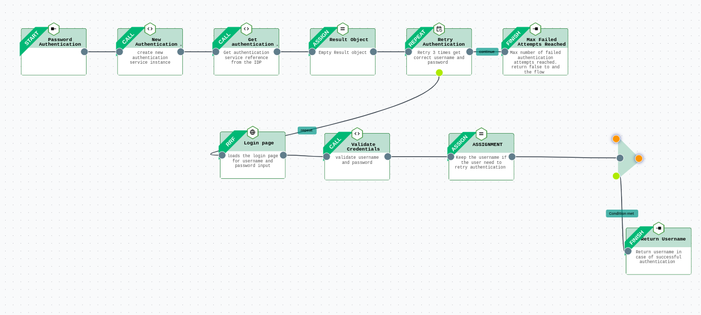

---
tags:
  - administration
  - developer
  - agama
  - agama lab
  - quick start
---

# Quick start using Agama Lab

In this quick start guide, we will build, deploy and test a simple Agama 
project using the [Agama Lab](https://cloud.gluu.org/agama-lab). 
This project will enable user authentication using password when deployed on
an IDP.

Major Steps involved in this process are:

- [Create A New Agama project on the Agama Lab](#create-a-new-agama-project)
- [Defining The Authentication Flow](#defining-the-authentication-flow)
- [Design User Interface](#design-user-interface)
- [Deploy Agama Project](#deploy-agama-project)
- [Test Using Tarp](#testing-using-janssen-tarp)

This guide covers steps above in the following sections.

## Prerequisites

- We will use the [Janssen Server](https://jans.io) to deploy the Agama project.
Follow the instructions [here](https://docs.jans.io/head/janssen-server/install/)
to install the Janssen Server.
- You will need a GitHub account where Agama Lab GitHub app has been [integrated](https://gluu.org/agama/sign-up-sign-in/). GitHub
account can be a personal account or an organizational account. For this guide
we will assume that a personal account is being used.
- Two new public GitHub repositories in your GitHub Account. These repositories
will be used as [development repository](https://gluu.org/agama/flow-designer/) and [release repository](https://gluu.org/agama/flow-designer/). Each repository should have at least one 
commit. 


## Create a new Agama project

We will use [Agama Lab](https://cloud.gluu.org/agama-lab/) to create a simple 
username-password based user authentication project. The authentication flow 
will be similar to the one shown below.



An Agama project may include multiple components. For example, an authentication
flow, a user interface, assets like organization's logo, external libraries, etc. 
In this project, we will see how to  

- Define the authentication steps of a flow
- Design the user interface to capture user inputs

Let's get started.

### Log into the Agama Lab


1. Go to [Agama Lab](https://cloud.gluu.org/agama-lab) login page. Sign in using
GitHub.

    

2. Authenticate on the GitHub authentication page.

    

3. After successful sign in, the [project dashboard](https://gluu.org/agama/agama-lab-project-dashboard/)
will be shown. Next step is to select the repository where you want to create 
the project. Select the `development` repository by clicking on 
`Change Repository` -> `Your Repositories` -> select the repository -> `Select`.
   
    


4. Project dashboard with all the existing projects (if any) from the GitHub
repository will be shown. New projects can be created, edited, and deleted 
from this project listing page.

    

### Create a new project

1. To create a new project, click on the `New Project` button.
   Enter the name and the description for the new project and click the `Create` button.

    

2. This will create a new project.

    

### Defining the authentication flow

1. Create a flow file

    Open the newly created project by clicking on :material-arrow-top-right:.
    This will open the project in the [project editor](https://gluu.org/agama/project-editor/). 
    
    To start creating the flow, right-click on the `code` directory > `New` > `Flow File`.

    

    Give name and description for the flow file and then click `Create`.

    

    A newly created flow file contains one `start` block.

    
    

    In the subsequent steps, we are going to create nodes in the flow using the
    flow editor. Refer to [this](https://gluu.org/agama/project-editor/) guide if you need to understand how 
    to create, delete and configure nodes.

2. Create `AuthenticationService` Call block

    Drag the colored dot available on the right edge of the `start` node to 
    create the next node in the flow. A list of available node types will be
    presented. 

    

    Select `Call` node. A new `Call` block should appear with a link to the 
    `Start` block

    

    Click the `Call` block and then click :material-pencil: to open the 
    configuration screen. Add configuration values as shown below.  
    This configuration will fetch a reference of the 
    `PasswordService` class and 
    store the reference in a variable called `AuthenticationService`. This reference will 
    be used to validate the user credentials in the subsequent steps.

    `class name`: `io.jans.as.server.service.AuthenticationService`

    `method name`: `class`

    `assign result to`: `authService`

    `title`: `New Authentication Service `

    `description`: `create new authentication service instance`

   
    

3.  Create `CdiUtil` Call block

    To perform authentication we will also need a reference of the `CdiUtil` class. To fetch a `CdiUtil`
    reference from the IDP, we will need to pass `AuthenticationService` reference 
    as an input. Use the steps and configuration below to do this.

    After the `AuthenticationService` create a new `Call` node.
   
    Click on the newly created `Call` block and by clicking :material-pencil: open the configuration page.
    Input values as shown below in the configuration screen.

    `class name`: `io.jans.service.cdi.util.CdiUtil`

    `method name`: `bean`

    `arguments`: `authServiceRef`

    `assign result to`: `cdiUtilRef`

    `title`: `Get authentication service reference`
    
    `description`: `Get authentication service reference from the IDP`

    


4. Create Assignment block

    Next, we need to create an empty variable that the flow will use in the future to store authentication results. 

    Create an `Assignment` block after the `PasswordService` call block and configure it as shown below.

    

5. Create Repeat block

    `Repeat` block represents the [Repeat](../../../agama/language-reference.md#repeat) instruction of Agama DSL.

    Repeat block creates a loop to iterate over certain steps(blocks). We will create a repeat loop that allows
    3 retries if the authentication fails.
    
    Create a Repeat block after the `Result Object` block 

    

    _Click on the newly created `Repeat` block. Click :material-pencil:.
    Input values as shown below in the configuration screen_

    

6. Create an RRF block

    `RRF` block represents the [RRF](../../../agama/language-reference.md#rrf)
   instruction of Agama DSL.

    Create an RRF block after the `Retry Authentication` block. 
    
    Remember that 
    the `Retry Authentication` is a `Repeat` type of block. It has two possible
    paths. 
    
    - One that originates from the colored dot on the bottom edge will be
    labeled as `repeat`. Execution of the blocks along this path will be
     repeated as configured in the `Repeat` block.
    - Second path originates from the colored dot on the right edge of the 
    `Repeat` block. This path is labeled as `Continue`. These blocks will be 
    executed after `repeat` path completes the execution.

    The new `RRF` block should be created on the `Repeat` path. 

    

    Click on the newly created `RRF` block. Click :material-pencil:. Input values as shown below in the configuration
    screen. 

    
    
    
    With this configuration, the RRF block will 

    - Present an input form to the user. We will build the `login.ftlh` in a [later section](#design-user-interface)
    - Capture and store user inputs like the user-name and password into the
     `creds` variable

    At this stage, let's save the flow using the `Save` button. This creates a new
    commit in your GitHub repository.

7. Create a Call block

    Create a `Call` block to process the username and password received from the user (in RRF) and
    validate them. The result of the validation is stored in a variable.
    
    Create a new call block after the `Login page` block.


    

    Click on the newly created `Call` block. Click :material-pencil:. 
    Configure it as shown below.

    

8. Create an Assignment block

    In case of authentication failure, the user will be prompted for reentering the
    credentials on the sign-in page. We want to show the username to the user while reentering the
    password on the web page. For this, we will save the username in a variable using the `Assignment` block.

    Create a new assignment block after the `Validate Credentials` block.

    

    Click on the newly created `Assignment` block. Click :material-pencil:.
    Input values as shown below in the configuration screen.

    `Resultant variable`: `authResult.uid`
    
    `Value/literal`: `creds.username`

    

9. Create a conditional When block

    `When` block represents the [When](../../../agama/language-reference.md#conditionals-and-branching)
   instruction of Agama DSL.

    Create a conditional check using the `When` block to check if the 
    user credentials were successfully validated.

    Create a new `When` block after the `Assignment` block.

    

    _Click on the newly created `When` block. Click :material-pencil:.
    Input values as shown below in the configuration screen_

    

10. Create Finish blocks

     The `Finish` block represents the [Flow finish](../../../agama/language-reference.md#flow-finish) instruction of Agama DSL.

     We will need to create two finish blocks.

     - One finish block to terminate the flow when the authentication is successful.
     - Second finish block to terminate the flow when the authentication is still not successful after 3 repeated attempts.

     If the authentication was successful then the flow should finish and return the
     username. This will be achieved by adding a Finish block to the `Condition met` branch of the `When` block. And if authentication fails after 3
     attempts, we need another `Finish` block following the `Repeat` block.

     Drag and drop colored dot on the lower vertex of the `When` block to create
     a `Condition met` branch. Create a `Finish` block on this branch.

     

     _Click on the newly created `Finish` block. Click :material-pencil:.
     Input values as shown below in the configuration screen_

     
     
    Let's create a second finish block that will terminate the flow when all 3
    authentication attempts have failed. 
    
    Create a `Finish` block on the `Continue` branch of the `Repeat` block. 

     

     _Click on the newly created `Finish` block. Click :material-pencil:.
     Input values as shown below in the configuration screen and click `Save`._

     

     Save the flow using the `Save` button on flow canvas.

     The completed flow looks like below:

     

11. Check generated code

    The flow is translated into [Agama DSL](../../../agama/language-reference.md). Click the `Code` button to see the 
    generated code.

    ```
    Flow co.acme.password
        Basepath ""
    // Get Authentication service reference from the IDP
    authServiceRef = Call io.jans.server.service.AuthenticationService#class 
    // Get CdiUtil reference from the IDP
    cdiUtilRef = Call io.jans.service.cdi.util.CdiUtil#bean authService
    // Empty result object 
    authResult = {}
    // Retry 3 times to get correct username and password 
    Repeat 3 times max
        // Loads the login page for username and password input 
        creds = RRF "login.ftlh" authResult
        // Validate username and password 
        authResult.success = Call cdiUtil#authenticate creds.username creds.password
        // Keep the username if the user needs to retry authentication 
        authResult.uid = "creds.username"
        When authResult.success is true
              // Return username in case of successful authentication 
              Finish authResult.uid
    // Max number of failed authentication attempts reached. Return False to end the flow
    Finish false
    ```

### Design user interface

In the RRF configuration step, we mentioned `login.ftlh` to render the login page elements.
We need to add `login.ftlh` to the Agama project so that the flow can use it during the execution.
Use the steps below to create the page.

1. Create a template file

    _On the left project explorer menu, click on `web` > `New` > `Freemarker Template`_

    

    _Select `+ Create` under the `New Blank Template`_

    

    _Give `Name` and `Description` as shown below and click `Create`_

    

2. Use the visual editor

    This opens a visual editor to create an Apache FreeMarker template. 
    Use this visual editor to create a template
    as per the need. For this article, we will use the code below.

    

    _Click `Edit HTML`. This opens a text editor. Remove existing code in the editor and paste the code shown below._

    ```html
        <!DOCTYPE html>
    <html lang="en">
        <head>
      <meta charset="UTF-8">
      <meta http-equiv="X-UA-Compatible" content="IE=edge">
      <meta name="viewport" content="width=device-width, initial-scale=1.0">
      <title>Username_Password_Form
      </title>
      <link rel="stylesheet" href="https://cdn.jsdelivr.net/npm/tailwindcss@2.2/dist/tailwind.min.css" type="text/css">
      </head>
      <body>
      <div class="md:h-screen bg-white relative flex flex-col justify-center items-center">
        <div class="md:border md:border-gray-300 bg-white md:shadow-lg shadow-none rounded p-10 align-middle">
        <div class="flex flex-col items-center space-y-3">
          <div class="flex">
          
          </div>
          <span class="text-2xl font-semi-bold leading-normal">Form</span>
          <p class="leading-normal">Enter your Username and Password
          </p>
        </div>
        <form method="post" class="my-8">
          <div class="relative mb-2">
          <label for="username" class="label mt-2 ml-1 leading-tighter text-gray-600 text-base cursor-text">
            Username
          </label>
          <input type="text" id="username" name="username" autofocus="" required="" class="w-full rounded px-3 border border-gray-300 pt-2 pb-2 focus:border-green-700">
          </div>
          <div class="relative mb-2">
          <label for="password" class="label mt-2 ml-1 leading-tighter text-gray-600 text-base cursor-text">
            Password
          </label>
          <input type="password" id="password" name="password" autofocus="" required="" class="w-full rounded px-3 border border-gray-300 pt-2 pb-2 focus:border-green-700">
          </div>
          <div class="space-y-9">
          <div class="text-sm flex justify-center items-center">
            <button type="submit" class="py-2 px-6 rounded text-white btn bg-green-500 hover:bg-green-600">
            Submit
            </button>
          </div>
          </div>
        </form>
        </div>
      </div>
      </body>
    </html>
    ```

_Click `Save changes`_


_This will render the page in the visual editor_.


### Release the project

At this point we have all the components of an Agama project ready, and they are 
stored in
the development repository. In order to deploy the project on an IDP, 
We need to build a `.gama` package from these components. We can build a `.gama`
package by releasing the project to the release repository.

_To release the project, click on any of the files in the left project explorer, and click `Release Project`._


_Enter a desired version number and click `Save`_


Upon successful release, Agama Lab `Releases` dashboard is shown. It lists all projects that are released.

_Click on the project name to go to the GitHub repository release page where `.gama` file has been released_


Download the `.gama` file from here to deploy on to the Janssen Server.


## Deploy Agama project

1. Download the `.gama` file from the `releases` section of the release repository
   
2. Open Janssen Server [TUI](../../config-guide/config-tools/jans-tui/README.md) 
  and upload the `.gama` package using [these instructions](https://docs.jans.io/head/janssen-server/config-guide/auth-server-config/agama-project-configuration/#agama-project-screen)

3. Ensure that the project has been uploaded without any errors by refreshing
  the project listing after the upload. 

## Testing using Janssen Tarp

We will use the [Jans Tarp](https://github.com/JanssenProject/jans/tree/main/demos/jans-tarp), 
a browser extension based tool from the Janssen Project, 
to test this Agama project. 

- [Install Jans Tarp browser plug-in](https://github.com/JanssenProject/jans/tree/main/demos/jans-tarp#installation-in-browser)
- Follow [these instructions](TODO: doc with instructions WIP) to test using the Janssen Server
- In a successful test run, the browser should prompt user for the user-name and 
  password using the same user-interface that we built in the previous steps.
  
- Upon entering a valid user-name and password, the tarp should present a page
  with access token. 
  

