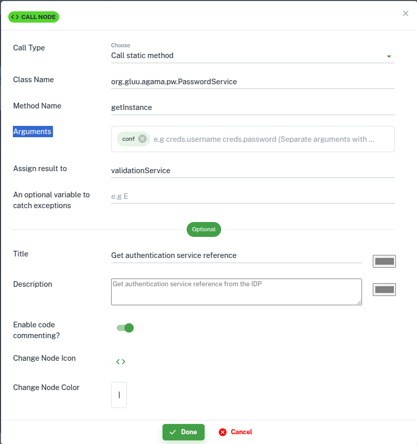

---
tags:
  - administration
  - developer
  - agama
  - agama lab
  - quick start
---

# Quick Start Using Agama Lab

In this quick start guide, we will build, deploy and test a simple Agama 
project using the [Agama Lab](https://cloud.gluu.org/agama-lab). 
This project will enable user authentication using password when deployed on
an IDP.

Major Steps involved in this process are:

- [Create Agama project on the Agama Lab](#create-agama-project)
- [Defining The Authentication Flow](#defining-the-authentication-flow)
- [Design User Interface](#design-user-interface)
- Deploy `.gama` package on an IDP (Janssen Server)
- Test the authentication flow

This guide covers these steps in the following sections.

## Prerequisites

- We will use the [Janssen Server](https://jans.io) to deploy the Agama project.
Follow the instructions [here](https://docs.jans.io/head/janssen-server/install/)
to install the Janssen Server.
- Two public GitHub repositories. These will be used as development repository
and release repository
- Completed GitHub integration using Agama Lab GitHub app

## Create Agama Project

We will use [Agama Lab](https://cloud.gluu.org/agama-lab/) to create a simple 
username-password based user authentication flow. This involves defining the authentication steps, designing the user interface to capture user
inputs, and lastly, releasing the flow as an Agama project.

### Log Into Agama Lab


1. Go to [Agama Lab](https://cloud.gluu.org/agama-lab) login page.

    

2. Authenticate on the GitHub authentication page.

    

3. Click on `Change Repository`, go to `your repositories` > select your repositories name. Click `Select`
   
    


4. Project listing page will be shown. All the existing projects for your GitHub user are listed here. Projects can be
   created, edited, and deleted from the project listing page.

    

### Create A New Project

1. To create a new project, click on the `New Project` button on the project listing page above.
   Enter the name and the description for the new project and click the `Create` button.

    

2. This will create a new project. It'll be listed on the project listing page.

    

### Defining The Authentication Flow

1. Create A Flow File

    _Click on :material-arrow-top-right:_

    The flow authoring view will open with a blank canvas. To start creating the flow, we need to create a `Flow File`. To
    do that,

    _Right-click on `code` and then select `New` > `Flow File`_

    

    _Give name and description for the flow file and then click `Create`_

    

    A newly created flow file has one block in it by default.

    
    

2. Create _AuthenticationService_ Call block

    Drag the colored dot available on the right edge of the `start` node to 
    create the next node in the flow. A list of available node types will be
    presented. 

    

    Select `Call` node. A new `Call` block should appear with a link to the 
    `Start` block

    

    Click `Call` block and then click :material-pencil: to open the 
    configuration screen. Add configuration values as shown below.  
    This configuration will create a new instance of 
    `AuthenticationService` class to 
    authenticate the user. The new instance will be 
    stored in a variable called `authService`.
   
    

3.  Create _CdiUtil_ Call block

    To perform authentication we will also need a bean instance of `CdiUtil` class. This bean instance  
    takes `AuthenticationService` instance that we created in the previous step as an argument.

    After the `AuthenticationService` create new `Call` node 
    

    

    _Click on the newly created `Call` block and by clicking :material-pencil: open the configuration page.
    Input values as shown below in the configuration screen_

    

4. Create Assignment block

    Next, we need to create an empty variable that the flow will use in the future to store authentication results.
    
    Drag and drop endpoint of this :material-circle: at `New Cdiutil Object` block then select `Assignment`

    

    _Click on the newly created `Assignment` block. Click :material-pencil:.
    Input values as shown below in the configuration screen_

    

5. Create Repeat block

    `Repeat` block represents the [Repeat](../../../agama/language-reference.md#repeat) instruction of Agama DSL.

    Repeat block creates a loop to iterate over certain steps(blocks). We will create a repeat loop that allows
    3 retries if the authentication fails.
    
    Drag and drop endpoint of this :material-circle: at `Result Object` block then select `Repeat`

    

    _Click on the newly created `Repeat` block. Click :material-pencil:.
    Input values as shown below in the configuration screen_

    

6. Create An RRF block

    `RRF` block represents the [RRF](../../../agama/language-reference.md#rrf)
   instruction of Agama DSL.

    Drag and drop end point of this :material-circle: at `Retry Authentication` block then select `RRF`

    

    _Click on the newly created `RRF` block. Click :material-pencil:. Input values as shown below in the configuration
    screen_

    
    
    **todo**
    Since we have checked the `In Repeat Block` at the time of adding the `RRF` block, the `RRF` block
    as well as all the blocks that we add to the `RRF` block iterated blocks.

    _At this stage, let's save the flow. Click `Save` on the flow canvas._

7. Create a _CdiUtil_ Call block

    Create a `Call` block to process the username and password received from the user (in RRF) and
    validate them. The result of validation should be stored in a variable.
    
    Drag and drop end point of this :material-circle: at `Login page` block then select `RRF`


    

    _Click on the newly created `Call` block. Click :material-pencil:. Input values as shown below in the configuration
    screen_

    

8. Create An Assignment block

    In case of authentication failure, we want to show the username to the user while reentering the
    password on the web page. For this, we will save the username in a variable using the `Assignment` block.

    Drag and drop end point of this :material-circle: at `Validate Credentials` block then select `Assignment`

    

    _Click on the newly created `Call` block. Click :material-pencil:.
    Input values as shown below in the configuration screen_

    

9. Create A Conditional When block

    `When` block represents the [When](../../../agama/language-reference.md#conditionals-and-branching)
   instruction of Agama DSL.

    Create a conditional check using the `When` block to check if the authentication (validated in
    `validate credentials` block) has been successful.

    Drag and drop end point of this :material-circle: at `Assignment` block then select `When`

    

    _Click on the newly created `When` block. Click :material-pencil:.
    Input values as shown below in the configuration screen_

    

10. Create [finish]() blocks

     ***todo***
     The `Finish` block represents the [Flow finish](../../../agama/language-reference.md#flow-finish) instruction of Agama DSL.

     If the authentication was successful then the flow should finish and return the
     username. This will be achieved by adding a Finish block to the `When` block. And if authentication fails after 3
     attempts, we need another `Finish` block following the `Repeat` block.

     _Click on the `When` block. Click :material-plus-circle:. Select `Condition met` and then click
     `Finish`_
      
    Drag and drop `Condition met` end point of this :material-circle: at `When` block then select `Finish`
    
    

     

     _Click on the newly created `Finish` block. Click :material-pencil:.
     Input values as shown below in the configuration screen_

     
     
    Drag and drop end point of this :material-circle: at `Repeat` block then select `Finish`

     

     _Click on the newly created `Finish` block. Click :material-pencil:.
     Input values as shown below in the configuration screen and click `Save`._

     

     Save the flow using the `Save` button on flow canvas.

     The completed flow looks like below:

     

11. Check Generated code

    Agama Lab flow gets translated in [Agama DSL](../../../agama/language-reference.md). Click the `Code` button to see the code
    generated by the flow.

    ```
    Flow co.acme.password
        Basepath ""
    // Create new  authentication service instance
    authService = Call io.jans.server.service.authenticationService#class 
    // Create new CdiUtil object
    cdiUtil = Call io.jans.service.cdi.uti.CdUtil#bean authService
    // Empty result object 
    authResult = "{}"
    // Retry 3 times to get correct username and password 
    Repeat 3 times max
        // Loads the login page for username and password input 
        creds = RRF "login.ftlh" authResult
        // Validate username and password 
        authResult.success = Call cdiUtil authenticate creds.username creds.password
        // Keep the username in the user needs to retry authentication 
        authResult.uid = "creds.uername"
        When 
              // Return username in case of successful authentication 
              it_oghyk = {success:true, data: { userId: "as9233Qz", property1: "value1"}}
              Finish it_oghyk
        Otherwise
              RRF "__________" 
        Finish __________
    // Max number of failed authentication attempts reached. Return False to end the flow
    Finish false
    ```

### Design User Interface

In the RRF configuration step, we mentioned `login.ftlh` to render the login page elements.
We need to add `login.ftlh` to the Agama project so that the flow can use during the flow execution.
Use the steps below to create the page.

1. Create a template file

    _On the left project explorer menu, click on `web` > `New` > `Freemarker Template`_

    

    _Select `+ Create` under the `New Blank Template`_

    

    _Give `Name` and `Description` as shown below and click `Create`_

    

2. Use the visual editor

    This opens a visual editor to create an Apache FreeMarker template. 
    Use this visual editor to create a template
    as per the need. For this article, we will use the code below.

    

    _Click `Edit HTML`. This opens a text editor. Remove existing code in the editor and paste the code shown below._

    ```html
        <!DOCTYPE html>
    <html lang="en">
        <head>
      <meta charset="UTF-8">
      <meta http-equiv="X-UA-Compatible" content="IE=edge">
      <meta name="viewport" content="width=device-width, initial-scale=1.0">
      <title>Username_Password_Form
      </title>
      <link rel="stylesheet" href="https://cdn.jsdelivr.net/npm/tailwindcss@2.2/dist/tailwind.min.css" type="text/css">
      </head>
      <body>
      <div class="md:h-screen bg-white relative flex flex-col justify-center items-center">
        <div class="md:border md:border-gray-300 bg-white md:shadow-lg shadow-none rounded p-10 align-middle">
        <div class="flex flex-col items-center space-y-3">
          <div class="flex">
          
          </div>
          <span class="text-2xl font-semi-bold leading-normal">Form</span>
          <p class="leading-normal">Enter your Username and Password
          </p>
        </div>
        <form method="post" class="my-8">
          <div class="relative mb-2">
          <label for="username" class="label mt-2 ml-1 leading-tighter text-gray-600 text-base cursor-text">
            Username
          </label>
          <input type="text" id="username" name="username" autofocus="" required="" class="w-full rounded px-3 border border-gray-300 pt-2 pb-2 focus:border-green-700">
          </div>
          <div class="relative mb-2">
          <label for="password" class="label mt-2 ml-1 leading-tighter text-gray-600 text-base cursor-text">
            Password
          </label>
          <input type="password" id="password" name="password" autofocus="" required="" class="w-full rounded px-3 border border-gray-300 pt-2 pb-2 focus:border-green-700">
          </div>
          <div class="space-y-9">
          <div class="text-sm flex justify-center items-center">
            <button type="submit" class="py-2 px-6 rounded text-white btn bg-green-500 hover:bg-green-600">
            Submit
            </button>
          </div>
          </div>
        </form>
        </div>
      </div>
      </body>
    </html>
    ```

_Click `Save changes`_


_This will render the page in the visual editor_.


### Release The Project

At this point we have all the components of an Agama project ready and stored in
the development repository. In order to deploy the project on an IDP, 
We need to build a `.gama` package from these components. We can build a `.gama`
package by releasing the project to the release repository.

_To release the project, click on any of the files in the left project explorer, and click `Release Project`._


_Enter a desired version number and click `Save`_


Upon successful release, Agama Lab `Releases` dashboard is shown. It lists all projects that are released.

_Click on the project name to go to the GitHub repository release page where `.gama` file has been released_


Download the `.gama` file from here to deploy on to the Janssen Server.


## Deploy Agama Project

1. Download the `.gama` file from the `releases` section of the release repository
   
2. Open Janssen Server [TUI](../../config-guide/config-tools/jans-tui/README.md) 
  and upload the `.gama` package using [these instructions](https://docs.jans.io/head/janssen-server/config-guide/auth-server-config/agama-project-configuration/#agama-project-screen)

3. Ensure that the project has been uploaded without any errors by refreshing
  the project listing after the upload. 

## Testing using Janssen Tarp

We will use the [Jans Tarp](https://github.com/JanssenProject/jans/tree/main/demos/jans-tarp), 
a browser extension from Janssen Project, 
to test this project. 

- [Install Jans Tarp browser plug-in](https://github.com/JanssenProject/jans/tree/main/demos/jans-tarp#installation-in-browser)
- Follow [these instructions](https://github.com/JanssenProject/jans/tree/main/demos/jans-tarp#testing-using-jans-tarp) to test using Jans Tarp. Remember that the `ACR value` is the composed of fully qualified name
of your flow (in our case `co.acme.password`) preceded by `agama_`. That is
`agama_co.acme.password`.
- In a successful test run, the browser should prompt user for the user-name and 
  password using the same user-interface that we built in the previous steps.

  

- Upon entering a valid user-name and password, the tarp should present a page
  with access token. 
  
  

