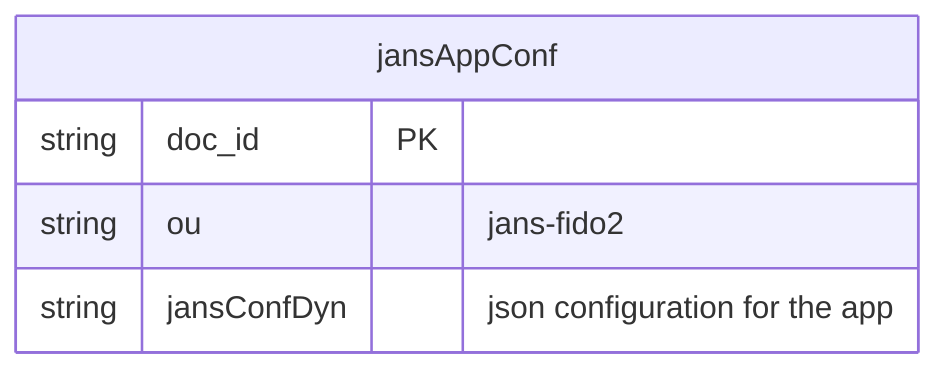

---
tags:
  - administration
  - fido2

---

### Configuration Parameters of Janssen's FIDO2 server:

| Field named                 | Example                                                | Description                                                                                                                     |
|-----------------------------|--------------------------------------------------------|---------------------------------------------------------------------------------------------------------------------------------|
| issuer                      | https://my-jans-server.jans.io                         | URL using the https scheme with no query or fragment component. The OP asserts this as its Issuer Identifier                    |
| baseEndpoint                | https://my-jans-server/jans-fido2/restv1               | Base URL of the FIDO2 server Endpoints
| webAuthnEndpoint            | https://FQDN/jans-fido2/restv1/webauthn/configuration  | Base URL of the FIDO2 Web Authn Server Endpoint which return RP Origins
| cleanServiceInterval        | 60                                                     | Time interval for the Clean Service in seconds.                                                                                 |
| cleanServiceBatchChunkSize  | 10000                                                  | Each clean up iteration fetches chunk of expired data per base dn and removes it from storage.                                  |
| useLocalCache               | true                                                   | Boolean value specifying whether to enable local in-memory cache for attributes, scopes, clients and organization configuration |
| disableJdkLogger            | true                                                   | Boolean value specifying whether to enable JDK Loggers                                                                          |
| loggingLevel                | "INFO" or "TRACE" or "DEBUG"                           | Logging level for FIDO2 server                                                                                                  |
| loggingLayout               | "text" or "json"                                       | Contents of logs as plain text or json format                                                                                   |
| externalLoggerConfiguration |                                                        | Path to external log4j2 logging configuration                                                                                   |
| metricReporterInterval      | 300                                                    | The interval for metric reporter in seconds.                                                                                    |
| metricReporterKeepDataDays  | 15                                                     | The number of days to retain metric reported data in the system                                                                 |
| metricReporterEnabled       | true                                                   | Boolean value specifying whether to enable Metric Reporter                                                                      |
| fido2Configuration          | See JSON contents in the below example                 | FIDO2 Configuration                                                                                                             |

#### Fido2Configuration structure

| **Field**                    | **Type**            | **Description**                                                                                           | **Default Value / Example**                          |
|------------------------------|---------------------|-----------------------------------------------------------------------------------------------------------|------------------------------------------------------|
| `authenticatorCertsFolder`    | String              | The folder where authenticator certificates are stored.                                                   | `"%(fido2ConfigFolder)s/authenticator_cert"`         |
| `mdsCertsFolder`              | String              | The folder where MDS TOC root certificates are stored.                                                   | `"%(fido2ConfigFolder)s/mds/cert"`                   |
| `mdsTocsFolder`               | String              | The folder where MDS TOC files are stored.                                                                | `"%(fido2ConfigFolder)s/mds/toc"`                    |
| `userAutoEnrollment`          | Boolean             | Whether to allow users to enroll on enrollment/authentication requests.                                    | `false`                                              |
| `unfinishedRequestExpiration` | Integer             | The expiration time in seconds for pending enrollment/authentication requests.                             | `120` (120 seconds)                                  |
| `metadataRefreshInterval`     | Integer             | The expiration time in seconds for approved authentication requests.                                      | `1296000` (15 days)                                  |
| `serverMetadataFolder`        | String              | The folder where authenticators' metadata in JSON format is stored.                                       | `"%(fido2ConfigFolder)s/server_metadata"`            |
| `enabledFidoAlgorithms`       | Array of Strings    | The list of requested credential types for FIDO authentication.                                           | `["RS256", "ES256"]`                                |
| `requestedParties`            | Array of Objects    | The list of requested parties (RPs) configuration for FIDO authentication.                                 | `[ { "id": "https://%(hostname)s", "origins": ["%(hostname)s"] } ]` |
| `metadataServers`             | Array of Objects    | A list of metadata servers providing external metadata URLs for FIDO authentication.                      | `[ { "url": "https://mds.fidoalliance.org/" } ]`      |
| `disableMetadataService`      | Boolean             | Whether downloading MDS metadata should be skipped.                                                        | `false`                                              |
| `hints`                       | Array of Strings    | Hints provided to the RP (e.g., security-key, client-device, hybrid).                                      | `["security-key", "client-device", "hybrid"]`        |
| `enterpriseAttestation`       | Boolean             | Whether enterprise authenticators are enabled for use in a specific protected environment.                | `false`                                              |
| `attestationMode`             | String              | "disabled" means attestation "none", "monitor" means attestation "direct" but still accept if none return, "enforced" means that credential creation will fail if attestation is not returned                                            | `"monitor"`                                          |


### Configuring the FIDO2 server:
#### 1. Read Configuration parameters:

Use the following command to obtain configuration parameters:

`jans cli --operation-id get-properties-fido2`

Response:
```
{
  "issuer": "https://my.jans.server",
  "baseEndpoint": "https://my.jans.server/jans-fido2/restv1",
  "cleanServiceInterval": 60,
  "cleanServiceBatchChunkSize": 10000,
  "useLocalCache": true,
  "disableJdkLogger": true,
  "loggingLevel": "DEBUG",
  "loggingLayout": "text",
  "metricReporterInterval": 300,
  "metricReporterKeepDataDays": 15,
  "metricReporterEnabled": true,
  "personCustomObjectClassList": [
    "jansCustomPerson",
    "jansPerson"
  ],
  "sessionIdPersistInCache": false,
  "fido2Configuration": {
    "authenticatorCertsFolder": "/etc/jans/conf/fido2/authenticator_cert",
    "mdsCertsFolder": "/etc/jans/conf/fido2/mds/cert",
    "mdsTocsFolder": "/etc/jans/conf/fido2/mds/toc",
    "checkU2fAttestations": false,
    "debugUserAutoEnrollment": false,
    "unfinishedRequestExpiration": 180,
    "authenticationHistoryExpiration": 1296000,
    "serverMetadataFolder": "/etc/jans/conf/fido2/server_metadata",
    "metadataUrlsProvider": "",
    "disableMetadataService": false,
    "attestationMode": "monitor",
    "assertionOptionsGenerateEndpointEnabled":true,
    "enabledFidoAlgorithms": [
      "RS256",
      "ES256"
    ],
    "rp": [
      {
        "id": "https://my.jans.server",
        "origins": [
          "my.jans.server"
        ]
      }
    ]
  }
}
```


#### 2. Update configuration parameters:
  Steps:
  A. Create a JSON file say `/tmp/config_values.json` by editing the JSON from Point 1
  B. Use the following command
  `jans cli --operation-id post-config-scripts --data /tmp/config_values.json`

#### 3. Change log level of FIDO2 server
  Steps:
  A. Create a JSON file say `/tmp/config_values.json` by editing the JSON from Point 1. Edit `loggingLevel` to `TRACE` or `DEBUG` or `INFO`
  B. Use the following command
    `jans cli --operation-id put-properties-fido --data /tmp/config_values.json`

#### 4. Locating FIDO2 configuration in Persistence Layer

While it is not recommended that an administrator directly edits a configuration at the persistence layer, it may be useful information for a developer.

#### 5. WebAuthn Endpoint
  A. The WebAuthn Endpoints retrieve the list of RP (Relying Party) Origins configured for FIDO2 authentication.
  B. Endpoints: https://FQDN/restv1/webauthn/configuration && https://FQDN/.well-known/webauthn

##### MySQL


