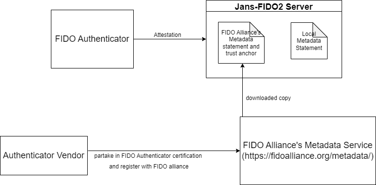

---
tags:
  - administration
  - fido2
  - metadata Service
  - attestation
---

# Vendor Metadata Service

Janssen server supports vendor-metadata validation. Metadata about vendor authenticators can be [stored locally](#local-metadata) by the administrator or [referenced from Fido Metadata Service](#fido-mds).

## Local metadata

Janssen's FIDO server has a [configuration parameter](./fido2-server-properties-config.md#servermetadatafolder) called `serverMetadataFolder` which by default points to a directory location `/etc/jans/conf/fido2/server_metadata` where the administrator can (obtain from a vendor and ) place authenticator metadata in json format.

Example of authenticator metadata:
```
{
    "aaguid": "83c44309-....-8be444b573cb",
    "metadataStatement": {
        "legalHeader": "Submission of this statement and retrieval and use of this statement indicates acceptance of the appropriate agreement located at https://fidoalliance.org/metadata/metadata-legal-terms/.",
        "aaguid": "83c44309-....-8be444b573cb",
        "description": "Just an example",
        "authenticatorVersion": 448962,
        "protocolFamily": "fido2",
        "schema": 3,
        "upv": [
            {
                "major": 1,
                "minor": 0
            },
            {
                "major": 1,
                "minor": 1
            }
        ],
        "authenticationAlgorithms": [
            "ed25519_eddsa_sha512_raw",
            "secp256r1_ecdsa_sha256_raw"
        ],
        "publicKeyAlgAndEncodings": [
            "cose"
        ],
        "attestationTypes": [
            "basic_full"
        ],
        "userVerificationDetails": [
            [
                {
                    "userVerificationMethod": "passcode_external",
                    "caDesc": {
                        "base": 64,
                        "minLength": 4,
                        "maxRetries": 8,
                        "blockSlowdown": 0
                    }
                },
                {
                    "userVerificationMethod": "presence_internal"
                }
            ],
            [
                {
                    "userVerificationMethod": "passcode_external",
                    "caDesc": {
                        "base": 64,
                        "minLength": 4,
                        "maxRetries": 8,
                        "blockSlowdown": 0
                    }
                }
            ],
            [
                {
                    "userVerificationMethod": "fingerprint_internal",
                    "baDesc": {
                        "selfAttestedFRR": 0,
                        "selfAttestedFAR": 0,
                        "maxTemplates": 5,
                        "maxRetries": 5,
                        "blockSlowdown": 0
                    }
                },
                {
                    "userVerificationMethod": "presence_internal"
                }
            ],
            [
                {
                    "userVerificationMethod": "none"
                }
            ],
            [
                {
                    "userVerificationMethod": "fingerprint_internal",
                    "baDesc": {
                        "selfAttestedFRR": 0,
                        "selfAttestedFAR": 0,
                        "maxTemplates": 5,
                        "maxRetries": 5,
                        "blockSlowdown": 0
                    }
                }
            ],
            [
                {
                    "userVerificationMethod": "presence_internal"
                }
            ]
        ],
        "keyProtection": [
            "hardware",
            "secure_element"
        ],
        "matcherProtection": [
            "on_chip"
        ],
        "cryptoStrength": 128,
        "attachmentHint": [
            "external",
            "wired"
        ],
        "tcDisplay": [],
        "attestationRootCertificates": [
            "MII....psmyPzK+Vsgw2jeRQ5JlKDyqE0hebfC1tvFu0CCrJFcw=="
        ],
        "icon": "data:image/png;base64,iVBORw0KGgoAAAA....k5+36hF7vXAAAAAElFTkSuQmCC",
        "authenticatorGetInfo": {
            "versions": [
                "FIDO_2_0",
                "FIDO_2_1_PRE",
                "FIDO_2_1"
            ],
            "extensions": [
                "credProtect",
                "hmac-secret",
                "largeBlobKey",
                "credBlob",
                "minPinLength"
            ],
            "aaguid": "83c.....73cb",
            "options": {
                "plat": false,
                "rk": true,
                "clientPin": true,
                "up": true,
                "uv": false,
                "pinUvAuthToken": true,
                "largeBlobs": true,
                "ep": false,
                "bioEnroll": false,
                "userVerificationMgmtPreview": false,
                "authnrCfg": true,
                "credMgmt": true,
                "credentialMgmtPreview": true,
                "setMinPINLength": true,
                "makeCredUvNotRqd": false,
                "alwaysUv": true
            },
            "maxMsgSize": 1200,
            "pinUvAuthProtocols": [
                2,
                1
            ],
            "maxCredentialCountInList": 8,
            "maxCredentialIdLength": 128,
            "transports": [
                "usb"
            ],
            "algorithms": [
                {
                    "type": "public-key",
                    "alg": -7
                },
                {
                    "type": "public-key",
                    "alg": -8
                }
            ],
            "maxSerializedLargeBlobArray": 1024,
            "forcePINChange": false,
            "minPINLength": 4,
            "firmwareVersion": 328965,
            "maxCredBlobLength": 32,
            "maxRPIDsForSetMinPINLength": 1,
            "preferredPlatformUvAttempts": 3,
            "uvModality": 2,
            "remainingDiscoverableCredentials": 25
        }
    },
    "statusReports": [
        {
            "status": "FIDO_CERTIFIED_L1",
            "effectiveDate": "2021-08-06",
            "url": "www.yubico.com",
            "certificationDescriptor": "An example",
            "certificateNumber": "FIDO2.....001",
            "certificationPolicyVersion": "1.3",
            "certificationRequirementsVersion": "1.4"
        },
        {
            "status": "FIDO_CERTIFIED",
            "effectiveDate": "2021-08-06"
        }
    ],
    "timeOfLastStatusChange": "2021-08-16"
}
```


## Fido MDS 

Janssen server provides Metadata service for authenticators approved by [FIDO Alliance (MDS3)](https://fidoalliance.org/metadata/).

The metadata service is a centralized, trusted database of FIDO authenticators. It is used by the Relying Party to validate authenticators i.e. attest the genuine-ness of a device. 

Metadata entries for trusted authenticators registered with FIDO Alliance can be found on - https://fidoalliance.org/certification/fido-certified-products/





Janssen's FIDO2 server performs the following functions:

1.  Downloads, verifies and caches metadata BLOBs from the FIDO Metadata Service.
1.  Re-downloads the metadata BLOB when it expires.
1.  Provides trust root certificates for verifying attestation statements during credential registrations.

## Skip metadata validation

Metadata validation is recommended but not mandatory as per FIDO2 specifications.
In FIDO2 we can disable this validation by setting the `attestationMode` parameter (default is
monitor).

It should look something like this:

```
"fido2Configuration": {
  ...,
  "attestationMode": "disabled",
  ...
}
```

## How Apple does it differently

If you check `attStmt` and it contains `x5c`, it is a FULL attestation. FULL basically means that it is a certificate
that is chained to the vendor. It's signed by a batch private key whose public key is in a batch certificate that is
chained to the Apple attestation root certificate. Usually certificates have an authorityInfoAccess extension that helps
locate the root, but Apple chose not to do that. Nevertheless, a quick google give us the needed root
certificate https://www.apple.com/certificateauthority/Apple_WebAuthn_Root_CA.pem.

This certificate is downloaded to the path `/etc/jans/conf/fido2/authenticator_cert`.

Refer to [this link](https://medium.com/webauthnworks/webauthn-fido2-verifying-apple-anonymous-attestation-5eaff334c849) for more details of the implementation.

