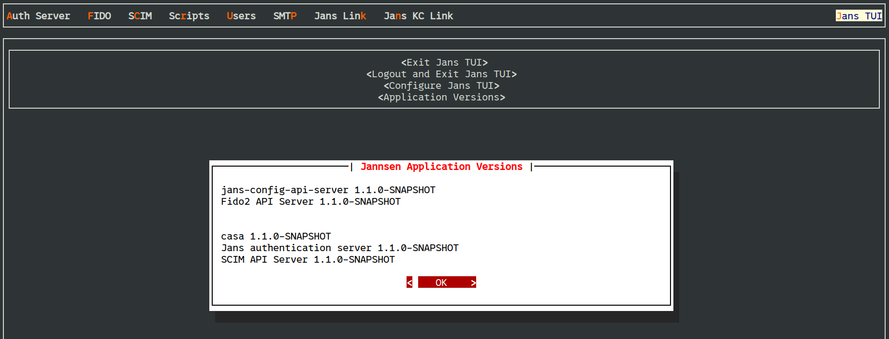

---
tags:
  - administration
  - installation
  - faq
---

# Janssen Server Installation FAQs

----------------------

## After installation, how do I verify that the Janssen Server is up and running?

Health and status of Janssen Server and its various processes can be verified in multiple ways:

### Use the Janssen Server Health Check endpoint

Janssen Server provides a health check endpoint for Authentication module. It can be invoked from commandline using CURL as below:

```text
curl -k https://janssen-host-name/jans-auth/sys/health-check
```

For a healthy server, this option will return output as below:

```text
Please wait while retrieving data ...

{
"status": "running",
"db_status": "online"
}
```

### Access .well-known endpoints

Janssen Server exposes `.well-known` endpoint for openid configuration as per the [OpenIDConnect RFC](https://openid.net/specs/openid-connect-discovery-1_0.html). Successful response from this endpoint is also an indicator of healthy authentication module. 

From command-line interface, use CURL to access this endpoint. For example:

```bash
curl https://janssen-host-name/jans-auth/.well-known/openid-configuration
```

This should return JSON response from Janssen Server as per OpenId 
specification. Sample below:

```text
{
  "request_parameter_supported" : true,
  "pushed_authorization_request_endpoint" : "https://janssen-host-name/jans-auth/restv1/par",
  "introspection_endpoint" : "https://janssen-host-name/jans-auth/restv1/introspection",
  "claims_parameter_supported" : false,
  "issuer" : "https://janssen-host-name",
  "userinfo_encryption_enc_values_supported" : [ "RSA1_5", "RSA-OAEP", "A128KW", "A256KW" ],
  "id_token_encryption_enc_values_supported" : [ "A128CBC+HS256", "A256CBC+HS512", "A128GCM", "A256GCM" ],
  "authorization_endpoint" : "https://janssen-host-name/jans-auth/restv1/authorize",
  "service_documentation" : "http://jans.org/docs",
  "authorization_encryption_alg_values_supported" : [ "RSA1_5", "RSA-OAEP", "A128KW", "A256KW" ],
  "claims_supported" : [ "street_address", "country", "zoneinfo", "birthdate", "role", "gender", "user_name", "formatted", "phone_mobile_number", "preferred_username", "inum", "locale", "updated_at", "post_office_box", "nickname", "preferred_language", "email", "website", "email_verified", "profile", "locality", "room_number", "phone_number_verified", "given_name", "middle_name", "picture", "name", "phone_number", "postal_code", "region", "family_name", "jansAdminUIRole" ],
  "token_endpoint_auth_methods_supported" : [ "client_secret_basic", "client_secret_post", "client_secret_jwt", "private_key_jwt", "tls_client_auth", "self_signed_tls_client_auth" ],
  "tls_client_certificate_bound_access_tokens" : true,
  "response_modes_supported" : [ "FORM_POST", "QUERY_JWT", "FRAGMENT_JWT", "FORM_POST_JWT", "QUERY", "FRAGMENT", "JWT" ],
  "backchannel_logout_session_supported" : true,
  "token_endpoint" : "https://janssen-host-name/jans-auth/restv1/token",
  "response_types_supported" : [ "id_token token", "id_token", "code", "code token", "id_token code token", "id_token code", "token" ],
  "acr_mappings" : {"alias1": "acr1"},
  "authorization_encryption_enc_values_supported" : [ "A128CBC+HS256", "A256CBC+HS512", "A128GCM", "A256GCM" ],
  "backchannel_token_delivery_modes_supported" : [ "poll", "ping", "push" ],
  "dpop_signing_alg_values_supported" : [ "RS256", "RS384", "RS512", "ES256", "ES384", "ES512", "ES512", "PS256", "PS384", "PS512" ],
  "request_uri_parameter_supported" : true,
  "backchannel_user_code_parameter_supported" : false,
  "grant_types_supported" : [ "RESOURCE_OWNER_PASSWORD_CREDENTIALS", "CLIENT_CREDENTIALS", "OXAUTH_UMA_TICKET", "AUTHORIZATION_CODE", "DEVICE_CODE", "REFRESH_TOKEN", "IMPLICIT" ],
  "ui_locales_supported" : [ "en", "bg", "de", "es", "fr", "it", "ru", "tr" ],
  "userinfo_endpoint" : "https://janssen-host-name/jans-auth/restv1/userinfo",
  "op_tos_uri" : "http://www.jans.io/doku.php?id=jans:tos",
  "require_request_uri_registration" : false,
  "id_token_encryption_alg_values_supported" : [ "RSA1_5", "RSA-OAEP", "A128KW", "A256KW" ],
  "frontchannel_logout_session_supported" : true,
  "authorization_signing_alg_values_supported" : [ "HS256", "HS384", "HS512", "RS256", "RS384", "RS512", "ES256", "ES384", "ES512", "ES512", "PS256", "PS384", "PS512" ],
  "claims_locales_supported" : [ "en" ],
  "clientinfo_endpoint" : "https://janssen-host-name/jans-auth/restv1/clientinfo",
  "request_object_signing_alg_values_supported" : [ "none", "HS256", "HS384", "HS512", "RS256", "RS384", "RS512", "ES256", "ES384", "ES512", "ES512", "PS256", "PS384", "PS512" ],
  "request_object_encryption_alg_values_supported" : [ "RSA1_5", "RSA-OAEP", "A128KW", "A256KW" ],
  "session_revocation_endpoint" : "https://janssen-host-name/jans-auth/restv1/revoke_session",
  "global_token_revocation_endpoint" : "https://janssen-host-name/jans-auth/restv1/global-token-revocation",
  "check_session_iframe" : "https://janssen-host-name/jans-auth/opiframe.htm",
  "scopes_supported" : [ "https://jans.io/scim/all-resources.search", "address", "user_name", "clientinfo", "openid", "https://jans.io/scim/fido2.write", "profile", "uma_protection", "permission", "https://jans.io/scim/fido.read", "https://jans.io/scim/users.write", "https://jans.io/scim/groups.read", "revoke_session", "global_token_revocation", "https://jans.io/scim/fido.write", "https://jans.io/scim/bulk", "https://jans.io/scim/users.read", "phone", "mobile_phone", "offline_access", "https://jans.io/scim/groups.write", "email", "https://jans.io/scim/fido2.read", "jans_client_api" ],
  "backchannel_logout_supported" : true,
  "acr_values_supported" : [ "simple_password_auth" ],
  "request_object_encryption_enc_values_supported" : [ "A128CBC+HS256", "A256CBC+HS512", "A128GCM", "A256GCM" ],
  ...
  ...
```

### Check OS Services

Check the OS platform [Janssen Services and their status](#how-can-i-see-status-of-janssen-os-platform-services)

### Check Logs

Check [logs](#where-can-i-find-janssen-server-logs) for errors

----------------------

## How can I see status of Janssen OS platform services?

### Ubuntu
  
```commandline
systemctl list-units --all "jans*"
```

Command above should list services along with its current status.

```commandline
UNIT                    LOAD   ACTIVE SUB     DESCRIPTION               
jans-auth.service       loaded active running Janssen OAauth service    
jans-config-api.service loaded active running Janssen Config API service
jans-fido2.service      loaded active running Janssen Fido2 Service     
jans-scim.service       loaded active running Janssen Scim service      

LOAD   = Reflects whether the unit definition was properly loaded.
ACTIVE = The high-level unit activation state, i.e. generalization of SUB.
SUB    = The low-level unit activation state, values depend on unit type.

5 loaded units listed.
```

!!! Note
    Some process listed above may not be available in every installation based on options selected during installation.

----------------------

## Where can I find Janssen Server logs?

During installation, Janssen Server produces setup logs under following location:

```commandline
/opt/jans/jans-setup/logs/
```

Individual modules of the Janssen Server will continue to write their operational logs under respective directory at path below:

```commandline
/opt/jans/jetty/<module-name>/logs/
```

-----------------------------

## How do I check the version of Janssen server?

```commandline
/opt/jans/bin/show_version.py
```

Alternatively, [TUI](../config-guide/config-tools/jans-tui/README.md) can be used to get this information:

1. Open TUI
2. Navigate to `Jans TUI` menu item on top menu bar
3. Navigate to `Application Versions`
4. Hit `enter`

This will show version of each Janssen Server modules:



-----------------------------

## After installation, what's next?

After successful installation of the Janssen Server, start configuring Janssen
Server to fulfil your organizational requirements and authentication flows you
intend to implement. Use the 
[Text-based UI](../config-guide/config-tools/jans-tui/README.md) or  
[command-line interface](../config-guide/config-tools/jans-cli/README.md) to 
configure the Janssen Server.

## Does the Janssen Server uninstall process remove the data store as well?

No. For all persistence options, the
Janssen server uninstall steps ([this](./vm-install/suse.md#uninstall)
for instance) will only remove the Janssen Server
software and it'll keep the data store untouched. Removing the data store is at 
the discretion of the
administrator and it is a manual step. If not removed before attempting a
reinstall of the Janssen Server, the installer would fail due to the existence of
the previous data store. 