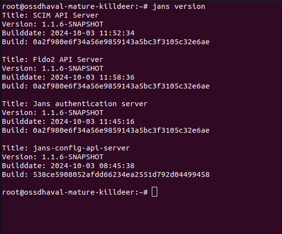
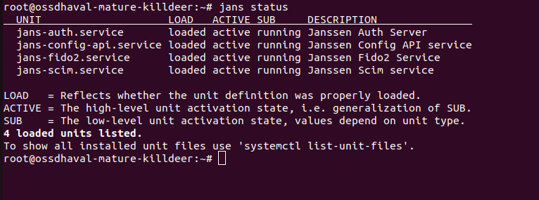
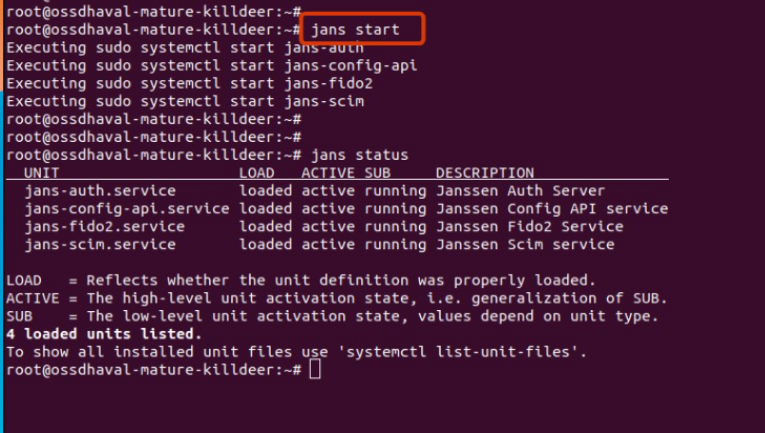
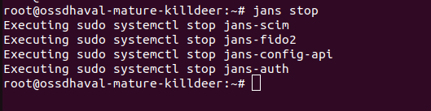
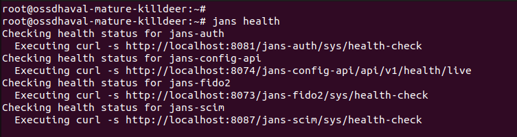

---
tags:
- command
- jans
---


# Jans Command Overview

The `jans` command is a top-level wrapper script for managing the Janssen Server. 
This guide provides an overview of its usage and available commands.


## Available Commands

### Version

Displays the version of the currently installed Janssen Server.

```bash title="Command"
jans version
```



### CLI

Description: Invokes the Janssen Command-Line Interface.
```bash title="Command"
jans cli
```


### TUI
Launches the text-based user interface for Janssen.

```bash title="Command"
jans tui
```
     

### Logs

Shows the log file paths for various Janssen Server modules. 
```bash title="Command"
jans logs
```


### Status

Displays the status of Janssen Server module services.

```bash title="Command"
jans status
```



### Start 

Starts services for the Janssen Server.

```bash title="Command"
     jans start
```


Start a specific service.

```bash title="sample command"
jans start -service=jans-config-api
```

```title="Sample Output"
Executing sudo systemctl start jans-config-api
```


### Stop

Stops services for the Janssen Server.
```bash title="Command"
jans stop
```



Stop a specific service.

```bash title="Command"
jans stop -service=jans-config-api
```
```title="Sample Output"
Executing sudo systemctl stop jans-config-api
```


### Restart 

Restarts services for the Janssen Server.

```bash title="Command"
jans restart
```


Restart a specific service.

```bash title="Sample Command"
jans restart -service=jans-config-api
```

```title="Sample Output"
Executing sudo systemctl restart jans-config-api
```


### Health

Retrieves health status from the Janssen services' health-check endpoint.

```bash title="Command"
jans health
```


Health check for specific service.

```bash title="Command"
jans health -service=<service-name>
```

```title="sample Output"
Checking health status for jans-config-api
  Executing curl -s http://localhost:8074/jans-config-api/api/v1/health/live
  Command output: {"name":"jans-config-api liveness","status":"UP"}
```


### Info

Lists important URLs, such as .well-known and Casa.

```bash title="Command"
jans info
```


