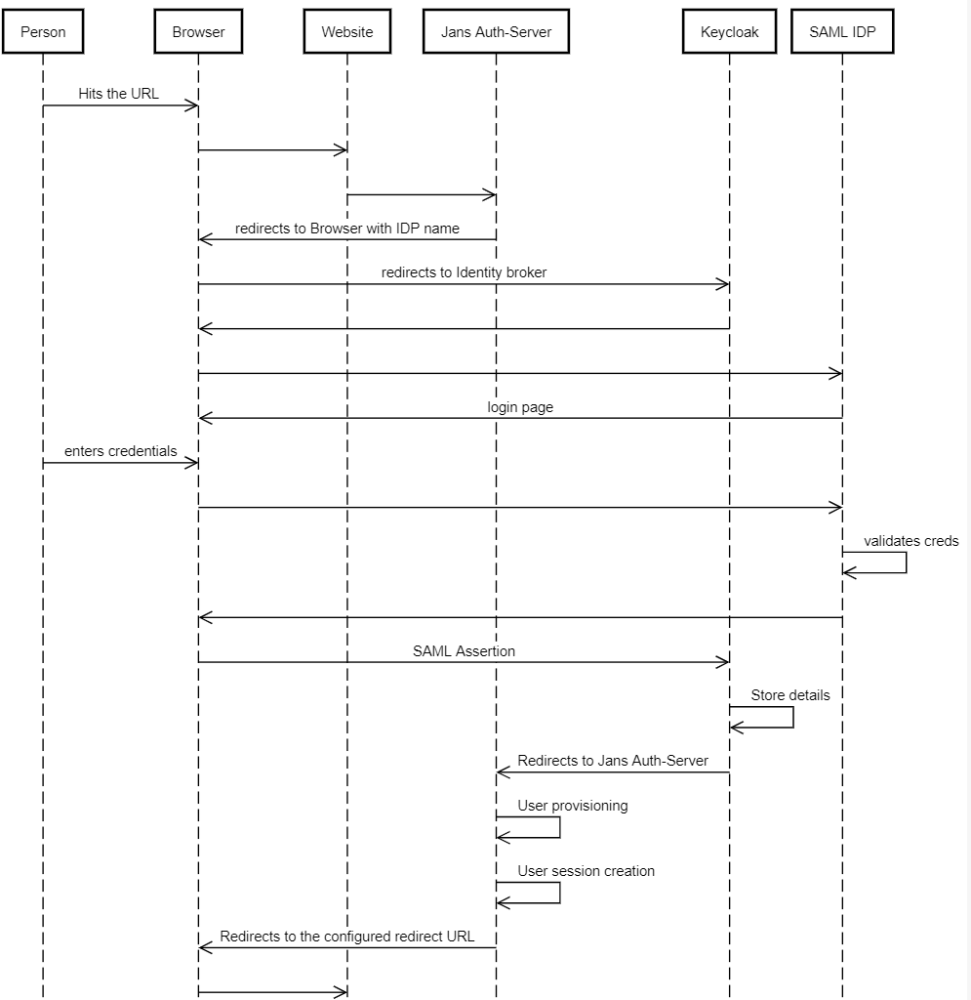
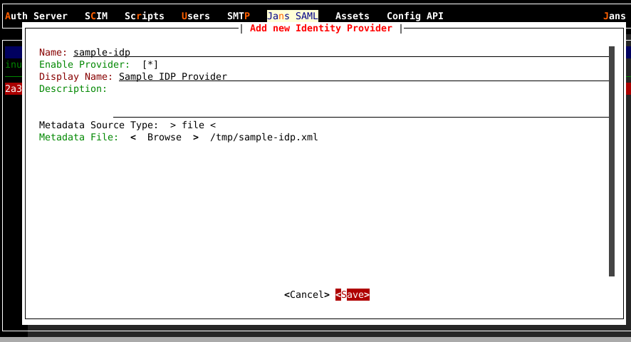
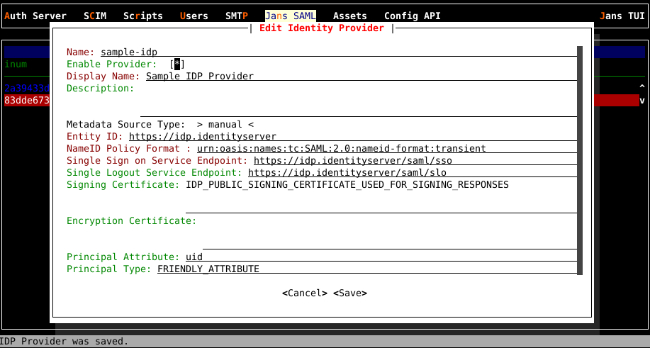

---
tags:
  - administration
  - keycloak
  - SAML
  - inbound
---

# Inbound SAML
Janssen supports authentication against external SAML identity provider (IDP) namely inbound SAML/inbound identity.
This document provides instructions for configuring Janssen server

## Enable inbound SAML
Make sure you have Janssen server with SAML plugin installed and enabled. SAML plugin can be enabled using TUI (Jans Saml -> Contribution)

## Inbound SAML Authentication Flow

The following is a high-level diagram depicting a typical inbound identity user authentication and provisioning workflow.

## Configure SAML IDP
Use [Janssen Text-based UI(TUI)](../config-guide/config-tools/jans-tui/README.md) or [Janssen command-line interface](../config-guide/config-tools/jans-cli/README.md) to create new IDP Keycloak Server.
1. Navigate to `Jans SAML` > `Identity Providers`

1. Go to `Add Identity Provider` and press **Enter**

1. Enter a name (unique identifier) for this provider (letters, digits, and underscore characters allowed).

1. Enter a display name for the `Add Identity Provider`

1. Upload IDP Metadata by selecting **file** for `Metadata Source Type` and press **Enter** after you navigated on **Browse** of `Metadata File`

1. Or you can, optionally provide individual metadata elements by selecting **manual** for `Metadata Source Type`.
   See adding a sample idp in the following figure
   

1. Save details

SAML IDP is created in Keycloak server under realm **jans**. IDP details are also persisted in Jans DB.

To edit IDP details later, you can navigate to the idp in the list and press **Enter**, you will get a popup screen as shown in the
figure below:

## Configure IDP for inbound SAML 
1. SAML IDP should have been configured as stated in above
1. Use Agama Lab is an online visual editor to build authentication flows. Learn more about [Agama Lab](../../janssen-server/developer/agama/quick-start-using-agama-lab.md)
1. Fork existing agama-inbound-saml project from [Agama Lab Projects](https://agama-lab.gluu.org/landing-page/)
1. In Agama orchestrator create a new flow by adding a RFAC (Redirect and fetch a callback) node for SAML IDP.
1. Deploying .gama package on Janssen Server 
1. Testing the authentication flow using Jans Tarp.
* Install Tarp, check details [here](https://github.com/JanssenProject/jans/blob/main/demos/jans-tarp/README.md).
- Open Tarp extension.
- Enter URL of Keycloak OpenID configuration. Example http:///realms/keycloak-external-broker/.well-known/openid-configuration.
- Click Register.
- Registered Client details are displayed, enter Additional Params to hint Keycloak about IDP to be trigger. Example {"kc_idp_hint":"gluu-saml-idp-1"}
-  Click "Trigger Auth Code Flow.
- This should redirect to IDP login page.
- Enter user details and login.

