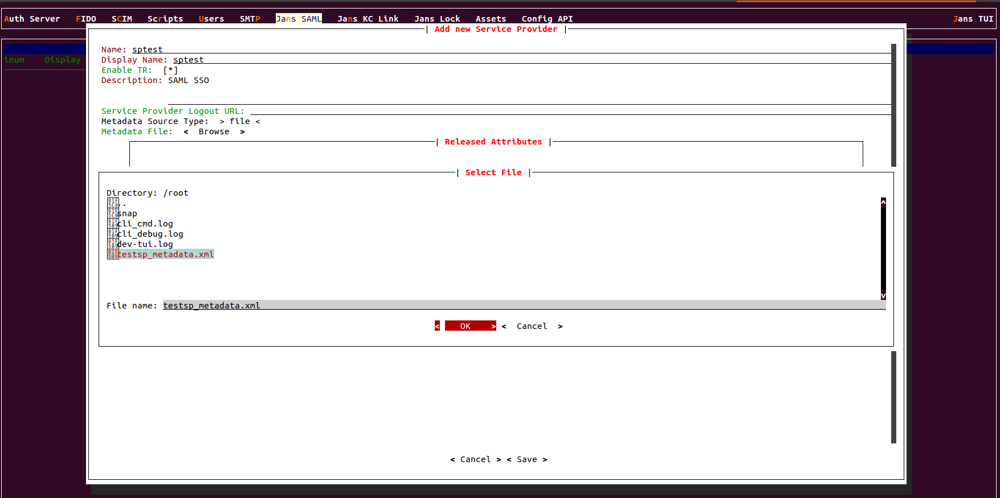
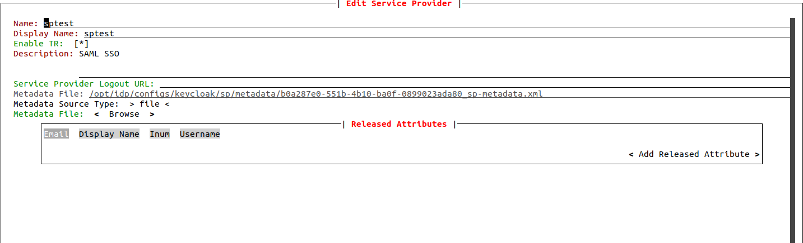
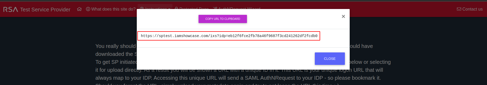

---
tags:
  - administration
  - keycloak
  - SAML
  - SSO
---

# SAML SSO

The Janssen Server acts as a SAML Identity Provider to support outbound SAML
single sign-on (SSO). It does this by leveraging the SAML features available
in [Keycloak](https://www.keycloak.org/), while leveraging the Janssen Server's
authentication module to handle the user
authentication part of SSO. Once authentication is successful, the user is
redirected to the SP with personal attributes and an active SSO session.

## Installation

During installation of the Janssen Server, simply select the option
`Install Jans KC`   to install and setup SAML SSO for Keycloak. Instructions
on how to setup SAML SSO with Keycloak post-install will eventually be provided.

## Managing SAML Service Providers Through the Jans-Cli

To act as an IDP to various SAML SPs (Service Providers), the latter
need to be added to the Janssen Server. This can be done via the
[Jans TUI](../config-guide/config-tools/jans-tui/README.md) which is what we
will cover in this section.

###  Adding a SAML SP

1. Open Jans-TUI
1. Select the menu item `Jans SAML` > `Service Providers`
1. Then navigate and select `<Add Service Provider>`
1. Input the following:
    1. `Display Name` : An identifiable name for the Service Provider
    1. `Enable TR`: Whether or not the Service Provider should be enabled
    1. `Metadata Location`: The location of the metadata. The supported options
      so far are `file` and `manual`.
    1. `Released Attributes`: The user attributes to be released via the SAML
      response if authentication is successful

The configurable options are kept to the bare functional minimum but will be
expanded gradually.

The `manual` metadata option for `Metadata Location`, allows the possibility
to specify SP metadata information manually.

## IDP Metadata Location

For SAML authentication to work, there is a need for the SPs to
trust the IDP, which usually is done by using an IDP metadata file that will
be used on the SP side. The metadata can be found at
`https://<server-hostname>/kc/realms/jans/protocol/saml/descriptor`  where
`<server-hostname>` is the hostname of the Janssen server specified during
installation.

## Testing Jans SAML SSO with sptest

### Configure IDP [Janssen Server]

In this tutorial, we are going to use [Iamshowcase](https://sptest.iamshowcase.com) as a service provider. Lets create a TR, Apply following steps in Janssen Server:

- Download sp metadata: `wget https://sptest.iamshowcase.com/testsp_metadata.xml`
- Open Jans TUI and navigate to **Jans SAML > Service Providers > Add Service Provider**:

- Release some attributes, for example: `email`, `username`
  

- Finally Save it.

### Configure SP [IAMShowcase]

Since We are done at Janssen Server side, now let's connect SP with the IDP:

- browse and download IDP Metadata: `https://<yoour-janssen-server>/kc/realms/jans/protocol/saml/descriptor`
- Go to: https://sptest.iamshowcase.com/instructions#spinit and upload the IDP metadata.
- It will give you an SP link to test the SAML SSO flow:

### Test SSO

Copy that link and open it in a browser. You can open it in incognito mode to avoid session issue. So, It will redirect you to janssen login page. Once you logged in with user credentials it will redirect back to the SP's protected page and show the user session details. 
  
### FAQ

* Check KC scheduler log for any TR issue `/opt/kc-scheduler/logs/scheduler.log`
* Also check file directory inside `/opt/idp/configs/keycloak/sp/metadata`

