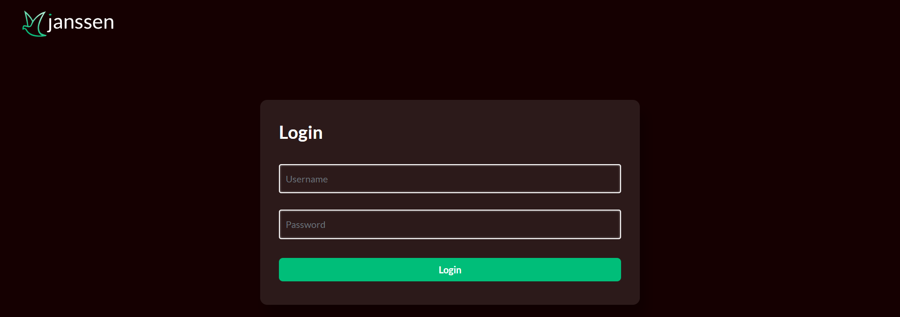
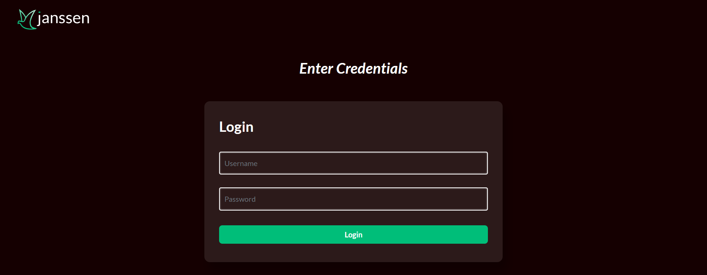

---
tags:
  - administration
  - developer
  - operations
  - kubernetes
  - customization
---

# Customization

Most organizations will want to edit and customize the look and feel of public-facing `jans` server pages to match their own corporate branding. 
The following documentation provides the file locations of public facing pages, as well as instructions for adding custom HTML, CSS, and Javascript files to your `jans` server.

## Overview
All web pages are **xhtml** files.

## Default pages bundled in the `jans-auth.war` are:
* Login page: [login.xhtml](https://github.com/JanssenProject/jans/blob/main/jans-auth-server/server/src/main/webapp/login.xhtml)
* Authorization page: [authorize.xhtml](https://github.com/JanssenProject/jans/blob/main/jans-auth-server/server/src/main/webapp/authorize.xhtml)
* Logout page: [logout.xhtml](https://github.com/JanssenProject/jans/blob/main/jans-auth-server/server/src/main/webapp/logout.xhtml)
* Error page: [error.xhtml](https://github.com/JanssenProject/jans/blob/main/jans-auth-server/server/src/main/webapp/error.xhtml)

## To override default pages listed above:
Put a modified `login.xhtml` or `authorize.xhtml` or `error.xhtml` or `logout.xhtml` under `/opt/jans/jetty/jans-auth/custom/pages/`

## Directory structure for customization
```
/opt/jans/jetty/jans-auth/
|-- custom
|   |-- i18n (resource bundles)
|   |-- libs (library files used by custom script)
|   |-- pages (web pages)
|   |-- static (images and css files)
```
## Adding a new web page for Person Authentication scripts
1. If `enterOTP.xhtml` is your webpage for step 2 of authentication, place it under `/opt/jans/jetty/jans-auth/custom/pages/auth/enterOTP.xhtml`
2. Reference it in the custom script as follows:
```
    def getPageForStep(self, configurationAttributes, step):
        # Used to specify the page you want to return for a given step
        if (step == 1):
          return "/auth/login.xhtml"
        if (step == 2)
          return "/auth/enterOTP.xhtml"
```
## Reference login pages

[Here](https://github.com/JanssenProject/jans/tree/main/jans-auth-server/server/src/main/webapp/auth) you will find several login pages for different authentication methods.

## Customized resource bundles
1. Resource bundles that are present in the jans-auth.war are present in this [folder](https://github.com/JanssenProject/jans/blob/main/jans-auth-server/server/src/main/resources/)

2. To override the defaults, custom `.properties` files should be placed in the following file under this path : `/opt/jans/jetty/jans-auth/custom/i18n/jans-auth.properties`
Resource bundle names to support other languages should be placed under the same folder `/opt/jans/jetty/jans-auth/custom/i18n/`. Some examples of file names are :
    * jans-auth_en.properties
    * jans-auth_bg.properties
    * jans-auth_de.properties
    * jans-auth_es.properties
    * jans-auth_fr.properties
    * jans-auth_it.properties
    * jans-auth_ru.properties
    * jans-auth_tr.properties

3. To add translation for a language that is not yet supported, create new properties file in resource folder and name it jans-auth_[language_code].properties, then add language code as supported-locale to the [faces-config.xml](https://github.com/JanssenProject/jans/blob/main/jans-auth-server/server/src/main/resources/faces-config.xml) present in the same folder.

## Custom CSS files

1. Place the file in `/opt/jans/jetty/jans-auth/custom/static/stylesheet/theme.css`
2. Reference it in .xhtml file using the URL `https://your.jans.server/jans-auth/ext/resources/stylesheet/theme.css` or `/jans-auth/ext/resources/stylesheet/theme.css`

## Custom image files
1. All images should be placed under `/opt/jans/jetty/jans-auth/custom/static/img`
2. Reference it in .xhtml file using the URL `https://your.jans.server/jans-auth/ext/resources/img/fileName.png` or `/jans-auth/ext/resources/img/fileName.jpg`

## Page layout, header, footer (xhtml Template) customization

Templates refers to the common interface layout and style. For example, a banner, logo in common header and copyright information in footer.

1. All templates should be placed under `/opt/jans/jetty/jans-auth/custom/pages/WEB-INF/incl/layout/` 
2. Place a modified `template.xhtml` in the above location which will override the [default template file](https://github.com/JanssenProject/jans/blob/main/jans-auth-server/server/src/main/webapp/WEB-INF/incl/layout/template.xhtml) from the war


## Custom Jar file for scripts 

### for JARs less than 1MB
1.  Create a configmap with the custom jar file: 
    `kubectl -n <namespace> create cm my-custom-jar --from-file=mycustom.jar`

1.  Mount the configmap in your values.yaml under `auth-server.volumes` and `auth-server.volumeMounts`

    ```
    auth-server:
      volumeMounts:
        - name: my-custom-jar-volume
          mountPath: /opt/jans/jetty/jans-auth/custom/libs/mycustom.jar
          subPath: mycustom.jar
      volumes:
        - name: my-custom-jar-volume
          configMap:
            name: my-custom-jar
    ```
        
1.  Run helm install or helm upgrade if Jans has been already installed.
    ```bash
    helm upgrade <helm-release-name> janssen/janssen -n <namespace> -f values.yaml --version=1.0.x
    ```
### For JARs greater than 1MB
1.  Create a configmap or secret for a shell script that contains instructions to pull the custom jar file:

    ```shell
    #!/bin/sh
    # This script will pull the custom jar file from a remote location
    # and place it in the correct location for the Jans Auth server to use it
    wget -O /opt/jans/jetty/jans-auth/custom/libs/mycustom.jar https://mydomain.com/mycustom.jar
    ```
    `kubectl -n <namespace> create cm my-custom-jar --from-file=mycustomjar.sh`

1.  Mount the configmap or secret in your values.yaml under `auth-server.volumes` and `auth-server.volumeMounts`

    ```
    auth-server:
      volumeMounts:
        - name: my-custom-jar-volume
          mountPath: /tmp/mycustomjar.sh
          subPath: mycustomjar.sh
      volumes:
        - name: my-custom-jar-volume
          configMap:
            name: my-custom-jar
            defaultMode: 0755
      customScripts:
        - /tmp/mycustomjar.sh
    ```
        
1.  Run helm install or helm upgrade if Jans has been already installed.
    ```bash
    helm upgrade <helm-release-name> janssen/janssen -n <namespace> -f values.yaml --version=1.0.x
    ```
## Customized pages examples

### Custom Login page


This guide will demonstrate how to customize the html and css of the default login page.

Here's a screenshot of the default login page.



As an example, we will add text to the top of the form and change the color of the button using the following steps:


1.  Locate the directory that contains exploded auth-server WAR

    ```bash
    kubectl exec -n <namespace> <auth-server-pod-name> -- ls /opt/jetty/temp
    ```

    Output example:

    ```
    jetty-0_0_0_0-8080-jans-auth_war-_jans-auth-any-15449359106458251753
    ```

1.  Get the `login.xhtml` from the auth-server pod:

    ```bash
    kubectl -n jans cp <auth-server-pod-name>:opt/jetty/temp/jetty-0_0_0_0-8080-jans-auth_war-_jans-auth-any-15449359106458251753/webapp/login.xhtml login.xhtml
    ```

    Modify the file locally:


    ```html
    <h:form
        id="loginForm"
      class="bg-highlight position-relative d-flex flex-column align-items-center justify-content-center"
      style="height: 100vh; gap: 2rem"
      >
    <!-- customization -->
    <div class="row"><p id="creds-title">Enter Credentials</p></div>
    <!-- end of customization -->
    ```

1.  Get the `login-template.xhtml` from the auth-server pod:
    ```bash
    kubectl -n jans cp <auth-server-pod-name>:opt/jetty/temp/jetty-0_0_0_0-8080-jans-auth_war-_jans-auth-any-15449359106458251753/webapp/WEB-INF/incl/layout/login-template.xhtml login-template.xhtml
    ```
    Modify the file locally:


    ```html
    <h:head>
        <link type="text/css" rel="stylesheet" href="https://fonts.googleapis.com/css?family=Open+Sans:300,400,600" />
        <!-- customization -->
        <link rel="stylesheet" href="/jans-auth/ext/resources/stylesheet/custom.css" />
        <!-- end of customization -->
    </h:head>
    ```

1.  Copy the following text and save it as `custom.css`:

    ```css
      #creds-title {
        font-style: italic;
        font-weight: bolder;
        color: white;
        font-size: 2em;
      }
    ```

1.  Create `configmaps` to store the content of `login.xhtml`, `login-template.xhtml` and `custom.css`.

    ```bash
    kubectl -n <namespace> create cm auth-server-custom-html --from-file=login.xhtml
    kubectl -n <namespace> create cm auth-server-custom-layout-html --from-file=login-template.xhtml
    kubectl -n <namespace> create cm auth-server-custom-css --from-file=custom.css
    ```

1.  Mount the `configmaps` in your `values.yaml` under `auth-server.volumes` and `auth-server.volumeMounts`:

    ```yaml
    auth-server:
      volumeMounts:
        - name: auth-server-pages-volume
          mountPath: /opt/jans/jetty/jans-auth/custom/pages # login.xthml will be mounted under this directory
        - name: auth-server-layout-volume
          mountPath: /opt/jans/jetty/jans-auth/custom/pages/WEB-INF/incl/layout # login-template.xthml will be mounted under this directory
        - name: auth-server-static-volume
          mountPath: /tmp/static #custom.css will be mounted in the temporary location
      lifecycle:
        postStart:
          exec:
            command: [ "sh", "-c", "mkdir /opt/jans/jetty/jans-auth/custom/static/stylesheet/ && cp /tmp/static/custom.css /opt/jans/jetty/jans-auth/custom/static/stylesheet/"] # custom.css will be copied from the temporary to the desired location
      volumes:
        - name: auth-server-pages-volume
          configMap:
            name: auth-server-custom-html
        - name: auth-server-layout-volume
          configMap:
            name: auth-server-custom-layout-html
        - name: auth-server-static-volume
          configMap:
            name: auth-server-custom-css
    ```

1.  Run helm install or helm upgrade if Jans has been already installed.

    ```bash
    helm upgrade <helm-release-name> janssen/janssen -n <namespace> -f values.yaml --version=1.0.x
    ```


Here's a screenshot of the customized login page.



### Custom Device-code page

This guide will demonstrate how to customize the html and css of the device-code page.

Here's a screenshot of the device-code page.


As an example, we will change the color of the button to blue using the following steps:


1.  Locate the directory that contains exploded auth-server WAR

    ```bash
    kubectl exec -n <namespace> <auth-server-pod-name> -- ls /opt/jetty/temp
    ```

    Output example:

    ```
    jetty-0_0_0_0-8080-jans-auth_war-_jans-auth-any-15449359106458251753
    ```

1.  Get the `device_authorization.xhtml` from the auth-server pod:

    ```bash
    kubectl -n jans cp <auth-server-pod-name>:opt/jetty/temp/jetty-0_0_0_0-8080-jans-auth_war-_jans-auth-any-15449359106458251753/webapp/device_authorization.xhtml device_authorization.xhtml
    ```

    Modify the file locally:

    ```html
    <div class="device-authz-button">
        <div style="width: 100%">
    <!-- customization -->        
        <div style="text-align: center;">
        <h:commandButton id="continueButton"
                        style="background-color: red; color: white;" value="#{msgs['device.authorization.confirm.button']}"
                        iconAwesome="fa-sign-in">
            <f:ajax execute="@form" render="@form messages" listener="#{deviceAuthorizationAction.processUserCodeVerification}" />
        </h:commandButton>
        </div>
    <!-- end of customization -->                                               
    ```


1.  Create a configmap to store the content of `device_authorization.xhtml`.

    ```bash
    kubectl -n <namespace> create cm device-code-custom-html --from-file=device_authorization.xhtml
    ```

1.  Mount the `configmap` in your `values.yaml` under `auth-server.volumes` and `auth-server.volumeMounts`:

    ```yaml
    auth-server:
      volumeMounts:
        - name: device-code-pages-volume
          mountPath: /opt/jans/jetty/jans-auth/custom/pages # device_authorization.xthml will be mounted under this directory
      volumes:
        - name: device-code-pages-volume
          configMap:
            name: device-code-custom-html
    ```

1.  Run helm install or helm upgrade if Jans has been already installed.

    ```bash
    helm upgrade <helm-release-name> janssen/janssen -n <namespace> -f values.yaml --version=1.0.x
    ```


Here's a screenshot of the customized device-code page.


### Custom Error page

This guide will demonstrate how to customize the html and css of the error page.

Here's a screenshot of the default Error page.


As an example, we will change the color of the text at the top of the error page:

1.  Locate the directory that contains exploded auth-server WAR

    ```bash
    kubectl exec -n <namespace> <auth-server-pod-name> -- ls /opt/jetty/temp
    ```

    Output example:

    ```
    jetty-0_0_0_0-8080-jans-auth_war-_jans-auth-any-15449359106458251753
    ```

1.  Get the `error.xhtml` from the auth-server pod:

    ```bash
    kubectl -n jans cp <auth-server-pod-name>:opt/jetty/temp/jetty-0_0_0_0-8080-jans-auth_war-_jans-auth-any-15449359106458251753/webapp/error.xhtml error.xhtml
    ```

    Modify the file locally:

    ```html
    <div class="section">
       <!-- customization -->
      <h1
        style="color: red; font-size: 3em; font-weight: bold; font-family: Arial">
        OOPS</h1>
      <!-- end of customization -->
    </div>
    ```


1.  Create a configmap to store the content of `error.xhtml`.

    ```bash
    kubectl -n <namespace> create cm error-custom-html --from-file=error.xhtml
    ```

1.  Mount the `configmap` in your `values.yaml` under `auth-server.volumes` and `auth-server.volumeMounts`:

    ```yaml
    auth-server:
      volumeMounts:
        - name: error-pages-volume
          mountPath: /opt/jans/jetty/jans-auth/custom/pages # error.xthml will be mounted under this directory
      volumes:
        - name: error-pages-volume
          configMap:
            name: error-custom-html
    ```

1.  Run helm install or helm upgrade if Jans has been already installed.

    ```bash
    helm upgrade <helm-release-name> janssen/janssen -n <namespace> -f values.yaml --version=1.0.x
    ```


Here's a screenshot of the customized error page.

