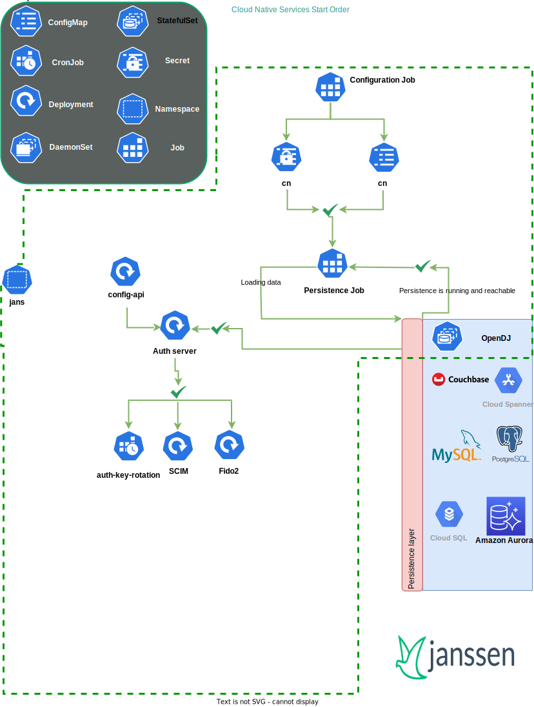

---
tags:
  - administration
  - kubernetes
  - operations
  - start-order
---

## Service Start Order

## Network traffic between Jans services

1. **Database Access:** all Jans services require access to the database.

2. **Pod-2-Pod Communication:** Jans services communicate with each other as depicted.

3. **External/Internet Communication**:
    - Auth-server: should be publically accessible.

    - Rest of the pods:  We recommend to only keep the `.well-known` endpoints public and protect the rest.
