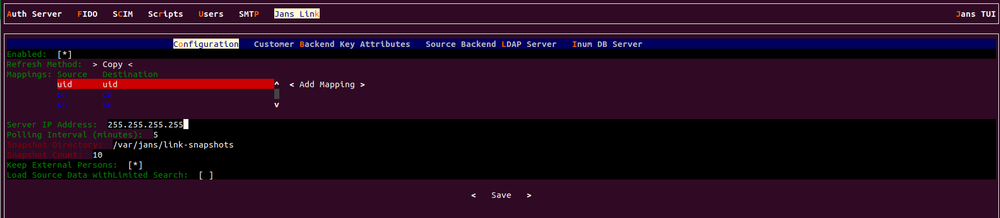
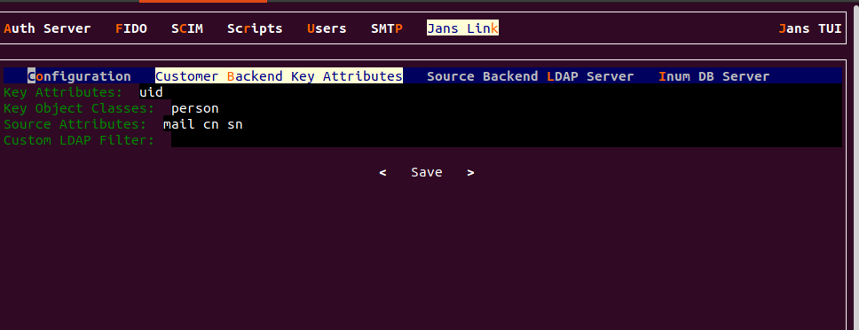
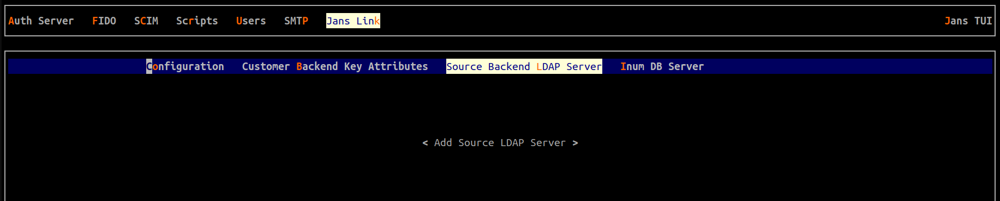

---
tags:
  - administration
  - link
  - jans-ldap-link
---

# Jans LDAP Link

The Jans LDAPLink synchronization service updates the Janssen User Store when 
authoritative data is managed in an external LDAP store. 

## Installation

The API is available as the `Jans Link` component of Jans Server. 
Upon [installation](https://docs.jans.
io/head/admin/install/vm-install/ubuntu/) you can select if you want 
to install this Service along with other Janssen Server components. Post 
installation, to add Jans-Link component, use the following:

```bash
python3 /opt/jans/jans-setup/setup.py --install-jans-link`
```

Jans LDAP link gets installed as a service that can be managed using below 
commands.

To Satrt Jans-Link 

```bash
systemctl start jans-link
```

To check status 

```bash
systemctl status jans-link
```

To Stop Jans-Link 

```bash
systemctl stop jans-link
```

## Jans LDAP Link Configuration


The Janssen Server provides multiple configuration tools to perform these
tasks.


=== "Use Command-line"

    Use the command line to perform actions from the terminal. Learn how to 
    use Jans CLI [here](./config-tools/jans-cli/README.md) or jump straight to 
    the [Using Command Line](#using-command-line)

=== "Use Text-based UI"

    Use a fully functional text-based user interface from the terminal. 
    Learn how to use Jans Text-based UI (TUI) 
    [here](./config-tools/jans-tui/README.md) or jump straight to the
    [Using Text-based UI](#using-text-based-ui)

=== "Use REST API"

    The Jans link does not have a REST API.
### Using Command Line

Janssen Server [CLI](../config-guide/config-tools/jans-cli/README.md) provides the number of operations and metadata information about the Jans LDAP link.

To see Jans-Link info using Jans CLI

```bash title="Command"
 jans cli --info JansLinkConfiguration
```

```text
Operation ID: get-jans-link-properties
  Description: Gets Jans Link App configuration.
Operation ID: put-jans-link-properties
  Description: Updates Jans Link configuration properties.
  Schema: Jans Link Plugin:AppConfiguration
```
 
#### Gets Jans Link App configuration

To see Jans Link properties, use the below command. Use the operation ID 
`get-jans-link-properties` to get all the Jans link on the Janssen Server.

```bash title="Command"
 jans cli --operation-id get-jans-link-properties
```
The output of the above command will be similar to this:

```json title="Sample Output"
{
  "inumConfig": {
    "configId": "local_inum",
    "bindDN": "@ldap_binddn@",
    "bindPassword": "@ldap_bind_encoded_pw@",
    "servers": [
      "@ldap_hostname@:@ldaps_port@"
    ],
    "maxConnections": 10,
    "useSSL": true,
    "baseDNs": [
      "ou=link,o=site"
    ],
    "useAnonymousBind": false,
    "enabled": true,
    "version": 0,
    "level": 0
  },
  "targetConfig": {
    "maxConnections": 2,
    "useSSL": false,
    "useAnonymousBind": false,
    "enabled": false,
    "version": 0,
    "level": 0
  },
  "ldapSearchSizeLimit": 1000,
  "keyAttributes": [
    "uid"
  ],
  "keyObjectClasses": [
    "gluuPerson"
  ],
  "sourceAttributes": [
    "mail",
    "cn",
    "sn"
  ],
  "updateMethod": "copy",
  "defaultInumServer": true,
  "keepExternalPerson": true,
  "useSearchLimit": false,
  "attributeMapping": [
    {
      "source": "uid",
      "destination": "uid"
    },
    {
      "source": "cn",
      "destination": "cn"
    },
    {
      "source": "sn",
      "destination": "sn"
    }
  ],
  "snapshotFolder": "/var/jans/link-snapshots",
  "snapshotMaxCount": 10,
  "baseDN": "o=jans",
  "personObjectClassTypes": [
    "jansCustomPerson",
    "jansPerson",
    "eduPerson"
  ],
  "personCustomObjectClass": "jansCustomPerson",
  "allowPersonModification": false,
  "supportedUserStatus": [
    "active",
    "inactive"
  ],
  "metricReporterInterval": 0,
  "metricReporterKeepDataDays": 0,
  "disableJdkLogger": true,
  "cleanServiceInterval": 0,
  "linkEnabled": false,
  "serverIpAddress": "255.255.255.255",
  "lastUpdate": "2023-07-05T18:27:28",
  "lastUpdateCount": "0",
  "problemCount": "3",
  "useLocalCache": false
}
```


#### Updates Jans Link configuration properties

Let's update the Jans Link configuration properties using the Janssen CLI command line. 
To perform the `put-jans-link-properties` operation, we have to use its schema. 
To get its schema:


```bash title="Command"
jans cli --schema "Jans Link Plugin:AppConfiguration"
```

You can also use the following command for `Jans Link Plugin:AppConfiguration` a schema example.

```bash title="Command"
jans cli --schema-sample "Jans Link Plugin:AppConfiguration"
```
To update the configuration, follow the steps below.


1. [Get Jans Link App configuration](#gets-jans-link-app-configuration) and store it into 
a file for editing. The following command will retrieve the existing Jans link in the schema file.
```bash title="Command"
jans cli -no-color \
--operation-id get-jans-link-properties > /tmp/update-jans-link.json
```
2. Edit and update the desired configuration values in the file while keeping other properties 
and values unchanged. Updates must adhere to the `Jans Link Plugin:AppConfiguration` schema as mentioned 
[here](#using-command-line).
3. We have seen in the jans link `maxConnections:10` and `useSSL:true`. We are going to 
update it with `maxConnections:15` and `useSSL:false`.
```bash title="Command"
jans cli --operation-id put-jans-link-properties \
--data /tmp/update-jans-link.json
```
Upon successful execution of the update, the Janssen Server responds with updated configuration


###  Using Text-based UI

Start TUI using the command below:

```bash title="Command"
jans tui
```

Navigate to `Jans Link` -> `Configuration` to open the screen as shown
in the image below.



The section below covers Jans LDAP link configuration in more detail.

#### Configuration Using 

In order to configre Jans LDAP Link, the administrator needs to know various 
values of the backend LDAP(or Active Directory). For example, `host` & `port`, 
`bindDN`, user information, `password`, `Objectclasses`, `attributes` which 
will be pulled, etc.

In addition, the administrator needs to know generic information about the 
Jans Server's LDAP. By default, the deployer can use `localhost:1636`, 
`cn=directory manager`, `password` chosen during installation, 
`ou=people,o=site` as server information, `bindDN`, `bindDN` `password` and 
`baseDN` respectively.

Let's move forward with the Jans-Link setup.


* `Enabled` : Enable your Jans-link configuration.
TUI
* `Refresh Method`: There have two refresh mode `copy` and `VDS`. If the organization has any kind of Active Directory/LDAP server, they are strongly recommended to use the Copy Method from the drop-down menu. Any organization with a database like mysql can use the VDS method. This option can be enabled via the drop-down menu in Refresh Method option.

* `Mapping` : In the source attribute to destination attribute mapping field, you can enter the source attribute value on the left, and the destination attribute on the right. In other words, you can specify what the attribute is on the backend in the left field, and what it should be rendered as when it comes through the Jans Server in the right field.


* `Server IP address`: Proviede your server IP address.

* `Polling Interval (minutes)`: This is the interval value for running the link mechanism in the Jans Server. It is recommended to be kept higher than 15 minutes.

* `Keep External Persons` : Enable it during Jans-Link setup. This will allow your default user 'admin' to log into Jans Server after initial linking iteration. If you do not enable 'Keep External Person', your 'admin' user including all other test users will be gone after first linking iteration.

* `Snapshot Directory` : Every cycle of Jans Server link cycle saves an overall snapshot and problem-list record on a specified location. This is where the Jans Server Administrator can specify the location. You can easily decide whether link synchronizes all users or not. Generally the rejected users are enclosed in the problem-list file.

* `Snapshot Count` : This defines the total number of snapshots that are allowed to be saved in the hard drive of the VM. It is recommended to be kept to 10 snapshots.

* `Load Source Data withLimited Search`


#### Customer Backend Key Attribute



* `Key Attributes` : This is the unique key attribute of backend Active Directory/LDAP Server such as MikeAccountname for any Active Directory.

* `Key Object Classes` : This contains the `Object Classes` of the backend Active Directory/LDAP which has permission to talk to Jans Server link such as person, organizationalPerson, user etc.

* `Source Attributes` : This contains the list of attributes which will be pulled and read by the Jans Server.

* `Custom LDAP Filter` : If there is any custom search required, this filtering mechanism can be used such as "sn=*" whereas the value of this field ensures that every user must contain an attribute named `SN`.


#### Source Backend LDAP Server 



This section allows the Jans Server to connect to the backend Active Directory/LDAP server of the organization.

Add new Source LDAP Config


* `Name` : Input `source` as the value

* `Bind DN` : This contains the username to connect to the backend server. You need to use full DN here. As for example, `cn=jans`,`dc=company`,`dc=org`.

* `Bind Password` : This is your server password.

* `Max Connections` : This value defines the maximum number of connections that are allowed to read the backend Active Directory/LDAP server. It is recommended to keep the value of 2 or 3.

* `Server:Port` : provide your server name and port number.

* `Base DNs` : This contains the location of the Active Directory/LDAP tree from where the Jans Server shall read the user information.

* `Use SSL` : Use this feature if the backend server allows SSL connectivity.

* `Enable` : This check-box is used to save and push the changes. Do not use this unless the server administrator has entered all the required values.


#### Inum DB Server 


This section of the application allows the server administrator to connect to 
the internal LDAP of the Jans Server. As Jans Server administrator, you do not 
need to insert anything here in this section as new Gluu Server versions 
automatically populates this for you (unlessyou try to manually configure it 
anyway).

## Things To Remember

The Jans Server supports two LDAP modes:

* Authentication
* Identity mapping

To synchronize user accounts from an external LDAP directory server, you can use the built-in Jans CLI or Jans TUI features for Service Link, which supports mapping identities from one or more source directory servers.

After configuring Jans Link, you should give it some time to run and populate the LDAP server. Here are some tips before you get started:

* Make sure you are using LDAP authentication

* Check the snapshots folder to see if files are being created.

* Use the Jans TUI to browse users.

* Use the command ldapsearch to check to see if results are starting to come in. The following command will search for the total number of users in the Jans LDAP:

```bash
/opt/opendj/bin/ldapsearch -h localhost -p 1636 -Z -X -D "cn=directory manager" -w <pass> -b "ou=people,o=DA....,o=jans" dn | grep "dn\:" | wc -l
```

Try to log in with one of these users. We assume that you have also set up your 
Jans Server to use the correct LDAP server for authentication.

## Want to contribute?

If you have content you'd like to contribute to this page in the meantime, you can get started with our [Contribution guide](https://docs.jans.io/head/CONTRIBUTING/).
