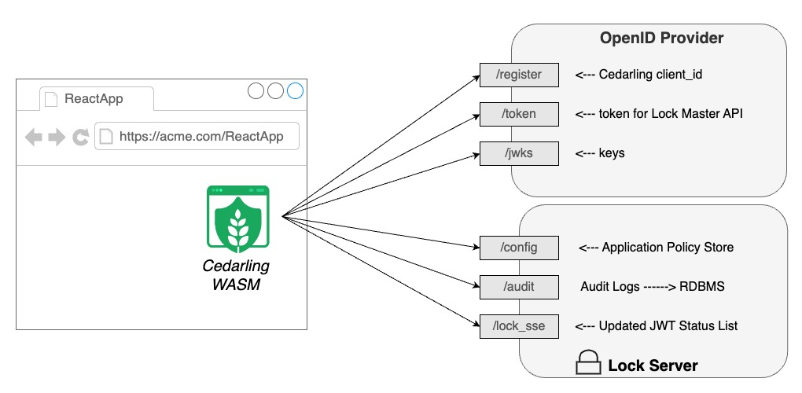

---
tags:
 - administration
 - lock
 - authorization / authz
 - Cedar
 - Cedarling
---
# Lock Guide
## Janssen Lock Overview

Janssen Lock (or just "Lock") provides a centralized control plane for domains 
to use [Cedar](https://www.cedarpolicy.com/en) to secure a network of 
distributed applications and audit the activity of both people and software. 

A Lock topology has three software components: 

1. [Cedarling](../../../docs/cedarling.md): a WebAssembly 
("WASM") application that runs the 
[Amazon Rust Cedar Engine](https://github.com/cedar-policy/cedar) and 
validates JWTs
2. [Lock Server](./lock-server.md): a Java Weld application that connects 
ephemeral Cedarlings to the enterprise
3. Jans Auth Server: which provides the OAuth and OpenID services



Lock is designed for domains that deploy a **network of Cedarlings**. 
Communication in this Lock topology 
is bi-directional. Cedarlings can send information to the Lock Server, and 
the Lock Server can push 
updates to the Cedarlings. Notifications from the Lock Server to the Cedarlings
 are connectionless--
a Cedarling subscibes to event notifications using 
[Server Sent Events](https://html.spec.whatwg.org/multipage/server-sent-events.html#server-sent-events) 
or "SSE". Requests from the Cedarling to the Lock Server are sent via HTTP Post
 to OAuth protected endpoints. 

## Authz Theoretical Background

For years, security architects have conceptualized a distributed authorization 
model in line with
[RFC 2409](https://datatracker.ietf.org/doc/html/rfc2904#section-4.4)
and [XACML](https://docs.oasis-open.org/xacml/3.0/xacml-3.0-core-spec-cos01-en.html),
which describe several common roles:

| Role  | Acronym | Description |
| ----- | :--: | ----------- |
| Policy Decision Point | PDP |  Service which evaluates access requests against authorization policies before issuing access decisions |
| Policy Information Point  | PIP | The source of "data", e.g. about people, clients, and resources |
| Policy Enforcement Point  | PEP | Service, website, or API that queries the PDP for authorization |
| Policy Administration Point | PAP |  Where admins manage the authorization infrastructure |
| Policy Retrieval Point  | PRP | Repository where policies are stored |

Jans Lock aligns with this model:

| Role  | Lock | Description |
| ----- | :--: | ----------- |
| PDP | Cedarling | Evaluates policies versus input data |
| PIP | JWT tokens | Contain data to instantiate entities |
| PEP | Application | Must rely on Cedarling for decision |
| PAP | Jans Config API | Endpoints for Lock admin configuration |
| PRP | Lock Server | Endpoints to publish Policy Store and other PDP configuration |

## Policy Store

By convention, the filename of the Cedarling Policy Store is 
`cedarling_store.json`. It is a JSON 
file that contains all the data Cedarling needs to evaluate policies and verify
 JWT tokens.
The Policy Store contains three things:

1. [Cedar Schema](https://docs.cedarpolicy.com/schema/schema.html): Cedar 
schema file (base64 encoded human readible format). Developers can extend the 
schema to align with the application model, especially for Resources. 
2. [Cedar Policies](https://docs.cedarpolicy.com/policies/syntax-policy.html): Cedar Policy Set file (base64 encoded human readible format).
3. [Trusted Issuers](.): A list of domains are authorized to issue tokens.

In JSON it looks like this: 

```json
{
    "policies": "...",
    "schema": "...",
    "trusted_idps": []
}
```

### Trusted Issuer Schema

At initialization, the Cedarling iterates the list of Trusted IDPs and fetches 
the current public
keys. The trusted issuer schema provides guidance on how to uniquely identify a 
person, and how
to build the roles based on a user claim.

Here is a non-normative example: 

```json
[
{"name": "Google", 
 "Description": "Consumer IDP", 
 "openid_configuration_endpoint": "https://accounts.google.com/.well-known/openid-configuration",
 "access_tokens": {"trusted": True}, 
 "id_tokens": {"trusted":True, "principal_identifier": "email"},
 "userinfo_tokens": {"trusted": True, "role_mapping": "role"},  
 "tx_tokens": {"trusted": True}
},
...
]
```

### Entity Mapping 

A Cedar Entity is an instance of the object defined in the Cedar Schema.  
Without entities, there 
is no data for the policies to evaluate. The Cedarling creates the Resource and
 tokens sent in the authz request. 

* **Client**: Created from access token 
* **Application**: Created if input supplies an Application name
* **Role**: Created for each `role` claim value in the joined id_token and userinfo token
* **User**: Created based on the joined id_token and userinfo token. `sub` is the entity identifier
* **Access_token**: 1:1 mapping from claims in token
* **id_token**: 1:1 mapping from claims in token
* **Userinfo_token**: 1:1 mapping from claims in token
* **TrustedIssuer**: Created if Policy Store contains trusted IDPs
* **Application**: 

## More information

* Lock Server configuration and operation [docs](./lock-server.md) 
* Cedarling [docs](../../../docs/cedarling.md)
* Cedarling [Readme](https://github.com/JanssenProject/jans/blob/main/jans-lock/cedarling/README.md)
* Cedarling [Training](.) (coming soon)


